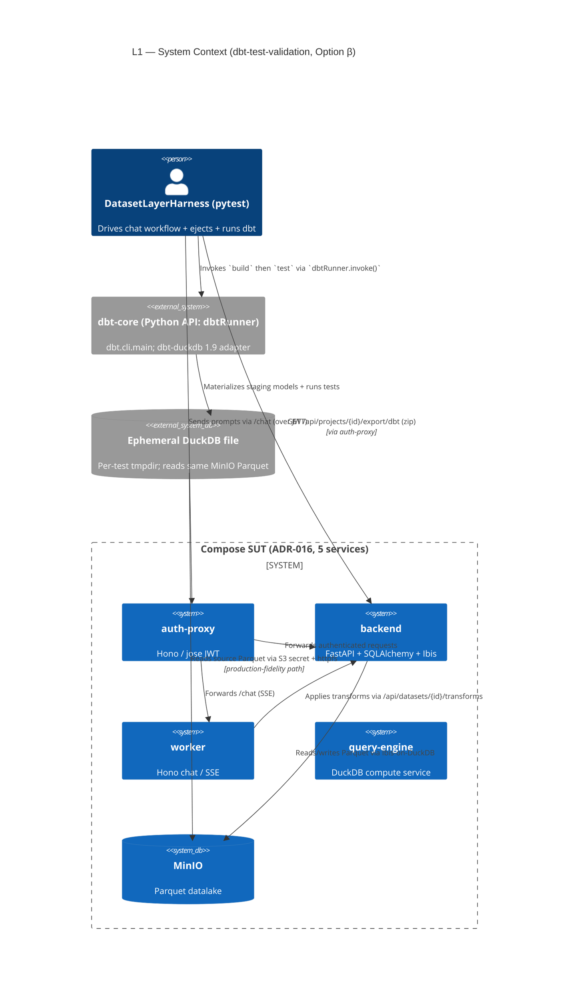
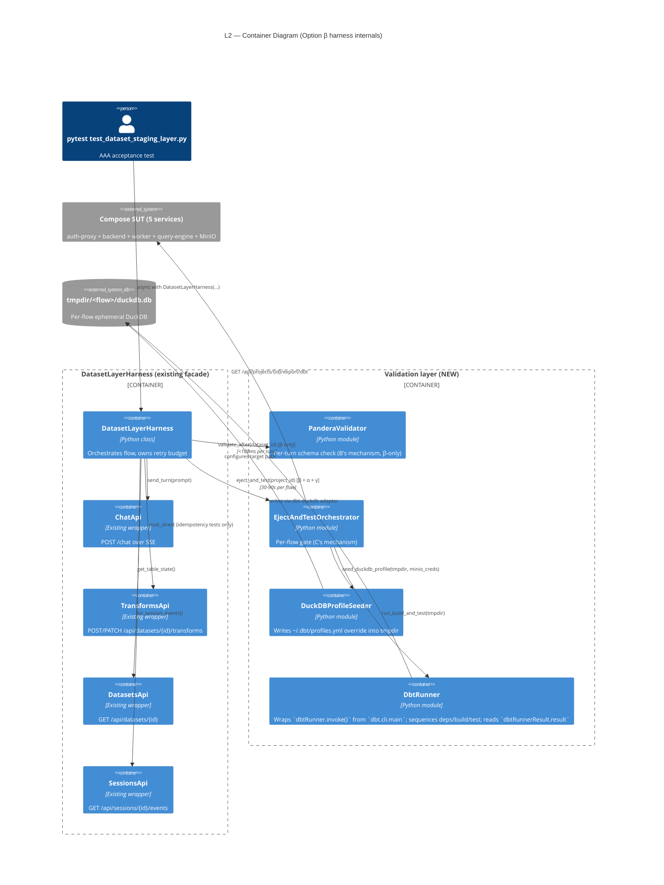
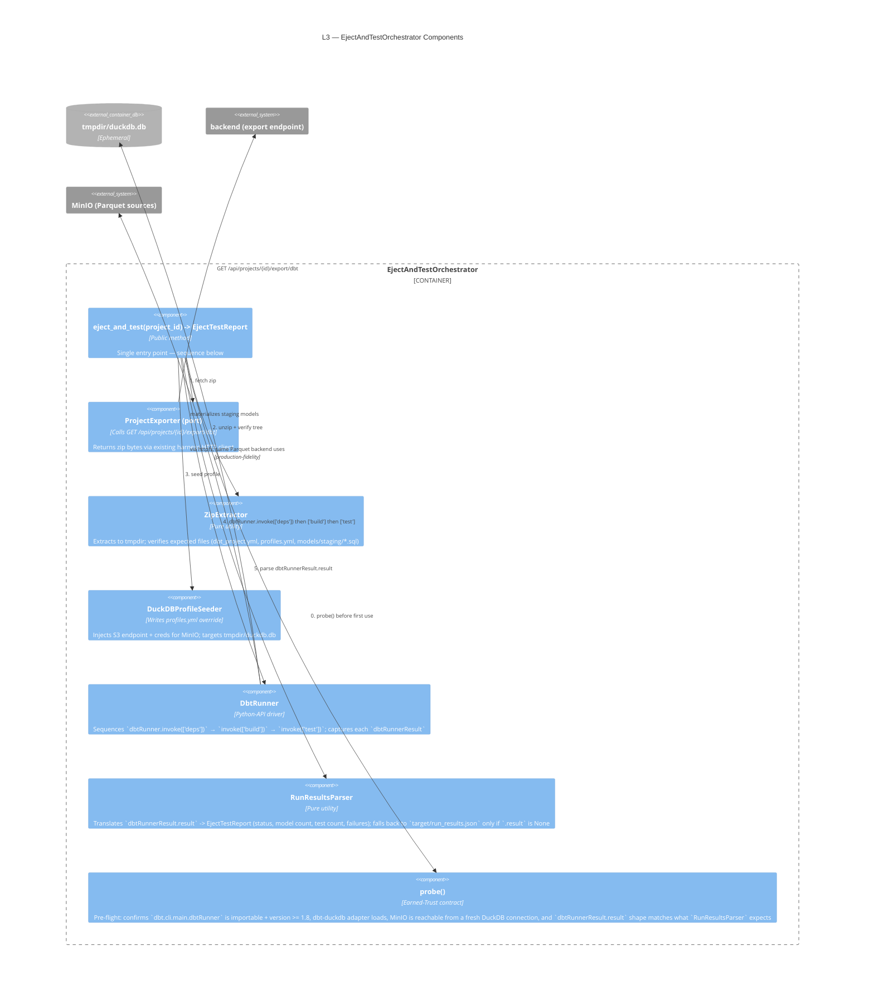

# C4 Diagrams — `dbt-test-validation`

**Feature:** dbt-test-validation
**Wave:** DESIGN
**Date:** 2026-05-08
**Author:** Morgan (nw-solution-architect)

These diagrams describe the chosen Option **β (Layered C+B)**. Where shape would
differ for α (pure C) or γ (sampled-eject) it is annotated inline.

---

## L1 — System Context

The harness is the actor; the SUT is the existing 5-service compose stack
(ADR-016); the in-process `dbtRunner` (Python API from `dbt.cli.main`) +
a fresh DuckDB file are the new artifacts.



**OQ1 resolution visible above:** the harness-owned DuckDB file is **separate**
from the backend's Ibis-materialized DuckDB. Both read the **same** MinIO
Parquet — that is the bridge that gives "fresh DuckDB seeded with same
Parquet" its production-fidelity property (it is exactly what the customer
will do after they unzip).

---

## L2 — Container Diagram (harness internals + new components)

Zooms inside the harness process. Existing containers are unshaded;
new-this-feature containers are shaded by the `Container_Boundary` they sit in.



**Variant notes:**

* **α (pure C)** — drop `PanderaValidator`. Facade no longer calls it; per-turn
  data assertions go away (only AC1.4 raw-tool-call leak guard at protocol level
  is retained).
* **γ (sampled-eject)** — same containers as β, but the test invokes
  `orch.eject_and_test()` only on a representative subset of flows (registry of
  "regression" flows in `conftest.py`); per-turn Pandera covers density.

---

## L3 — Component Diagram for `EjectAndTestOrchestrator` (NEW substantive component)

The new substantive component. Boundary is the public method
`eject_and_test(project_id) -> EjectTestReport`. Internals are
implementation detail (software-crafter owns them; this diagram is the WHAT).



**Earned-Trust note (principle 12):** `probe()` is **not optional**. The
composition root for the orchestrator (a session-scoped pytest fixture)
invokes `probe()` once. Failure → `pytest.skip("eject-orchestrator probe
failed: <reason>")` rather than allowing the suite to run with a silently
broken dependency. The probe must specifically exercise:

1. `from dbt.cli.main import dbtRunner` succeeds AND
   `dbtRunner().invoke(['--version']).success` is `True` AND the reported
   version is `>= 1.8`.
2. `dbt-duckdb` adapter import succeeds (`import dbt.adapters.duckdb`).
3. A throwaway DuckDB connection in tmpdir can `INSTALL httpfs; LOAD httpfs;`
   and `SELECT count(*) FROM read_parquet('s3://...')` against MinIO using the
   same credentials that get baked into the seeded profile. **This catches the
   class of substrate lies that makes Option C dangerous: a profile that
   compiles but cannot read sources at runtime.**
4. `dbtRunner().invoke(['parse', '--project-dir', <probe>])` returns a
   `dbtRunnerResult` whose `.result` exposes the attributes
   `RunResultsParser` reads — pinning the dbt-side surface that dbt
   explicitly documents as "not fully contracted."

If the probe is omitted or stubbed, the suite passes trivially when MinIO
auth is broken — exactly the failure mode JOB-001 says we must not have.

---

## Sequence — One Regression Flow End-to-End (Option β)

Shows the order and where Pandera (per-turn, β only) interleaves with the
post-flow eject-and-test. AC1.4 raw-tool-call leak guard stays at the protocol
level; data assertions are split across the two layers per OQ5.

```mermaid
sequenceDiagram
    autonumber
    participant T as pytest test
    participant H as DatasetLayerHarness
    participant P as PanderaValidator (β)
    participant SUT as Compose SUT
    participant O as EjectAndTestOrchestrator
    participant DBT as dbtRunner (in-process)
    participant DDB as tmpdir DuckDB
    participant MIN as MinIO

    T->>H: async with DatasetLayerHarness(...)
    T->>H: upload_csv("ecommerce-orders.csv")
    H->>SUT: POST /api/uploads + register dataset
    SUT-->>H: dataset_id

    loop For each chat op (e.g. "standardize region to title case")
      T->>H: chat_turn(prompt, dataset_id)
      H->>SUT: POST /chat (SSE, dev JWT)
      SUT-->>H: ChatEventTrace (turn_done)
      Note over H: AC1.4 raw_tool_call_seen MUST stay False<br/>(protocol-level guard, retained)
      opt β only: per-turn fast feedback
        T->>P: validate_after(dataset_id, schema=OrdersStaging)
        P->>SUT: GET /api/datasets/{id}?preview_limit=100
        SUT-->>P: TableState
        P-->>T: ValidationResult (<100ms)
        Note over P: Surfaces LLM jitter / wrong column<br/>BEFORE flow completes
      end
    end

    Note over T,O: After ALL chat ops complete — per-flow durable gate
    T->>O: eject_and_test(project_id)
    O->>O: probe() (first call only; cached for session)
    O->>SUT: GET /api/projects/{id}/export/dbt
    SUT-->>O: zip bytes (200 application/zip)
    O->>O: unzip to tmpdir; verify tree
    O->>O: seed profiles.yml (S3 endpoint + creds → tmpdir/duckdb.db)
    O->>DBT: dbtRunner.invoke(['deps', '--project-dir', tmpdir])
    DBT-->>O: dbtRunnerResult (.success=True)
    O->>DBT: dbtRunner.invoke(['build', '--project-dir', tmpdir, '--profiles-dir', tmpdir])
    DBT->>DDB: CREATE TABLE stg_orders AS (compiled CTEs)
    DDB->>MIN: read_parquet('s3://datalake/datasets/<proj>/<ds>/...')
    MIN-->>DDB: rows
    DBT-->>O: dbtRunnerResult (.result = list[RunResult])
    O->>DBT: dbtRunner.invoke(['test', '--project-dir', tmpdir, '--profiles-dir', tmpdir])
    DBT->>DDB: run dbt generic tests (not_null, unique, accepted_values, ...)
    DDB-->>DBT: test results
    DBT-->>O: dbtRunnerResult (.result, .success)
    O->>O: parse .result -> EjectTestReport
    O-->>T: EjectTestReport (status, failures)
    T->>T: assert report.status == "pass"

    Note over T,DDB: tmpdir cleaned by pytest tmp_path teardown
```

**Wall-clock budget check (OQ4):**

* Single regression flow today: 10 chat ops × ~7s = ~70s for the chat phase
  (per evolution doc §6).
* Eject phase per flow: zip download (~200ms), unzip (~50ms), profile seed
  (~10ms), `dbtRunner.invoke(['deps'])` (cached after first run; ~2s cold /
  ~50ms warm), `dbtRunner.invoke(['build'])` + `invoke(['test'])` (~10–30s on
  a single staging model with ~250 rows; saves ~50–200ms per call vs
  subprocess fork/exec).
* **Total per regression flow: ~85–105s. AC1.6 (300s) holds with ~65% headroom**
  against today's single-flow scenario. **If a second regression flow lands**,
  margin tightens; γ (sampled-eject) becomes the contingency at that point.

---

## Production-fidelity invariants (ADR-016 inheritance)

The compose stack STAYS at 5 services. The eject orchestrator runs OUTSIDE
the compose network — it is a peer of the harness, not a service on the
network. The existing prod-topology guarantees are unaffected:

* All ingress to backend/worker still flows through auth-proxy.
* `TRUST_PROXY_HEADERS=true` branch is still the one tests exercise.
* No new service is added to docker-compose; the orchestrator is in-process
  to pytest and invokes `dbt-core` via the `dbtRunner` Python API
  (`dbt.cli.main`) — also in-process. (`dbtRunner` is not safe for
  concurrent calls within one process — fine for serial pytest and for
  pytest-xdist's per-worker process isolation; documented constraint.)

This is the key reason α/β/γ all pass the ADR-016 hard constraint — none of
them touches the topology of the SUT.
