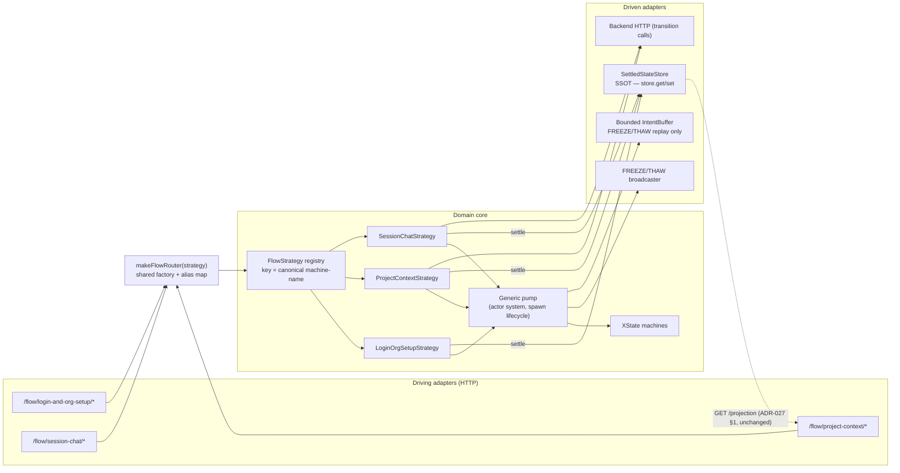

# ADR-040: ui-state Hexagonal Transport + Emission-Completeness Resolution

**Status:** Accepted (2026-05-16)
**Deciders:** project overseer (architect) + Morgan (nw-solution-architect), guide-mode DESIGN session
**Wave:** DESIGN — emerged from the J-002 (`project-and-chat-session-management`) substrate experience, finalized after MR-6 (`43c7c04`) landed
**Companion artifacts:**
- `docs/feature/project-and-chat-session-management/design/wave-decisions.md` (DESIGN decision summary)
- Empirical basis: `docs/feature/project-and-chat-session-management/deliver/upstream-issues.md` (D-MR4-06, D-MR5-01 ×2, MR-6 freeze harvest — five in-pattern emission-completeness instances)

**Relationship to prior ADRs:**
- **Supersedes** ADR-030's *"Amendment 2026-05-15 — Projection as primary read model"* for the **read path only**. ADR-030 §1–§4 (topology behind auth-proxy, single-replica, scaling ceiling, failover) remain fully in force and are cross-referenced, not changed.
- **Resolves** ADR-030's *"Amendment 2026-05-16 — Emission-completeness tripwire"* — **by exit**, not by adding the compile-time emit-guard. The tripwire's pre-costed store-model alternative is hereby adopted.
- Honors ADR-027 §1 (FE projection read contract), ADR-028 (XState v5 actor model + cross-machine FREEZE/THAW), ADR-039 (ui-state vocabulary conventions).

## Context

`ui-state/index.ts` (705 L) exposes the flow transport with the machine **parameterized** — `GET /health`; `POST /flow/:machine/begin`; `POST /flow/:machine/event`; `POST /flow/:machine/open-deep-link`; `GET /flow/:machine/projection?flow_id=…`; `GET /flow/:machine/projection/stream`. The handlers fork on `machine === "…"` string conditionals (L188/222/359/376/461) in **three inconsistent vocabularies** (`"login-and-org-setup"` flow-name, `"session-chat"` machine-name, `"project-and-chat-session-management"` feature-slug). The 1939-L orchestrator carries the matching per-machine fan-out.

This shared-handler conditional seam is the structural origin of the **emission-completeness bug class**: the orchestrator must emit a FlowEvent for every machine settle or the rebuilt projection (ADR-030 §2 amendment SSOT) goes stale. It recurred five times across one feature's delivery (D-MR4-06 `switching_project` + adjacent arms; D-MR5-01 project-context + session-chat resume harvests; MR-6 `harvestSettledFreezeState`). ADR-030's 2026-05-16 amendment recorded a tripwire: *when a structural emit-guard is proposed, instead evaluate the simpler server-authoritative store model.* The deep hexagonal re-core below puts `settle→emit` on a typed port member — which **is** that structural emit-guard — so the tripwire fires here, and is resolved by taking its exit.

## Decision

### D1 — Deep hexagonal re-core
A `FlowStrategy` port owns per-machine orchestration. The orchestrator is decomposed into a thin generic **pump** plus per-machine strategies. This is a decomposition of the existing orchestrator (strategy extraction), not a new parallel subsystem.

### D2 — Port boundary (forced by FREEZE/THAW's cross-machine nature, ADR-028 §94)
- **Generic pump / driven + cross-cutting (stays central):** actor-system ownership & spawn lifecycle, the FREEZE/THAW broadcast (intrinsically cross-machine — cannot belong to one strategy), the bounded intent-replay buffer, the FE projection-read endpoint (ADR-027 §1 contract preserved at the adapter edge).
- **`FlowStrategy` (per machine):** machine definition, `begin` semantics, event→transition mapping, and `settle` (the typed member that subsumes the emit obligation).

### D3 — Driven read-port = hybrid store model (the tripwire exit)
The per-flow **settled-state record** becomes the SSOT; `GET …/projection` resolves to `store.get(flow_id)`. The Redis-Streams `FlowEventLog` + `buildProjection` rebuild path is **removed**. The bounded intent buffer (16-max / 5 s, ADR-027 §5) **survives** as a distinct append-only driven adapter, scoped solely to US-210 FREEZE/THAW replay — the one temporal requirement an actual written story justifies. The emission-completeness invariant is **eliminated by construction**: with no rebuilt projection, there is nothing to go stale, and the `harvestSettled*` family becomes dead code (deleted in LEAF-5).

### D4 — Transport exposure
Per-machine sub-routers via a shared `makeFlowRouter(strategy)` factory, mounted with Hono `app.route('/flow/<canonical-machine-name>', …)` (the Flask-blueprint analog). No `:machine` parameter.

### D5 — Registry key = canonical machine-name + migration-safe alias map
The `FlowStrategy` registry is keyed by the **canonical machine-name** (ADR-039). A thin alias map accepts the legacy feature-slug / flow-name path segments **during the LEAF migration** so the ADR-027 §1 FE projection contract and the nginx `/ui-state/` proxy never break mid-migration. Aliases are removed in a terminal cleanup LEAF once the FE has migrated to canonical paths. (`flow-id` is explicitly rejected as the key: `flow-id = <machine-name>:<principal_id>` per ADR-030 §6 is an instance identifier, not a machine-type dispatch key.)

## C4 Component delta (ui-state hexagon, target state)

## Reuse Analysis

| Existing component | File | Overlap | Decision | Justification |
|---|---|---|---|---|
| Hono app + 5 parameterized routes | `ui-state/index.ts` | All flow transport | EXTEND | Replace `:machine` param with `app.route` mounts; handlers become factory-generated. Net deletion of conditional blocks, not new surface. |
| `orchestrator.ts` (1939 L) | `ui-state/lib/orchestrator.ts` | Per-machine begin/event/settle fan-out | EXTEND (carve) | Carve per-machine branches into strategies; residual = generic pump. Decomposition of the existing class (strategy extraction over "too many deps"), not a new class. |
| `orchestrator-harvester.ts` | `ui-state/lib/orchestrator-harvester.ts` | `harvestSettled*` family | DELETE | Hybrid store-model removes the projection rebuild these feed; dead by construction (LEAF-5). |
| `buildProjection` | `ui-state/lib/projection.ts` | Event-log → read model | REPLACE | Becomes `store.get`; event-log read path removed. ADR-027 §1 FE contract preserved at the adapter edge via a contract test. |
| Intent replay buffer | `ui-state/index.ts` / orchestrator | US-210 FREEZE/THAW replay | EXTEND (extract) | Promote to a standalone bounded driven adapter; behavior unchanged (16-max / 5 s). |

## Migration journey (deferred, LEAF-series — ADR-030 amendment-style)

Behavior-neutral steps; each LEAF independently mergeable through the refinery queue. Recorded here so future contributors can pick it up without re-deriving the sequence; **NOT scheduled** until delivery capacity is committed (same posture as ADR-030's deferred journey).

- **LEAF-1** — `FlowStrategy` interface + registry keyed by canonical machine-name; existing conditionals delegate to the registry. No behavior change.
- **LEAF-2** — `makeFlowRouter` factory + per-machine `app.route` mounts + alias map for legacy path segments; retire the `:machine` parameter. FE / nginx unaffected (legacy paths still resolve via aliases).
- **LEAF-3** — carve orchestrator per-machine branches into the three strategies; orchestrator shrinks to the generic pump. `settle→emit` still writes the event-log (behavior-neutral).
- **LEAF-4** — extract the bounded intent buffer + FREEZE/THAW broadcaster as explicit named driven adapters.
- **LEAF-5 (the tripwire exit, hard swap)** — replace the driven read-port event-log→`SettledStateStore` in one move; delete `buildProjection`'s event-log path and the entire `harvestSettled*` family same MR; `GET /projection` reads the store. **No dual-read parity window** (see accepted risk below).
- **LEAF-6** — once the FE consumes canonical machine-name paths, remove the alias map.

## Consequences

**Positive**
- Emission-completeness bug class (D-MR4-06 / D-MR5-01 / MR-6 freeze) **eliminated by construction** — five recurrences become structurally impossible.
- Orchestrator 1939 L → small generic pump; per-machine logic unit-testable in isolation behind the strategy port.
- Explicit static machine registry; unknown-machine becomes a clean 404, no conditional fall-through.
- Only the temporal machinery a written requirement (US-210) justifies is retained; speculative event-sourcing removed (resolves the ADR-030 tripwile permanently rather than perpetually policing it).
- ADR-027 §1 FE contract and nginx `/ui-state/` proxy untouched throughout (alias map + adapter-edge contract test).

**Negative / accepted trade-offs**
- **LEAF-5 hard swap carries no parity safety net (accepted by the overseer over the dual-read alternative).** A `SettledStateStore` write defect would surface as wrong projection data with no event-log comparison signal. Mitigation required at LEAF-5: exhaustive store-write unit + the ADR-027 §1 adapter contract test + the full per-marker acceptance suite (mr_1..mr_6) as the regression gate before the swap MR submits. This is a deliberate speed-over-safety-net choice; recorded so the risk is owned, not discovered.
- Audit-trail / point-in-time replay over the *full* flow history is lost (only the bounded US-210 intent window remains). Re-introduced as a **separate** append-only audit adapter only if and when a temporal-query requirement is actually written (none exists at the planning horizon).
- ADR-030 §2 amendment is partially superseded — readers must follow the cross-reference; ADR-030 §1–§4 remain authoritative for topology/scaling/failover.

## Open questions

1. **When is the LEAF series scheduled?** Deferred-journey posture (per ADR-030 precedent). Owner: a future DISTILL pass when delivery capacity is committed. Not feature-blocking.
2. **SettledStateStore backing** — Redis hash per `flow_id` is the assumed substrate (reuses the existing Redis dependency; ADR-030 §"Negative" Redis-blast-radius note still applies and is not worsened — one key-shape replaces one stream-shape). Confirm at LEAF-5 DISTILL.
