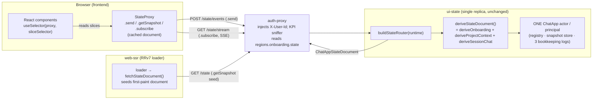

# ADR-046: StateProxy — a Single Server-Resident-Actor `/state` HTTP Surface (Proxy Model)

**Status:** Accepted (ratified by user 2026-05-29; DELIVER in progress). **Supersedes ADR-045.**
**Date:** 2026-05-29
**Originating wave:** DESIGN — completes ADR-044 §5 OQ#3 with the proxy model the surveyor research named
**Author:** Morgan (nw-solution-architect), propose-mode; grounded in `docs/research/xstate-react-backend-integration.md` (Nova, RESEARCH) and the live `ui-state` source
**Scope:** Application architecture — the published read+write interface of the `ui-state` container and the client construct that consumes it, plus a clean in-repo cutover. No container-topology delta (ADR-030/033/034 unchanged).

**Resolves:** **ADR-044 §5 Open Question #3** — *"Unify the external projection wire (one ChatApp projection instead of per-machine) — a follow-on FE + auth-proxy story, not required for the pivot."* This ADR marks OQ#3 **RESOLVED** (see §10), superseding ADR-045's composite-of-envelopes resolution with the proxy model.

---

## Why this supersedes ADR-045

ADR-045 collapsed the three per-machine read projections into **one composite of three byte-frozen `FlowProjection` envelopes** (`{ phase, active_scope, machines: { … } }`), migrated by an **ADR-040-style additive-alias dance** (mount composite alongside the three legacy reads, migrate route-by-route, retire in a cleanup LEAF). Every load-bearing constraint in that design — the byte-frozen ADR-027 envelope preserved verbatim as each `machines[*]` slice, the mechanical byte-equivalence gate, the zero-404 coexistence window, the dual-shape auth-proxy sniffer — existed **to protect a frozen wire contract that real consumers depended on**.

That constraint is gone. The decision recorded here (taken by the user after reading the research):

> **The FE is being rewritten around XState, and nothing is in production.** ADR-027's three byte-frozen `FlowProjection` envelopes are **not preserved.** The three former per-machine projections become **client-side `useSelector` selectors over ONE state document.**

Once the frozen contract is discarded, ADR-045's entire mechanism is dead weight: there is no byte-stable envelope to preserve, no piecemeal-migration window to keep 404-free, no legacy shape for a sniffer to fall back to. ADR-045 is therefore **superseded, not amended** — its composite-of-envelopes shape and its additive-coexistence migration are both replaced. ADR-045's analysis stays on record (the A1/A2/A3 read-shape trade-off and the SSE-consolidation evidence remain sound and are reused below); only its terminal decision is overridden.

This ADR adopts the **proxy model**: the chat-app coordinator stays ONE server-resident XState v5 actor per principal (unchanged from ADR-044), and the client holds a **`StateProxy`** — a custom object satisfying XState's `ActorRef` contract (`.send` / `.getSnapshot` / `.subscribe`) that stands in for the remote actor. The client does **not** run the machine; it observes a stable state document and slices it with `useSelector`.

**Relationship to prior ADRs:**
- **ADR-045** — **SUPERSEDED.** Composite-of-three-frozen-envelopes → one stable state document; additive-alias migration → clean cutover. (Cross-linked; its analysis retained as history.)
- **ADR-027** (per-machine frozen `FlowProjection` wire) — its three byte-frozen envelopes are **discarded** (the rewrite mandate removes the freeze). The data each envelope carried survives as a **region slice** of the one state document. The per-machine read paths + their three SSE streams are **retired** (§9, MR-7).
- **ADR-030** (single-replica, in-process actors; `flow_id = <machine>:<principal_id>`) — **unchanged.** One per-principal actor in one process; header-derived identity. `flow_id` is an internal/audit detail only; it leaves the wire entirely (the document has no `flow_id`).
- **ADR-040** (hexagonal transport; canonical-name registry + alias map; "flows addressed by verified identity, not client `flow_id`") — identity stays header-derived (no `:principal` param, no body identity). The **alias map dies with the per-machine mounts** (co-sequenced with ADR-040 LEAF-6 at MR-7); the `/state` surface needs no alias resolution (one actor, one document, no wire-machine vocabulary).
- **ADR-044** (ChatApp coordinator; hybrid snapshot + audit-log persistence; derived-view projection) — the **read+write completion** of ADR-044. The coordinator, hybrid persistence, settled-snapshot R3 guard, and the principle "return a derived view, never `getPersistedSnapshot()`" are all **unchanged**. The per-slice derivation logic (`deriveOnboarding`/`deriveProjectContext`/`deriveSessionChat`) is **reused** as the building block of the whole-actor mapper.

---

## Context

The surveyor research (`docs/research/xstate-react-backend-integration.md`) established that XState ships only local primitives — `send` (event-in), `getSnapshot` (state-out), `subscribe` (push) — and **no network transport** (Finding 1); the developer bridges those over HTTP. It also established (Finding 1b) that `@xstate/react` runs actors *client-side* and has **no remote-actor adapter** — so a React app cannot point `useMachine` at a server actor. The idiomatic shapes are therefore two, and the research's central refinement was that **the open decision is which one to adopt for the read surface:**

- **Mirror model (REJECTED).** The client runs a *copy* of the machine, rehydrated from `getPersistedSnapshot()` + the shared machine definition, kept in sync by replayed events. *Why rejected:* (a) it puts the machine definition on the wire and couples the client to XState's internal serialized snapshot shape — any server-side machine refactor becomes a breaking client change (research Findings 2/5); (b) it duplicates the machine in two runtimes that must be kept version-locked; (c) its only genuine payoff — offline/optimistic local transitions with no server round-trip — is a capability **we do not need** (the server is the sole state-of-record for agent-co-authored state; ADR-027's whole reason for existing). Mirror is the right tool only for offline-first / optimistic-local apps; this is neither.

- **Proxy model (CHOSEN).** The client holds a `StateProxy` — a hand-built object satisfying XState's `ActorRef` contract — that *stands in for* the remote actor: `.send` POSTs the event, `.getSnapshot` returns the last observed state document, `.subscribe` opens an SSE stream of document changes. The machine never leaves the server; the client observes a **stable derived view** and slices it with `useSelector`. This is the canonical XState client/server shape — e.g. Stately Sky hands the client a live actor-ref over the wire; we self-host the identical contract. It keeps the server authoritative (research Finding 7), keeps the wire decoupled from machine internals (Findings 2/5), and needs only `useSelector` on the client (Finding 1b's "stable narrow projection" is exactly what `useSelector` consumes).

The write side is **already** the idiomatic single-actor shape: all of `/begin`, `/event`, `/open-deep-link` converge on ONE per-principal actor regardless of which of the five wire mounts they arrive on (`router.ts`; research Fit Analysis). What is *cosmetic* today is the **path multiplicity** — three machine names × read+write+stream mounts — a frozen-contract artifact (ADR-027) the proxy model dissolves into one honest surface.

Two facts (verified in the live code) shape the design:

1. **The FE reads ≥2 lifecycle regions at once.** `frontend/app/root.tsx` reads *both* the onboarding slice (`org_id` + `user.first_name`) **and** the project-context slice (`project_flow_state` + `active_scope`) in a single loader; `sessions.tsx` reads project + session together. A state document that exposed only "the active region" would force these back to multiple reads — so the document must carry **all regions simultaneously** (ADR-045 Decision A established this; it carries forward).
2. **No live consumer reads the per-machine projection SSE.** The FE's stream machinery points at the *agent's* chat SSE, not ui-state's. The three per-machine `/projection/stream` mounts are exposed-but-unconsumed — so consolidating to one `/state/stream` is pure surface reduction, not a cutover (ADR-045 Context #2; carries forward).

---

## The naming decision (recorded, not re-litigated)

| Construct | Name | Rationale |
|---|---|---|
| Client object | **`StateProxy`** (`createStateProxy()` → an `ActorRef`-shaped proxy) | The proxy is the *client's* stand-in for the remote actor — it mirrors the repo's `auth-proxy` vocabulary on the **client** side (the side that forwards/stands-in). |
| Server route prefix | **`/state`** (NOT `/state-proxy`) | The server is the **origin** of the state, not a forwarder of it. Calling the server route `/state-proxy` would misname the origin as a proxy. The *proxy* is the client; the *state* is what the server publishes. `/state` keeps the route honest while `StateProxy` keeps the `auth-proxy`-family vocabulary on the correct side. |

ActorRef-method → HTTP mapping (the three primitives, bridged):

| `ActorRef` method | HTTP | Returns |
|---|---|---|
| `.send(event)` | `POST /state/events` | the new state document (req/resp ergonomics) |
| `.getSnapshot()` | `GET /state` | the current state document |
| `.subscribe(observer)` | `GET /state/stream` (SSE) | the document, pushed on every change |

Identity is header-derived (`X-User-Id`), as today. The actor **bootstraps implicitly on first contact** — see Decision 3.

---

## Decision 1 — The state document shape

> The single JSON document `GET /state` and `/state/stream` emit, derived from the one chat-app actor's snapshot. It must be a **stable derived view** (never raw `getPersistedSnapshot()` — version-coupled, Findings 2/5) and must carry enough for every FE `useSelector` slice (the data the old login / project / session views exposed).

| Option | Shape | Pros | Cons | Verdict |
|---|---|---|---|---|
| **1A — Phase-discriminated flat view** | One flat document; `phase` discriminates which fields are meaningful; all region data merged to one level | Smallest payload; "one screen" mental model | **Lossy by field collision** (org.name populated in onboarding, null in project-context; per-region `state`/`underlying_cause_tag` collide) AND **insufficient** — `root.tsx`/`sessions.tsx` read two regions at once, which a single-active-phase flat view cannot serve. This is ADR-045's A1+A3 failure modes combined. | ❌ Rejected |
| **1B — Nested regions map + hoisted top-level conveniences** | `{ phase, active_scope, sequence_id, last_event_at, request_id, regions: { onboarding, projectContext, sessionChat } }` where each region is a derived `{ state, context }` slice | FE selects whichever region(s) it needs from one document; carries all regions for the proven multi-region reads; single authoritative `active_scope`/`sequence_id`/`request_id` at the top (no per-slice duplication — there is now one actor, one document); reuses the existing per-slice derivation; **no machine internals on the wire** | All three region slices always present (slightly larger than one region — but smaller than the up-to-three round-trips it replaces; the FE already fetched ≥2) | ✅ **RECOMMENDED** |

**Recommendation: 1B — nested regions map.** It is the inheritor of ADR-045's A2 (which won the same multi-region argument), with three changes the discarded frozen contract now permits and demands:

1. **Region keys are the domain regions (`onboarding` / `projectContext` / `sessionChat`), not the legacy wire-machine aliases** (`login-and-org-setup` / `project-and-chat-session-management` / `session-chat`). The aliases were a frozen-wire artifact (ADR-040); the proxy surface has no wire-machine vocabulary, so it names regions for what they are.
2. **Bookkeeping is hoisted to a single top-level set** (`sequence_id` / `last_event_at` / `request_id`). ADR-045 kept these per-slice because each slice was a byte-frozen `FlowProjection`. With one document over one actor, one authoritative counter is correct and the per-slice copies are redundant noise.
3. **`flow_id` is dropped entirely.** It was a wire-addressing artifact; the proxy is addressed by header identity, and the document carries no id.

```ts
// shared/ui-state/state-document.ts (NEW — see Decision 2 on placement)
import type { ActiveScope } from "@dashboard-chat/ui-state-domain"; // ActiveScope type, shared

/** Coarse lifecycle phase — the parent ChatApp region value, for routing/first-paint. */
export type ChatAppPhase = "onboarding" | "project_context" | "chat" | "rejected";

/** A derived slice of one lifecycle region — the discriminated state + its reduced context.
 *  `context` is the same reduced shape the old per-machine projection exposed for that region
 *  (so the FE's selectors read the identical fields), minus the wire envelope. */
export interface RegionView {
  state: string;
  context: Record<string, unknown>;
}

/** The single document GET /state and /state/stream emit. A STABLE DERIVED VIEW of the
 *  one per-principal ChatApp actor — never the raw, version-coupled persisted snapshot. */
export interface ChatAppStateDocument {
  /** Lifecycle phase — convenience for routing/first-paint dispatch (NOT the source of record
   *  for any region's status; consumers dispatch on regions.<r>.state). */
  phase: ChatAppPhase;
  /** The single authoritative active scope (deepest-resolved region wins) — the value the FE
   *  reads today from the project/session projection. */
  active_scope: ActiveScope;
  /** Monotonic per-actor change marker (aggregated over the region bookkeeping logs). */
  sequence_id: number;
  /** Timestamp + request id of the last settled transition. */
  last_event_at: string;
  request_id: string;
  /** Every lifecycle region, always present, each a derived slice of the actor snapshot. */
  regions: {
    onboarding: RegionView;     // ← was login-and-org-setup
    projectContext: RegionView; // ← was project-and-chat-session-management
    sessionChat: RegionView;    // ← was session-chat
  };
}
```

**Example payload** (`GET /state`; a user who finished onboarding and selected a project, chat not yet entered):

```json
{
  "phase": "project_context",
  "active_scope": { "org_id": "org-001", "project_id": "proj-7", "resource_type": null, "resource_id": null },
  "sequence_id": 8,
  "last_event_at": "2026-05-29T12:00:04.000Z",
  "request_id": "7f3c-…",
  "regions": {
    "onboarding": {
      "state": "ready",
      "context": {
        "org": { "id": "org-001", "name": "Acme" },
        "user": { "email": "z@acme.io", "display_name": "Z A", "first_name": "Z" },
        "underlying_cause_tag": null, "org_validation_error": null
      }
    },
    "projectContext": {
      "state": "project_selected",
      "context": { "org": { "id": "org-001", "name": null }, "user": { "first_name": "Z" }, "project": { "id": "proj-7", "name": "Sales" } }
    },
    "sessionChat": {
      "state": "verifying",
      "context": { "org": { "id": null, "name": null }, "project": { "id": null, "name": null }, "session_list": [], "session_id": null, "transcript": [] }
    }
  }
}
```

The FE's three former projection reads become three `useSelector` selectors over this one document:

```ts
// illustrative — the slices the old login/project/session views exposed, now selectors:
const login   = (d: ChatAppStateDocument) => ({ org_id: d.regions.onboarding.context.org?.id ?? "",
                                                 first_name: d.regions.onboarding.context.user?.first_name ?? null });
const project = (d: ChatAppStateDocument) => ({ state: d.regions.projectContext.state,
                                                 active_scope: d.active_scope,
                                                 project: d.regions.projectContext.context.project });
const session = (d: ChatAppStateDocument) => d.regions.sessionChat;
```

### How it's derived (reuse, not re-derive)

The existing `deriveProjection(view, wireMachine, bookkeeping)` is composed of three **private per-slice functions that already return exactly `{ state, context }`** — `deriveOnboarding(view)`, `deriveProjectContext(view)`, `deriveSessionChat(view)` (`derive-projection.ts:223–343`). The whole-actor mapper **exports and calls those three** and assembles the document — it does not introduce a parallel derivation:

```ts
// ui-state/lib/machines/chat-app/projection/derive-state-document.ts (NEW)
export function deriveStateDocument(
  view: ChatAppSnapshotView,
  bookkeeping: { sequence_id: number; last_event_at: string; request_id: string },
): ChatAppStateDocument {
  const onboarding     = deriveOnboarding(view);     // existing slice fn (now exported)
  const projectContext = deriveProjectContext(view); // existing slice fn (now exported)
  const sessionChat    = deriveSessionChat(view);    // existing slice fn (now exported)
  return {
    phase: derivePhase(view),                          // parent region value → ChatAppPhase
    active_scope: deriveActiveScope(                   // existing tiered scope resolver
      projectContext.context.org.id ? projectContext.context : onboarding.context),
    // bookkeeping is PRE-AGGREGATED by the handler over the three child logs before this call:
    //   sequence_id  = len(onboarding-log) + len(project-context-log) + len(session-chat-log)
    //   last_event_at = max ts across the three logs; request_id = the current request
    // (monotonic — each log only grows; no new persisted key — see Decision 4)
    sequence_id: bookkeeping.sequence_id,
    last_event_at: bookkeeping.last_event_at,
    request_id: bookkeeping.request_id,
    regions: {
      onboarding:     { state: onboarding.state,     context: onboarding.context },
      projectContext: { state: projectContext.state, context: projectContext.context },
      sessionChat:    { state: sessionChat.state,     context: sessionChat.context },
    },
  };
}
```

`derivePhase(view)` maps the parent lifecycle value (`machine.ts`: top-level `login` / `engaged` / `user_rejected`, `engaged` nesting `project_context` / `chat`): `"login" → "onboarding"`, `{engaged:"project_context"} → "project_context"`, `{engaged:"chat"} → "chat"`, `"user_rejected" → "rejected"`. It reads the **settled** value only — every `/state` read and `/state/events` response derives *after* `settle()` (the R3 guard), so a mid-invoke transient is never observable on the wire (same guarantee the current `/projection` read relies on). `phase` is a routing convenience, **not** a region's state-of-record — consumers dispatch on `regions.<r>.state` (the same discipline ADR-045 §"phase derivation" pinned).

Because each `regions.<r>` is **literally the existing slice function's output**, the migration gate (MR-1) is mechanical: `document.regions.<r>` byte-equals the `{state,context}` half of `deriveProjection(view, <alias>, bk)` for all three regions, over every existing J-001/J-002 scenario — true by construction (see §9).

---

## Decision 2 — The `StateProxy` client contract

> What object `createStateProxy()` returns, how each `ActorRef` method maps to transport, how the first document is obtained, reconnection/error behavior, the types it needs, and confirmation that `useSelector(stateProxy, selector)` works unchanged.

`useSelector(actorRef, selector, compare?)` requires only that its first argument expose **`.getSnapshot()`** (read current) and **`.subscribe(observer)`** (notify on change), and re-renders when `selector(snapshot)` changes by `compare` (default `Object.is`). `StateProxy` satisfies exactly that minimal `ActorRef` surface, where the "snapshot" it exposes **is the state document**:

```ts
// frontend/app/lib/state-proxy.ts (NEW)
import type { ChatAppStateDocument, ChatAppWireEvent } from "@dashboard-chat/ui-state-wire";

export interface StateProxy {
  /** ActorRef.send — fire-and-forget. POSTs the event; updates the cached document and
   *  notifies observers when the response (the new document) lands. */
  send(event: ChatAppWireEvent): void;
  /** ActorRef.getSnapshot — returns the last observed document synchronously (the cache).
   *  Seeded by the SSR document (no first-paint flash) or by the anonymous document until
   *  the first GET/SSE frame resolves. THIS is what useSelector's selector receives. */
  getSnapshot(): ChatAppStateDocument;
  /** ActorRef.subscribe — registers an observer and (on first subscription) opens the SSE
   *  stream. Returns { unsubscribe }. Every document the stream pushes updates the cache and
   *  fans out to observers. */
  subscribe(observer: ((doc: ChatAppStateDocument) => void)
            | { next?: (doc: ChatAppStateDocument) => void; error?: (e: unknown) => void; complete?: () => void }
  ): { unsubscribe(): void };
  /** Loader/req-resp ergonomics (a superset of ActorRef): await the document a send produces.
   *  Server loaders and post-then-read flows use this; React components use send + useSelector. */
  postEvent(event: ChatAppWireEvent): Promise<ChatAppStateDocument>;
}

export function createStateProxy(opts?: { seed?: ChatAppStateDocument }): StateProxy;
```

**Method → transport.**
- **`.getSnapshot()`** returns the in-memory cached document. No network on the hot path (the cache is kept fresh by SSE + send responses) — matching XState's synchronous `getSnapshot`.
- **`.send(event)` / `.postEvent(event)`** → `POST /state/events` with the event envelope (Decision 3). The response **is the new document**; the proxy writes it to the cache and notifies observers (so a user's own event reflects immediately without waiting for the SSE round-trip). `.send` discards the promise (ActorRef contract); `.postEvent` returns it (loader ergonomics).
- **`.subscribe(observer)`** → on the first observer, open an `EventSource` on `GET /state/stream`; each `event: state` frame's `data` is parsed to a document, cached, and fanned out. Last observer unsubscribing closes the stream.

**First document.**
- **SSR / hydration (no flash):** the RRv7 server loader fetches `GET /state` once and serializes the document into the hydration payload; the browser constructs `createStateProxy({ seed })` so `getSnapshot()` returns the real document immediately on first render.
- **Pure CSR (no seed):** `getSnapshot()` returns the **anonymous document** (the zero-state document the server's `emptyView` produces — every region in its initial `verifying`/`login` state) until the first SSE frame (the stream's first frame is always the current document) or an explicit `GET /state` resolves. This guarantees `useSelector` never sees `undefined`.

**Reconnection / error.**
- SSE auto-reconnects (`EventSource` built-in); on reconnect the server re-emits the current document as the first frame, so the cache re-syncs. `Last-Event-ID`/`?since` cursor resume is **best-effort and non-load-bearing** (matches today — no resume obligation since there was never a live stream consumer).
- An observer's `error` callback receives transport errors; the cached document stays last-known-good (the FE renders stale-but-coherent rather than blanking).
- A failed `POST /state/events` rejects `postEvent` (server loaders map it to a thrown `Response`, exactly as the current client maps timeouts to `504`); the cache is unchanged.

**Types it needs (shared, NOT the machine definition).** The proxy needs exactly two types — the document (`ChatAppStateDocument`, Decision 1) and the event union (`ChatAppWireEvent`, Decision 3). It does **not** import the machine, any child machine, or `getPersistedSnapshot`'s shape — that is precisely the mirror-model coupling we rejected. **Placement (sub-decision):**

| Option | Where the two wire types live | Verdict |
|---|---|---|
| **2-i — New shared module `@dashboard-chat/ui-state-wire`** under `shared/` | Single source of truth, imported by both `ui-state` (the origin) and `frontend` (the proxy) | ✅ **RECOMMENDED** — mirrors the established `shared/chat/` precedent (the chat event schema shared by `agent/` + `frontend/`); no drift, no machine leak |
| **2-ii — `frontend` imports the types from `ui-state`** across the workspace | One source, no new package | ⚠️ couples the FE build to the backend package's internals; weaker boundary than `shared/` |
| **2-iii — `frontend` declares its own copy** | Zero cross-package wiring | ❌ drift risk — the document shape would have two owners |

**Recommendation: 2-i** — a `shared/ui-state-wire` module exporting `ChatAppStateDocument` + `ChatAppWireEvent` (and the `ActiveScope`/`RegionView` types they reference), following `shared/chat/`. `ui-state` derives documents *to* this contract; `frontend` consumes it; the machine never appears in it.

**`useSelector` works unchanged.** Confirmed: `useSelector(stateProxy, (doc) => doc.regions.projectContext.state)` calls `stateProxy.getSnapshot()` → document, applies the selector, subscribes for changes, and re-renders only when the selected slice changes by `Object.is` (pass a `compare` for object slices). No `@xstate/react` change is needed — the library treats `StateProxy` as any other observable actor-ref. (`@xstate/react` is added to `frontend` solely for `useSelector`; no machine runs client-side.)

---

## Decision 3 — The event surface

> `POST /state/events` takes ONE event; specify the envelope (the chat-app actor's existing event union), the response, and how the onboarding ACL/validation carries over.

**Envelope.** The wire event is the same `{ type: string; payload?: object }` the current `/event` route accepts; the server maps it to the parent actor's existing event union (`setup/types.ts` `ChatAppEvent`) with the **identical `forwardToActor` logic** in use today (`router.ts:589`):

```ts
// shared/ui-state-wire — the closed wire vocabulary the proxy may send.
export type ChatAppWireEvent =
  // onboarding closed vocabulary (validated server-side; see ACL below)
  | { type: "org_form_submitted"; payload: { org_name: string } }
  | { type: "__force_failure__"; payload: { tag: string } }       // failure-sim, gate-authorized
  // project switch — maps to the parent's PROJECT_SWITCH (reaches project-context even in chat)
  | { type: "switching_project_intent"; payload: { new_project_id: string } }
  // deep link — was POST /open-deep-link; now an ordinary event (route collapses, see below)
  | { type: "open_deep_link"; payload: { intent_project_id?: string; intent_session_id?: string;
                                         intent_resource_id?: string; intent_resource_type?: string } }
  // restart — was POST /begin force-restart; now a reserved event (route collapses, see below)
  | { type: "session_begin"; payload?: { force_restart?: boolean } }
  // everything else — forwarded verbatim as child_event to the active region's child
  | { type: string; payload?: Record<string, unknown> };
```

Server-side, `POST /state/events` reuses the live mapping verbatim: `switching_project_intent → PROJECT_SWITCH`; everything else → `child_event { type, payload }` forwarded to `active_child_id` (XState ignores events the active child doesn't model — research Finding 4, the robustness/silent-failure trade-off is unchanged).

**`/begin` and `/open-deep-link` collapse into events.** The two extra write routes are not separate ActorRef methods — they are events. `open_deep_link` is forwarded as it is today (re-enters `resolving_initial_scope`). Cold-start/force-restart becomes the reserved `session_begin` event (`force_restart: true` → recycle + cold-start), so the write surface stays the three ActorRef-mapped routes. (Sub-decision below.)

**Bootstrap on first contact (sub-decision — does explicit `/begin` remain?).**

| Option | First-contact behavior | Verdict |
|---|---|---|
| **3a — Implicit bootstrap; force-restart as the `session_begin` event** | The first `GET /state` or `POST /state/events` for a principal with no live/persisted actor **cold-starts** one into onboarding (reading the same `X-User-Id` + forwarded Bearer the current `/begin` reads). A deliberate restart (logout→login) is the `session_begin` event with `force_restart: true`. | ✅ **RECOMMENDED** — keeps the surface to three routes; "the actor exists as soon as you talk to it" is the natural proxy semantics; cold-read already folds to the anonymous document so a pre-bootstrap `GET /state` is well-defined. |
| **3b — Keep an explicit `POST /state/begin`** | A fourth route mints the actor before any read/write. | ❌ reintroduces a non-ActorRef route the proxy model exists to remove; nothing requires an explicit pre-mint step. |

**Recommendation: 3a.** Implicit bootstrap; `session_begin{force_restart}` for the rare deliberate restart. The current `/begin`'s only load-bearing effects — re-verify the forwarded Bearer, cascade onboarding→project-context→chat — happen identically on implicit cold-start (the cascade is internal to the actor).

**Response.** Always the **new derived `ChatAppStateDocument`** (Decision 1), never `getPersistedSnapshot()` (Findings 2/5). Server-authoritative (Finding 7); the proxy caches it and fans it to observers — so the user's own event updates `useSelector` slices without a stream round-trip.

**Onboarding ACL carries over (type/phase-dispatched).** Today the closed onboarding vocabulary is gated by *which wire path* the POST hit (`isOnboardingWire`). On one surface the gate dispatches on the **active phase** the server authoritatively knows: when the actor's active region is `onboarding`, validate the body against the existing `onboardingEventSchema` discriminated union (unmodeled `type` → HTTP 400); otherwise forward verbatim as `child_event`. This is byte-equivalent to today's behavior (the onboarding wire is only meaningfully POSTed while onboarding is active) and keeps the closed ACL exactly where safety requires it (research Finding 4). The **failure-simulation authorization gate** (`__force_failure__` requires the env-gated knob; `router.ts:403`) is preserved unchanged — it is a policy check independent of shape validation. *(Alternative: dispatch the ACL purely by event `type` — `org_form_submitted`/`__force_failure__` always validated — equivalent in practice; phase-dispatch is the more faithful carry-over of today's per-wire semantics.)*

---

## Decision 4 — Persistence & identity (unchanged — confirmed)

No change from ADR-044/030/040:

- **One in-memory actor per principal** via `ChatAppActorRegistry`; XState v5 actors are in-process; **single-replica** (ADR-030). The `/state` surface reads/writes the **same** registry.
- **Hybrid persistence** — the live actor is the state-of-record; `ChatAppSnapshotStore` (`getPersistedSnapshot`) backs hot-restart; the R3 `isSettledForSnapshot` guard is unchanged (`/state/events` `settle()`s before reading exactly as `/event` does today).
- **Header-derived identity** — `principal_id = X-User-Id` (auth-proxy injects from the re-verified Bearer). No `:principal` path param, no body identity, no client `flow_id` (ADR-040 amendment). The proxy carries identity only in the header it already forwards.
- **Bookkeeping logs** stay the SSE/audit substrate. The document's single top-level `sequence_id`/`last_event_at`/`request_id` is **aggregated over the three existing per-child logs** (`sequence_id` = sum of their lengths — monotonic since each only grows; `last_event_at` = max ts; `request_id` = the current request). This needs **no new persisted key** — the three logs are read exactly as today. *(A single `chat-app:{principal}` bookkeeping log is a clean future simplification but is out of scope; aggregating the existing logs keeps persistence byte-unchanged.)*
- **No durable-shape migration.** `ui-state:` keys are ephemeral/flush-on-deploy (ADR-027 amendment); the `/state` surface is read-derived over existing state and introduces no new persisted shape.

The SSE stream subscribes to the **union of the three child bookkeeping logs** (re-derive + emit the full document on any child-log event) — the ADR-045 SSE seam, carried forward to the single `/state/stream`.

---

## Decision 5 — Migration: clean cutover (NOT additive coexistence)

> Since the rewrite is sanctioned and nothing is in production, recommend a **clean cutover**.

| Option | Mechanism | Verdict |
|---|---|---|
| **5A — Clean cutover** | Stand up `/state` (additive, new mount — no removal yet); **rewrite the FE around `StateProxy` + `useSelector`**; repoint auth-proxy to one `/state` upstream rule; migrate acceptance; then delete the three per-machine `/flow` read+write mounts + their 3 SSE streams + the `FlowProjection` envelope + the alias map (co-sequenced with ADR-040 LEAF-6). **No alias dance, no dual-shape sniffer fallback, no per-route coexistence-as-a-supported-state.** | ✅ **RECOMMENDED** |
| **5B — Additive coexistence (ADR-045's C1)** | Mount `/state` alongside the frozen per-machine reads; migrate the FE route-by-route with both surfaces live; dual-shape sniffer; retire in a cleanup LEAF. | ❌ Rejected — see below |

**Recommendation: 5A — clean cutover.** **Why this differs from ADR-045's additive-coexistence (C1), and why the difference is now justified:** ADR-045's additive path existed for exactly two reasons, **both of which the rewrite mandate removes**:

1. *To protect a byte-frozen contract real consumers depended on* — so the legacy envelopes had to keep returning identical bytes through a zero-404 coexistence window while consumers migrated one at a time, guarded by a mechanical byte-equivalence gate and a dual-shape sniffer fallback. **We are discarding that contract** — there is no frozen envelope to preserve and no external consumer to protect.
2. *To migrate a stable FE incrementally* — route-by-route, because the FE was not being rewritten. **The FE is being rewritten wholesale** around a fundamentally different client (`StateProxy` + `useSelector` replaces per-machine loader fetches). There is no piecemeal window to keep 404-free; the FE flips to the new client as one architectural move.

Once both reasons are gone, the coexistence machinery (aliases, dual-shape sniffer, route-by-route dual reads) is pure cost with no benefit — it reaches the same end state ADR-045's cleanup LEAF reaches, just more slowly and with cruft. The clean cutover reaches that end state directly.

**Clean cutover is still gate-first and MR-sized** — "clean" means *no coexistence machinery*, **not** *one big-bang MR*. `/state` lands additively (it can coexist physically with the old mounts while the FE/auth-proxy/acceptance migrate within the sequence below); the old surface is **deleted in one cleanup MR once nothing reads it**, with no obligation to keep both shapes simultaneously *working* (no sniffer fallback, no alias resolution). Each MR is independently mergeable + green.

---

## Reuse Analysis (mandatory — DESIGN hard gate)

| Existing component | File | Overlap | Decision | Justification |
|---|---|---|---|---|
| `deriveOnboarding` / `deriveProjectContext` / `deriveSessionChat` | `ui-state/lib/machines/chat-app/projection/derive-projection.ts:223–343` | Per-region `{state,context}` derivation | **EXTEND (export + compose)** | These three already return exactly `{state, context}`. The whole-actor mapper **exports and calls them**, then assembles regions + top-level phase/scope/bookkeeping. New code ≈ a thin assembler + `derivePhase` + bookkeeping aggregation (~40–60 LOC). The migration gate is true by construction. |
| `deriveActiveScope` / `initialContext` | `ui-state/lib/domain/projection.ts` | Tiered active-scope + zero-event context | **REUSE (unchanged)** | The document's top-level `active_scope` reuses the same resolver the slices use; no divergent scope logic. |
| `buildChatAppRouter` runtime helpers — `getActor`/`coldStart`/`settle`/`persist`/`readBookkeeping`/`emptyView`/`requestIdMiddleware`/`forwardToActor`/`onboardingEventSchema`/union-SSE | `ui-state/lib/machines/chat-app/router.ts` | Wire transport, actor lookup, settle/persist, ACL, SSE substrate | **EXTEND** | A new `buildStateRouter(runtime)` factory reuses the **same `ChatAppRuntime`** (one registry, one event log, one snapshot store, one set of child resolvers) and every helper above. `/state/events` is `/event`'s body with phase-dispatched ACL; `/state` is `/projection` over the whole-actor mapper; `/state/stream` is the union-subscribed SSE. No new actor, persistence, or topology. |
| `ChatAppActorRegistry` / `ChatAppSnapshotStore` / `FlowEventLog` | `router.ts`, `lib/persistence/*` | Per-principal actor + state + logs | **REUSE (unchanged)** | The `/state` surface reads the same single actor and the same logs; zero change. |
| `FlowProjection` envelope | `ui-state/lib/domain/flow-projection.ts` | Per-machine wire envelope | **RETIRE (at MR-7)** | The frozen 7-field envelope is the thing being discarded. Replaced by `ChatAppStateDocument` + `RegionView` (regions carry plain `{state,context}`; bookkeeping hoisted; no `flow_id`). Retired when the per-machine mounts go. |
| `deriveProjection` (the per-machine wrapper) + `WIRE_TO_CHILD` alias map + `WIRE_PATHS` loop | `derive-projection.ts`, `index.ts` | Per-machine wire derivation + alias resolution + 5-mount loop | **RETIRE (at MR-7, with ADR-040 LEAF-6)** | The wire-machine vocabulary and aliases die with the per-machine mounts; the whole-actor mapper supersedes the per-machine wrapper. Kept live until the FE/auth-proxy/acceptance are off them, then deleted. |
| `frontend/app/lib/ui-state-client.ts` (`getProjection`/`postEvent`/`openProjectDeepLink`) | `frontend/app/lib/ui-state-client.ts` | Per-machine FE transport | **REPLACE** | This is the client being rewritten. `StateProxy` + `fetchStateDocument` (SSR seed) + `postEvent` (one event surface) supersede it; `activeScopeHeader` is retained (re-pointed at the document's top-level `active_scope`). |
| auth-proxy KPI sniffer `emitKpiEventsForResponse` | `auth-proxy/app.ts:517` | Reads `body.state` / `body.context.underlying_cause_tag` | **EXTEND** | Repoint to `body.regions.onboarding.state` / `body.regions.onboarding.context.underlying_cause_tag` (the onboarding region carries what `login-and-org-setup` used to). **No dual-shape fallback** (clean cutover — the legacy shape is deleted, not coexisted). |
| `shared/chat/` package pattern | `shared/chat/` | Cross-package wire-type single-source-of-truth | **EXTEND (new sibling)** | A new `shared/ui-state-wire` follows the precedent: the document + event-union types shared by `ui-state` (origin) and `frontend` (proxy). Justified CREATE-NEW: cross-package wire types need one owner, and the existing `shared/chat` is the chat-event schema, not ui-state's. |

**Zero unjustified CREATE NEW.** The genuinely-new artifacts are: the whole-actor mapper (a thin compose of three existing slice fns), the `buildStateRouter` factory (reuses the entire runtime + helpers), the `StateProxy` client lib (the new client the rewrite mandates), and the `shared/ui-state-wire` types module (follows `shared/chat`). Everything else is reuse or retirement.

---

## Component data-flow (the one diagram that changes)

No container-topology delta (ADR-030/033/034 unchanged) — the change is the component interaction between the FE and the unchanged `ui-state` actor.



---

## §9 — Phased DELIVER plan (gate-first; each MR independently mergeable + green)

| MR | Slice | Gate / acceptance |
|---|---|---|
| **MR-1** *(gate-first)* | Author `deriveStateDocument(view, bookkeeping)` (export the three slice fns; add `derivePhase` + bookkeeping aggregation) + **migration-equivalence contract test**. The test asserts, over every existing J-001/J-002 scenario in `derive-projection.contract.test.ts`, that `document.regions.<r>` byte-equals the `{state,context}` half of the live `deriveProjection(view, <alias>, bk)` for all three regions, that `phase` matches the parent lifecycle value, that top-level `active_scope` matches the deepest-resolved region, and that `sequence_id` aggregates the three logs. Pure function; no wiring. | Contract test green; becomes the regression gate riding under MR-2…MR-6. (Retired at MR-7 with the legacy baseline, replaced by a direct `deriveStateDocument` contract test.) |
| **MR-2** | Add `buildStateRouter(runtime)` exposing `GET /state`, `POST /state/events`, `GET /state/stream` on the per-principal actor — reuse `getActor`/`coldStart`/`settle`/`persist`/`readBookkeeping`/`emptyView`/`forwardToActor`/`onboardingEventSchema`/union-SSE. Implicit bootstrap on first contact; `open_deep_link` + `session_begin{force_restart}` as events; phase-dispatched onboarding ACL. Mount additively at `/state` (per-machine mounts untouched). | ui-state integration test: `GET /state` returns the three regions equal to the three per-machine reads for the same actor; `POST /state/events` returns the post-event document; `/state/stream` emits a fresh document on each child-log event; bootstrap-on-first-contact verified. |
| **MR-3** | `shared/ui-state-wire` types module (`ChatAppStateDocument` + `ChatAppWireEvent` + referenced types). `StateProxy` client lib (`createStateProxy`, `getSnapshot`/`send`/`subscribe`/`postEvent`, `fetchStateDocument` for SSR seed). Add `@xstate/react` to `frontend`. | Unit tests: `getSnapshot` returns seed/anonymous doc; `send`→cache update + observer fan-out; `subscribe`→SSE frames update cache; **`useSelector(stateProxy, selector)` re-renders only on selected-slice change** (the load-bearing compatibility test). |
| **MR-4** | FE rewrite: replace `ui-state-client` per-machine reads with `StateProxy` + the document. `root.tsx` + `sessions.tsx`/`projects.tsx`/`chat.tsx`/`_test-loader-probe.tsx` read region slices via `useSelector`; SSR loaders seed the document via `fetchStateDocument`. Re-point `activeScopeHeader` at the document's top-level `active_scope`. Remove `getProjection`/`postEvent`/`openProjectDeepLink` usage. | Per-route loader + component tests green against the document; walking-skeleton first-paint (`no_projects` → welcome panel) still observes `phase`/`regions.projectContext.state`; no remaining per-machine `getProjection` call in `frontend/app/**`. |
| **MR-5** | auth-proxy: single `/state` upstream rule (the `/ui-state/*` prefix already proxies it; the substantive change is the KPI sniffer); repoint `emitKpiEventsForResponse` to `body.regions.onboarding.{state,context.underlying_cause_tag}`. **No dual-shape fallback.** | `auth-proxy/app.test.ts`: `ready_reached` / `auth_recoverable_error_shown` fire from `regions.onboarding` against the document. |
| **MR-6** | Acceptance migration: JS harness (`user-flow-state-machines`, 3 features) + py driver (`project-and-chat-session-management`, `us201`–`us210`) read the single `/state` document. | Both acceptance suites green against `/state`. |
| **MR-7** *(cleanup — gated on MR-2…MR-6 merged)* | Retire the per-machine surface: delete the 5 `WIRE_PATHS` mounts + `buildChatAppRouter`'s per-machine read/stream paths, `deriveProjection` + `WIRE_TO_CHILD` alias map, the `FlowProjection` envelope type, the `/begin` + `/open-deep-link` standalone routes (now events), and the 3 per-machine SSE streams. Co-sequence with **ADR-040 LEAF-6** (alias-map removal). Replace MR-1's migration gate with a direct `deriveStateDocument` contract test. | No consumer references a per-machine path; full suite + acceptance green; one SSE stream per tab; the wire-machine vocabulary is gone. |

Sequencing rationale: gate before surface (MR-1→2); the new surface lands additively (MR-2) so the FE (MR-4), auth-proxy (MR-5), and acceptance (MR-6) migrate against a live `/state` while the old surface still answers; deletion is last (MR-7) once nothing reads the old surface — the clean cutover reaches ADR-045's end state without the coexistence machinery.

---

## §10 — ADR-044 §5 Open Question #3: RESOLVED (proxy model)

> ADR-044 §5 OQ#3: *"Unify the external projection wire (one ChatApp projection instead of per-machine) — a follow-on FE + auth-proxy story, not required for the pivot."*

**RESOLVED — adopt the proxy model: ONE server-resident ChatApp actor per principal (unchanged) published through a single `/state` surface (`GET /state` · `POST /state/events` · `GET /state/stream`) that emits ONE stable derived `ChatAppStateDocument` (Decision 1, nested `regions`); the client holds a `StateProxy` satisfying XState's `ActorRef` contract and slices the document with `useSelector` (Decision 2); migrated by a clean cutover (Decision 5).** This supersedes ADR-045's composite-of-three-frozen-envelopes resolution — the FE-rewrite mandate removed the frozen-contract constraint that design was built around. The mirror model (client runs a rehydrated machine copy) is rejected (version coupling, machine duplication; its only payoff, offline/optimistic, is not needed). The write side requires no behavioral change (already one actor); persistence and identity are unchanged (Decision 4).

---

## Consequences

**Positive**
- One honest surface (`/state`) replaces five per-machine mounts × {read, write, stream}; one loader read and one SSE stream replace up to three (research Finding 6 — relieves the HTTP/1.1 6-connection cap).
- The published interface is the canonical XState client/server shape (`ActorRef` over the wire); the client needs only `useSelector` over a stable document — no machine duplication, no `getPersistedSnapshot` coupling (Findings 2/5).
- The wire is fully decoupled from machine internals: a server-side machine refactor cannot break the client as long as `deriveStateDocument` holds the document shape.
- Reuses the contract-tested per-slice derivation + the entire `ChatAppRuntime`; no new actor, persistence, or topology.
- Resolves ADR-044 §5 OQ#3 and deletes ADR-045's coexistence machinery (aliases, dual-shape sniffer) outright.

**Costs / risks**
- A **wholesale FE rewrite** (MR-4) is a larger single consumer change than ADR-045's route-by-route migration — justified by the sanctioned XState rewrite, but it is the bulk of the work and must land green in its own right.
- The document always carries all three regions (larger than one region; smaller than the round-trips it replaces). For the SSE stream, full-document re-derivation per child event is more bytes per frame — non-load-bearing today (no live stream consumer); delta encoding (`?since=`) remains the documented path if a future consumer makes it loud.
- `StateProxy` is bespoke (XState ships no network transport — research Gap 1); its `ActorRef`-compatibility with `useSelector` is the load-bearing contract and is pinned by an MR-3 test.
- **Write-side concerns remain open and out of scope** (read+write *shape* unification ≠ write-semantics fixes): unmodeled-event silence (Finding 4 / OQ#1) and idempotency of retried non-idempotent POSTs (Finding 8 / OQ#3) are unchanged and still open against the event surface.

---

## Open questions (deferred)

1. **Optimistic UI reconciliation.** If the FE adopts `useOptimistic`/TanStack optimism over the proxy, define the reconcile/rollback rule against the authoritative document (revert on `postEvent` error or a contradicting SSE frame). The document stays the single source of truth (research Findings 7/7b).
2. **Single chat-app bookkeeping log.** The document's `sequence_id` aggregates the three child logs today. A single `chat-app:{principal}` log would simplify the SSE subscription and counter to one source — a clean follow-on, not required here.
3. **Idempotency-Key on `POST /state/events`** (research Finding 8 / OQ#3) and **unmodeled-event signalling** (Finding 4 / OQ#1) — write-semantics gaps inherited unchanged; tracked against the event surface.
4. **Delta encoding** (`?since=sequence_id`) for the `/state/stream` document — deferred until payload size is loud (ADR-027 OQ#3, the other one).

## References

- `docs/research/xstate-react-backend-integration.md` — evidence base (Verdict; Findings 1/1b/2/5/6/7; Mirror-vs-proxy; "What a SINGLE chat-app endpoint would CHANGE"; Concrete Recommended API Shape; Gap 1/4).
- **ADR-045** (SUPERSEDED) — composite-of-frozen-envelopes read collapse + additive-alias migration; its A1/A2/A3 read-shape analysis and SSE-consolidation evidence are reused here.
- ADR-027 (frozen per-machine `FlowProjection` wire — its freeze is discarded), ADR-030 (single-replica topology + `flow_id`), ADR-040 (hexagonal transport + alias map + identity-derivation amendment — alias map retired at MR-7), ADR-044 (ChatApp coordinator + hybrid persistence + §5 OQ#3).
- Live code: `ui-state/index.ts` (`WIRE_PATHS`), `ui-state/lib/machines/chat-app/router.ts`, `ui-state/lib/machines/chat-app/projection/derive-projection.ts` (the three slice fns), `ui-state/lib/machines/chat-app/machine.ts` (lifecycle value), `ui-state/lib/machines/chat-app/setup/types.ts` (`ChatAppEvent`), `ui-state/lib/domain/flow-projection.ts`; `frontend/app/root.tsx`, `frontend/app/lib/ui-state-client.ts`, `frontend/app/routes/{projects,sessions,chat,_test-loader-probe}.tsx`; `auth-proxy/app.ts` (`/ui-state/*` proxy + `emitKpiEventsForResponse`); `shared/chat/` (cross-package wire-type precedent).
