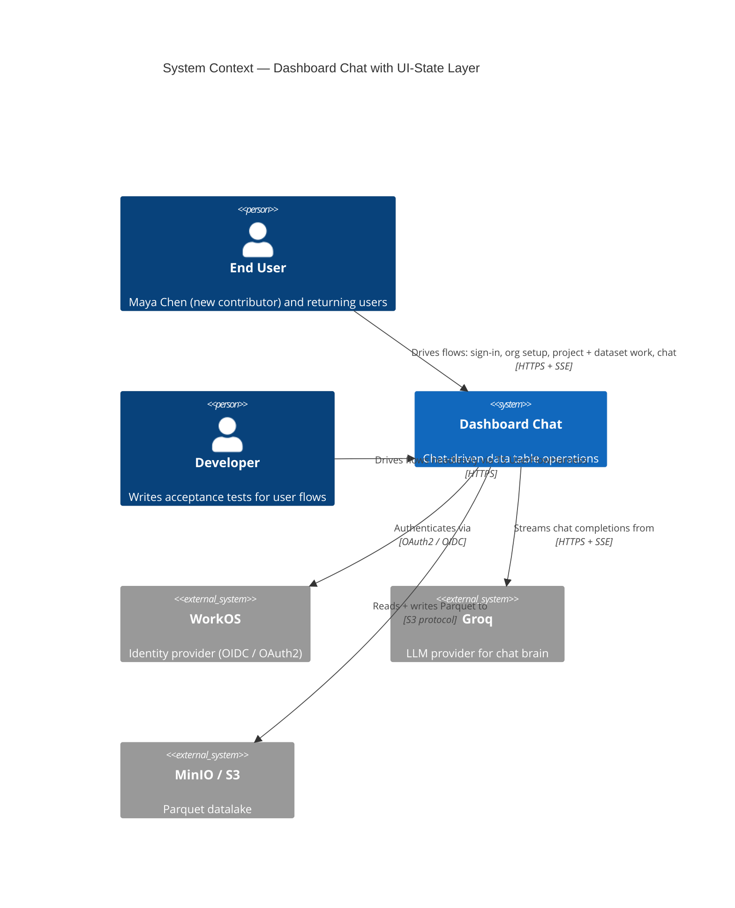
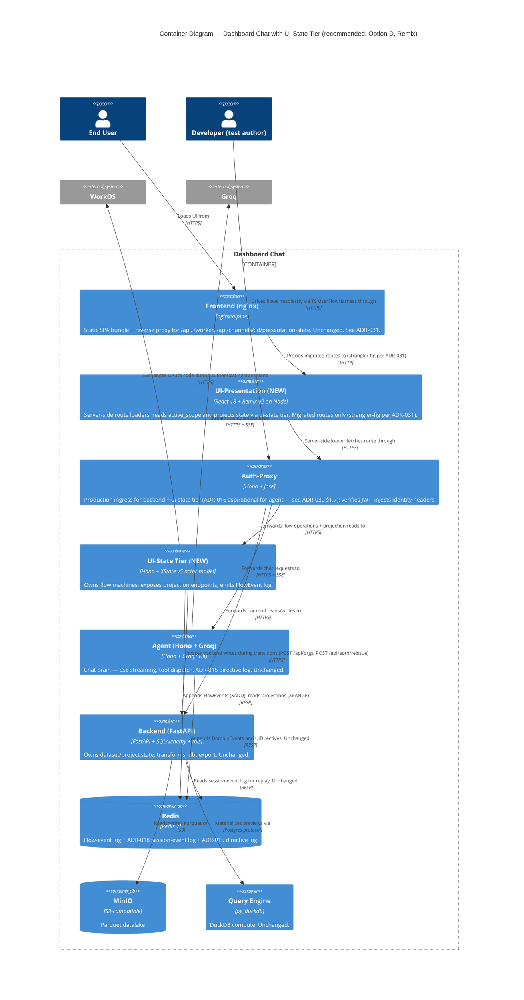
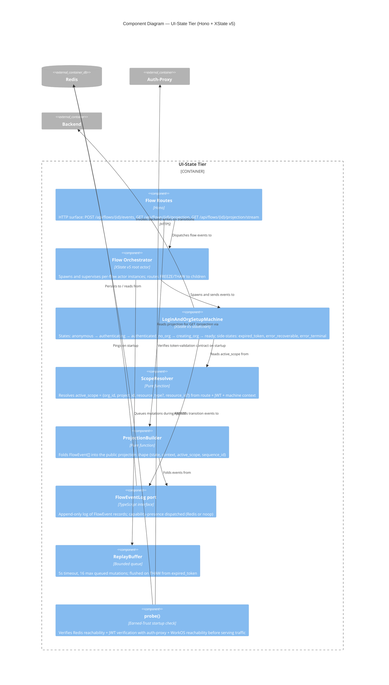

# Application Architecture — `user-flow-state-machines`

> **Wave**: DESIGN (propose mode)
> **Architect**: Morgan (nw-solution-architect)
> **Companion**: `wave-decisions.md` (decisions D1–D9); ADR-027 (ui-state tier + projection contract), ADR-028 (XState v5 actor model), ADR-029 (`active_scope` propagation contract).

This document is the propose-mode deliverable. It narrows the 5-option matrix to 2 survivors, presents each with full trade-offs, and recommends one with explicit rationale. It also specifies the `active_scope` propagation contract as a concrete artifact.

---

## 1. C4 System Context (L1)



The system-context diagram is unchanged from prior architecture. The new tier is internal; no new external system is introduced.

## 2. C4 Container (L2)



**Key callouts in the diagram**:
- **The UI-State Tier is a NEW container.** Hono + XState v5, deployed alongside the agent in the same compose topology. It is NOT the agent.
- **Auth-proxy is the only ingress** for the FE, the harness, the ui-state tier, the agent, and the backend. ADR-016 is honored.
- **Redis is the shared durability substrate.** Three logs coexist with distinct key prefixes: `ui-state:{flow_id}:events` (this feature), `session:{session_id}:events` (ADR-018), `presentation-state:{channel_id}` (ADR-015).
- **The agent is unchanged.** D8 is honored mechanically — no new responsibility, no new endpoint, no integration with the ui-state tier except via the same auth-proxy ingress.

## 3. C4 Component (L3) — UI-State Tier internals



**Component responsibilities** (each is a single concern; one file per box, modulo unit-internal helpers):

- `routes` — HTTP surface. Thin handlers. Validates `active_scope` is present and matches JWT.
- `orchestrator` — XState v5 root actor. Owns the actor tree. Receives `FREEZE`/`THAW` and forwards.
- `loginmachine` — the seed implementation (US-001/002/003/005 directly). Other flows add sibling machines.
- `scoperesolver` — pure function: `(route, jwt, machineContext) → active_scope`. Single source of truth.
- `projectionbuilder` — pure function: `FlowEvent[] → projection`. Mirrors ADR-015's `applyDirective` shape.
- `eventlog` — driven adapter port; Redis or noop, capability-presence dispatched.
- `replaybuffer` — in-memory queue; bounded; flushed on THAW. Lives in the tier, not in the FE.
- `probe` — startup health check. Refuses to serve traffic if dependencies fail. ADR-027 enumerates probes.

## 4. Two surviving options — full trade-off

### Option B: New Node BFF + XState server-side + React SPA reads projection

**Architecture sketch.** Keep the current Vite + React Router + AuthContext frontend. Introduce a new Node service ("flow-choreographer") that owns XState v5 actors and exposes a projection endpoint. The FE adds a single `useFlowProjection(flowId)` hook (TanStack Query under the hood) that polls or SSE-subscribes to the projection. All scope-aware components read `active_scope` from the projection rather than from `useParams`/`useAuth`.

**`active_scope` propagation** (Option B):

```ts
// frontend: one provider at the AppShell layout boundary
function ScopeProvider({ children }: { children: React.ReactNode }) {
  const flowId = useCurrentFlowId(); // derived from route
  const { data } = useFlowProjection(flowId);
  if (!data) return <LoadingScopeSplash />;
  return <ScopeContext.Provider value={data.active_scope}>{children}</ScopeContext.Provider>;
}
// consumers read once:
function ChatView() {
  const scope = useScope(); // throws if not under ScopeProvider
  // …
}
```

**How XState fits**: server-only. The FE never imports XState. The FE consumes a JSON projection. The server publishes the projection on every transition.

**Effort**: 4–5 weeks. Confidence: HIGH (every primitive already exists in the repo under another vocabulary).

**Migration risk**: LOW for routing (React Router stays). MEDIUM for auth (AuthContext strangler-fig: keep, then migrate consumers off, then delete; sequenced over 3 PRs).

**Lock-in risk**: LOW. The tier is plain Hono + XState. If the team later moves to Remix or Next.js, the projection endpoint is unchanged; only the FE consumer changes.

**Test surface**: TS harness drives the ui-state tier's HTTP surface directly. `harness.user_flow.begin_auth("maya")` POSTs `/api/flows/login-and-org-setup/events` with `{ event: "sign_in_clicked" }` then polls `/api/flows/{id}/projection` until state is `authenticated_no_org`. `assert_scope(...)` GETs the projection and diffs `active_scope` against the expected shape with named-column diff output.

**Trade-off summary**: smallest FE delta. Scope drift risk remains MEDIUM because every component still has to opt into `useScope()`. One missed opt-in = one drift.

### Option D: Remix + XState server-side (RECOMMENDED)

**Architecture sketch.** Replace `frontend/main.tsx` + `frontend/App.tsx` with a Remix app. Vite stays as the build tool. The new `ui-state` Hono tier still exists (Remix doesn't replace it — XState lives there because it must NOT live in the agent per D8). Each route file has a `loader` function that calls into the ui-state tier's projection endpoint server-side; the loader's return value IS the FE's data. `useRouteLoaderData("root")` exposes `active_scope` at every nested layout.

**`active_scope` propagation** (Option D):

```ts
// app/root.tsx  (Remix root route)
export async function loader({ request }: LoaderFunctionArgs) {
  const projection = await uiStateClient(request).getProjection("login-and-org-setup");
  return json({ active_scope: projection.active_scope, user: projection.context.user });
}
export function useScope() {
  return useRouteLoaderData<typeof loader>("root").active_scope;
}

// app/routes/org.$org.project.$project.tsx
export async function loader({ params, request }: LoaderFunctionArgs) {
  // Nested loader can override or augment scope from URL params; the
  // ScopeResolver in the ui-state tier reconciles route params with
  // machine context and returns the AUTHORITATIVE active_scope.
  const projection = await uiStateClient(request).getProjection("project-session-mgmt", {
    intent_org_id: params.org,
    intent_project_id: params.project,
  });
  return json({ project: projection.context.project, active_scope: projection.active_scope });
}

// Any leaf component:
function ChatView() {
  const scope = useScope();  // server-resolved; zero FE re-derivation
  // …
}
```

**How XState fits**: server-only, in the ui-state tier. Remix loaders are the HTTP-shaped interface to the tier. The FE consumes loader data. The same projection endpoint Option B exposes is what Remix's loaders consume — the only difference is *who calls it* (FE in Option B, Remix server in Option D) and *how the scope is propagated downward* (Context in Option B, loader data in Option D).

**Effort**: 4–6 weeks. Confidence: MEDIUM-HIGH (Remix migration from React Router v6 is well-documented; the chat SSE integration needs verification — Remix supports SSE responses but our existing agent SSE flow stays in the agent unchanged).

**Migration risk**:
- **Routing**: HIGH-effort but LOW-risk; route-by-route migration; Remix's `@remix-run/react` has a React-Router-v6-compatible upgrade path.
- **Auth**: Same strangler-fig as Option B, except `AuthContext` retires faster because route loaders own the resolution.
- **Chat SSE**: LOW — the FE's SSE client (currently connecting to the agent through nginx) is unchanged. Remix does not own the SSE connection; the FE component does.
- **Test harness**: same as Option B — the harness drives HTTP, not the FE.

**Lock-in risk**: MEDIUM. Remix is mature (v2.7+, 2024), Shopify-owned, Vite-integrated. The lock-in is at the routing layer, not the data layer. Reversibility: if Remix becomes unmaintained or the team decides to migrate to Next.js, the route-level loaders can be ported to Next.js `app/` route handlers in 1-2 weeks because the ui-state tier (the load-bearing piece) is framework-independent.

**Test surface**: identical to Option B. The TS harness reads the same projection endpoint. **The harness does NOT drive Remix loaders** — it talks directly to the ui-state tier. This is important: the harness and the FE are peers; both read the same SSOT.

**Trade-off summary**: largest FE delta. Scope drift risk LOW by construction (`useRouteLoaderData` is the only path; missing the opt-in is a TypeScript error, not a silent bug). Closest match to the user's stated mental model ("FE reloads after API call → same state as backend").

## 5. Comparison matrix

| Criterion | Option B (BFF + SPA) | Option D (Remix) |
|---|---|---|
| Solves JOB-002 server-owned-state? | YES | YES |
| Scope-chain drift risk | MEDIUM (manual opt-in per component) | **LOW** (loader data is the only path) |
| Matches user's "FE reloads after API call" mental model | Partially (via polling/SSE) | **Strongly** (loader IS the reload) |
| Effort | 4–5 weeks | 4–6 weeks |
| Routing migration | None | Full (React Router → Remix routes) |
| Auth-proxy compatibility | Same | Same |
| Chat SSE compatibility | Unchanged | Unchanged |
| Test-harness shape | Same (drives ui-state HTTP) | Same |
| Reversibility | HIGH (plain SPA stays) | MEDIUM (Remix lock-in at routing layer) |
| Lock-in risk | LOW | MEDIUM |
| Sequential migration path | Strangler-fig per component | Route-by-route |
| Adapter maturity risk | None (custom code) | LOW (Remix v2 with Vite is stable since 2024) |

## 6. Sequence diagrams — most complex flows

### 6.1 Cold project URL deep-link (Option D, US-002 Round-2 AC)

```mermaid
sequenceDiagram
  actor User as Maya
  participant FE as Frontend (Remix on Vite)
  participant AP as Auth-Proxy
  participant FS as UI-State Tier
  participant BE as Backend
  participant R as Redis
  User->>FE: GET /org/acme-data/project/q4-analytics
  FE->>AP: GET /ui-state/projection?flow=project-session-mgmt&intent_org=acme-data&intent_project=q4-analytics
  AP->>FS: forward (with identity headers)
  FS->>R: XRANGE ui-state:project-session-mgmt:events
  R-->>FS: FlowEvent[]
  FS->>FS: ProjectionBuilder.fold(events) + ScopeResolver.resolve(route, jwt, ctx)
  FS->>BE: (if project not in cache) GET /api/projects/{id}
  BE-->>FS: {project: {name: "Q4 Analytics", ...}}
  FS-->>AP: { state: "session_active", active_scope: {org_id, project_id, ...}, context: {project: ...} }
  AP-->>FE: same
  FE->>FE: Remix loader returns; UI renders org chip + project chip + body in one paint
  FE-->>User: page rendered (no flicker; all three chips correct)
```

The key: **`active_scope` is in the same response body as the body content**. No second fetch. No re-derivation. The chip and the body cannot disagree because they read from the same loader result.

### 6.2 Token expiry mid-chat-turn with cross-machine freeze (US-005)

```mermaid
sequenceDiagram
  actor User as Maya
  participant FE as Frontend
  participant Agent as Agent (chat brain, unchanged)
  participant FS as UI-State Tier
  participant AP as Auth-Proxy
  participant R as Redis
  User->>FE: types "what's the average rev by region"
  FE->>AP: POST /chat (with JWT — expired 30s ago)
  AP->>Agent: forward
  Agent-->>AP: 401 token-expired
  AP-->>FE: 401 token-expired
  FE->>FS: POST /api/flows/login-and-org-setup/events { event: "token_expired", original_correlation_id: "R-chat-9b2a" }
  FS->>FS: LoginAndOrgSetupMachine transitions to expired_token
  FS->>FS: Orchestrator sends FREEZE to ALL spawned actors (transforms, dataset, view, report)
  FS->>FS: ReplayBuffer queues the original chat request (5s budget, 16 max)
  FS->>R: XADD ui-state:*:events { type: "freeze", reason: "expired_token" }
  FS->>AP: POST /auth-proxy silent re-auth attempt
  AP-->>FS: { token: <new JWT>, expires_in: 3600 }
  FS->>FS: LoginAndOrgSetupMachine transitions expired_token → ready
  FS->>FS: Orchestrator sends THAW to all actors
  FS->>FS: ReplayBuffer flushes; original chat request re-sent with new JWT
  FS->>AP: POST /chat (replay; with original correlation_id)
  AP->>Agent: forward
  Agent-->>FE: SSE stream begins (via existing SSE channel, unchanged)
  FE-->>User: chat response streams as if expiry never happened
```

The cross-machine freeze is mechanically the XState v5 actor model's `send`-to-children pattern. No hand-rolled pub/sub. No FE-side coordination. The replay buffer is in the tier, not the FE — so if the FE crashes during freeze, the buffer is unaffected.

## 7. Quality attributes (ISO 25010)

| Attribute | Strategy | Verification |
|---|---|---|
| Performance | Projection endpoint p95 ≤ 80ms (Redis XRANGE bounded by maxLen=1000 + in-process fold). SSE push for live updates avoids polling. | Acceptance test asserts `time_to_email_visible_ms` < 100 (US-001 KPI). |
| Reliability | Earned-Trust `probe()` at startup verifies Redis + auth-proxy + WorkOS reachability before serving traffic. Failed probe → process exits 1, structured `health.startup.refused` log. | ADR-027 §"Earned Trust"; gold-test in CI uninstalls Redis client → probe fails → tier refuses to start. |
| Security | Sole ingress is auth-proxy. JWT verified before any flow event is accepted. `active_scope.org_id` MUST equal JWT's `org_id` claim — divergence is a 403. | Acceptance test attempts cross-tenant write; asserts 403 + named "scope mismatch" diagnostic. |
| Maintainability | One file per flow machine; one component per concern in the tier; projection is a pure function. Strict dependency-inversion: `eventlog` is a port; Redis is one adapter; tests use an in-memory adapter. | ArchUnit-style enforcement: `pytest-archon`-equivalent for TS via `dependency-cruiser` config in the tier; ADR-027 §"Enforcement". |
| Testability | TS harness reads SAME projection FE reads — no parallel state. Personas seeded in fixtures; one-file change to add a persona. | US-004 AC verifies this end-to-end. |
| Observability | Every FlowEvent carries `correlation_id`. `correlation_id` threads across FE → auth-proxy → ui-state tier → backend → agent via `X-Correlation-Id` header. Redis-persisted log IS the audit trail. | DEVOPS handoff (ADR-027 §"Observability"); KPI K4 (recoverable-error correlation rate) instrumentable from the FlowEventLog directly. |
| Portability | Tier is Hono on Node; runs the same in `npm run dev`, compose, and any container runtime. No platform-specific APIs. | Compose acceptance test (ADR-016 mirror) verifies the tier starts byte-identically in compose and in CI. |

## 8. External integrations (annotated for DEVOPS handoff)

| Integration | Direction | Contract testing recommendation |
|---|---|---|
| UI-state tier → WorkOS (OIDC code exchange during `authenticating`) | Outbound | **Pact consumer-driven contract** (Pact-JS in CI) against pinned WorkOS schema. The ui-state tier consumes WorkOS's `/v1/sso/token` and `/v1/users/{id}` endpoints; if WorkOS changes response shape, the tier's parser must catch at build time, not in production. |
| UI-state tier → auth-proxy (silent re-auth during `expired_token`) | Outbound | Contract test via the auth-proxy's existing OpenAPI document (`auth-proxy/lib/openapi.ts`) — the tier validates its mock-server against that spec. |
| UI-state tier → backend (`POST /api/orgs`, `POST /api/auth/reissue` if added) | Outbound | Contract test via FastAPI's OpenAPI document — the tier validates its mock-server against the live spec. |

**Annotation for `platform-architect` (DEVOPS handoff)**:
> Contract tests recommended for UI-State Tier → WorkOS — consumer-driven contracts via Pact-JS in CI acceptance stage to detect WorkOS API breaking changes before production. Internal contracts (auth-proxy, backend) are covered by their existing OpenAPI documents; the ui-state tier's mock-server validation step should run those specs in CI.

## 9. Earned Trust — probes per adapter

Per principle 12, every driven adapter has a `probe()` method exercised at composition root before serving traffic.

| Adapter | Probe assertions |
|---|---|
| `RedisFlowEventLog` | (a) Connect; (b) XADD a probe event; (c) XRANGE that event back; (d) DEL probe key. Fault scenario: Redis unreachable → probe fails → tier refuses to start with `health.startup.refused`. |
| `AuthProxyClient` | (a) GET `/auth-proxy/openapi.json`; (b) verify expected route shape (`POST /api/auth/reissue` present); (c) issue a probe token-verification call. Fault: auth-proxy returns malformed JSON → probe fails. |
| `WorkOSClient` | (a) GET WorkOS health URL; (b) verify OIDC discovery document accessible. Fault: WorkOS unreachable → probe SOFT-fails (logs warning; tier still serves, but `authenticating` transitions degrade to `error_recoverable`). |
| `BackendClient` | (a) GET `/api/health`; (b) GET `/openapi.json`; (c) verify expected route shape. Fault: backend unreachable → probe fails → tier refuses to start. |

**Probe enforcement** (per principle 12 + 11, three orthogonal layers):
1. **Subtype** — `mypy`-style: every adapter implements a `Probed` TypeScript interface with `probe(): Promise<ProbeResult>`. Compile-time check at the composition root: `selectFlowEventStore` returns `Probed & FlowEventLog`.
2. **Structural** — pre-commit hook walking the tier's `adapters/` directory: every file matching `*Adapter.ts` MUST export a class with a `probe` method. AST check.
3. **Behavioral** — CI gold-test: at startup, the composition root calls `probe()` on every adapter; if a developer adds an adapter that exits early without calling `probe()`, the gold-test fails (it runs `npm start` with `--probe-strict` and asserts the structured `health.probes.passed` event for each registered adapter).

`import-linter` was investigated and rejected (per principle 12): it works on import graphs only, not on class-method presence. The three-layer enforcement above covers method-presence semantically.

## 10. Architectural enforcement (principle 11)

Language-appropriate tooling for the TypeScript tier:

| Layer | Tool | Rule |
|---|---|---|
| Import graph | `dependency-cruiser` (`.dependency-cruiser.cjs`) | `routes/` may import from `orchestrator/`; `orchestrator/` may import from `machines/`; `machines/` may NOT import from `routes/`. Reverse dependency = build error. |
| Subtype | TypeScript `strict` + `Probed` interface | All adapter exports satisfy `Probed`. Compile-time. |
| Structural | AST pre-commit hook (`scripts/check-adapters.ts`) | Every `*Adapter.ts` exports a class with `probe(): Promise<ProbeResult>`. |
| Behavioral | CI gold-test (`ui-state/test/composition-root.test.ts`) | Process startup with `--probe-strict` emits one `health.probes.passed` event per adapter. |

For the Remix FE (Option D):

| Layer | Tool | Rule |
|---|---|---|
| Import graph | `dependency-cruiser` | FE may NOT import from `ui-state/` internals; only from a published `@dashboard-chat/ui-state-client` package shape. |
| Type | TypeScript strict | `useRouteLoaderData` return types are reified; missing fields = compile error. |
| Linting | `eslint-plugin-remix` | Enforce loader-data-only access pattern; flag direct `useParams` reads of scope-relevant params (force route through ScopeResolver). |

## 11. Deployment

The ui-state tier deploys alongside the agent in the same compose topology:

```yaml
# docker-compose.yml additions (illustrative — not committed in this wave)
ui-state:
  image: dashboard-chat/ui-state:bazel
  pull_policy: never
  environment:
    AUTH_MODE: ${AUTH_MODE:-dev}
    JWKS_URL: ${JWKS_URL:-}
    AUTH_PROXY_URL: http://auth-proxy:3000
    BACKEND_URL: http://api:8000
    WORKOS_API_KEY: ${WORKOS_API_KEY:-}
    REDIS_URL: redis://redis:6379/0
    FLOW_EVENT_MAXLEN: ${FLOW_EVENT_MAXLEN:-1000}
  ports:
    - "${UI_STATE_HOST_PORT:-1043}:8788"
  depends_on:
    redis:
      condition: service_healthy
```

The auth-proxy's nginx-style routing forwards `/ui-state/*` to this service. No new compose container types — same Node image base as the agent. The compose acceptance test (per ADR-016 mirror) verifies the 6-service stack (was 5; +1 for ui-state) starts byte-identically.

## 12. Recommendation

**Option D (Remix + XState v5 server-side + new ui-state Node tier).**

**Single sharpest argument**: it is the smallest framework choice that mechanically eliminates the scope-chain drift class. The "ChatView project-context race" the user named is impossible by construction under Option D — there is no path by which a component can read `project_id` from anywhere other than `useRouteLoaderData("root").active_scope`, because the alternative paths (`useParams`, `useAuth()`, ad-hoc fetches) are flagged at compile time or by lint and have no value to read.

Option B remains structurally viable as a slower-migration alternative; ADR-027/028/029 are written to apply to both. If the user chooses B, the surviving paragraphs are the propagation mechanism (`ScopeContext` + `useScope()` hook) and the route-by-route migration sequence in §6.1.

## 13. Decision boundary — what the user/orchestrator must ratify

| Decision | This document recommends | Acceptance criterion |
|---|---|---|
| Framework | Option D (Remix) | User confirms or selects Option B explicitly. |
| State-machine engine | XState v5 with actor model | User confirms or proposes alternative with rationale (ADR-028 documents the choice). |
| Persistence | Redis via capability-presence dispatch (ADR-018 inheritance) | No new ADR required — pattern is inherited. |
| Wire format | JSON projection + SSE stream (ADR-027) | User confirms or asks for delta encoding (deferred — additive). |
| Scope contract | `active_scope` typed object, server-resolved at route entry, propagated via loader data (D) or Context (B) | ADR-029 ratifies the contract; D vs B affects only the propagation mechanism, not the shape. |
| Cross-machine freeze | XState v5 actor-tree FREEZE/THAW + bounded replay buffer in tier | ADR-027 §"Cross-machine freeze" ratifies. |
