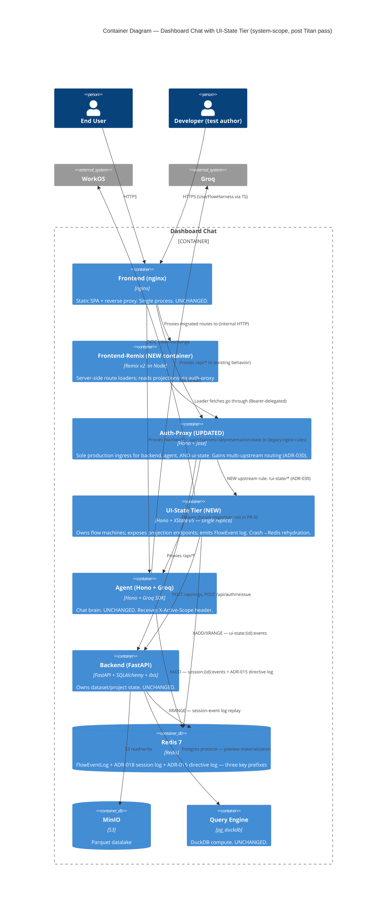

# System Architecture — `user-flow-state-machines`

> **Wave**: DESIGN (propose mode, system-scope pass)
> **Architect**: Titan (nw-system-designer)
> **Companion**: Morgan's `application-architecture.md` (application-scope pass), `wave-decisions.md`, ADR-027/028/029.
> **New ADRs**: ADR-030 (topology + scaling), ADR-031 (frontend tier transition).

This document is the system-scope counterpart to Morgan's application-scope
deliverable. Morgan picked the host tier (`ui-state/` as a peer Hono
container), the engine (XState v5 actor model), the FE framework (Remix), and
the `active_scope` propagation contract. This document pressure-tests those
choices against system-level concerns: topology, scaling shape, persistence
substrate, observability, frontend tier transition, auth path, failover, and
quantitative estimation.

Each open system question (SQ-1..SQ-8) from the engagement brief is resolved
below with options + trade-offs + recommendation (SQ-1, SQ-2, SQ-5) or with a
directive contract spec (SQ-3, SQ-4) or as a derivation of the chosen topology
(SQ-6, SQ-7, SQ-8).

---

## 0. Back-of-envelope estimation (numbers before topology)

This section is the foundation. Every topology + scaling choice below references it.

### 0.1 Assumptions

| Variable | Today (1x) | 10x target |
|---|---|---|
| Concurrent active users | 100 | 1,000 |
| Active flow actors per user (avg) | 3 | 3 |
| FlowEvent transitions per user per minute | 60 (1/sec peak) | 60 |
| Projection reads per user per minute (post-Remix loader) | ~5 | ~5 |
| Avg FlowEvent payload | ~500 bytes | ~500 bytes |
| Redis maxLen per flow stream | 1,000 entries | 1,000 entries |
| FlowEventLog retention | bounded by maxLen (best-effort) | same |

Per-user actor count rationale:
- 1 × `LoginAndOrgSetupMachine` (always-on once authenticated)
- 0..1 × `ProjectSessionMachine` (when inside a project URL)
- 0..N × resource-edit machines (transform/dataset/view/report — typically 0..1 at a time)
- Avg ~3.

### 0.2 Memory (actor tree size)

XState v5 actor with a small context object + interpreter + event queue is approximately
10-15KB resident. Conservative pick: **15 KB / actor**.

| Scale | Actors | RAM (actors only) | + Node baseline (~150MB) | Total |
|---|---|---|---|---|
| 1x | 300 | 4.5 MB | 150 MB | **~155 MB** |
| 10x | 3,000 | 45 MB | 150 MB | **~195 MB** |

**Conclusion: a single 256MB container handles 10x with headroom.**

### 0.3 Redis throughput (FlowEvent log)

| Op | 1x events/sec | 10x events/sec |
|---|---|---|
| XADD (transition writes) | 100 | 1,000 |
| XRANGE (projection fold reads) | 8 | 83 |
| Total | **~110 ops/sec** | **~1,100 ops/sec** |

Single-node Redis 7 sustains ~100K ops/sec on commodity HW. **Headroom: 3 orders of magnitude at 10x.** Same Redis container that backs ADR-018's session-event log and ADR-015's directive log can absorb this load without contention.

Storage:
- Per flow stream: 1,000 events × 500B = 500 KB
- 3,000 active flows at 10x → **~1.5 GB total**, eclipsed by maxLen-driven trimming.

### 0.4 Projection endpoint QPS

| Scale | Loader-driven reads/sec | SSE concurrent connections |
|---|---|---|
| 1x | ~8 QPS | ~100 |
| 10x | ~83 QPS | ~1,000 |

A single Hono process handles >5K QPS on plain JSON. 10x QPS load is **2 orders of magnitude under capacity**.

SSE concurrent connections: 1,000 long-lived TCP connections per replica fits comfortably in Node's default event-loop with `keep-alive`. Node's default 65K-fd ceiling is the asymptotic limit; we are 65x below it.

### 0.5 Headline result

**A single 256MB container with one CPU core, fronted by one Redis instance, services 10x load with 2-3 orders of magnitude headroom on every dimension.** Scaling beyond 10x will reach a CPU or fd limit, not a memory or persistence limit. This estimation directly constrains SQ-1 and SQ-2 below.

---

## 1. SQ-1 + SQ-2 (fused): Topology + Scaling

These two questions are inseparable: how the tier is *placed* in the topology determines whether it can be *scaled*, and how it scales determines the legal placement options.

### 1.1 Why fused

XState v5 actors live **in-process**. The orchestrator's `system.get(actor_id).send(...)` enumeration requires actors to be reachable in memory; cross-process actor enumeration is not a v5 primitive. This means:

- If we run N replicas, an actor spawned on replica A is **not visible** from replica B.
- A `FREEZE` broadcast from replica A reaches its local actors only, not actors on replica B.
- Therefore, **either** all requests for a given user's flow tree route to the same replica (sticky session), **or** there is only one replica.

The auth-proxy's nginx forwarding is round-robin DNS over the compose network (see `docker-compose.yml` agent comment line 23: *"rides docker's round-robin DNS across replicas"*). It is **not sticky**. So multi-replica deployment of the ui-state tier requires either:

- a) Sticky routing layer (consistent hashing on `flow_id` or `user_id`), OR
- b) Stateless tier with per-request actor rehydration from Redis, OR
- c) Single replica.

The estimation in §0 says one container at 10x fits in 200 MB of RAM and uses 1% of CPU. **The capacity case for >1 replica does not exist at the planning horizon.**

### 1.2 Options

#### Option α — Single replica, behind auth-proxy

```
Browser → frontend(nginx) → auth-proxy → ui-state (1 replica) → Redis
                                       → api (backend)
                                       → agent
```

- UI-state tier deployed as 1 replica in compose (`scale: 1`).
- Auth-proxy gains an upstream-routing rule for `/ui-state/*`.
- Actor tree lives in one process; no rehydration cost on the hot path.
- Crash recovery: rehydrate from Redis FlowEventLog on cold start.

#### Option β — Multiple replicas, stateless (Redis-rehydrate per request)

```
Browser → frontend(nginx) → auth-proxy → ui-state replica 1 → Redis
                                      → ui-state replica 2 → Redis
                                      → ui-state replica N → Redis
```

- Each replica is stateless. On every POST event, the replica:
  1. Reads the actor's persisted snapshot from Redis (`XRANGE` + replay).
  2. Spawns an in-memory actor.
  3. Applies the event.
  4. Persists the new state.
  5. Discards the actor.
- Cross-machine FREEZE/THAW becomes a **broadcast over Redis pub/sub**, not in-process `system.get`.
- Latency cost: every event pays an XRANGE round-trip (~1ms in compose; ~2-5ms in cloud).

#### Option γ — Multiple replicas with sticky routing (consistent hash on `flow_id`)

```
Browser → frontend(nginx) → auth-proxy/sticky-router → ui-state replica K → Redis
```

- Routes requests for the same `flow_id` always to the same replica.
- Auth-proxy gains a sticky-routing layer (hash `flow_id` in path/header → upstream index).
- Per-replica actor tree fits in RAM; no rehydration cost.
- Failover requires rehydration on a different replica when one dies.

### 1.3 Trade-off matrix

| Criterion | Option α (1 replica) | Option β (N stateless) | Option γ (N sticky) |
|---|---|---|---|
| Hot-path latency for events | **Lowest** (~5ms p95) | Highest (~15ms p95: XRANGE + spawn + persist) | Lowest (~5ms p95) |
| FREEZE/THAW semantics | Native XState `system.get` | Redis pub/sub fan-out (re-implementation) | Native XState `system.get` per-replica only — cross-replica is Redis pub/sub anyway |
| RAM at 10x | 200 MB | 200 MB × N | 200 MB × N |
| CPU at 10x | <5% of 1 core | <5% × N (with per-event spawn overhead) | <5% × N |
| HA — surviving 1 crash | Recovery via cold restart (~10-30s) + Redis rehydration | **Survives transparently** (replicas independent) | Survives, but the failed replica's flows must be rehydrated on the takeover replica (~hundreds of ms) |
| Operational complexity | **Lowest** (1 deployable) | Medium (N replicas + Redis pub/sub channel for FREEZE) | High (sticky-routing layer + per-flow rebalance on crash) |
| Compose acceptance test impact | +1 service | +1 service + scale flag | +1 service + sticky layer in auth-proxy |
| Code surface in tier | Minimal | Substantial (rehydration helper, pub/sub layer, snapshot serialization) | Medium (rehydration on takeover only) |
| Does estimation justify? | YES at 1x and 10x | NO — over-engineered for the load | NO — over-engineered for the load |
| HA SLO compatibility | OK for 99.5% (single-replica restart = ~30s downtime per failover) | OK for 99.9%+ | OK for 99.9%+ |

### 1.4 Recommendation — Option α (single replica), with an explicit scaling-ceiling note

**Recommendation: Option α** — single replica behind auth-proxy.

**Sharpest argument**: XState v5 actors are in-process by design; the estimation (§0) says one container handles 10x with 99% CPU headroom. Choosing β or γ accepts the cost of cross-process actor coordination today to solve a capacity problem we don't have at the planning horizon. The savings from Option α are not the small RAM win — they are the avoidance of a **pub/sub-based FREEZE broadcast layer**, which is a load-bearing piece of logic that would be wholly synthetic (no consumer outside this feature needs it) and would re-implement what XState v5 gives us for free in-process.

The HA cost of Option α is bounded: a tier crash forces a cold restart with FlowEventLog rehydration. Mean time to recovery: ~10-30 seconds (process startup + Redis XRANGE for active flows). For our SLO posture (JOB-002 does not name an availability target stronger than "matches the rest of the stack"), this is acceptable. The single-replica restart shape matches the agent's current `scale: 1` posture (fixed host port precludes multi-replica per `docker-compose.yml:48`).

### 1.5 Scaling ceiling — when Option α breaks

| Trigger | Indicator | Action |
|---|---|---|
| CPU > 60% sustained | `ui_state.cpu_utilization` p95 alarm | Migrate to Option γ (sticky); pre-write the rehydration helper |
| RAM > 200 MB sustained | `ui_state.heap_used_bytes` alarm | Migrate to Option γ |
| Active actors > 10,000 | `ui_state.actors_active` alarm | Migrate to Option γ |
| Required SLO > 99.5% | Product decision | Migrate to Option γ; consider Option β if cross-machine FREEZE proves rare |

The Option γ migration is non-destructive — the tier's FlowEventLog is already event-sourced; sticky routing is an auth-proxy concern; the actor model unchanged. **Estimated migration cost: 1-2 weeks engineering, including the sticky-routing logic in auth-proxy.**

### 1.6 Topology placement detail (the SQ-1 sub-question)

Where does `ui-state/` *physically* sit?

| Placement | Verdict | Reason |
|---|---|---|
| Behind the frontend nginx (parallel to `/api/`, `/worker/` rules) | Considered | Today's nginx is the de-facto multi-upstream router; adding `/ui-state/` is a 5-line nginx.conf change. But this **bypasses auth-proxy**, which violates ADR-016 if the tier handles privileged operations. |
| Behind auth-proxy as a second upstream | **RECOMMENDED** | Honors ADR-016 ("auth-proxy is the sole production ingress for backend and worker"). The ui-state tier handles privileged operations (writing FlowEvents that mutate scope state; invoking backend writes on transitions); it must sit behind auth-proxy. |
| Direct host port via auth-proxy + new ingress | Overkill | No external system consumes the tier; an additional ingress adds operational mass for no value at this scale. |
| Co-tenanted in the auth-proxy container | **REJECTED** | Auth-proxy is stateless and does one thing well (JWT verification + identity-header injection). The ui-state tier is hot, stateful (in-process actor tree), and runs business logic. Co-tenancy muddles two responsibilities. Mirrors the rejection of `agent/` as host per D8. |

**Selected**: behind auth-proxy. This requires the auth-proxy to gain multi-upstream routing capability (see §1.7).

### 1.7 Auth-proxy multi-upstream — system-level call-out

**Today's auth-proxy is single-upstream.** Reading `auth-proxy/app.ts`:

- Line 19: `const BACKEND_URL = process.env.BACKEND_URL || "http://api:8000";`
- Line 178: `app.all("*", ...)` proxies all unmatched paths to `BACKEND_URL`.

The agent today is reached via the **frontend container's nginx** (`frontend/nginx.conf:35-47`, the `/worker/` rule), **NOT** via auth-proxy. The ADR-016 statement that "auth-proxy is the sole production ingress for backend and worker" is **aspirational, not currently honored for the agent in compose dev.**

Morgan's design assumes the auth-proxy will forward `/ui-state/*` to the new tier. To honor that:

- **Option (a)**: Extend auth-proxy to be multi-upstream. Add an upstream table (`/api/*` → backend, `/ui-state/*` → ui-state, `/worker/*` → agent). This is a small Hono-routes change (~30 lines + tests) but is a **policy-shaped change** to auth-proxy's responsibility (it grows from "the auth-and-proxy gateway for backend" to "the auth-and-proxy gateway for all internal services"). Recommended.

- **Option (b)**: Add `/ui-state/*` to `frontend/nginx.conf` (mirror the `/worker/` rule). This is byte-trivial but means the ui-state tier sits in front of auth-proxy in the routing topology, violating ADR-016 the same way the agent already does. Not recommended.

ADR-030 ratifies **Option (a)** — extend auth-proxy. This decision has retroactive cleanup value: the agent's `/worker/` route can later be migrated behind the same multi-upstream auth-proxy, restoring ADR-016 fidelity. Out of scope for THIS feature, but the door is now open.

---

## 2. SQ-3: Persistence — Redis Streams (contract spec, directive)

ADR-018 anchors the persistence pattern: `REDIS_URL` set → Redis tier; unset → noop. Morgan's design inherits this (ADR-027 §3) and is correct.

This section gives the **concrete contract spec** beyond what ADR-027 enumerated.

### 2.1 Key prefix and schema

```
ui-state:{flow_id}:events    → Redis Stream (XADD/XRANGE/DEL)
ui-state:{flow_id}:snapshot  → Redis String (optional fast-path; see §2.4)
```

Per ADR-027 §3: `flow_id` format is `{flow-machine-name}:{principal_id}` for per-user flows; `{flow-machine-name}` alone for singleton flows. **Decision**: ADR-027's "flow_id" should always include `principal_id` for per-user flows; this is necessary for multi-tenant correctness (one user's expired_token freeze MUST NOT freeze another user's flows). This is an enhancement to ADR-027's specification, not a contradiction; see §6 "Upstream challenges."

### 2.2 FlowEvent record schema

```jsonc
{
  "sequence_id": 47,                    // monotonic per-flow; assigned by Redis XADD
  "event_type": "token_expired",        // machine event (e.g., sign_in_clicked, freeze, thaw, scope_reconciled)
  "machine_id": "loginAndOrgSetup",     // which actor emitted
  "from_state": "ready",                // FSM state before
  "to_state": "expired_token",          // FSM state after
  "context_delta": { "user.email": null }, // shallow JSON-patch shape (additive optimization; see §2.4)
  "context_snapshot": { ... },          // full machine context; only present every N events or on critical transitions
  "correlation_id": "R-chat-9b2a",      // threaded across FE → auth-proxy → tier → backend → agent
  "principal_id": "user-001",
  "org_id": "org-acme",
  "timestamp": "2026-05-11T14:32:17.421Z"
}
```

### 2.3 Persistence frequency

- **Every transition**: XADD a FlowEvent. No throttling — the load envelope (§0.3) shows 1,000 ops/sec at 10x is 1% of Redis capacity.
- **Full snapshot in `context_snapshot`**: every 50 transitions OR on entry to a "critical" state (`expired_token`, `error_terminal`, `ready`). This bounds replay cost.
- **No batching**: every transition is observable in the log as soon as it occurs. Critical for the SSE projection stream.

### 2.4 Snapshot fast-path (additive optimization, deferred to DELIVER)

If projection-build cost grows (folding 1,000 events through XState's reducer takes >5ms p95), introduce a `ui-state:{flow_id}:snapshot` Redis String containing the latest full machine snapshot. Build path:

1. Read `:snapshot` → start from that.
2. Read `:events` with cursor > snapshot's sequence_id.
3. Apply tail events.

This is a **deferred optimization**. PR-0 uses pure event-sourced fold. Estimation: at 1,000 events × XState fold ~0.005ms each = 5ms. Within budget; deferred to DELIVER if it becomes loud.

### 2.5 Probe contract (Earned Trust — principle 9)

```ts
async probe(): Promise<ProbeResult> {
  const k = `ui-state:_probe:${Date.now()}`;
  await this.redis.xadd(k, "*", "_probe", "1");           // (a) XADD round-trip
  const r = await this.redis.xrange(k, "-", "+");         // (b) XRANGE readback
  if (r.length !== 1) return failure("xrange-empty");
  await this.redis.del(k);                                // (c) DEL cleanup
  return ok();
}
```

Fault scenarios this probe detects:
- Redis unreachable → connection refused → HARD fail.
- Redis evicted under memory pressure → DEL returns 0; tier degraded but continues.
- Redis writable but not readable (rare; replication lag) → r.length === 0; HARD fail.
- **Substrate lie**: a noop adapter erroneously selected when REDIS_URL was set → XRANGE returns empty → HARD fail. (Detects the "we thought we were durable but we aren't" lie.)

Per the Earned Trust principle (system-designer principle 9): this probe is **mandatory at composition root**, runs before serving traffic, refuses to start with `health.startup.refused` if it fails. The `Probed` TypeScript interface from ADR-027 §6 enforces this at compile time.

### 2.6 Persistence directive — final

| Question | Answer |
|---|---|
| Substrate | Redis 7 (same container the agent uses) |
| Dispatch | Capability-presence (ADR-018), `REDIS_URL` set → Redis; unset → noop |
| Stream.io | Explicitly EXCLUDED — ADR-018 supersedes ADR-017 |
| Snapshot serialization | XState v5 `getPersistedSnapshot()` output (structured JSON) |
| Snapshot frequency | Every transition (XADD); full snapshot every 50 events |
| Probe | XADD/XRANGE/DEL round-trip; HARD-fail on failure |

---

## 3. SQ-4: Observability — Directive contract (instrumentation spec)

Morgan's design names `correlation_id` threading and lists KPIs (K1-K5 in `application-architecture.md` §7) but does not specify the **emission shape** of operational events. This is the system-level gap to close.

### 3.1 Per-transition log emission

Every machine transition emits a single structured log record at INFO level:

```json
{
  "ts": "2026-05-11T14:32:17.421Z",
  "level": "info",
  "event": "flow.transition",
  "flow_id": "loginAndOrgSetup:user-001",
  "machine_id": "loginAndOrgSetup",
  "from_state": "ready",
  "to_state": "expired_token",
  "machine_event": "token_expired",
  "sequence_id": 47,
  "correlation_id": "R-chat-9b2a",
  "principal_id": "user-001",
  "org_id": "org-acme",
  "duration_ms": 3
}
```

**Sink: stdout JSON lines.** Picked up by the compose log driver; in production by whichever log aggregator (Datadog/Loki/CloudWatch) ingests stdout. The Redis FlowEventLog is the audit-trail SSOT; stdout is the operational view; the two should agree (any divergence is a bug).

### 3.2 FREEZE/THAW events — separate event class

```json
{
  "event": "flow.freeze.broadcast",
  "reason": "expired_token",
  "actors_frozen": 4,                // count of actors received FREEZE
  "originating_machine": "loginAndOrgSetup",
  "correlation_id": "R-chat-9b2a"
}
```

```json
{
  "event": "flow.thaw.broadcast",
  "duration_frozen_ms": 1247,
  "replay_buffer_size_at_thaw": 2,
  "replay_buffer_overflowed": false
}
```

These are higher-cardinality and lower-rate than transitions; warrant their own event names for filter ergonomics.

### 3.3 Health endpoint shape

The tier exposes:

- `GET /health` → 200 `{"status":"ok"}` if probes passed at startup; 503 otherwise.
- `GET /health/probes` → details of each probe's last result (Redis, auth-proxy, backend, WorkOS).
- `GET /health/actors` → count of active actors, broken down by machine_id. **NOT individual actor enumeration** (would leak per-user data to the health surface).

```json
{
  "actors_active": 287,
  "by_machine": {
    "loginAndOrgSetup": 100,
    "projectSession": 95,
    "datasetEdit": 60,
    "viewEdit": 32
  },
  "freeze_active": false,
  "replay_buffer_total": 0
}
```

### 3.4 Metrics surface (Prometheus-compatible)

These are derived from the structured log; an aggregator (Vector, Promtail) extracts them. We do not run a metrics endpoint in the tier itself (avoids the operational cost of an in-process metrics scraper for a single-replica service).

| Metric | Type | Labels | Source event |
|---|---|---|---|
| `ui_state_transitions_total` | counter | machine_id, to_state | `flow.transition` |
| `ui_state_transition_duration_ms` | histogram | machine_id | `flow.transition` |
| `ui_state_actors_active` | gauge | machine_id | `/health/actors` poll |
| `ui_state_freeze_events_total` | counter | reason | `flow.freeze.broadcast` |
| `ui_state_replay_buffer_size` | gauge | | `/health/actors` poll |
| `flow_state_replay_abandoned_total` | counter | reason | `flow.replay.abandoned` event |
| `flow_state_probe_failures_total` | counter | adapter | probe failure event |

### 3.5 Correlation-ID propagation contract

Every chat turn / projection fetch / agent invocation MUST carry an `X-Correlation-Id` header. The tier:

- **Reads** `X-Correlation-Id` from incoming requests (injected by FE/harness or auto-generated upstream).
- **Generates** a fresh `R-flow-{uuid}` if absent at the tier boundary.
- **Propagates** it on every outgoing call (auth-proxy → backend, auth-proxy → WorkOS, agent invocation).
- **Persists** it on every FlowEvent (per §2.2 schema).

This is the same `X-Correlation-Id` ADR-015 introduced for the directive log; the tier joins the existing thread.

### 3.6 OpenTelemetry — deliberately deferred

The tier emits stdout JSON. **OpenTelemetry tracing is deferred** until the operator running this stack adopts an OTel collector for the rest of the system. Adding OTel to one tier in isolation buys nothing; adding it to all four Node services (agent, auth-proxy, ui-state, backend) is a separate decision. ADR-030 §"Open questions" lists this for revisit.

### 3.7 Observability — final directive

| Question | Answer |
|---|---|
| Per-transition events | YES — structured JSON to stdout, one record per transition |
| Where do events go? | stdout (logs); persistence SSOT is the Redis FlowEventLog |
| Replay infrastructure | Redis FlowEventLog (already required for actor rehydration; observability is a free byproduct) |
| Health endpoint | `/health`, `/health/probes`, `/health/actors` |
| Metrics | Derived from structured logs by aggregator; no in-tier metrics endpoint at PR-0 |
| OpenTelemetry | DEFERRED — system-wide decision, not feature-local |
| Correlation-id threading | MANDATORY — every event, every outgoing call |

ADR-030 §"Observability" ratifies the above. (Optional standalone ADR for SQ-4 is **NOT** filed — the answer fits inside ADR-030's topology scope and a standalone ADR would fragment unnecessarily.)

---

## 4. SQ-5: Frontend tier transition — Remix replaces nginx?

This is the most consequential system-level question. Morgan's design says: "Replace `frontend/main.tsx` + `frontend/App.tsx` with Remix" — implying that the `frontend/` container's process model changes from "nginx serving static `dist/` + reverse-proxy" to "Node running Remix server."

That implication has system-level consequences that need to be made explicit and weighed.

### 4.1 What nginx does today (audit)

From `frontend/nginx.conf` and `docker-compose.yml`:

1. **Serves the SPA** — static `dist/` files, SPA fallback (`try_files $uri $uri/ /index.html`).
2. **Reverse-proxies `/api/`** → `http://auth-proxy:3000/api/`.
3. **Reverse-proxies `/api/channels/:id/presentation-state`** → `http://agent:8787` (direct, bypassing auth-proxy — ADR-015's directive log route).
4. **Reverse-proxies `/worker/`** → `http://agent:8787` (direct, bypassing auth-proxy).
5. **Serves `/health`** → auth-proxy.
6. **Gzip + static-asset cache** — `expires 1y` on `/assets/`, gzip on JSON/JS/CSS.
7. **DNS resolution deferred** via `resolver 127.0.0.11` + `set $worker_upstream` to allow nginx to boot before agent exists.

### 4.2 Three sub-questions

**4.2.1 Does Remix's Node server *replace* nginx, or does it sit *behind* nginx?**

**4.2.2 If Remix replaces nginx, who handles items 2-7 above?**

**4.2.3 Process-model impact — RAM, restart shape, build pipeline?**

### 4.3 Options

#### Option R1 — Remix Node server replaces nginx outright

```
Browser → frontend container (Remix on Node) → auth-proxy / agent (via fetch from loaders)
```

- The `frontend/` container runs `node ./build/index.js` (Remix's compiled server).
- Remix's request handler owns: SPA route resolution, loader execution, static asset serving (`@remix-run/node` ships `createReadableStreamFromReadable` for assets, OR a thin `serve-static` in front).
- **Lost**: nginx's mature reverse-proxy semantics (`resolver` for late-binding DNS; gzip + caching; chunked-transfer + buffering controls for SSE).
- **Lost (most subtle)**: the `frontend/nginx.conf` line 16-23 rule that routes `/api/channels/:id/presentation-state` to agent — this was a deliberate nginx-level routing decision (ADR-015 / `dc-x3y.2.2`). Remix loaders would have to reproduce this routing logic in JavaScript.

#### Option R2 — Remix Node server runs BEHIND nginx (nginx as reverse proxy)

```
Browser → frontend container (nginx) → Remix Node server (sidecar in same container OR separate)
                                    → auth-proxy
                                    → agent
```

- Two processes in the `frontend/` container (or two containers: `frontend-nginx` + `frontend-remix`).
- nginx keeps items 2-7 above.
- Remix only handles items 1 (SPA routes + loaders).
- nginx routes `/` (and Remix-owned routes) → Remix Node server on internal port (e.g., `localhost:3001`).
- nginx routes `/api/`, `/worker/`, `/health`, `/assets/` as today.

#### Option R3 — Remix container as a separate compose service, nginx stays as ingress

```
Browser → frontend container (nginx) → remix container (Node) → ...
                                    → auth-proxy
                                    → agent
```

- Symmetrical to Option R2 but with an extra container in compose.
- Cleanest separation; highest operational mass.

### 4.4 Trade-off matrix

| Criterion | R1 (Remix replaces nginx) | R2 (nginx + Remix in one container) | R3 (separate containers) |
|---|---|---|---|
| Container count | Unchanged (1) | Unchanged (1, multi-process) | +1 (Remix is its own container) |
| Process count | 1 | 2 (nginx + node) | 1 per container |
| Static asset perf (gzip + cache) | Remix-native (slower than nginx; ~3x CPU per asset) | nginx-native (production-grade) | nginx-native |
| SPA fallback | Remix-native | nginx (try_files) | nginx (try_files) |
| Reverse-proxy items 2-5 | Reimplemented in Remix loaders (TS code) | Unchanged | Unchanged |
| Late-binding DNS (resolver) | Reimplemented in Node fetch (works; less idiomatic) | nginx resolver directive | nginx resolver directive |
| SSE buffering controls | `Buffer.alloc(0)` flushes in Node (works) | nginx-native `proxy_buffering off` | nginx-native |
| RAM footprint | ~150 MB Node | ~150 MB Node + ~10 MB nginx | same as R2 but distributed |
| Restart shape | `docker compose restart frontend` restarts Remix too (loses static-serving) | nginx restart independent of Remix | container-isolated |
| Build pipeline impact | `make up` builds a Node image, not nginx-serving-static | Multi-process container build (s6-overlay, supervisord, or split entrypoint) | Each container builds independently — cleanest |
| Bazel build graph | One new image kind | One new mixed image | One new pure-Node image, frontend stays nginx-static |
| Migration risk from today | HIGHEST (whole-container replacement) | MEDIUM (additive process; can phase) | LOWEST (additive container; can phase) |
| Reversibility | LOW (rolling back means rebuilding the frontend image) | MEDIUM | **HIGHEST** — strangler-fig: deploy R3 alongside, drain traffic, retire when stable |
| Honors current nginx routing | Reimplemented (likely error-prone) | YES | YES |
| ADR-015 `/api/channels/:id/presentation-state` rule | Reimplemented in Remix loader | Unchanged in nginx | Unchanged in nginx |

### 4.5 Pushback on Morgan — and recommendation

Morgan's `application-architecture.md` §2 implies R1 (Remix server replaces nginx + static dist). The implication is not load-bearing for her decision (the decision is the *framework*, not the *deployment shape*), but if not pushed back on it becomes a downstream commitment.

**Pushback**: there is no system-level reason to replace nginx. The nginx config is mature, handles four routing concerns that Remix would have to reimplement, and contains a load-bearing ADR-015 routing rule. Replacing it is unnecessary churn.

**Recommendation: Option R3** — Remix runs as a new compose service (e.g., `frontend-remix`); nginx in the existing `frontend` container stays and gains a `/` → `remix:3001` upstream rule.

**Sharpest argument**: Option R3 is the **only option with a clean strangler-fig path**. We can deploy the Remix container alongside the existing nginx-static SPA, route specific routes through Remix (`/login`, `/org/$org`, etc.) progressively, and retire the SPA fallback when the migration completes. R1 demands a big-bang container replacement; R2 forces nginx + Node into the same container's lifecycle. R3 is the option Morgan's design also implicitly supports — her ADR-027 §"Reversibility" notes that "the load-bearing piece (ui-state tier) is framework-independent" — the same reasoning applies to the FE migration.

**TLS, gzip, caching**: unchanged. nginx in the `frontend` container keeps doing those. In production behind a CDN (future concern; out of scope), the CDN handles TLS and caching anyway.

**Container build pipeline**: `make up` builds three Bazel-managed images (frontend nginx-static, frontend-remix Node, ui-state Node). Same shape as the existing build of (frontend, agent, auth-proxy, api). Net additive: +1 image, same pattern.

### 4.6 Frontend transition — final directive

| Sub-question | Answer |
|---|---|
| Does Remix replace nginx? | NO — Remix runs alongside nginx as a separate container (Option R3) |
| Who handles `/api/` proxying? | nginx, unchanged |
| Who handles `/worker/` proxying? | nginx, unchanged |
| Who handles ADR-015's `/api/channels/:id/presentation-state` rule? | nginx, unchanged |
| Who handles gzip + static asset caching? | nginx, unchanged |
| Who handles SPA fallback? | nginx for legacy routes; Remix for migrated routes |
| Process model change in `frontend/` | NONE — nginx-only, single process |
| New container | `frontend-remix` (Node), separate from the existing `frontend` |
| Migration path | Strangler-fig: nginx routes `/login`, `/org/*` to Remix; the rest stays on SPA; migrated route-by-route over 4-6 weeks |
| `make up` flow survives? | YES — adds one more Bazel image target |

ADR-031 ratifies the above.

---

## 5. SQ-6: Auth path — system-level implications of Remix loaders

The auth-path question is partly resolved by §1.7 (auth-proxy gains multi-upstream routing) and §4 (Remix is a separate container behind nginx). Remaining items:

### 5.1 Does Remix server-side talk to auth-proxy on behalf of the user?

**YES.** The Remix loader runs server-side (in the `frontend-remix` container) and makes a fetch to `auth-proxy:3000/ui-state/...`. The loader extracts the user's Bearer token from the **request cookie or Authorization header** that the browser sent it (per Remix convention) and forwards it.

This is **JWT delegation**: the user's JWT flows through Remix's loader as a Bearer header to auth-proxy. Auth-proxy verifies the token as it does today; no new auth surface.

### 5.2 Does the ui-state tier verify tokens itself?

**NO.** The tier trusts auth-proxy's injected identity headers (`X-User-Id`, `X-Org-Id`, `X-User-Email`), exactly like the backend and the agent do today. The tier does NOT replicate auth-proxy's JWT verification — that would split the source of truth.

Mirrors the existing pattern (`backend/app/auth/middleware.py` with `TRUST_PROXY_HEADERS=true` per ADR-016).

### 5.3 Cookie vs Bearer — migration implication

Today's app uses **Bearer in localStorage** (Vite SPA). Remix's idiomatic auth is **HTTP-only cookies** because loaders run server-side and cannot read localStorage.

**Migration path**:

1. **Phase A (PR-0)**: Remix-served routes use the existing Bearer-in-localStorage pattern; the SPA reads the token from localStorage, sets it as a Authorization header on every request including Remix navigations. Remix's `clientLoader` exists for exactly this case.
2. **Phase B (after the strangler-fig migration completes)**: migrate to HTTP-only secure cookies. Auth-proxy gets a `Set-Cookie` on successful auth; Remix loaders read `request.headers.get("cookie")` and forward to auth-proxy. localStorage usage is deprecated.
3. **Phase C (cleanup)**: remove localStorage; cookies are the only path.

This is implementation-level migration detail, but the system-level consequence worth flagging is: **once Phase B lands, the auth-proxy must set Set-Cookie headers, which is a small but visible change to its public surface.** Today auth-proxy only verifies tokens; future auth-proxy issues cookies. Not in PR-0.

### 5.4 Auth path — final

| Question | Answer |
|---|---|
| Remix → auth-proxy delegation? | YES, Bearer-forwarded |
| Tier verifies tokens? | NO — trusts auth-proxy headers (mirrors backend) |
| Cookie vs Bearer | Bearer in PR-0; Cookie post-migration (Phase B) |
| Auth-proxy surface change | NONE in PR-0; Set-Cookie added in Phase B (separate ADR when needed) |

---

## 6. SQ-7: Failover / SPOF analysis

### 6.1 If `ui-state/` is down

| Component | Behavior when ui-state is down |
|---|---|
| FE Remix loaders | Loader fails → Remix `ErrorBoundary` renders → graceful 503 page with "flow service unavailable" |
| Chat (agent) | **UNAFFECTED** — agent has no dependency on ui-state. Existing chat flows degraded only if they need `active_scope` (per ADR-029, the scope header must be present; agent rejects scope-less invocations with 400). |
| Dataset preview (backend) | **UNAFFECTED** — backend is independent of ui-state. |
| `active_scope` propagation | Loaders fail; FE shows error page. Once ui-state recovers, loaders succeed; state rehydrates from FlowEventLog. |
| User experience | Sign-in flow is broken. Existing in-session pages already loaded continue to work (SPA cache). |

**SPOF assessment**: the tier is a SPOF for **new sign-ins** and **scope transitions** (project switching, etc.) but is NOT a SPOF for **active chat** or **dataset operations**. This matches Morgan's claim in `application-architecture.md` §"The agent is unchanged" — the architecture is correctly decoupled.

### 6.2 Recovery shape

1. Tier crashes (panic, OOM, deploy).
2. Compose `restart: on-failure` (or `unless-stopped`) restarts the container.
3. Tier startup: `probe()` runs; Redis connectivity verified.
4. Actor rehydration: on first GET projection per flow_id, the tier reads `ui-state:{flow_id}:events` from Redis and replays through the XState reducer to reconstruct the actor.
5. **No global rehydration on startup** — actors rehydrate lazily on first projection request. This bounds startup time to ~5-10 seconds regardless of active-flow count.

Mean time to recovery (MTTR): **~30 seconds** — container restart (~10s) + first user navigation triggers rehydration (~1s/flow). For 99.5% SLO, this is fine. For 99.9%+, see §1.5 scaling-ceiling triggers.

### 6.3 What about Redis being down?

- Tier startup `probe()` fails → `health.startup.refused` → tier exits 1 → compose attempts restart → loops until Redis recovers.
- Redis is the persistence substrate; if it's down, the tier cannot provide its core service. **Correct behavior**: refuse to serve traffic rather than serve stale or inconsistent state.
- During a transient Redis outage post-startup: XADD failures bubble up as 500s on `POST /api/flows/{id}/events`; the FE retries (TanStack Query default behavior).

### 6.4 What about auth-proxy being down?

- Tier startup probe fails (probe verifies auth-proxy openapi.json reachability) → tier refuses to start.
- During runtime, the tier doesn't directly call auth-proxy on the hot path (auth-proxy is in front, not below). But the tier's `silent re-auth during expired_token` calls auth-proxy. Failure → `expired_token` transitions to `error_recoverable` (per ADR-027 §5).

### 6.5 SPOF summary

| Component | Is it a SPOF for THIS feature? | Mitigation |
|---|---|---|
| ui-state tier | YES (sign-in, scope transitions) | Container restart + Redis rehydration; MTTR ~30s |
| Redis | YES (persistence substrate) | Already a SPOF for ADR-018 + ADR-015; not a new exposure |
| auth-proxy | YES (token verification + tier ingress) | Already a SPOF per ADR-016; not a new exposure |
| backend (api) | NO (tier only calls backend for org creation; transient failure → error_recoverable) | n/a |
| agent | NO (no dependency from ui-state to agent) | n/a |
| WorkOS | NO — soft-fail in probe; `authenticating` degrades to `error_recoverable` | n/a |

**No new SPOF compared to today's stack.** The tier inherits Redis + auth-proxy + backend SPOFs; it does not introduce a novel one.

---

## 7. SQ-8: Estimation summary (cross-references §0)

Already done in §0. Repeating headline numbers for the deliverable table:

| Metric | 1x (today) | 10x target |
|---|---|---|
| Concurrent users | 100 | 1,000 |
| Concurrent active actors | 300 | 3,000 |
| Actor RAM (each ~15 KB) | 4.5 MB | 45 MB |
| Tier process RAM total | ~155 MB | ~195 MB |
| Tier CPU (1 core) | <1% | ~5% |
| Redis XADD rate | 100/sec | 1,000/sec |
| Redis XRANGE rate | 8/sec | 83/sec |
| Redis storage | 150 MB | 1.5 GB |
| Projection endpoint QPS | 8 | 83 |
| SSE concurrent connections | 100 | 1,000 |
| Replicas needed | 1 | 1 |

**Single replica with one Redis instance is sufficient at 10x with 2-3 orders of magnitude headroom on every dimension.** Migration to multi-replica (Option γ) is triggered by ceiling alarms in §1.5, not by planned capacity.

---

## 8. Updated C4 Container diagram (post system-scope pass)

This amends Morgan's `application-architecture.md` §2 with the system-scope clarifications: Remix as a separate container, nginx unchanged, auth-proxy multi-upstream, single-replica ui-state.



**Key system-scope deltas from Morgan's diagram:**

1. **`frontend-remix`** is a separate container (was implicit/missing in Morgan's diagram).
2. **`frontend` (nginx)** is explicit as a separate, unchanged container — not collapsed into "frontend (Remix on Vite)" as in Morgan's diagram.
3. **auth-proxy** annotated as "UPDATED" — it gains multi-upstream routing.
4. **ui-state** annotated as "single replica" — the scaling stance is on the diagram.
5. **Redis** annotation lists all three key prefixes coexisting.

---

## 9. Deployment diagram

```mermaid
flowchart TB
    subgraph "Browser"
      B[User Browser]
    end

    subgraph "Host: dev compose / cloud equivalent"
      direction TB

      subgraph FE["Frontend Container — port 5173:80"]
        N[nginx<br/>1 process<br/>~10MB RAM]
      end

      subgraph FR["Frontend-Remix Container (NEW) — internal :3001"]
        RX[Remix Node Server<br/>1 process<br/>~150MB RAM]
      end

      subgraph AP["Auth-Proxy Container — port 1042:3000"]
        APX[Hono + jose<br/>1 process / scalable<br/>~80MB RAM<br/>MULTI-UPSTREAM ROUTING]
      end

      subgraph FS["UI-State Container (NEW) — port 1043:8788"]
        FX[Hono + XState v5<br/>1 replica ONLY<br/>~200MB RAM at 10x<br/>actor tree in-process]
      end

      subgraph AG["Agent Container — port 1041:8787"]
        AGX[Hono + Groq SDK<br/>1 process / fixed port]
      end

      subgraph API["Backend Container — port 8000"]
        APIX[FastAPI + SQLAlchemy]
      end

      subgraph REDIS["Redis Container — port 6379"]
        R[Redis 7<br/>append-only<br/>3 key prefixes coexist]
      end

      MN[MinIO]
      QE[Query Engine]
    end

    B -->|HTTPS :5173| N
    N -->|/<br/>migrated routes| RX
    N -->|/api/*| APX
    N -->|/worker/*<br/>/api/channels/:id/presentation-state| AGX
    RX -->|loader fetch<br/>Bearer-delegated| APX
    APX -->|/ui-state/*<br/>NEW upstream| FX
    APX -->|/api/*| APIX
    APX -->|future: /worker/*| AGX
    FX -->|XADD/XRANGE<br/>ui-state:{id}:events| R
    FX -->|POST /api/orgs| APIX
    FX -.->|OIDC| W[(WorkOS)]
    AGX -->|XADD<br/>session:{id}:events<br/>presentation-state| R
    AGX -.->|SSE| G[(Groq)]
    APIX -->|XRANGE| R
    APIX --> MN
    APIX --> QE

    classDef new fill:#dfd,stroke:#0a0,stroke-width:2px
    classDef updated fill:#ffd,stroke:#aa0,stroke-width:2px
    classDef unchanged fill:#eef,stroke:#88a
    class FR new
    class FS new
    class AP updated
    class FE unchanged
    class AG unchanged
    class API unchanged
    class REDIS unchanged
```

**Deployment notes:**

- **Routing layer**: nginx in `frontend` is the de-facto multi-upstream router today; auth-proxy will share that role for the new tier per ADR-030.
- **Stickiness**: not needed (single replica per §1.4 recommendation).
- **Replica count**: ui-state = 1 (mandatory by XState v5 in-process actor model + estimation headroom). Others unchanged.
- **Volumes**: ui-state has NO persistent volume — Redis is the persistence substrate.
- **Host ports**: `1041` (agent), `1042` (auth-proxy), `1043` (ui-state — new). Pattern continues.
- **Compose acceptance test** (ADR-016 mirror): grows from 5 services to 7 (add `frontend-remix` + `ui-state`).

---

## 10. Quality attributes — system-scope dimensions

This table complements Morgan's `application-architecture.md` §7 (ISO 25010) by adding system-level concerns Morgan did not enumerate.

| Attribute | Strategy | Verification |
|---|---|---|
| Availability | Single replica → MTTR ~30s; SLO target 99.5% baseline. Scaling-ceiling triggers (§1.5) define migration to Option γ. | Compose acceptance test simulates `docker compose restart ui-state` mid-flow; asserts the user-visible flow recovers within 60s. |
| Latency budget — projection read | p95 < 80ms (Redis XRANGE + in-process fold + Hono response) | Synthetic load test (5 RPS for 60s) in CI acceptance; assert p95 < 80ms. |
| Latency budget — event write | p95 < 50ms (Hono parse + XState transition + Redis XADD + response) | Same load test; assert XADD p95 < 50ms. |
| Throughput ceiling | 100 QPS projection reads per replica (at 50% CPU) | Documented in this file §1.5; alarm triggers at 60 QPS sustained. |
| Network paths | 1 hop from FE to auth-proxy; 2 hops from FE through Remix to auth-proxy; 3 hops from FE through Remix through auth-proxy to ui-state. Each hop adds ~1ms in compose, ~5-10ms across cloud zones. | Observability: every hop logs with the same `X-Correlation-Id`; mean inter-hop latency derived. |
| Operational runbook | 1. probe failure on startup → check Redis. 2. tier OOM → unlikely at planning horizon; if happens, dump heap, inspect actor count. 3. high CPU → scaling-ceiling alarm; trigger Option γ migration plan. | Out of scope for this wave; DEVOPS handoff captures runbook items. |
| Deploy surface | +1 service in compose (ui-state), +1 service in compose (frontend-remix), +1 Bazel image kind per. ~30 min of devops work to add. | Operator checklist in ADR-030. |

---

## 11. Recommendation summary

| SQ | Decision | ADR |
|---|---|---|
| SQ-1 | Topology: ui-state sits behind auth-proxy (which gains multi-upstream routing) | ADR-030 |
| SQ-2 | Scaling: 1 replica (XState v5 in-process actors + estimation headroom). Scaling-ceiling triggers documented. | ADR-030 |
| SQ-3 | Persistence: Redis Streams, ADR-018 inherited; key prefix `ui-state:{flow_id}:events`; XADD per transition; snapshot every 50 events | ADR-027 §3 (inherited; no new ADR) |
| SQ-4 | Observability: structured JSON to stdout per transition; FlowEventLog is audit SSOT; `/health/probes` + `/health/actors`; metrics derived from logs; OTel deferred | ADR-030 §"Observability" (folded in; no standalone ADR) |
| SQ-5 | Frontend tier: NEW `frontend-remix` container; nginx in `frontend` UNCHANGED; strangler-fig route migration | ADR-031 |
| SQ-6 | Auth path: Bearer delegation through Remix loaders; tier trusts auth-proxy headers (no token re-verification); Cookie migration in Phase B (future ADR) | derives from SQ-1 + ADR-016 + ADR-031 |
| SQ-7 | Failover: ui-state is SPOF for sign-in + scope transitions; not SPOF for chat or backend; MTTR ~30s; no new SPOF vs today | covered in §6 |
| SQ-8 | Estimation: 1 replica, <5% CPU, ~200 MB RAM, 1,000 Redis ops/sec — all at 10x with orders-of-magnitude headroom | §0 |

---

## 12. Top-3 system risks (DEVOPS handoff)

1. **The auth-proxy must learn multi-upstream routing in PR-0.** Today it is single-upstream (`BACKEND_URL` only). ADR-030 specifies the extension — a small Hono routes table change — but this is a behavior change to a production-critical service. **Mitigation**: contract tests against auth-proxy's `openapi.json` (already required per Morgan's ADR-027 §6); compose acceptance test verifies the new `/ui-state/*` rule end-to-end before merge.

2. **Single-replica ui-state tier is a deliberate, bounded SPOF for sign-in.** MTTR ~30s on crash. Acceptable for current SLO posture (99.5%) but **becomes unacceptable if business SLO tightens to 99.9%+**. The scaling-ceiling triggers (§1.5) define the migration path to Option γ (sticky multi-replica). **Mitigation**: cite SLO target explicitly in DEVOPS runbook; pre-write the rehydration helper code so the Option γ migration is shovel-ready.

3. **Redis as a shared substrate has now grown three key prefixes** (`ui-state:`, `session:`, `presentation-state:`) — and a single Redis container backs all three. **A Redis outage takes down sign-in, chat replay, AND directive log simultaneously.** This is not a new SPOF (Redis was a SPOF before this feature), but the **blast radius grows**. **Mitigation**: (a) per-prefix maxLen prevents one log from starving another; (b) the operator runbook should add Redis HA (Sentinel or Cluster) before the next service joins the substrate; (c) the probe at each tier independently verifies its own key prefix's reachability — they fail-fast independently.

---

## 13. What Titan challenged in Morgan's design

1. **The C4 Container diagram** (`application-architecture.md` §2) shows `Container(frontend, "Frontend (Remix on Vite)", ...)` as a single container. This implies Remix REPLACES the existing nginx-static frontend container. ADR-031 pushes back: nginx stays; Remix is a separate container. Diagram amended in §8 above.

2. **"Auth-proxy is the only ingress"** (`application-architecture.md` §"Key callouts"). This is **aspirationally correct** but **mechanically incomplete today**: the agent is reached via nginx directly, bypassing auth-proxy. Morgan's design implicitly extends auth-proxy to be multi-upstream without naming the work; ADR-030 makes this explicit.

3. **`flow_id` schema** (ADR-027 §3 implies `flow_id` may be machine-name only). This is **multi-tenant-unsafe** for per-user flows: a `freeze` event for user A's `loginAndOrgSetup` flow must not match user B's. The `flow_id` should ALWAYS include `principal_id` for per-user flows. Documented as upstream change (see `upstream-changes.md` append).

4. **Replicas implied vs single-replica required** (`application-architecture.md` is silent on replica count). The XState v5 actor model + estimation jointly imply **single replica only** at the planning horizon; this is a system-level constraint Morgan's design did not state. ADR-030 makes it explicit.

5. **Compose service count** (Morgan claims "was 5; +1 for ui-state" → 6). With the frontend-remix container added (per ADR-031), it's actually **+2 → 7**. Updated in §9 above.

---

## 14. References

- Morgan's `application-architecture.md` (companion application-scope deliverable)
- `wave-decisions.md` D1..D9 + appended `## System Decisions`
- ADR-027 (host tier + framework), ADR-028 (XState v5 actor model), ADR-029 (active_scope contract)
- **NEW ADR-030**: Topology + scaling — ui-state tier behind auth-proxy, single replica
- **NEW ADR-031**: Frontend tier transition — Remix runs alongside, not in place of, nginx
- ADR-016 (auth-proxy ingress), ADR-018 (Redis-only dispatch), ADR-015 (presentation-state log), ADR-001 (Hono over Express)
- `docker-compose.yml`, `frontend/nginx.conf`, `auth-proxy/app.ts`
