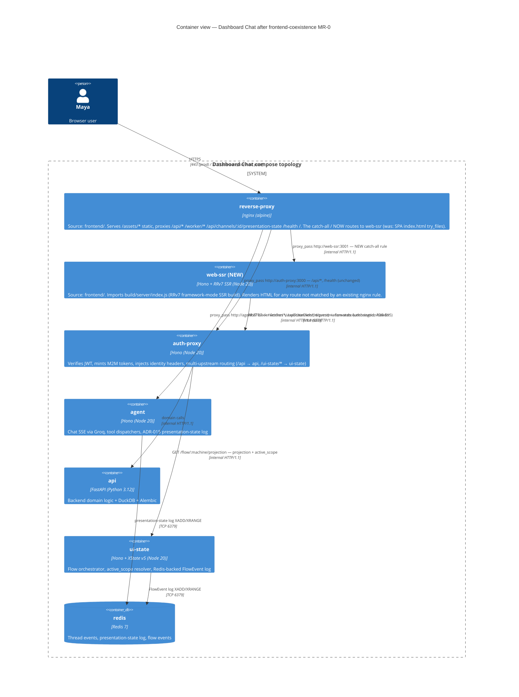
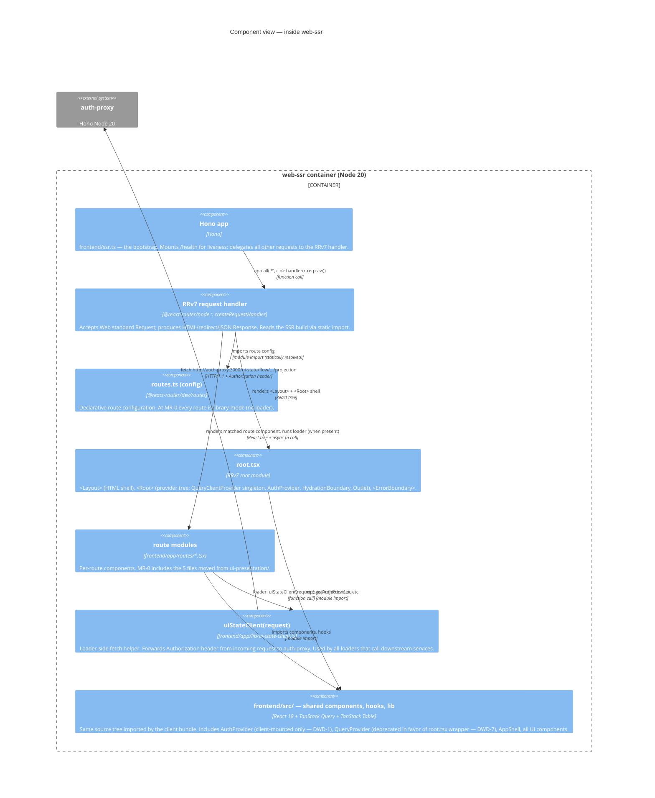
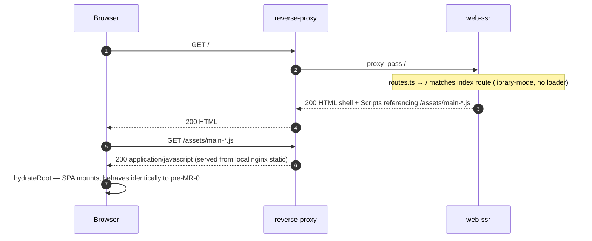

# C4 Diagrams — `frontend-coexistence`

> **Wave**: DESIGN (application scope)
> **Date**: 2026-05-13
> **Companion**: [`application-architecture.md`](./application-architecture.md), [`wave-decisions.md`](./wave-decisions.md), [`handoff-design-to-distill.md`](./handoff-design-to-distill.md)
> **Notation**: Mermaid C4-style. Three views — **Container** (where `web-ssr` fits among compose services), **Component** (what's inside `web-ssr`), **Sequence** (request lifecycle for an SSR'd route after first per-route migration).

---

## 1. Container view — post MR-0

The container topology after MR-0 lands. The new container is `web-ssr`. The five compose services that already exist (`reverse-proxy`, `auth-proxy`, `agent`, `api`, `ui-state`, `redis`) are unchanged in role; the `reverse-proxy`'s `nginx.conf` gains one new location rule routing the catch-all to `web-ssr:3001`.



**Notes on the container view**:

- This represents a **+1 service delta** over the pre-MR-0 topology — `web-ssr` is added; no services are removed; no services are renamed. The pre-MR-0 topology has 6 application services (`reverse-proxy`, `auth-proxy`, `agent`, `api`, `ui-state`, `redis`); the post-MR-0 topology has 7.
- **`reverse-proxy`** is the source-tree directory `frontend/` rendered as the nginx compose service (per ADR-033 layer separation).
- **`web-ssr`** is the *second* compose service backed by the same `frontend/` source tree, producing a Node SSR image (per ADR-034 + DWD-5).
- The arrow `reverse-proxy → web-ssr` is the **only new edge in the topology**. Every other edge is pre-existing.
- `web-ssr` does NOT connect to `redis` directly. SSR is stateless w.r.t. application state; all stateful reads route through `auth-proxy → ui-state` or `auth-proxy → api`.
- `web-ssr` does NOT connect to `agent` directly. Chat-bearing routes don't SSR (DWD-3); SSE is browser-direct via the unchanged nginx rule.

---

## 2. Component view — inside `web-ssr`

What lives inside the `web-ssr` container's `node` process. This is the level at which DELIVER works.



**Notes on the component view**:

- The yellow edge from `route_mods → ui-state-client → auth-proxy` is the **loader fetch path** (DWD-1 + ADR-029 §"Decision outcome §2"). It's dormant at MR-0 (no route has a loader) and becomes live in the first per-route migration MR.
- `routes.ts` and `root.tsx` are the entry points the RRv7 build process resolves. The build is produced offline by `vite build --ssr`; at runtime `createRequestHandler({build, mode})` invokes the pre-built tree.
- `frontend/src/` is the same source body shared with the client bundle. **No code duplication**: the SSR pass and the client pass both import from `src/`.
- The `<HydrationBoundary>` mount inside `<Root>` receives dehydrated state from per-route loaders (DWD-2). At MR-0 the boundary wraps `<Outlet />` with `state={undefined}`.

---

## 3. Sequence view — SSR'd route request (future state, after first per-route migration)

This sequence is what an SSR'd route looks like end-to-end **after** the first per-route migration adds a loader to (for example) `/login`. **MR-0 itself does not produce SSR'd data** — every route is library-mode, so the SSR pass is a thin pass-through that emits the same HTML shell + JS bundle reference today's `index.html` does.

The diagram shows the **load-bearing flow** the DWDs enable.

```mermaid
sequenceDiagram
    autonumber
    participant Browser
    participant nginx as reverse-proxy<br/>(nginx)
    participant SSR as web-ssr<br/>(Hono + RRv7)
    participant AP as auth-proxy
    participant US as ui-state<br/>(Hono + XState)
    participant API as api<br/>(FastAPI)

    Browser->>+nginx: GET /login<br/>Authorization: Bearer <token>
    Note right of nginx: Matches catch-all location /<br/>(NEW MR-0 rule routes to web-ssr)
    nginx->>+SSR: proxy_pass /login<br/>Authorization: Bearer <token>

    Note over SSR: Hono receives Request<br/>delegates to RRv7 createRequestHandler
    SSR->>SSR: match route → /login route module<br/>invoke loader({request, params})

    Note over SSR: Loader: read Authorization<br/>(DWD-1: no AuthProvider on server)<br/>construct request-scoped QueryClient<br/>(DWD-2)
    SSR->>+AP: GET /ui-state/flow/login-and-org-setup/projection<br/>Authorization: Bearer <token>
    AP->>AP: verify JWT (workos or dev)<br/>inject X-User-Id, X-Org-Id headers
    AP->>+US: GET /flow/login-and-org-setup/projection<br/>X-User-Id, X-Org-Id

    Note over US: orchestrator.getProjection<br/>resolveActiveScope(...) per ADR-029
    US-->>-AP: 200 {state, context, active_scope, sequence_id, ...}
    AP-->>-SSR: 200 (same body)

    SSR->>SSR: queryClient.prefetchQuery() seeded with projection<br/>dehydrate(queryClient) → dehydratedState
    SSR->>SSR: render <Root><HydrationBoundary state={dehydratedState}><Outlet/></...> → HTML

    SSR-->>-nginx: 200 text/html<br/>Set-Cookie: (none — auth state is client-managed)
    nginx-->>-Browser: 200 text/html (SSR'd first paint includes active_scope + login flow state)

    Note over Browser: Browser parses HTML, executes /main.tsx bundle<br/>hydrateRoot via <HydratedRouter />
    Browser->>Browser: QueryClient (singleton) merges dehydratedState<br/>useScope() reads active_scope from useRouteLoaderData("root")
    Note over Browser: First render: NO duplicate fetch — cache is seeded.<br/>AuthProvider mounts client-side; token read from sessionStorage.

    Note over Browser,API: Subsequent client-side actions (form submit, navigation) follow the standard SPA flow:<br/>TanStack Query mutations → /api/* via nginx → auth-proxy → api/ui-state.<br/>Chat SSE bypasses web-ssr: /worker/* and /api/channels/:id/presentation-state nginx rules<br/>route directly to agent (DWD-3 + ADR-015).
```

**Notes on the sequence**:

- Steps 1-3: nginx routing is the system-level path. The new `location /` rule routes to `web-ssr`. All other nginx rules (`/api/*`, `/worker/*`, etc.) bypass `web-ssr` entirely.
- Step 4-5: **The loader runs in the Hono process**, not in any React component. No `useContext`, no React renders, just an async function with `(request, params)` arguments.
- Step 6-9: The loader's fetch chain (`web-ssr → auth-proxy → ui-state`) is the same chain a future client-side TanStack Query mutation would walk, but server-initiated and Bearer-forwarded from `request.headers`.
- Steps 10-11: TanStack Query's SSR primitives (`prefetchQuery` + `dehydrate`) seed the cache. The dehydrated state ships in the HTML as serialized JSON inside `<Scripts />`.
- Steps 12-13: nginx ferries the rendered HTML back to the browser. Note: **no `Set-Cookie` from `web-ssr`**. Auth state is browser-managed; `AuthProvider` reads from `sessionStorage` on hydration.
- Steps 14-15: Browser hydration uses the existing `<HydratedRouter />` entry. The hydration boundary merges the dehydrated state. `useScope()` returns the server-resolved `active_scope` without a re-fetch.
- The closing note (no arrow) confirms that **chat / SSE / presentation-state flows remain client-direct** through unchanged nginx rules. The SSR boundary does not handle them.

---

## 4. What MR-0 itself produces (sequence, abbreviated)

For completeness, MR-0's no-behavior-change posture means the sequence for any route at MR-0 is:



**Key invariant**: at MR-0, the SSR pass produces an HTML shell that the browser hydrates exactly as today. No loader runs server-side because no route has one. **Functionally equivalent to the SPA's `index.html` from nginx's `try_files`**, with the only observable difference being which container served the HTML (web-ssr vs. nginx-direct). To the browser the response is structurally identical.

---

## 5. What the diagrams do NOT show

By scope:

- **DOM-level renders, React component trees**: out of scope for C4. See `application-architecture.md` §3 for the provider hierarchy.
- **JWT verification internals in auth-proxy**: orthogonal; see auth-proxy README + ADR-031 §7.
- **XState actor tree inside ui-state**: orthogonal; see ADR-028.
- **WorkOS / OIDC discovery flow**: orthogonal; pre-existing.
- **Migration of `ui-presentation/` files**: a file-tree change, not a runtime topology change. See DWD-4 and `handoff-design-to-distill.md`.
