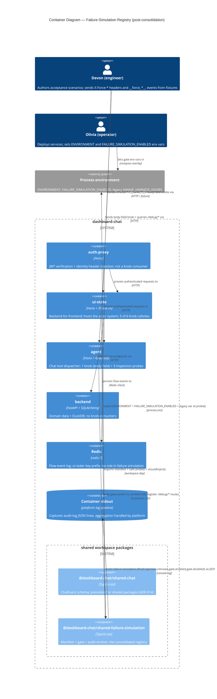
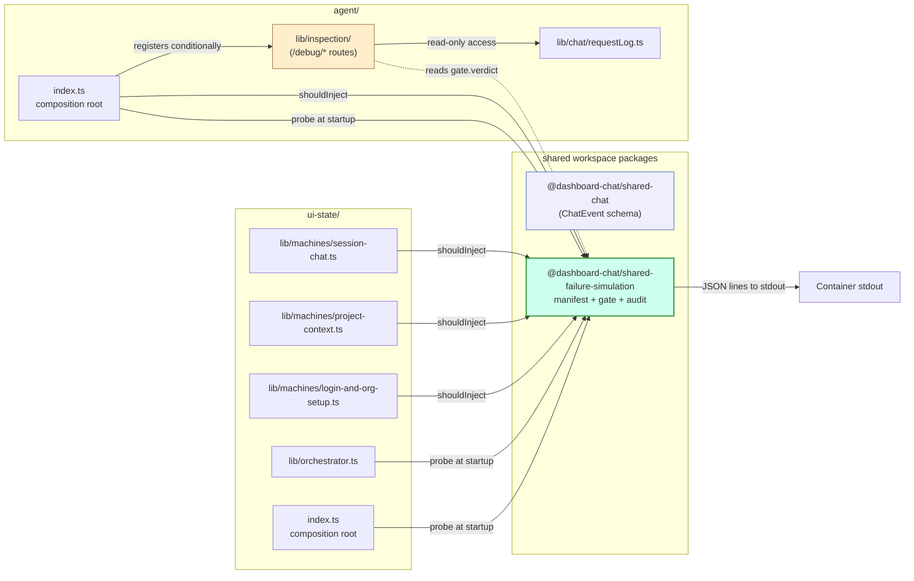

# C4 — Container View: Failure-Simulation Registry

DESIGN-wave deliverable for `failure-simulation-consolidation`. Container-level
view (C4 L2) showing where the failure-simulation registry sits relative to
the application's runtime containers. The gate-evaluation path
(`probe()` at composition root) and the audit-log emission path are both
labeled.

## Vocabulary

- **Failure-simulation registry** — the consolidated module living in
  `shared/failure-simulation/` (ADR-036). Imported by `ui-state/` and
  `agent/` as a workspace package.
- **Inspection probes** — the `/debug/*` Hono routes living in
  `agent/lib/inspection/`. Read-only observability; share the
  ENVIRONMENT gate with failure simulation but are categorically distinct.
- **Composition root** — each service's startup module (`ui-state/index.ts`
  via `ui-state/lib/orchestrator.ts`; `agent/index.ts`) that wires
  dependencies and calls `probe()` exactly once before serving requests.

## System Context note

This DESIGN wave operates at the Container level only. The System Context
diagram is unchanged from prior architecture work (`backend/`, `agent/`,
`ui-state/`, `auth-proxy/`, the `frontend/` SPA, and the external Groq /
WorkOS / Stripe-like dependencies). The failure-simulation registry is an
internal cross-cutting library; it has no external system surface.

## Container diagram

## Gate evaluation path (annotated walkthrough)

The path a process takes from "container starts" to "first knob can
fire":

1. **Container starts.** Olivia's compose overlay has set `ENVIRONMENT=dev`
   (or `staging`, etc.) and `FAILURE_SIMULATION_ENABLED=true` (or unset).
   The legacy `NWAVE_HARNESS_KNOBS` may also be present during the
   migration overlap.
2. **Composition root executes.** `ui-state/index.ts` (via
   `ui-state/lib/orchestrator.ts`) and `agent/index.ts` each import the
   `probe()` function from `@dashboard-chat/shared-failure-simulation`.
3. **`probe()` runs once.** It reads `process.env`, computes the
   verdict per ADR-035's `EVAL_GATE` algorithm, and emits a structured
   log entry (`failure-simulation.gate.enabled` or
   `failure-simulation.gate.disabled`) per ADR-037.
4. **Conditional route registration.** The agent's composition root
   reads the cached verdict; if disabled, the `/debug/*` routes are
   **not** registered (the routes return 404, not 403, per
   US-CONSOL-2). If enabled, the routes are registered. The audit event
   carries `inspection_probes_registered: true|false` to make the
   verdict observable.
5. **Service serves requests.** Per-request `shouldInject()` calls are
   cached-verdict reads — no per-request env-var parse.

## Audit log emission path

The path from "knob arrives in request" to "audit entry in container
stdout":

1. **Request arrives.** Devon's fixture sends e.g.
   `X-Force-Create-Session-Failure: transient`.
2. **Callsite calls `shouldInject('force-create-session-failure', ctx)`.**
   The call happens inside the relevant machine actor or middleware.
3. **Registry checks gate verdict.**
   - If verdict is disabled: emit `failure-simulation.rejected`. Return false.
   - If verdict is enabled AND name in manifest: emit
     `failure-simulation.fired`. Return true.
   - If verdict is enabled AND name not in manifest: emit
     `failure-simulation.unknown`. Return false.
4. **`audit.ts` calls `console.log(JSON.stringify(event))`.** Schema per
   ADR-037. Single JSON line per event.
5. **Container runtime captures stdout.** Platform's log pipeline (today:
   docker-compose `logs` in dev/ci; aggregated tooling in staging/prod
   when configured) collects and routes the entries.
6. **Devon / on-call queries the audit trail.** Filter by `event.name`
   prefix `failure-simulation.*` and `correlation_id`. The on-call query
   "did any knob fire in staging over the incident window?" is one
   filter expression.

## Category-boundary view

**Reading the diagram:**

- Green: the failure-simulation registry — single source of truth for the
  manifest, the gate verdict, and the audit emission.
- Tan: the inspection probes — categorically distinct from fault
  injection. Read-only observability. Share the gate verdict; do not
  register manifest entries.
- Blue: pre-existing `shared/chat/` — the workspace-package precedent
  the registry mirrors.

## Notes on Conway-Law fit

The team is small and the failure-simulation registry has no separate
owner. The two-service consumer pattern (`ui-state/` and `agent/` both
depending on `shared/failure-simulation/`) matches the existing
`shared/chat/` pattern. No org-chart change is implied. The category
boundary between failure simulation and inspection probes is a vocabulary
distinction the same engineer enforces.

## External integrations

None new. The failure-simulation registry has no external surface — it is
an in-process library consumed by services that already exist. No
contract-testing annotation needed for the registry itself.

The existing external integrations (Groq for `agent/`, WorkOS via
`auth-proxy/`, etc.) are unchanged by this design wave.
