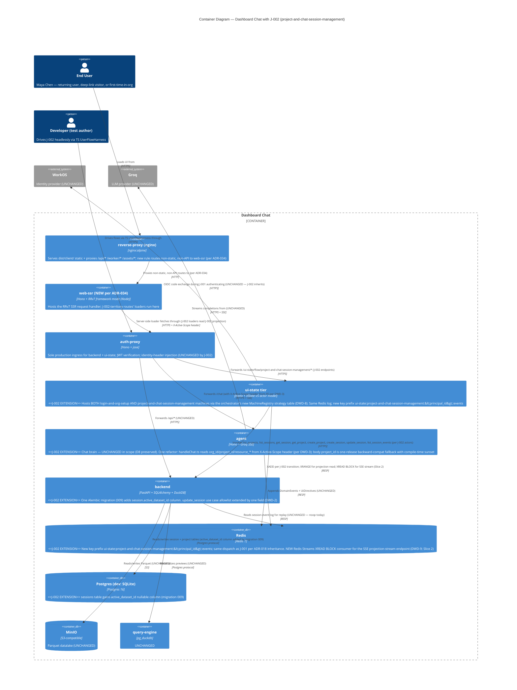
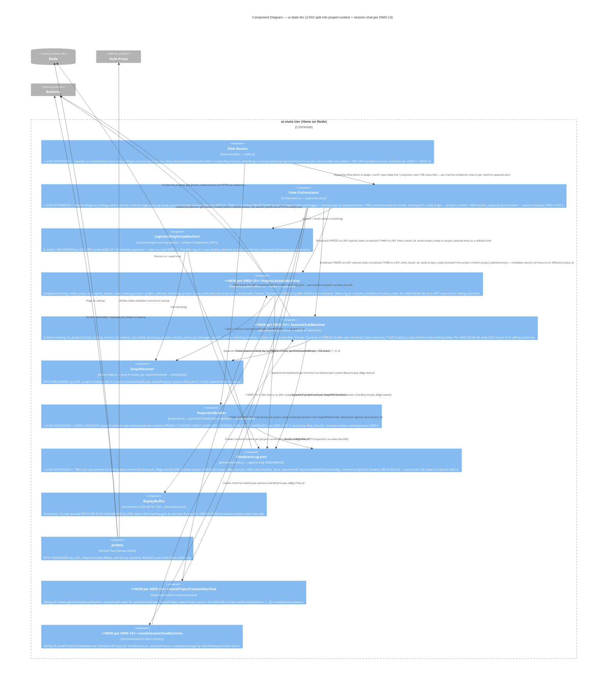
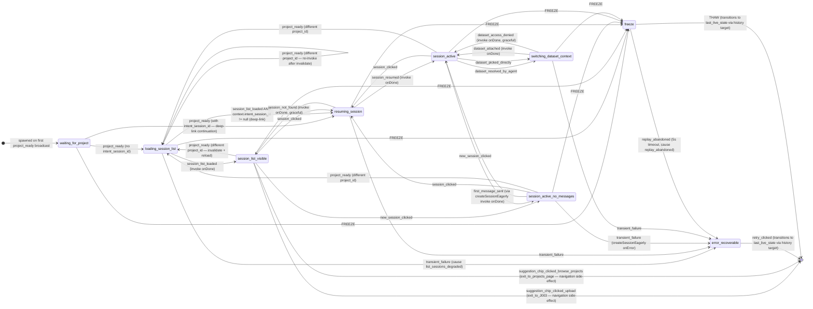

# C4 Diagrams — `project-and-chat-session-management` (J-002)

> **Wave**: DESIGN (with SRP amendment 2026-05-13)
> **Date (original)**: 2026-05-13
> **Date (SRP amendment)**: 2026-05-13
> **Architect**: nw-solution-architect (J-002 DESIGN wave; SRP amendment)
> **Companion**: `application-architecture.md` (binding architecture); `wave-decisions.md` (DWD-1..DWD-13).

This document provides the C4 model artifacts for J-002:
- **§1 Container Diagram (L2)** — J-002 deltas vs the live topology.
- **§2 Component Diagram (L3)** — inside `ui-state/` for J-002 (TWO machines per DWD-13) + cross-machine orchestration with J-001.
- **§3 State Charts** — the TWO J-002 machine charts (post-DWD-13) with all transitions.
- **§4 Sequence Diagrams** — one per carpaccio slice (canonical happy path each). Slice 1 is unchanged in shape (single machine path); Slices 2-6 show the two-actor coordination.

Existing system-context (L1) is byte-unchanged from J-001 (see `docs/evolution/2026-05-12-user-flow-state-machines/design/c4-diagrams.md` §1); J-002 introduces no new external systems.

**Amendment scope**: §2 (Component) is updated to show TWO J-002 actors (project-context + session-chat). §3 (State Chart) is split into two charts. §1 (Container) is unchanged — both machines live in the same ui-state container. §4 (Sequence) carries an addendum note in §4.7 explaining how the existing single-actor sequence diagrams are read against the two-actor decomposition (they remain accurate at the projection-consumer / agent level; the orchestrator-mediated two-actor inner mechanics are summarized in §4.7).

---

## 1. Container Diagram (L2) — J-002 deltas



### 1.1 What this diagram shows

- **No new containers.** J-002 lands inside the existing 7-service compose topology ratified by ADR-030 + ADR-034. Zero new deployables.
- **`ui-state` is the load-bearing extension point** — gains a second machine, gains the SSE projection-stream endpoint (Slice 2 / DWD-9), gains the MachineRegistry refactor.
- **`agent` is extended in one place** — `handleChat.ts` reads scope from header. The Groq SSE, tool dispatch, ADR-015 directive log are all unchanged (D8 preserved).
- **`backend` is extended in one column** — migration 009 + `update_session` allowlist. No new use case.
- **`web-ssr` gains 5 new loaders** in the existing frontend source tree (per ADR-034 framework-mode-route-graduation pattern). No new container; no new routes file.

### 1.2 What this diagram does NOT change (vs the J-001 container diagram)

- All container boundaries.
- All inter-container relationships (every arrow's protocol and direction).
- The Redis key-prefix tenancy pattern (one prefix per flow type).
- The auth-proxy's role as sole ingress.
- WorkOS, Groq, MinIO usage.

---

## 2. Component Diagram (L3) — ui-state internals + cross-machine orchestration (post-DWD-13)



### 2.1 What this diagram shows (post-DWD-13)

- **Two NEW sibling machines** (`ProjectContextMachine` + `SessionChatMachine`) — each is a peer of `LoginAndOrgSetupMachine` under the same XState v5 actor-model pattern; per ADR-028:46-48 + DWD-13 NONE of the three machines import each other; all communication is one-way via orchestrator broadcast.
- **The orchestrator's `MachineRegistry`** (DWD-8) now has **three entries**; the registry is constructed at the composition root with three factories.
- **The orchestrator's `priorState` watcher** now drives **two broadcast hooks**: the existing `j001_ready` (login → project-context) plus the NEW `project_ready` (project-context → session-chat) per DWD-13 §3.2. Both follow the same pattern.
- **The replay buffer and FREEZE/THAW broadcast logic are byte-unchanged** — the broadcast enumerates spawned actors (machine-agnostic); both J-002 actors are just new spawned actors.
- **`ProjectionBuilder` namespaces `EVENT_HANDLERS`** per-machine; flow_id prefix routes the dispatch.
- **`FlowEventLog` adapter** gains a `subscribe()` method for the SSE endpoint (shared by both machines' SSE handlers); existing XADD/XRANGE methods are unchanged.
- **Per-principal cardinality**: bounded by 3 flows (login + project-context + session-chat); session-chat may be absent for users still in `no_projects_empty_state` / `scope_mismatch_terminal`.

### 2.2 What this diagram does NOT change

- The `routes/` → `orchestrator/` → `machines/` import-graph topology (`dependency-cruiser` rule per ADR-027 §7) — the rule covers the new file pair automatically.
- The Earned-Trust `probe()` pattern (ADR-027 §6).
- The composition root's adapter-injection shape.
- The Redis key prefix tenancy invariant (each `(machine, principal_id)` pair has its own key; no collision possible).
- The orchestrator broadcast loop and replay buffer mechanics.

---

## 3. State Charts — TWO J-002 machines (post-DWD-13)

Per DWD-13 the single 14-state machine is split into two cohesive sibling machines. Each chart below is the IMMUTABLE journey-YAML contract expressed as XState v5 state names for its owning machine. Each transition's `event → target` mapping comes directly from the YAML (with per-machine assignments per `application-architecture.md` §2 post-amendment).

### 3.A `project-context` state chart — 8 states

```mermaid
stateDiagram-v2
    direction LR
    [*] --> resolving_initial_scope: spawned on j001_ready

    resolving_initial_scope --> project_selected: resolved_with_project (invoke onDone)
    resolving_initial_scope --> no_projects_empty_state: resolved_no_projects (invoke onDone)
    resolving_initial_scope --> scope_mismatch_terminal: cross_tenant / project_not_found (invoke onDone)
    resolving_initial_scope --> error_recoverable: transient_failure (invoke onError)
    resolving_initial_scope --> freeze: FREEZE (top-level)

    no_projects_empty_state --> creating_project: create_project_clicked / create_project_submitted (valid name)
    no_projects_empty_state --> no_projects_empty_state: create_project_submitted (invalid name; inline error)
    no_projects_empty_state --> freeze: FREEZE

    creating_project --> project_selected: project_created (invoke onDone)
    creating_project --> error_recoverable: transient_failure (invoke onError)
    creating_project --> freeze: FREEZE

    project_selected --> switching_project: switching_project_intent
    project_selected --> freeze: FREEZE

    switching_project --> project_selected: project_switched (invoke onDone) [triggers project_ready re-broadcast]
    switching_project --> scope_mismatch_terminal: cross_tenant / access_revoked (invoke onDone)
    switching_project --> error_recoverable: transient_failure
    switching_project --> freeze: FREEZE

    scope_mismatch_terminal --> resolving_initial_scope: back_to_projects_clicked

    error_recoverable --> [*]: retry_clicked (transitions to last_live_state via history target)

    freeze --> [*]: THAW (transitions to last_live_state via history target)
    freeze --> error_recoverable: replay_abandoned (5s timeout, cause replay_abandoned)
```



**Cross-machine effect**: On entry to `project_selected` (from `resolving_initial_scope`, `creating_project`, or `switching_project`), the orchestrator observes the state transition and broadcasts `project_ready` to session-chat with `{org_id, project_id, project_name, intent_session_id?, intent_resource_id?, intent_resource_type?}`. project-context itself does NOT emit anything to session-chat — the orchestrator carries the signal.

### 3.B `session-chat` state chart — 9 states



> **Note on collapsed state**: The journey YAML lists `no_sessions_empty_state` as one of the 12 narrative states (kind `interactive`) for emotional-arc clarity. The XState machine **does NOT create a separate state for it** — it is a derived UI predicate within `session_list_visible` when `context.session_list.length === 0`. See `application-architecture.md` §2.3 for the rationale (DWD-1).

> **Note on `waiting_for_project`**: This state is new per DWD-13 (does not appear in the journey YAML's 12-state enumeration). It is the internal pre-spawn state for session-chat. No FE component, no acceptance test, no projection consumer reads `state === "waiting_for_project"` as a UX trigger.

### 3.1 Chart legend / reading guide

- `[*]` exits in `session-chat`'s `session_list_visible` are the **navigation side-effects** `exit_to_J003` and `exit_to_projects_page` from the journey YAML — they are NOT internal XState states; they fire route navigations.
- `[*]` re-entries from `error_recoverable` and `freeze` (in BOTH charts) represent **history-target transitions** to the OWNING machine's `context.last_live_state` (per DWD-6 + DWD-13 — each machine carries its own `last_live_state`).
- The top-level `FREEZE` handler (per DWD-6 + DWD-13 + §2.2 of application-architecture.md) is shown as a transition from every non-terminal state IN BOTH CHARTS — visually this is redundant but it matches XState v5's `on:` top-level inheritance semantics in each machine.
- **`scope_mismatch_terminal` is terminal-recoverable** — it has an exit (`back_to_projects_clicked`) but no auto-resolution. The user must click. It lives in project-context.

### 3.2 Cross-machine signals (shown but originating outside the receiving machine)

- **`j001_ready`** is emitted by the **orchestrator** when J-001 transitions to `ready`. project-context receives it. (Not shown explicitly in 3.A; the initial transition `[*] --> resolving_initial_scope: spawned on j001_ready` summarizes the entry.)
- **`project_ready`** is emitted by the **orchestrator** when project-context transitions INTO `project_selected` (from any source state). session-chat receives it. (Shown explicitly in 3.B as the entry transition `waiting_for_project → loading_session_list / resuming_session` and as the re-broadcast invalidation transitions in `session_list_visible / session_active_no_messages / session_active / loading_session_list`.)
- **`FREEZE`** is emitted by the **orchestrator** when J-001 transitions to `expired_token` (per ADR-028 §"Decision outcome"). BOTH J-002 machines receive it. Neither J-002 machine ever emits FREEZE.
- **`THAW`** is emitted by the **orchestrator** when J-001 silent re-auth completes (J-001 transitions `expired_token → ready`). BOTH J-002 machines receive it. Neither emits THAW.
- **`replay_abandoned`** is emitted by the **orchestrator's replay buffer** on 5s timeout without THAW (per ADR-027 §5). Each per-flow buffer drives its own machine's transition.

### 3.3 Match against the journey YAML

| Journey YAML state | Owning machine | XState state | Notes |
|---|---|---|---|
| `resolving_initial_scope` | project-context | ✓ same | Initial state of project-context |
| `no_projects_empty_state` | project-context | ✓ same | Sibling — not a sub-shape per DWD-1 |
| `creating_project` | project-context | ✓ same | |
| `project_selected` | project-context | ✓ same | Triggers `project_ready` orchestrator broadcast on entry |
| `loading_session_list` | session-chat | ✓ same | |
| `session_list_visible` | session-chat | ✓ same | **`no_sessions_empty_state` collapses into this** per DWD-1 |
| `no_sessions_empty_state` | session-chat (UI sub-shape) | (not an XState state per DWD-1) | Derived from `context.session_list.length === 0` |
| `resuming_session` | session-chat | ✓ same | |
| `session_active_no_messages` | session-chat | ✓ same | |
| `session_active` | session-chat | ✓ same | |
| `switching_dataset_context` | session-chat | ✓ same | |
| `switching_project` | project-context | ✓ same | |
| `scope_mismatch_terminal` | project-context | ✓ same | |
| `error_recoverable` | **both (one per machine)** | ✓ same | Per-machine retry contract per DWD-13 |
| `freeze` | **both (one per machine)** | ✓ same | Per-machine side-state per DWD-13 |
| `waiting_for_project` (NEW) | session-chat | ✓ new initial state | Pre-`project_ready` state per DWD-13; no user-visible surface |
| `exit_to_J003`, `exit_to_projects_page` | session-chat (navigation events) | (not XState states) | Emit + side-effect |

---

## 4. Sequence Diagrams — one per slice (canonical happy path)

### 4.1 Slice 1 — Walking skeleton: cold deep-link to `/projects/q4-analytics` (US-204 happy)

```mermaid
sequenceDiagram
    actor Maya as Maya Chen
    participant Nginx as reverse-proxy (nginx)
    participant SSR as web-ssr (Hono+RRv7)
    participant AP as auth-proxy
    participant US as ui-state tier (J-002 actor)
    participant BE as backend
    participant R as Redis

    Maya->>Nginx: GET /projects/q4-analytics (cold tab, fresh JWT)
    Nginx->>SSR: proxy to web-ssr (per ADR-034 nginx rule)
    Note over SSR: RRv7 framework-mode loader runs at routes/project-detail.tsx
    SSR->>AP: POST /ui-state/flow/project-and-chat-session-management/open-deep-link {intent_project_id: "q4-analytics"} (Bearer JWT)
    AP->>US: forward + inject X-Org-Id, X-User-Id headers
    US->>US: ScopeResolver(route={project: "q4-analytics", org: "acme-data"}, jwt={org_id: "acme-data"}, ctx={})
    Note over US: I1 OK + I4 OK (project belongs to acme-data — backend authorize will gate too)
    US->>BE: GET /api/projects/q4-analytics (verify access; loads project.name)
    BE-->>US: 200 {id: "q4-analytics-id", name: "Q4 Analytics"}
    US->>R: XADD ui-state:project-and-chat-session-management:user-001:events {type: "deep_link_opened", payload: {scope, project, reconciled: false}, correlation_id}
    US->>US: J-002 machine: resolving_initial_scope --resolved_with_project--> project_selected
    US->>R: XADD ... {type: "project_selected", payload: {project_id, project_name, correlation_id}}
    Note over US: project_selected entry-action raises session_list_load_started internally; loading_session_list invokes loadSessionList
    US->>BE: GET /api/projects/q4-analytics/sessions?page_size=30
    BE-->>US: 200 {items: [4 sessions], next_cursor: null}
    US->>R: XADD ... {type: "session_list_loaded", payload: {items, next_cursor}}
    US->>US: loading_session_list --session_list_loaded--> session_list_visible
    US->>US: ProjectionBuilder folds events; emits FlowProjection
    US-->>AP: 200 FlowProjection {flow_id, state: "session_list_visible", context: {project, session_list, ...}, active_scope: {org_id, project_id, ...}}
    AP-->>SSR: same
    Note over SSR: loader returns json({active_scope, project, session_list, ...}) — RRv7 sends HTML with hydrated state
    SSR-->>Nginx: HTML + initial-state JSON (loader data)
    Nginx-->>Maya: First paint: project chip "Q4 Analytics" + session list rendered together (<300ms p95)
```

### 4.2 Slice 2 — Session resume: Maya clicks `chat-9b2a` (US-205 happy)

```mermaid
sequenceDiagram
    actor Maya as Maya Chen
    participant FE as web-ssr (chat-view component)
    participant AP as auth-proxy
    participant US as ui-state tier (J-002 actor)
    participant BE as backend
    participant R as Redis

    Note over FE: User is in session_list_visible for Q4 Analytics; clicks "chat-9b2a" in recent-sessions nav
    FE->>AP: POST /ui-state/flow/project-and-chat-session-management/event {type: "session_clicked", payload: {session_id: "chat-9b2a"}, correlation_id: "R-session-resume-..."}
    AP->>US: forward
    US->>US: J-002 machine: session_list_visible --session_clicked--> resuming_session
    US->>R: XADD ... {type: "session_resume_started", payload: {session_id, correlation_id}}
    Note over US: resuming_session invokes resumeSession actor — parallel calls list_session_events + get_session

    par Transcript load
        US->>BE: GET /api/sessions/chat-9b2a/events
        BE-->>US: 200 {events: [12 messages]}
    and Session metadata load (for active_dataset_id)
        US->>BE: GET /api/sessions/chat-9b2a
        BE-->>US: 200 {id, title, owner_id, org_id, active_dataset_id: "sales_2026-id", ...}
    end

    Note over US: active_dataset_id is set — validate dataset is still accessible
    US->>BE: GET /api/datasets/sales_2026-id
    BE-->>US: 200 {id, name: "sales_2026", project_id: "q4-analytics-id"}
    Note over US: project_id matches active scope — dataset OK
    US->>R: XADD ... {type: "session_resumed", payload: {session_id, transcript, resource: {type: "dataset", id: "sales_2026-id"}}}
    US->>US: resuming_session --session_resumed--> session_active (assigns context.session_id, context.transcript, context.resource)
    US->>US: ProjectionBuilder folds events
    US-->>AP: 200 FlowProjection {state: "session_active", context: {session_id, transcript, resource: {type: "dataset", id}, ...}, active_scope: {..., resource_type: "dataset", resource_id: "sales_2026-id"}}
    AP-->>FE: same
    Note over FE: Component re-renders from new projection. Transcript with 12 messages + dataset chip "sales_2026" appear on SAME first paint
    FE-->>Maya: chat-9b2a session resumed; conversation continues with dataset context restored
```

### 4.3 Slice 3 — New session lifecycle: lazy create on first message (US-206 happy)

```mermaid
sequenceDiagram
    actor Maya as Maya Chen
    participant FE as web-ssr (chat-view component)
    participant AP as auth-proxy
    participant US as ui-state tier (J-002 actor)
    participant BE as backend

    Note over FE: User is in session_list_visible for Q4 Analytics; clicks "+ New Session" in nav rail
    FE->>AP: POST /ui-state/flow/project-and-chat-session-management/event {type: "new_session_clicked", correlation_id}
    AP->>US: forward
    US->>US: J-002 machine: session_list_visible --new_session_clicked--> session_active_no_messages
    Note over US: NO BACKEND CALL — state is purely client-side
    US-->>AP: 200 FlowProjection {state: "session_active_no_messages", context: {project, session_id: null, ...}}
    AP-->>FE: same
    Note over FE: Component re-renders: welcome chips ("Upload CSV", "Browse Projects") + enabled chat input. session_id is null in projection

    Note over FE: Maya types "Show me top customers by revenue" and presses Enter
    FE->>AP: POST /ui-state/flow/project-and-chat-session-management/event {type: "first_message_sent", payload: {content: "Show me top customers by revenue"}, correlation_id}
    AP->>US: forward
    US->>US: J-002 machine: session_active_no_messages --first_message_sent--> createSessionEagerly invoke fires
    US->>BE: POST /api/projects/q4-analytics-id/sessions {} (creates session row)
    BE-->>US: 201 {id: "chat-new-id", title: null, ...}
    Note over US: Fire-and-forget update_session for title
    US-)BE: PATCH /api/sessions/chat-new-id {title: "Show me top customers by revenue"}
    US->>US: createSessionEagerly onDone: assign context.session_id = "chat-new-id"; transition to session_active
    US-->>AP: 200 FlowProjection {state: "session_active", context: {session_id: "chat-new-id", project, ...}, active_scope: {project_id, ...}}
    AP-->>FE: same
    Note over FE: Component re-renders: session_id is now non-null. Chat-view dispatches the first chat turn to /chat with X-Active-Scope header carrying project_id (no resource_id yet)
    FE->>AP: POST /chat (thread_id = "chat-new-id", X-Active-Scope: {org_id, project_id: "q4-analytics-id", resource_*: null})
    AP->>FE: SSE stream begins (UNCHANGED agent path)
    FE-->>Maya: Agent response streams; new session appears at top of nav with title "Show me top customers by revenue"
```

### 4.4 Slice 4 — Project switching + agent contract: Q4 → Q3 atomic (US-207 + US-208 happy)

```mermaid
sequenceDiagram
    actor Maya as Maya Chen
    participant FE as web-ssr (chat-view component)
    participant AP as auth-proxy
    participant US as ui-state tier (J-002 actor)
    participant BE as backend
    participant Agent as agent

    Note over FE: User is in session_active for Q4 Analytics with session "chat-9b2a"; in-flight chat turn streaming
    FE->>Agent: POST /chat (X-Active-Scope: {org_id, project_id: "q4-analytics-id", resource_*: ...}, thread_id: "chat-9b2a")
    Agent--)FE: SSE stream chunk 1
    Agent--)FE: SSE stream chunk 2 (mid-response)

    Note over Maya: Maya clicks "Q3 Sales" in nav rail
    FE->>AP: POST /ui-state/flow/project-and-chat-session-management/event {type: "switching_project_intent", payload: {new_project_id: "q3-sales-id"}, correlation_id}
    AP->>US: forward
    US->>US: J-002 machine: session_active --switching_project_intent--> switching_project (assigns context.session_id = null, context.resource = {type: null, id: null})
    US-->>AP: 200 FlowProjection {state: "switching_project", context: {session_id: null, resource: {null}, ...}}
    AP-->>FE: same
    Note over FE: chat-view useEffect sees state === "switching_project" → eventSource.close() — SSE stream torn down
    FE-XAgent: SSE stream closed (agent receives no further frames)

    Note over US: switching_project invokes switchProject actor — calls ScopeResolver + get_project for new id
    US->>US: ScopeResolver({org: "acme-data", project: "q3-sales-id"}, jwt, ctx) — I1 + I4 pass
    US->>BE: GET /api/projects/q3-sales-id
    BE-->>US: 200 {id: "q3-sales-id", name: "Q3 Sales"}
    US->>US: switching_project --project_switched--> project_selected (assigns context.project)
    Note over US: project_selected entry-action raises loading_session_list
    US->>BE: GET /api/projects/q3-sales-id/sessions?page_size=30
    BE-->>US: 200 {items: [...], next_cursor: ...}
    US->>US: loading_session_list --session_list_loaded--> session_list_visible
    US-->>AP: 200 FlowProjection {state: "session_list_visible", context: {project: Q3, session_list: [Q3 sessions], session_id: null, ...}, active_scope: {project_id: "q3-sales-id", ...}}
    AP-->>FE: same
    Note over FE: chat-view re-renders. URL → /chat (or /projects/q3-sales-id depending on entry path). Project chip + session list for Q3 paint together. NO Q4 session ever appears in Q3 list

    Note over Maya: Maya later sends a turn in a Q3 session — every outbound /chat carries X-Active-Scope from J-002 projection
    FE->>Agent: POST /chat (X-Active-Scope: {org_id, project_id: "q3-sales-id", ...}, thread_id: <Q3 session>)
    Note over Agent: extractActiveScope: org_id ✓, project_id ✓; X-Org-Id matches; proceed with Groq stream
```

### 4.5 Slice 5 — Dataset context switching: agent's `resolve_dataset` → user picks (US-209 happy)

```mermaid
sequenceDiagram
    actor Maya as Maya Chen
    participant FE as web-ssr (chat-view component)
    participant AP as auth-proxy
    participant Agent as agent
    participant US as ui-state tier (J-002 actor)
    participant BE as backend

    Note over FE: User is in session_active for Q4 Analytics with session "chat-9b2a", no dataset attached
    Maya->>FE: types "filter rows where age > 30"; presses Enter
    FE->>AP: POST /chat (X-Active-Scope: {org_id, project_id, resource_*: null}, thread_id: "chat-9b2a")
    AP->>Agent: forward
    Note over Agent: contextType is "project" (no resource_type); getConversationalTools includes resolve_dataset
    Agent--)FE: SSE stream → tool-input-available chunk for resolve_dataset(name: "patients")
    Note over FE: pipeChatStream intercepts; emits data-agent-request typed part
    Note over Maya: Inline list renders: ["patients_2025", "patients_archive"]; Maya clicks "patients_2025"

    FE->>AP: POST /ui-state/flow/project-and-chat-session-management/event {type: "dataset_resolved_by_agent", payload: {resource_type: "dataset", resource_id: "patients_2025-id"}, correlation_id}
    AP->>US: forward
    US->>US: J-002 machine: session_active --dataset_resolved_by_agent--> switching_dataset_context (assigns context.intent_resource_*)
    Note over US: switchDatasetContext invokes — ScopeResolver I4 + persist
    US->>BE: GET /api/datasets/patients_2025-id (verify access + project match)
    BE-->>US: 200 {id, name: "patients_2025", project_id: "q4-analytics-id"} — project matches
    US->>BE: PATCH /api/sessions/chat-9b2a {active_dataset_id: "patients_2025-id"}
    BE-->>US: 200 (write succeeded — per DWD-2 column + DWD-2 allowlist)
    US->>US: switching_dataset_context --dataset_attached--> session_active (assigns context.resource = {type: "dataset", id: "patients_2025-id"})
    US-->>AP: 200 FlowProjection {state: "session_active", context: {resource: {type: "dataset", id: "patients_2025-id"}, ...}, active_scope: {..., resource_type: "dataset", resource_id: "patients_2025-id"}}
    AP-->>FE: same
    Note over FE: chat-view re-renders: dataset chip in gutter shows "patients_2025". FE re-submits the chat turn with new scope.
    FE->>AP: POST /chat (X-Active-Scope: {org_id, project_id, resource_type: "dataset", resource_id: "patients_2025-id"}, thread_id: "chat-9b2a")
    AP->>Agent: forward
    Note over Agent: extractActiveScope: resource_type = "dataset", resource_id = "patients_2025-id" → fetches tableSchema → uses getTools(tableSchema) → dispatches filterTable
    Agent--)FE: SSE stream → filter result; conversation continues
```

### 4.6 Slice 6 — Cross-machine FREEZE/THAW: token expires during `resuming_session` (US-210 happy)

```mermaid
sequenceDiagram
    actor Maya as Maya Chen
    participant FE as web-ssr (chat-view component)
    participant AP as auth-proxy
    participant US as ui-state tier (orchestrator + J-001 actor + J-002 actor)
    participant BE as backend

    Note over FE: User is in session_list_visible; clicks chat-9b2a
    FE->>AP: POST /ui-state/flow/project-and-chat-session-management/event {type: "session_clicked", payload: {session_id: "chat-9b2a"}}
    AP->>US: forward
    US->>US: J-002 machine: session_list_visible --session_clicked--> resuming_session
    US->>BE: GET /api/sessions/chat-9b2a/events (transcript load fires)

    Note over BE: Mid-call, the JWT's expiry passes
    BE-->>US: 401 token-expired
    Note over US: J-001 machine detects 401 via auth-proxy callback; transitions ready → expired_token
    US->>US: Orchestrator: priorState[loginFlowId] === "ready" && new state === "expired_token" → broadcastFreeze(loginFlowId)
    US->>US: Orchestrator broadcasts FREEZE to all spawned children (here: J-002 actor)
    US->>US: J-002 machine: top-level on.FREEZE → freeze (assigns last_live_state = "resuming_session")
    Note over US: J-002 in freeze; the 401-response from BE is no-longer-relevant — the invoke's onError/onDone is discarded by the machine because state has moved on
    US->>R: XADD ... {type: "j002_frozen", payload: {last_live_state: "resuming_session", correlation_id}}

    Note over US: Meanwhile J-001 invokes silentReauth actor (per login-and-org-setup.ts:373-393)
    US->>AP: POST /api/auth/reissue (silent re-auth)
    AP-->>US: 200 {new JWT}
    US->>US: J-001 machine: expired_token --silent_reauth_ok--> ready
    US->>US: Orchestrator: priorState[loginFlowId] === "expired_token" && new state === "ready" → broadcastThaw(loginFlowId)
    US->>US: Orchestrator drains ReplayBuffer; queued intents replay in arrival order
    Note over US: For J-002 the queued intent is the original session_clicked
    US->>US: J-002 machine: freeze --THAW--> resuming_session (history target via last_live_state)
    US->>BE: GET /api/sessions/chat-9b2a/events (replay with fresh JWT, same correlation_id)
    BE-->>US: 200 {events: [12 messages]}
    US->>BE: GET /api/sessions/chat-9b2a
    BE-->>US: 200 {active_dataset_id, ...}
    US->>BE: GET /api/datasets/sales_2026-id
    BE-->>US: 200 {project_id matches}
    US->>US: resuming_session --session_resumed--> session_active
    US->>R: XADD ... {type: "j002_thawed", payload: {last_live_state, replayed_intents_count: 1, stale_intents_dropped_count: 0, correlation_id}}
    US-->>AP: 200 FlowProjection {state: "session_active", ...}
    AP-->>FE: same
    Note over FE: "Refreshing your session..." banner fades; chat-9b2a session active. Maya never re-clicked.
```

### 4.7 Slice notes (post-DWD-13 — two-actor model)

All six sequence diagrams share these properties (per ADR-029 §4 + ADR-031 §7 inheritance):

- **Auth-proxy is on every outbound path.** No FE → ui-state or FE → agent direct.
- **`X-Active-Scope` header is set by `uiStateClient.activeScopeHeader(view)` on every FE outbound fetch** post-Slice-4. The composer takes BOTH J-002 projections per DWD-13 §4.3.
- **Correlation_id threads through every emit.** The original user-action's correlation_id survives FREEZE/THAW (Slice 6) and reentry from `error_recoverable`.
- **The agent is byte-unchanged in flow logic.** Slice 4 is the only slice touching `agent/lib/chat/handleChat.ts`, and only the scope-extraction prefix. The agent is NOT aware of the J-002 split — it consumes ONE composed `X-Active-Scope` header.

#### How to read the existing sequence diagrams against the two-actor decomposition (DWD-13)

The diagrams in §§4.1–4.6 above represent the pre-amendment single-`US` (ui-state) actor. Per DWD-13, that `US` actor is now TWO actors (`PC` = project-context, `SC` = session-chat). At the projection-consumer / agent level the externally observable behavior is identical, so the diagrams remain accurate for the FE/agent-facing flows. The inner mechanics differ as follows:

| Slice / diagram | What the single-actor view shows | What actually happens post-DWD-13 |
|---|---|---|
| **§4.1 Slice 1 — Cold deep-link** | `US` resolves scope, transitions through `resolving_initial_scope → project_selected → loading_session_list → session_list_visible`. | `PC` resolves and transitions `resolving_initial_scope → project_selected`. Orchestrator's `priorState` watcher fires `project_ready` broadcast → `SC` spawns in `waiting_for_project` → receives `project_ready` → transitions `waiting_for_project → loading_session_list → session_list_visible`. Two projection envelopes; same end-to-end timeline. |
| **§4.2 Slice 2 — Resume** | `US`: `session_list_visible → resuming_session → session_active`. | `SC`: `session_list_visible → resuming_session → session_active`. `PC` is byte-unchanged during the resume. (FE's loader fetches both projections; only `SC` transitions are observed.) |
| **§4.3 Slice 3 — New session** | `US`: `session_list_visible → session_active_no_messages → session_active` (eager-create on first_message_sent). | `SC`: same transitions. `PC` byte-unchanged. |
| **§4.4 Slice 4 — Project switching** | `US`: `session_active → switching_project → project_selected → loading_session_list → session_list_visible` for the new project. | `PC` transitions `project_selected → switching_project → project_selected` (with new project_id). The FE's chat-view watches `PC`'s projection state and closes SSE on `switching_project`. Then orchestrator broadcasts `project_ready` with new `project_id` → `SC` (which was in `session_active`) sees the project_id mismatch in its `project_ready` handler → invalidates `session_id`+`resource_*` → transitions to `loading_session_list → session_list_visible`. The atomicity guarantee (US-207 AC) is satisfied because `SC` never holds the old `session_id` against the new `project_id`. |
| **§4.5 Slice 5 — Dataset attach** | `US`: `session_active → switching_dataset_context → session_active`. | `SC`: same transitions. `PC` byte-unchanged. |
| **§4.6 Slice 6 — FREEZE/THAW during resume** | `US`: enters `freeze`, last_live_state = `resuming_session`. THAW → restore. | BOTH `PC` and `SC` enter their own `freeze` states with their own `last_live_state`. Per the diagram's scenario (token expiry during resume), `PC`'s last_live_state is probably `project_selected` (no in-flight invoke); `SC`'s last_live_state is `resuming_session` (the in-flight transcript fetch). THAW broadcasts to BOTH; each restores via its own `last_live_state`. The replay buffer is per-flow — `SC`'s buffer drains the original `session_clicked` intent. |

These mechanics are explicit in the post-DWD-13 sequence-diagram template that DELIVER MR-1.5 will produce. The existing diagrams here are kept as authoritative for the externally-observable contracts; the two-actor inner workings are summarized above.

#### When to update the sequence diagrams to show TWO actors explicitly

A future DESIGN revisit may rewrite §§4.1–4.6 with explicit `PC` + `SC` swimlanes if reviewer feedback indicates the single-actor view causes confusion. For this amendment, the brief tabular addendum above is sufficient — it cites the binding inner mechanics without churning the pre-existing diagrams.

---

## References

- Companion DESIGN docs: `application-architecture.md` (post-DWD-13), `wave-decisions.md` (DWD-1..DWD-13), `handoff-design-to-distill.md`
- SRP review (binding input for the amendment): `./review-by-software-crafter-srp.md`
- DESIGN amendment review: `./review-by-solution-architect-srp-amendment.md`
- Journey YAML (state contract): `docs/feature/project-and-chat-session-management/discuss/journey-project-and-chat-session-management.yaml`
- ADR-027 (ui-state tier + Remix→RRv7 framework), ADR-028 (XState v5 actor model), ADR-029 (active_scope contract), ADR-030 (topology + scaling), ADR-031 §7 (auth path), ADR-034 (frontend coexistence)
- J-001 C4 diagrams: `docs/evolution/2026-05-12-user-flow-state-machines/design/c4-diagrams.md`
- Mermaid C4 syntax: [https://mermaid.js.org/syntax/c4.html](https://mermaid.js.org/syntax/c4.html)
