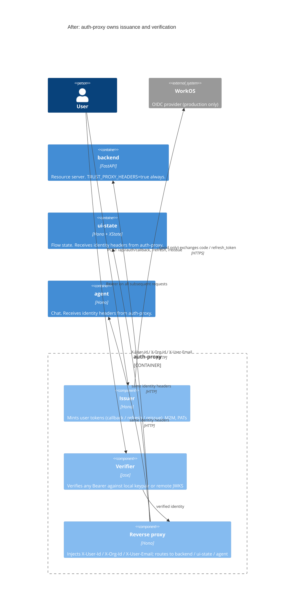
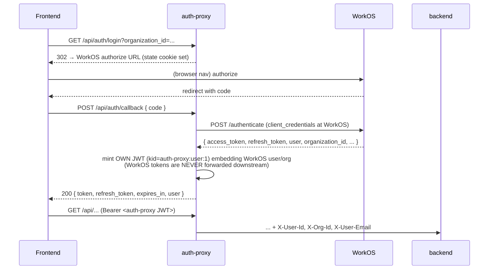

# Design — auth-proxy mints user tokens

**Status:** Proposed (planning artifact; implementation deferred)
**Date:** 2026-05-27
**Wave:** DESIGN
**Companion ADR:** ADR-043 (`Amendment 2026-05-27 — auth-proxy as issuer`)
**Related ADRs:** ADR-016 (auth-proxy as single ingress), ADR-029 (`active_scope` propagation), ADR-041 (session-onboarding domain realignment)

---

## 1. Context

The repo today runs **two JWT issuers** for the same audience. Auth-proxy already mints M2M and PAT tokens with the production keypair; backend independently mints user tokens on `/api/auth/callback`, `/api/auth/refresh`, and `/api/auth/reissue`. The split is incidental: when WorkOS landed it was wired through the backend (`backend/app/auth/workos_provider.py:19-104`), and auth-proxy was later given its own minting kit for service credentials without ever pulling user-token minting back. This design records the decision to consolidate.

### Three findings that ground the decision

**F1 — auth-proxy already has the full minting kit.** `auth-proxy/lib/m2m.ts:147-166` (`issueM2mToken`) and `auth-proxy/lib/pat.ts:164-212` (`issuePat`) both sign RS256 JWTs through `getKeypair()` (`auth-proxy/lib/keypair.ts:70-80`) with `jose@6.x`. Persistence, multi-replica behaviour, and dev/prod parity are already solved (`auth-proxy/README.md:285-365`, `auth-proxy/lib/secrets.ts`). User-token minting joins an existing, tested capability — it does not introduce a new one. The dev-mode built-in (`auth-proxy/lib/m2m.ts:55-62`) already mirrors `DEV_USER` exactly (`backend/app/auth/dev_provider.py:9`), so the identity contract is already established.

**F2 — Backend is both issuer and resource server.** `backend/app/routers/auth.py:25-145` exposes `login`, `callback`, `refresh`, `reissue`, `logout`, `me`. Of those, `callback`, `refresh`, and `reissue` *mint* — `_mint_jwt()` at `backend/app/auth/dev_provider.py:17-36` and the WorkOS authenticate POSTs at `backend/app/auth/workos_provider.py:89-120`. The same backend process also runs as resource server via `AuthMiddleware.dispatch` (`backend/app/auth/middleware.py:34-94`) which has a `TRUST_PROXY_HEADERS=true` branch (lines 49-60) that the dev compose and production both run through. The minting role is the *only* reason `AuthMiddleware` has a second branch (the direct-JWT-verification branch at lines 62-80) — that branch exists for the not-yet-behind-the-proxy auth endpoints. Moving minting to auth-proxy removes both the role overlap and the second middleware branch.

**F3 — The reissue flow is non-functional, top to bottom.** Two independent breakages compound:
  - **Server side (broken in prod):** `backend/app/routers/auth.py:131-138` checks `isinstance(provider, DevAuthProvider)` and returns `501` for WorkOS, even though `WorkOSAuthProvider.reissue_with_org` exists at `backend/app/auth/workos_provider.py:148-157` (raising `NotImplementedError`). Production users hit `501` after org-create.
  - **Client side (broken in dev too):** `ui-state/lib/machines/session-onboarding/setup/actors.ts:374-393` (`reissueOrgJwtFn`) POSTs `/api/auth/reissue` and then checks only `resp.ok`. The response body — `{ access_token, refresh_token, expires_in }` from `backend/app/routers/auth.py:140-145` — is discarded. The FE's stored JWT is never updated. In dev the request returns `200` because `backend/app/auth/dev_provider.py:83-91` is wired, but the FE keeps its pre-org-create token. In dev this is masked because auth-proxy injects `DEV_USER` identity headers regardless of the Bearer (`auth-proxy/app.ts:224-228`), so the obsolete JWT never appears wrong. In prod the request 501s, the FE retries inside `creating_org` (machine.ts:131-174, retry budgets at `setup/guards.ts:20-37`), and eventually lands in `error_terminal` (machine.ts:179-192). The entire `creating_org → error_recoverable → error_terminal` subgraph exists to handle a failure mode that the design itself produced.

### Why now

ADR-041 retired the entry-handshake bounded-context leak (ui-state pretending to participate in sign-in). ADR-043 retired the token-lifecycle leak (ui-state pretending to participate in refresh). The remaining leak is symmetric on the **backend** side: backend pretends to participate in token issuance when auth-proxy is the architectural home for that. ADR-016 already establishes auth-proxy as "the single home for auth, by design" — this design extends that charter to issuance, not just verification.

## 2. Decision drivers

- **Single issuer.** One process mints; one keypair signs. Today's dual-issuer state is incidental, not designed.
- **Backend purity.** Backend becomes a pure resource server (one auth path: trust the headers). The direct-JWT-verification branch in `AuthMiddleware` (`backend/app/auth/middleware.py:62-80`) becomes dead and is deletable.
- **Dev-mode quietness.** Auth-proxy already has a dev-mode synthetic flow that needs no WorkOS round-trip (`auth-proxy/lib/m2m.ts:55-62, 95-122`). User-token minting joins it. Backend stops needing `DevAuthProvider` and its associated WorkOS log clutter at dev boot.
- **ADR-016 alignment.** ADR-016 §"Why not Option 3" left open the question of auth-proxy's long-term scope ("if auth-proxy ever becomes vestigial … this ADR is superseded"). This design moves in the opposite direction — auth-proxy gains scope, becomes *less* vestigial, and the architectural arrow ADR-016 picked is reinforced.
- **Dissolves an unhandled-error gap.** With auth-proxy injecting the new JWT on the org-create response (§4.3), the FE's stored token updates atomically with the org-create success. The retry / `error_recoverable` / `error_terminal` subgraph in onboarding becomes unreachable by construction — not unreachable by accident.
- **ADR-029 invariant 1 preserved.** `active_scope.org_id` MUST equal the JWT's `org_id` claim. This design changes *who* mints the JWT that carries `org_id`, not *whether* it carries `org_id`. The invariant survives; the implementation site moves.

## 3. Target architecture

### 3.1 Container view (after migration)



Compared to today: the dashed lines from backend to WorkOS, and from FE to backend's `/api/auth/*` minting endpoints, are gone. Backend has one path in: trusted headers.

### 3.2 Dev login (sequence)

```mermaid
sequenceDiagram
  participant FE as Frontend (SPA)
  participant AP as auth-proxy
  participant BE as backend (resource server)

  FE->>AP: POST /api/auth/callback { code: "dev-auth-code" }
  Note over AP: AUTH_MODE=dev → mint DEV_USER JWT<br/>via existing keypair (kid=auth-proxy:user:1)
  AP-->>FE: 200 { token, refresh_token, expires_in, user: DEV_USER }
  FE->>FE: setToken(token); setRefreshToken(...); setTokenExpiry(...)
  FE->>AP: GET /api/projects  (Authorization: Bearer <token>)
  AP->>AP: verifyToken → local keypair (kid match)
  AP->>BE: GET /api/projects  +  X-User-Id, X-Org-Id, X-User-Email
  BE-->>AP: 200 [...projects...]
  AP-->>FE: 200 [...projects...]
```

No WorkOS round-trip, no DevAuthProvider in backend, no JWKS proxy from backend to anywhere.

### 3.3 Production login (sequence)



**Key decision (called out for the reviewer):** auth-proxy mints its **own** JWT after the WorkOS exchange rather than passing the WorkOS access token straight through. This is the same posture today's backend takes for dev mode — local control of `aud`, `iss`, `kid`, and TTL. The WorkOS refresh token is stored server-side keyed by a `sid` claim in the auth-proxy JWT (or, simpler v0: re-exchange on each `/api/auth/refresh` call by holding the WorkOS refresh token in the response and trusting the FE to round-trip it — see Open Question 1). Either way the FE never sees a raw WorkOS token, which is the same invariant the backend enforces today.

### 3.4 Org-create with response-header reissue

```mermaid
sequenceDiagram
  participant FE as Frontend
  participant AP as auth-proxy
  participant US as ui-state
  participant BE as backend

  FE->>AP: POST /ui-state/flow/session-onboarding/event<br/>{ type: "org_form_submitted", org_name: "Acme" }
  AP->>US: POST .../event (X-User-Id, X-Org-Id=null)
  US->>AP: POST /api/orgs { name: "Acme" } (forwarding Bearer)
  AP->>BE: POST /api/orgs + identity headers
  BE-->>AP: 201 { id: "org-acme-...", name: "Acme" }
  Note over AP: auth-proxy detects 201 on POST /api/orgs<br/>and the response carries an org id for the calling user.<br/>Mints a fresh user JWT carrying the new org_id.<br/>Injects X-New-Access-Token + X-New-Token-Expires-In response headers.
  AP-->>US: 201 { id, name } + X-New-Access-Token + X-New-Token-Expires-In
  US->>US: machine transitions creating_org → ready
  US-->>AP: projection { state: "ready", active_scope: { org_id: "org-acme-..." } }
  AP-->>FE: 200 projection + X-New-Access-Token + X-New-Token-Expires-In (relayed)
  FE->>FE: tokenStorage.setToken(newToken); setTokenExpiry(...)
```

Three things to note:

1. **The reissue is server-driven, not client-driven.** The FE doesn't ask for it. It happens because auth-proxy *observes* the org-create response and knows the calling user's stored token is now stale.
2. **The reissue rides the response of an action the FE already issued.** No extra round-trip.
3. **`withAuth.ts` is the single consumer site.** `frontend/src/core/auth/withAuth.ts:17-41` already wraps every authenticated `fetch`; it gains a thin response-header check that calls `setToken(...)` / `setTokenExpiry(...)` from `frontend/src/core/auth/tokenStorage.ts:15-34`. No new flow in the FE; the existing storage primitives are reused.

### 3.5 Ongoing API requests

Identical to today's production path (`auth-proxy/app.ts:396-435`): FE sends Bearer, auth-proxy verifies via `verifyToken` (`auth-proxy/lib/auth.ts:84-128`), injects identity headers, forwards. The only change is that *every* user token now matches the local-keypair branch (`auth-proxy/lib/auth.ts:87-95`) instead of the JWKS branch — which means auth-proxy in production no longer needs the WorkOS JWKS round-trip on every request (a real perf win; today auth-proxy's `createRemoteJWKSet` caches the keys but still performs in-process verification against keys it didn't mint, with `kid` dispatch).

## 4. Migration sequencing

Three stages. Each stage is a separately mergeable MR. The order is non-negotiable — stage 2 depends on stage 1's keypair contract; stage 3 depends on stage 2's response-header injection.

### Stage 1 — Move user-token issuance to auth-proxy

**Scope:** `/api/auth/login`, `/api/auth/callback`, `/api/auth/refresh`, `/api/auth/logout` move to auth-proxy. Backend's `/api/auth/*` endpoints are **kept in place** for one MR cycle as a soft cutover (auth-proxy intercepts; backend's endpoints stop being called).

**What gets added to auth-proxy:**
- `auth-proxy/lib/user-token.ts` — `mintUserToken({ sub, orgId, email, name?, sid })` returning an RS256 JWT with `kid=auth-proxy:user:1`. Wraps the shared `getKeypair()`. The `sid` claim is the server-held session identifier (per OQ1 resolution → option (b)).
- `auth-proxy/lib/session-store.ts` — JSONL-persisted session store keyed by `sid`, holding `{ workos_refresh_token, expires_at, user_claims }`. Mirrors the shape of `auth-proxy/lib/pat.ts`; uses a new env var `SESSION_STORE_PATH` (sibling of `PAT_STORE_PATH`). Multi-replica deploy uses the same persistence pattern as the keypair (shared disk or `AUTH_PROXY_SECRETS_PROVIDER`).
- `auth-proxy/lib/user-auth/dev.ts` — `DevUserAuthProvider`: stateless mint for `code=dev-auth-code`, refresh-token rotation pattern matching today's `backend/app/auth/dev_provider.py:67-75`. In dev mode the session-store entry is trivial (no real WorkOS refresh_token to hold).
- `auth-proxy/lib/user-auth/workos.ts` — `WorkOsUserAuthProvider`: thin HTTP client to WorkOS `authenticate`/`refresh-token` (port of `backend/app/auth/workos_provider.py:89-120`), then re-mint as auth-proxy JWT. The WorkOS `refresh_token` is stored in the session store keyed by `sid`; the FE never sees it.
- `auth-proxy/app.ts` routes: `POST /api/auth/callback`, `POST /api/auth/refresh`, `POST /api/auth/logout`, `GET /api/auth/login`. The `verifyToken` dispatch in `auth-proxy/lib/auth.ts:84-128` gains a third local-kid branch (`auth-proxy:user:1`). The `refresh` route reads `sid` from the inbound JWT, looks up the WorkOS refresh_token in the session store, exchanges, re-mints, returns the new auth-proxy JWT (NOT the WorkOS token). The `logout` route deletes the session-store entry for the `sid`.
- Env additions: `WORKOS_API_KEY`, `WORKOS_CLIENT_ID`, `WORKOS_REDIRECT_URI`, `SESSION_STORE_PATH` (moved from backend's settings + new for the session store; backend stops needing the WorkOS ones once stage 1 lands).

**What gets deleted from backend:**
- Nothing yet. Backend retains `app/auth/dev_provider.py`, `app/auth/workos_provider.py`, `app/routers/auth.py` as dead-code-but-still-importable. They are deleted in stage 3's cleanup commit.

**Test impact:**
- `backend/tests/unit/test_auth_reissue.py` is moved/rewritten as auth-proxy unit tests (`auth-proxy/test/user-token.test.ts`).
- `backend/tests/integration/test_auth_proxy_m2m.py` already pins the receiving half; that contract holds.
- Acceptance suites that mocked backend's `/api/auth/login` (FE component tests in `frontend/src/core/auth/__tests__/`) need their fetch-mock targets updated from backend URL to auth-proxy URL. Mechanical.

**MR shape:** one MR. Risk: medium (adds a new minting surface to a service that already mints, exercises new WorkOS HTTP code).

**Blast radius:** auth-proxy gains ~550 lines (~400 for the user-token minting + auth providers, ~150 for the session store per OQ1 (b)); backend unchanged; FE unchanged (it still calls `/api/auth/callback`, but now lands on auth-proxy via the existing reverse-proxy routing rule that already proxies `/api/*`). Co-requisite: the `tests/acceptance/project-and-chat-session-management/` suite must migrate from `localhost:8000` to `localhost:1042` in the same MR (or paired MRs landing together) per OQ4 — Stage 1 invalidates the suite's direct-backend-port assumption.

### Stage 2 — Response-header reissue on org-create

**Scope:** auth-proxy observes `POST /api/orgs` 201s, mints a fresh user token, sets `X-New-Access-Token` + `X-New-Token-Expires-In` on the response.

**What gets added to auth-proxy:**
- A post-proxy hook in `auth-proxy/app.ts:396-435` (or refactored out into `lib/post-response-reissue.ts`): when the inbound request was `POST /api/orgs` AND the response status is 201 AND the response body carries an `id`, mint a new user token whose `org_id` claim matches the just-created org. The hook reads the inbound identity (already verified upstream in the proxy handler) and the new `org_id` from the response body.
- The hook MUST be path-and-status-specific. A 200 on `POST /api/orgs/something-else` does not trigger it. Today's reissue scope is exactly "after org-create"; this implementation matches.

**What gets added to the FE:**
- `frontend/src/core/auth/withAuth.ts:17-41` reads `X-New-Access-Token` and `X-New-Token-Expires-In` from every response and, when present, calls `setToken` + `setTokenExpiry`. ~10 lines.

**What gets deleted from backend / onboarding:**
- Nothing yet. The onboarding machine still calls `/api/auth/reissue` — auth-proxy answers `200` with an empty body and the same response headers, so the dead call becomes a no-op rather than a state-machine driver. Cleaner to delete the call (stage 3), but stage 2 must be independently safe to deploy.

**Test impact:**
- A new acceptance test asserts: org-create response carries `X-New-Access-Token`; FE's `withAuth` consumes it; subsequent backend calls succeed with the new org context.
- ui-state's existing `creating_org` test path still passes (the machine doesn't care that `reissueOrgJwtFn` is now a no-op — it only checked `resp.ok`).

**MR shape:** one MR. Risk: low (additive; existing flows continue to work).

**Blast radius:** auth-proxy + 10 FE lines. Backend untouched.

### Stage 3 — Dissolve the onboarding retry loop and delete the dead path

**Scope:** ui-state's `creating_org → error_recoverable → error_terminal` subgraph is removed; backend's `/api/auth/*` endpoints are deleted; backend's direct-JWT-verification middleware branch is removed.

**What gets deleted from onboarding (`ui-state/lib/machines/session-onboarding/`):**
- `setup/actors.ts:374-393` — `reissueOrgJwtFn` deleted; `getOrgAndReissue` becomes `getOrg` (just creates).
- `setup/actors.ts:85-111` (`CreateOrgAndReissueInput`) — the `attempt`, `force_reissue_failures`, and reissue-budget plumbing are removed.
- `setup/guards.ts:20`, `:34-35` — `REISSUE_BUDGET`, `isReissueBudgetExhausted` deleted. `USER_RETRY_BUDGET` and `isUserRetryBudgetExhausted` stay only if `error_recoverable` is preserved for *other* recoverable failures (e.g. duplicate-name retry from `setup/actors.ts:282-289`). If not, they go too.
- `machine.ts:131-174` (`creating_org` state) — the retry-onError branch (lines 154-173) collapses to a simple `onError: { target: "error_recoverable", actions: ... }` (or `session_rejected`, depending on whether duplicate-name still exits via `needs_org`).
- `machine.ts:177-192` — `error_recoverable` keeps the duplicate-name semantics (`recordOrgNameTaken` → `needs_org`); `error_terminal` is deletable IFF no remaining transition targets it.

**What gets deleted from backend:**
- `backend/app/routers/auth.py` entire file (all six endpoints).
- `backend/app/auth/dev_provider.py:17-36, 67-91` (`_mint_jwt`, `refresh_access_token`, `reissue_with_org`) — keep `verify_token` (but see next bullet) and `get_login_url` only if anything still calls them; otherwise the file deletes too.
- `backend/app/auth/workos_provider.py` — entire file; backend has no need to verify WorkOS JWTs once auth-proxy is the only ingress.
- `backend/app/auth/middleware.py:62-80` — the direct-JWT-verification branch goes; `TRUST_PROXY_HEADERS` becomes implicit (always on); the env var can be removed in a follow-up.
- `backend/app/auth/dev_keys.py` — backend no longer mints, no longer needs a keypair.
- `backend/app/auth/rate_limiter.py` — refresh-rate-limiting moves to auth-proxy in stage 1; this is the deletion site.

**What gets deleted from FE:**
- Nothing required. `frontend/src/core/auth/tokenStorage.ts`, `tokenRefresh.ts`, `withAuth.ts`, `AuthContext/AuthProvider.tsx` are unchanged in surface — they keep calling `/api/auth/callback`, `/api/auth/refresh`. Only the *server* responding to those URLs has changed.

**Test impact:**
- ui-state's `setup/guards.ts` retry-budget tests, `machine.test.ts` `creating_org` retry-loop tests, and any `__force_failure__` harness assets are removed.
- Backend's `tests/unit/test_auth_reissue.py` and any `tests/unit/test_*provider*.py` are deleted.

**MR shape:** split into two MRs by deletion target.
  - **3a (ui-state):** the retry-loop dissolution. Independent because it only removes states; auth-proxy's stage-2 response-header injection already drives the machine to `ready` on first attempt.
  - **3b (backend):** the dead-code removal. Independent because nothing should be calling backend's `/api/auth/*` after stage 1; stage 3b is the proof.

**Blast radius:** high (deletes ~600 lines across backend + ui-state), but the deleted code has no callers after stages 1 and 2 land. Stage 3 is safe to revert: re-add the files, re-add the FE call to `/api/auth/reissue`, and the system is back to stage-2 behaviour.

## 5. Risk register

| Risk | Stage | Severity | Mitigation |
|---|---|---|---|
| **R1.** Existing JWTs signed by backend's keypair (`backend/app/auth/dev_keys.py`) become unverifiable when stage 1 lands. | 1 | HIGH | Stage 1 keeps `backend/app/auth/middleware.py:62-80` (the direct-JWT-verification branch) live during a brief overlap. Auth-proxy's `verifyToken` keeps its JWKS-to-backend path (`auth-proxy/lib/auth.ts:22-43`) until stage 3b deletes backend's keys. Existing in-flight tokens verify against the old keypair until they naturally expire (TTL=300s in dev — fast turnover). For production: time the deploy window > token TTL. |
| **R2.** WorkOS redirect URI is wired to backend today (`backend/app/config.py` → `workos_redirect_uri`). Pointing it at auth-proxy requires a WorkOS dashboard change. | 1 | HIGH | Coordinate the WorkOS-dashboard URI change with the auth-proxy deploy; one-way migration. Pre-condition before merging stage 1 in prod. Test env: WorkOS has a separate test-client redirect URI; flip independently. |
| **R3.** Dev-mode env-var schema breaks running dev environments. | 1 | MEDIUM | Stage 1 reads the same env vars backend reads today (`WORKOS_API_KEY`, etc.) and additionally honors `AUTH_MODE=dev` to short-circuit. Backwards-compatible: existing dev `.env` files continue to work; the new minting code runs against the same DEV_USER fixtures. |
| **R4.** Existing FE component tests mock backend's `/api/auth/login` directly; they'll keep mocking the same URL after stage 1 because the URL is unchanged. Mocks that intercept by *response shape* keep passing; mocks that assert *target service* break. | 1 | LOW | None of `frontend/src/core/auth/__tests__/` asserts target-service; they all mock by URL. Verified via `Grep` — all five files use either `globalThis.fetch` mocks or `msw` URL handlers. |
| **R5.** auth-proxy becomes a single point of failure for both ingress AND minting. | 1, 2 | MEDIUM (already accepted by ADR-016) | Auth-proxy is already the ingress SPOF (ADR-016). Concentrating minting there does not add a new failure dimension. Multi-replica deployment with shared keypair (`auth-proxy/README.md:340-365`) addresses availability. |
| **R6.** Response-header reissue exposes a new JWT in HTTP response headers (not bodies). Risk: headers can be inadvertently logged at the proxy layer in front of auth-proxy (nginx, CloudFront, etc.). | 2 | MEDIUM | Document `X-New-Access-Token` as sensitive in `auth-proxy/README.md` alongside `Authorization`. Operators must apply the same header-logging redaction. Acceptable: same risk class as the `Authorization` header on every request today. |
| **R7.** `withAuth.ts` consuming response headers from EVERY response (not just `/api/orgs`) means an attacker who can inject a response header into a downstream service could swap the user's token. | 2 | HIGH | The `X-New-Access-Token` header is set only by auth-proxy, on the response leg, AFTER auth-proxy has authenticated the upstream caller and minted the token itself. Backend cannot set this header — auth-proxy strips inbound identity headers (`auth-proxy/lib/auth.ts:67`); the symmetric strip on outbound response headers is added at stage 2 (`X-New-Access-Token` set by upstream → stripped by auth-proxy on response → only auth-proxy's own injection survives). Architectural enforcement: ADR-style invariant + an auth-proxy integration test asserting backend cannot smuggle the header. |
| **R8.** Conway's Law: backend team owns auth-proxy too (both in `auth-proxy/` and `backend/`)? Confirm before stage 1. | All | LOW | Single team owns the repo; no team-boundary conflict. |
| **R9.** Org-create is not the only operation that changes a user's effective org binding. Future: org-switch, org-invite-accept. | 2 | LOW (forward-looking) | Stage 2's hook is path-specific (`POST /api/orgs`). Future operations get their own path-specific hooks (e.g. `POST /api/orgs/:id/accept-invite`). The pattern generalizes without re-architecting. Open Question 2 captures this. |

## 6. Non-goals

- **FE token storage model unchanged.** `localStorage`-based Bearer is preserved (`frontend/src/core/auth/tokenStorage.ts:11-34`). Moving to `httpOnly` cookies is out of scope.
- **ADR-027 active_scope contract unchanged.** Resolution still happens in ui-state; auth-proxy contributes `org_id` via the JWT claim that ui-state's `ScopeResolver` then enforces against route params.
- **ADR-028 child-actor model unchanged.** ui-state's XState topology is unaffected; only the `creating_org → error_recoverable → error_terminal` subgraph is removed in stage 3.
- **ADR-029 invariant 1 unchanged.** `active_scope.org_id` MUST equal JWT `org_id`. Auth-proxy mints the JWT; the invariant holds.
- **X-User-Id / X-Org-Id / X-User-Email identity-header contract between auth-proxy and backend unchanged.** This is the interface the migration preserves.
- **Multi-replica auth-proxy already solved.** `auth-proxy/README.md:340-365`. No new work.
- **PAT / M2M flows unchanged.** This design composes with them, doesn't restructure them.

## 7. Open questions — status as of 2026-05-27

1. **WorkOS refresh-token handling — RESOLVED: option (b) server-held.**

   Decision recorded: auth-proxy stores the WorkOS `refresh_token` server-side keyed by a `sid` (session-id) claim in the auth-proxy JWT. The FE never sees a WorkOS token. Implementation rides on the existing `PAT_STORE_PATH` JSONL pattern (`auth-proxy/lib/pat.ts`); add a sibling `SESSION_STORE_PATH` with the same shape.

   Rationale: the alternative (round-trip — refresh_token in `localStorage`) preserves a known XSS anti-pattern. R10 (since removed from the risk register) captured the consequence: localStorage compromise → long-lived account takeover unbounded by access_token TTL. Server-held is the BFF (Backend-For-Frontend) OAuth2 pattern; the cost is small (~150 LOC extending the JSONL persistence pattern, one new `sid` claim, one new revoke path on logout).

   Stage 1 scope grows by ~150 LOC to accommodate. Stage 1's stated "~400 LOC" estimate (§4.1) becomes ~550 LOC.

2. **Generalizing the response-header reissue to other scope-changing operations — DEFERRED.**

   Decision: defer until the third such operation lands. Stage 2 implements a path-specific case for `POST /api/orgs`; future cases get their own path-specific hooks. The right abstraction is only legible once ≥3 cases exist (the dimensions of variation aren't predictable from one).

   **Known future candidates (TODO — do not generalize prematurely, but record so future MRs cite this OQ):**
   - **`POST /api/users/me/active-org` (org-switch).** Same shape as org-create: new `org_id` in body → re-mint with updated `claim.org_id`. Likely the second case. When it lands, add a path-specific hook mirroring org-create's.
   - **Invite-accept** (path TBD; likely `POST /api/orgs/:id/accept-invite` or similar). Same claim-update shape. **Note: WorkOS may publish dedicated invite/membership tooling — confirm at implementation time, do not investigate now.** If WorkOS handles invites server-side (i.e. the membership transition happens in WorkOS not the app backend), the response-header pattern may be unnecessary for this case (auth-proxy can re-fetch claims from WorkOS during the next refresh instead).
   - **Role-change** (path TBD). Different dimension of variation — claims to update are role-shaped, may include claim REMOVAL (revoke a role). Watch for this as the case that justifies abstraction.

   At case #3 (whichever it turns out to be), revisit. Look at how much copying versus how much structure to extract. The dimensions of variation will be visible by then.

3. **Backend's `enrich_org_id` and `ensure_org_provisioned` — CLOSED: callers confirmed.**

   Verified via `grep`: the only non-test callers are the two sites the design already named — `backend/app/auth/middleware.py:83` (`enrich_org_id`) and `backend/app/routers/auth.py:45-46` (`enrich_org_id` + `ensure_org_provisioned`). Both definitions live in `backend/app/auth/__init__.py:27-110`. Test references are mocks in `backend/tests/auth/test_auth_routes.py:40-50` that disappear naturally when the helpers are removed.

   Both helpers are dead-on-arrival after Stage 1 (auth-proxy authoritatively mints `org_id` into the JWT). Stage 3b deletes them along with the rest of `backend/app/auth/__init__.py`.

4. **Direct backend access in acceptance suites — DISCOVERY COMPLETE: one suite affected.**

   Surveyed all 11 acceptance suites under `tests/acceptance/`. Findings:

   - **10 suites are compliant** — they either don't make HTTP calls to backend, or they correctly route through auth-proxy on `localhost:1042` (the host port mapped from auth-proxy's container port 3000 — see `docker-compose.yml:222-224`). The `user-flow-state-machines` and `dbt-test-validation-v2` suites are explicit good examples (use `AUTH_PROXY_URL`).
   - **One suite is non-compliant — `tests/acceptance/project-and-chat-session-management/`**. It hits `localhost:8000` (backend's direct port) in 12 test files. The suite's `driver.py:285-310` documents that it mints a real backend-signed JWT via auth-proxy's PUBLIC_PATHS `/api/auth/callback` (legitimate today), then talks to backend directly with that JWT (the bypass).

   Stage 1 effect on this suite: auth-proxy starts signing JWTs with auth-proxy's keypair (`kid=auth-proxy:user:1`). Backend's JWKS no longer recognises them, so the suite's direct-`:8000` calls return 401. Stage 1 cannot land in production until this suite is migrated.

   Migration is mechanical:
   - Search-replace `localhost:8000` → `localhost:1042` across the 12 files (auth-proxy proxies transparently to backend; request paths unchanged).
   - The suite's JWT-mint helper at `driver.py:285-310` keeps working as-is (it already calls auth-proxy's PUBLIC_PATHS endpoint).
   - Sanity-run the full suite post-migration.

   Adding to Stage 1 scope as a co-requisite: **Stage 1 lands the auth-proxy minting changes AND the pcsm-suite migration in the same MR (or paired MRs landing together)**. Splitting them risks a window where the suite is broken on main.

   Out-of-suite tooling: spot-check for hardcoded backend ports in operations/migration scripts before Stage 3b. Out of scope for this design — flagged as a Stage 3b pre-flight item.
