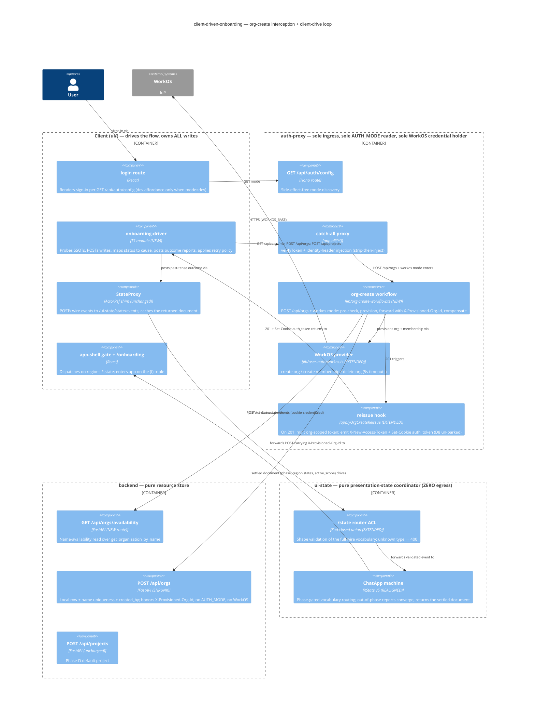

# client-driven-onboarding — Application Architecture (application-scope pass)

**Author:** Morgan (nw-solution-architect)
**Date:** 2026-06-10
**Mode:** Propose (boundary assignments are user-ratified and FIXED — `../design-intent.md` §"Boundary assignments"; options are presented only for the genuinely open application-level points (a)–(f), each with a recommendation)
**ADR:** ADR-050 (Accepted — user-ratified 2026-06-11; amended: naming override + cause-tag display rule) — `docs/decisions/adr-050-client-driven-onboarding-application-contracts.md`
**Upstream passes (binding):** system scope — `system-architecture.md` + ADR-048 (pre-check-then-compensate A+B layered, zero nginx changes, env/credential deltas, observability events, D8 un-park); domain scope — `domain-model.md` + ADR-049 (the past-tense outcome vocabulary (DR-2 override), INV-PCO, phase-gated vocabulary routing, state-set deltas, the domain answer to (f))
**Downstream:** DISTILL (acceptance rework per §(e).4) → DELIVER

This pass pins the CONCRETE CONTRACTS — HTTP shapes, headers, wire-schema deltas, file-by-file map, cleanup inventory, migration path — that make ADR-048/049 implementable. Every claim about live code carries file:line evidence.

---

## (a) Token reissue as `Set-Cookie` on the intercepted org-create response

**Un-parks ui-cookie-session D8** (`docs/feature/ui-cookie-session/design/delta-and-decisions.md` §3/§6).

### Ground truth

The reissue seam already mints the org-scoped token on `POST /api/orgs → 201` and emits `X-New-Access-Token` + `X-New-Token-Expires-In` (`auth-proxy/app.ts:839–885` `applyOrgCreateReissue`; pure compute in `auth-proxy/lib/post-response-reissue.ts:86–105`). The cookie attribute set and the two-distinct-`Set-Cookie`-headers discipline already exist at the callback (`app.ts:173–198`, using `buildSetCookie` from `lib/cookies.ts` with `{ append: true }` — the UC-6 never-collapse rule). `ui/` has **no reissue consumer at all** post-cookie-migration (org-onboarding D5 was parked; `setToken` is retired).

### Why this is load-bearing, not a nicety

In workos mode, **Phase D rides the reissued claim**: the client's automatic `POST /api/projects` (design-intent step 12) is authorized against the token's `org_id`. The org-create response is the only place the new claim can land without an extra round-trip or a race — exactly why the seam fires inside the same response path (ADR-048 §6).

### Options

| | A — unconditional dual emission (cookie + header, always) | B — conditional on credential source | C — `Set-Cookie` replaces the header |
|---|---|---|---|
| Mechanism | `applyOrgCreateReissue` appends two `Set-Cookie` headers (D1 attributes) **alongside** the existing `X-New-Access-Token` pair, on every trigger | Cookie-credentialed request → `Set-Cookie`; header-credentialed → `X-New-Access-Token` | Headers retired; cookie only |
| `frontend/` + PAT/headless | Unaffected: header preserved (ui-cookie-session D2/D9); non-browser clients ignore `Set-Cookie`; a browser holding both credentials is safe because the read priority is HEADER > COOKIE (`app.ts:66–84` D3) | Unaffected, but requires plumbing the credential *source* through the reissue path and doubles the test matrix | **Breaks** `frontend/` (still localStorage-Bearer, D2) and the headless reissue read |
| Complexity | One emission block, one test family | Source-tracking plumbing for zero security gain (the token was already header-exposed and remains so for `frontend/`) | Smallest surface, wrong compatibility |
| Verdict | ✅ **RECOMMENDED** | ⚠️ workable, not justified | ❌ rejected |

### The contract (Option A)

On `POST /api/orgs → 201` with a preservable user identity (`isUserToken`, `app.ts:851`), the response carries **all four**:

```
HTTP/1.1 201 Created
X-New-Access-Token: <jwt with new org_id claim>
X-New-Token-Expires-In: <seconds>
Set-Cookie: auth_token=<same jwt>; HttpOnly; SameSite=Lax; Path=/; Max-Age=<seconds>[; Secure]   ← Secure iff AUTH_MODE != dev (D1 rule, app.ts:178)
Set-Cookie: session=1; SameSite=Lax; Path=/[; Secure]
```

- Cookie attributes are **byte-identical to the callback's D1 pair** (`app.ts:179–198`); the `session=1` flag is re-emitted for symmetry with the callback. Both cookies use append semantics (never collapsed — UC-6).
- **Client behavior (`ui/`): nothing.** The cookie is httpOnly; the next request — Phase D's project POST — rides the new claim automatically. No `ui/` reissue code exists or is added.
- **Dev mode: no special case.** The hook is already mode-agnostic (path/method/status-guarded only, `app.ts:846–848`); in dev the refreshed claim is harmless redundancy because `DEV_NO_ORG` ignores org claims and resolves from the DB (`backend/app/routers/deps.py:49–50`, org-onboarding D1). Zero dev-conditional code.
- **Header emission retained** — explicitly reaffirming ui-cookie-session D2/D9: `frontend/` stays header-based; PAT/M2M/headless reissue reads stay possible. The observability event `auth.reissue.emitted` (ADR-048 §5) reports `transport: "both"`.

---

## (b) Org-id handoff: how the WorkOS-minted id reaches the forwarded backend write

### Ground truth

Today the WorkOS org id **is** the local org id: the workos path passes `id=org_id` into the repository (`backend/app/use_cases/organization/create_organization.py:73–79`); the dev path lets the repo generate (`:82`). The backend trusts auth-proxy-injected headers under `TRUST_PROXY_HEADERS` (`backend/app/routers/deps.py:36–45`); clients can never inject trusted headers because the proxy strips `IDENTITY_HEADERS` before injection (`auth-proxy/app.ts:789–794`, list at `auth-proxy/lib/auth.ts:68`).

### Options

| | A — trusted header `X-Provisioned-Org-Id` | B — proxy body rewrite (inject `id` into the JSON) | C — backend accepts `id` in the request body |
|---|---|---|---|
| Mechanism | Interception branch sets the header on the forwarded POST only; header joins the `IDENTITY_HEADERS` strip list so client-supplied values are always dropped | Proxy buffers, parses, mutates, re-serializes the body | `OrgCreate` schema gains an optional `id` |
| Trust posture | Same channel the backend already trusts (ADR-016 / `TRUST_PROXY_HEADERS`); unforgeable by construction (strip-then-inject) | Conflates client-authored and proxy-authored body fields; backend cannot tell who wrote `id` | **Forgeable by any client** — arbitrary org-id minting / squatting of future IdP ids |
| Mechanics | Zero body handling; forward stays streamed | Breaks the streamed forward (`duplex: "half"`, `app.ts:926–932`); buffering + re-encode on the ingress | Trivial but unsafe |
| Verdict | ✅ **RECOMMENDED** | ❌ rejected | ❌ rejected outright |

### The contract (Option A)

- **Header:** `X-Provisioned-Org-Id: <workos_org_id>` — set by auth-proxy **only** inside the org-create interception branch (workos mode, after a successful WorkOS org-create). Added to the strip list (`auth-proxy/lib/auth.ts:68`) so any inbound client value is dropped on every route.
- **Backend:** `POST /api/orgs` reads the header gated on `settings.trust_proxy_headers` (the same gate as identity headers) and passes `provisioned_org_id: str | None` to the use case, which forwards it as the repo `id=` (the exact parameter the workos path uses today, `create_organization.py:79`). Absent header → repo generates the id.
- **Dev-mode id source: backend-generated, as today** (`create_organization.py:82`). The identity rule is preserved: in workos mode the WorkOS id IS the local row id; in dev there is no IdP id to mirror.
- **Pre-check affordance** (ADR-048 layer A — the one new backend read): `GET /api/orgs/availability?name=<name>` → `200 {"available": true|false}`, one route over the existing `metadata_repo.get_organization_by_name` lookup (used at `create_organization.py:48`). Requires identity headers like every `/api` route; auth-proxy calls it with the same identity headers + correlation id it just built for the forward. Publicly reachable through the catch-all — harmless (a read that reveals only what a `POST` collision would reveal) and reusable for client-side UX pre-validation.
- **WorkOS calls** (relocated verbatim from `create_organization.py:100–115`, joining the existing injected-`fetch` boundary in `auth-proxy/lib/user-auth/workos.ts` per ADR-048 §9): `POST {WORKOS_BASE}/organizations {name}` → `{id}`; `POST {WORKOS_BASE}/user_management/organization_memberships {user_id, organization_id}` (the verified token's `sub` is the WorkOS user id — same value the backend uses today); compensation `DELETE {WORKOS_BASE}/organizations/{id}`. Timeouts/retry per ADR-048 R5. The request body's `name` is read via `Request.clone()` (the `peekInboundEventType` precedent, `app.ts:665–675`) so the forward leg still streams.

---

## (c) Failure-path contracts: HTTP error shapes, cause enums, retry behavior

### The HTTP contract of the intercepted `POST /api/orgs`

Backend-originated statuses are **relayed verbatim** (the proxy stays transparent on the forward leg); only proxy-originated failures (WorkOS egress) synthesize a body. One deliberate exception: the pre-check conflict **mirrors the backend's own 409 shape** so the client has exactly one 409 contract regardless of which layer caught the collision.

| Failure | Status to client | Body | Compensation |
|---|---|---|---|
| Pre-check: name taken (ADR-048 layer A) | `409` | Mirrors the backend's JSON:API 409 (`wrap_jsonapi_error(409, "Organization name already in use", …)` — `backend/app/controllers/_result_mapper.py:43–47`, `exceptions.py:14–22`): `{"errors":[{"status":"409","title":"Organization name already in use","detail":"…"}]}` | none needed — **no WorkOS egress occurred** |
| Backend name validation (new — see below) | `422` relayed | FastAPI/pydantic validation body | n/a (pre-WorkOS in the pre-check? No — validation fires on the forward; see ordering note) |
| WorkOS org-create egress fail (timeout / 4xx / 5xx) | `502` | `{"errors":[{"status":"502","title":"Organization provisioning failed","code":"org_provisioning_failed"}]}` | none needed (nothing created) |
| WorkOS membership fail (after the one retry) | `502` | same shape | compensation delete runs (ADR-048 layer B) |
| Backend persist fail — TOCTOU race 409 | `409` relayed | backend JSON:API 409 | compensation delete runs |
| Backend persist fail — 5xx | backend status relayed | backend body | compensation delete runs |
| **Compensation itself failed** (orphaned IdP org) | same as the row above — **client-indistinguishable by design** | — | `workos.org_compensate.fail` event carries the orphan id (ADR-048 §5); operator-driven reconcile. The client's retry still succeeds (orphans are inert — ADR-048 §3) |

Ordering note: name **well-formedness** (non-blank after strip) must be checked before WorkOS egress. The interception applies the same trivial check the backend schema enforces (blank → relay a 422-shaped response without egress); the backend stays the SSOT and re-validates on the forward. This replaces the retired machine-side `isOrgNameValid` guard (ADR-049 §3.3) — **the backend `OrgCreate` schema gains the validation** (today it is an unconstrained `str`, `backend/app/routers/organizations.py:16–19`).

Dev mode: straight forward (no interception work); all statuses relayed verbatim — today's behavior.

`POST /api/projects` (Phase D) is **not intercepted** — backend statuses arrive verbatim.

### Cause enums (the exact tag sets — closes ADR-049's delegation)

```ts
// shared/ui-state-wire/wire-event.ts
export type OrgCreateFailureCause =
  | "org_name_taken"      // re-edit class: 409
  | "org_name_invalid"    // re-edit class: 400/422
  | "org_create_failed";  // retry class: 5xx/502/504/network — incl. compensated AND uncompensated outcomes
export type ProjectCreateFailureCause = "project_create_failed";   // retry class only (the default name is a client constant; no re-edit arm until the project-naming feature)
export type ScopeMismatchCause = "cross_tenant" | "project_not_found" | "access_revoked";  // unchanged from ADR-049 §3.2
```

ADR-049's domain rule (the two-way split: *re-edit causes return to the form; everything else is retryable*) maps: `org_name_taken` | `org_name_invalid` → remain `needs_org` with `org_validation_error` set (the inline form error — today's 409 arm preserved, ADR-049 Spec 4); `org_create_failed` → `error_recoverable` (report-accepting — Spec 5). These tags join the `UnderlyingCauseTag` set (`ui-state/lib/machines/onboarding/setup/domain.ts`); `partial-setup` dies (ADR-048 binding constraint).

**Display rule (user-ratified amendment, 2026-06-11):** cause tags are machine-readable wire values — **the UI never renders a raw tag**. Re-edit causes map to user-friendly inline helper text the client owns (e.g. `org_name_taken` → "That organization name is already in use — try another"); the retry class triggers a distinct "something went wrong on our end" presentation with the retry affordance. Raw tags belong in the console-log audit trail only. The shipped `Cause: partial-setup` rendering (`ui/app/routes/onboarding.tsx`) is the anti-pattern this rule retires; the DISTILL acceptance criteria must assert friendly copy (or the generic-error surface), not tag strings, anywhere a failure is rendered.

### The client's status→event mapping (ONE function, `ui/`)

```
POST /api/orgs result        → outcome report posted to /ui-state/state/events
  201 {data:{id, attributes:{name}}}  → org_created   { org: { id, name } }
  409                                 → org_create_failed { cause: "org_name_taken",   org_name }
  400 | 422                           → org_create_failed { cause: "org_name_invalid", org_name }
  any other status / network / timeout→ org_create_failed { cause: "org_create_failed" }
  401                                 → NOT an outcome report — credential problem; fold to the auth gate (/login)

POST /api/projects result
  201                                 → project_created { project: { id, name } }
  401                                 → auth gate
  anything else                       → project_create_failed { cause: "project_create_failed" }
```

(The 201 body shape is the backend's JSON:API single — `data.id` + `data.attributes.name`, `organization_controller.py:47–54`. The `requires_reauth` attribute **dies** with the backend's workos path — the cookie reissue replaces its purpose.)

### Retry behavior per class (client policy, pinned)

| Class | Client behavior |
|---|---|
| `org_name_taken` / `org_name_invalid` | No retry. User re-edits; submit re-POSTs. The form renders `org_validation_error` from the report's machine action. |
| `org_create_failed` | **Manual retry only** (no auto-retry — org create is not idempotent end-to-end, ADR-048 R5). The `error_recoverable` surface offers a retry affordance; retry = re-`POST /api/orgs` (same name) → re-report. Clean after a compensated failure; still succeeds after an uncompensated one (orphan inert + alerted). |
| `project_create_failed` | Manual retry with **probe-first convergence**: before re-POSTing, the client re-probes `GET /api/projects`; non-empty → report `scope_resolved` (covers the lost-response duplicate — the project actually exists); empty → re-`POST` + re-report. |
| Probe transport failure (Phase B `GET /api/orgs/me` 5xx/network) | **Not reportable.** Only definitive answers are reported: `200 → org_found`, `404 → org_not_found`. A transport error triggers a bounded local re-probe; the document stays `awaiting_org_report` and the surface stays on the waiting state. This is the earned-trust rule client-side: *report only what the SSOT actually said.* |

---

## (d) Mode-discovery contract

### Options

| | A — dedicated `GET /api/auth/config` | B — fold `mode` into `GET /api/auth/login` | C — both |
|---|---|---|---|
| Mechanism | New side-effect-free auth-proxy local route | The login handler already branches on mode (`app.ts:107–136`); add a `mode` field | A + B |
| Side effects | None — pure config read; cacheable | In workos mode every call **mints + remembers a one-shot CSRF state** (`app.ts:119–120`, in-process `Set`, never expired) — a render-time call per page view leaks states and muddies click-vs-render semantics | inherits B's leak |
| Render-time fit | The login surface can decide what to render before any sign-in intent exists | Discovery requires invoking the sign-in initiator | — |
| Verdict | ✅ **RECOMMENDED** | ❌ rejected as the discovery mechanism (stays the click-time initiator, unchanged) | ❌ duplication with no consumer |

### The contract (Option A)

```
GET /api/auth/config
  200  Cache-Control: public, max-age=300
  { "mode": "dev" | "workos" }
```

- Served **locally by auth-proxy** (sole `AUTH_MODE` reader, ADR-048), registered before the catch-all like every `/api/auth/*` route (the `/api/auth/me` precedent, `app.ts:280–283`) — so it never reaches the proxy leg and needs **no `PUBLIC_PATHS` entry** (`lib/auth.ts:60–65` gates only the catch-all). No credential required: the mode is not a secret (the login response already reveals it), and the login surface is pre-auth by definition.
- **Caching posture:** static per-process config (env read at startup semantics; a mode flip requires a container restart anyway). `max-age=300` plus a module-level memo in `ui/` — fetched at most once per app load.
- Zero nginx change: `location /api/` already routes it (ADR-048 §3).
- Response validated at the `ui/` boundary with Zod (untrusted-input rule, inbound adapter only); unknown future fields ignored (extensible object).

### How `ui/app/routes/login.tsx` consumes it

Today the dev button renders **unconditionally** (`login.tsx:36–51` — design-intent Why #5). Target:

1. On mount, fetch the memoized config (a `fetchAuthConfig()` added to `ui/app/auth/bootstrap.ts`).
2. Until resolved: render no sign-in affordance (a neutral waiting surface) — **no flash of a dev affordance** in workos mode.
3. `mode === "dev"` → the existing "Sign in (dev)" button; `mode === "workos"` → a "Sign in" button. **Both click paths call the existing `login()` unchanged** (`bootstrap.ts:18–23`) — auth-proxy already returns the mode-appropriate URL (dev callback short-circuit vs WorkOS authorize URL, `app.ts:107–136`). The production user never sees a dev affordance; the dev affordance requires the server to say so.

---

## (e) Outcome-event vocabulary, wire-schema deltas, and the migration path

### (e).1 The `ChatAppWireEvent` union delta (TS sketch — the closed union)

Replaces `shared/ui-state-wire/wire-event.ts:19–52` wholesale. The trailing `{ type: string }` catch-all (`:52`) **retires** (ADR-049 D4 — the closed union is what makes phase-gated vocabulary routing total).

```ts
export interface OrgSnapshot { id: string; name: string }        // display snapshots (INV-PCO) — never authoritative
export interface ProjectSnapshot { id: string; name: string }

export type ChatAppWireEvent =
  // ── lifecycle (kept) ──
  | { type: "session_begin"; payload?: { force_restart?: boolean } }
  // ── onboarding outcome reports (login-phase vocabulary) ──
  | { type: "org_found"; payload: { org: OrgSnapshot } }
  | { type: "org_not_found"; payload?: Record<string, never> }
  | { type: "org_created"; payload: { org: OrgSnapshot } }
  | { type: "org_create_failed"; payload: { cause: OrgCreateFailureCause; org_name: string } }
  // ── project-context outcome reports + kept intents (engaged-phase vocabulary) ──
  | { type: "scope_resolved"; payload: { project: ProjectSnapshot } }
  | { type: "no_projects_found"; payload?: Record<string, never> }
  | { type: "scope_mismatch"; payload: { cause: ScopeMismatchCause } }
  | { type: "project_created"; payload: { project: ProjectSnapshot } }
  | { type: "project_create_failed"; payload: { cause: ProjectCreateFailureCause } }
  | { type: "project_switched"; payload: { project: ProjectSnapshot } }
  | { type: "open_deep_link"; payload: { intent_project_id?: string; intent_session_id?: string;
        intent_resource_id?: string; intent_resource_type?: string } }   // kept — wish-capture
  | { type: "back_to_projects_clicked"; payload?: Record<string, never> } // kept — UI intent
  // ── session-chat vocabulary (chat-phase; DR-8 — see (e).5) ──
  | SessionChatWireEvent
  // ── failure-sim side-channel (kept, gate-authorized) ──
  | { type: "__force_failure__"; payload: { tag: string } };
  // NO trailing { type: string } member — the union is CLOSED.
```

**Retired members** (with their consumers — see Cleanup): `org_form_submitted` (`wire-event.ts:22`), `create_project_submitted` + the UI-1 `org_name`-misnomer (`:33`), `switching_project_intent` (`:38`), the catch-all (`:52`). `create_project_clicked` and `retry_clicked` were never named members (they rode the catch-all) and die with it.

### (e).2 Router ACL change (`ui-state/lib/machines/chat-app/router.ts`)

- The onboarding-phase-only `onboardingEventSchema` (`router.ts:244–253`) is replaced by a **full closed-vocabulary Zod schema validated for every POST**, annotated `z.ZodType<ChatAppWireEvent>` against the shared union so producer/validator drift is a compile error. Unknown `type` → **400 at the edge** (this resolves ADR-046's unmodeled-event-silence question, per ADR-049 D4). Validation stays well-formedness + tag-membership only (shape, not truth — INV-PCO).
- Known-but-out-of-phase events are forwarded and **dropped by the machine** (no handler in the current phase state — ADR-049 D4); the response is the current document (Spec 8 convergence). The router no longer needs the `phase === "onboarding"` dispatch split (`router.ts:443`).
- `forwardToActor`'s `switching_project_intent → PROJECT_SWITCH` special case (`router.ts:560–573`) retires with the event; the forward becomes uniform (the parent's phase-state handlers do the routing — internals are the crafter's, the wire contract is: every union member is deliverable, handled-or-converged).
- The failure-sim gate (`router.ts:467–482`) is preserved verbatim.

### (e).3 State-document deltas (`shared/ui-state-wire/state-document.ts`)

**Region state-string sets** (the literals FE gates and the acceptance suite dispatch on):

| Region | Removed | Renamed | Kept |
|---|---|---|---|
| `onboarding` | `creating_org`, `session_rejected` | `verifying` → `awaiting_org_report` | `needs_org`, `ready`, `error_recoverable` (KPI literals preserved — `app.ts:710–722`) |
| `projectContext` | `creating_project`, `switching_project` | `resolving_initial_scope` → `awaiting_scope_report` | `no_projects`, `project_selected`, `scope_mismatch_terminal`, `error_recoverable` |
| `sessionChat` | `resuming_session`, `creating_session`, `switching_dataset_context` (`session-chat/machine.ts:232,299,388`) | `loading_session_list` → `awaiting_session_list_report` | `waiting_for_project`, `session_list_loaded`, `session_welcome`, `session_active`, `error_recoverable` |

**`ChatAppPhase`** (`state-document.ts:173`) loses `"rejected"` (DR-5 — `user_rejected` retires): `"onboarding" | "project_context" | "chat"`.

**`anonymousStateDocument()`** (`state-document.ts:214–232`): the hand-built zero values `"verifying"` become each region's actual initial state — `awaiting_org_report` / `awaiting_scope_report` / `waiting_for_project`.

**`ReducedContext` pruning** (closes ADR-049 §5.1's delegation; ratification AR-7):

| Field (`state-document.ts`) | Verdict | Why |
|---|---|---|
| `access_token` (`:75`) | **DELETE** | DR-6 — the real reissue rides `Set-Cookie` (§a); the alg:none echo has no consumer (verify at DISTILL). |
| `pending_project_name` (`:77`) | **DELETE** | In-flight create retired (ADR-049 DR-1); nothing captures a pending name. |
| `most_recent_session_per_project` (`:79`) / `last_used_resolution_degraded` (`:82`) | **DELETE** | The last-used-resolution policy moved to the client with `resolveInitialScopeFn`; the machine only learns the resolved answer. |
| `org_validation_error` / `project_validation_error` | **KEEP** | The re-edit class renders them (Spec 4). |
| `retries_count` | **KEEP** | Now counts received `*_create_failed` events — still honest, still display-only. |
| everything else | KEEP | unchanged. |

### (e).4 Migration path

**(i) The shipped `ui/` org-onboarding surfaces** — what changes from "post `org_form_submitted` to ui-state" to "client drives the POST, then reports":

| Surface | Today | Target |
|---|---|---|
| `ui/app/lib/StateProxyProvider.tsx` (`ensureBootstrap`, `:59–73`) | Once-latched `session_begin` | **Unchanged.** The probe sequencing lives in the new driver module, composed after `ensureBootstrap` by the entry surfaces — the latch stays auth-bootstrap-only. |
| **NEW** `ui/app/lib/onboarding-driver.ts` | — (this policy lived in the retired ui-state actors) | The relocated flow-driving policy: Phase B probe (`GET /api/orgs/me` → `org_found` / `org_not_found`; definitive-answers-only rule §c), the status→cause mapping (§c), Phase D auto default project (once-latched `POST /api/projects {name: "My First Project"}` → report), the probe-first retry policy, and the initial-scope resolution policy ported from `resolveInitialScopeFn` (`project-context/setup/actors.ts:229–331`) → `scope_resolved` / `no_projects_found`. |
| `ui/app/routes/onboarding.tsx` | `OrgNameForm` posts `org_form_submitted` (`:216`); `ProjectNameForm` posts `create_project_submitted` with the UI-1 quirk (`:170–175`); switch arms on `verifying`/`creating_org`/`session_rejected` (`:97–116`) | `OrgNameForm` submit → `POST /api/orgs` → report per the §c mapping (in-flight UI is **local** `useState` — DR-1; the document never shows an in-flight state). **`ProjectNameForm` is deleted** — Phase D is automatic (design-intent step 12); the project-phase surface becomes a progress view driven by the driver's auto-create. Switch arms: `verifying`→`awaiting_org_report`; `creating_org`/`session_rejected` arms die; `error_recoverable` gains the retry affordance (§c). The existing `project_selected` → `refreshOrgGlobal()` → `navigate("/")` effect (`:73–88`) survives verbatim — it is already the (f) contract. |
| `ui/app/routes/app-shell.tsx` (the gate) | `ONBOARDING_ACTIVE_STATES = {needs_org, creating_org, error_recoverable}` (`:120–124`); `phase === "rejected"` branch (`:142`); waits on `"verifying"` (`:143`); `no_projects` → `/onboarding` (`:153`) | States set → `{needs_org, error_recoverable}`; the `rejected` branch dies (DR-5 — auth failure is auth-proxy's 401, surfaced by the `hasSession()` gate); waits on `"awaiting_org_report"` (also the new anonymous-document zero state, so pre-first-frame behavior is unchanged); after bootstrap, the gate invokes the driver's Phase-B probe when the document shows `awaiting_org_report`. `no_projects` routing survives (the driver auto-creates from `/onboarding`). |
| `ui/app/routes/login.tsx` | Unconditional dev button | Mode-discovery consumption per §d. |
| `ui/app/lib/state-proxy.ts` | — | **No change** — the closed union only tightens its `ChatAppWireEvent` parameter at compile time. Transport untouched (design-intent non-goal). |
| `ui/app/catalog/dataSources/backendClient.ts` | `apiPost` throws on non-2xx without structured status | EXTEND: the thrown error carries `{status, body}` (an `ApiError`) so the driver's cause mapping can dispatch — the catalog's own call sites are unaffected. |

**(ii) `tests/acceptance/org-onboarding/` — per-file verdict.** The suite's business scenarios survive; the **driver layer** absorbs the write-model change (it must now perform the backend POSTs itself and narrate them — exactly what production `ui/` does). Strategy ratification in AR-6 (rework-in-place recommended over a parallel suite).

| File | Verdict | What changes |
|---|---|---|
| `driver.py` | **REWORK (extend)** | Keeps `session_begin`/`post_event`/`get_state`/`get_my_org`/`create_org` (`:115–144` — `create_org` already does the direct `POST /api/orgs`!). Gains: `create_project` (`POST /api/projects`), `report(event)` sugar, and a `probe_and_report_org()` helper implementing Phase B (`GET /api/orgs/me` → post `org_not_found`/`org_found`). |
| `test_walking_skeleton_org_then_default_project.py` | **REWORK** | New sequence: `session_begin` → assert `awaiting_org_report` → probe+report (404 → `org_not_found`) → assert `needs_org` → `create_org` (real POST) → post `org_created{org}` → assert `ready`/phase advanced → `create_project` (real POST) → post `project_created{project}` → assert `project_selected` + `phase == "chat"` + `active_scope.project_id` (the (f) triple) + the existing DB side-effect asserts. Same business scenario, new driver choreography. |
| `test_orgless_principal_routes_to_onboarding.py` | **REWORK** | "Begin session → guided to onboarding" now asserts `awaiting_org_report` after begin, then `needs_org` after the probe+report pair. Identity-shown assertion unchanged (DR-4 header seed). |
| `test_org_absent_from_db_routes_to_onboarding.py` | **REWORK** | Same probe+report insertion as above. |
| `test_org_creation_persists_created_by.py` | **REWORK (light)** | Replace the `org_form_submitted` post (`:47–48`) with `driver.create_org` + `org_created`. The `created_by` DB assertion survives unchanged (backend behavior untouched). |
| `test_default_project_completes_onboarding.py` | **REWORK** | The user-driven `create_project_submitted` (`:49–50`, with the UI-1 dual-key stopgap) becomes the automatic-default sequence: real `POST /api/projects` + `project_created`. **The UI-1 quirk dies with the event** — close the upstream issue. |
| `test_invalid_org_name_stays_needs_org.py` | **DIES → REWRITE** | It asserts the machine-side `isOrgNameValid` guard (`:41–46`), which retires. Replacement scenario: `POST /api/orgs {"name": "   "}` → backend `422` (the **new** backend validation — §c ordering note; without it this scenario has no SSOT to assert) → post `org_create_failed{cause: org_name_invalid}` → assert still `needs_org` + `org_validation_error` set. |
| `test_post_orgs_no_longer_auto_creates_project.py` | **SURVIVES (near-as-is)** | Already drives `driver.create_org` directly (`:41`) with no ui-state write event; only the Background's session bookkeeping needs the probe+report pair if it asserts region state. |
| `features/org-onboarding.feature` | **REWORK (wording)** | Org-creation scenarios survive verbatim at business language. Phase-D wording changes: "When they submit a name for their first project" → "Then their first project is created automatically". **New scenarios** (RED at DISTILL): name-taken 409 → re-edit; org-create failure → retryable `error_recoverable` → successful retry (Spec 5); late/duplicate report convergence with the process alive (Spec 8 — the 2026-06-10 crash regression); invalid name 422 re-edit. |
| `conftest.py`, `pyproject.toml`, `README.md` | **SURVIVE** | `DEV_NO_ORG` Background unchanged; marker descriptions updated. UI-2 (repeatable-run reset) remains open and unchanged by this feature. |

Workos-mode interception coverage (pre-check / compensation / reissue-cookie) is **not** this suite's job — it lands as auth-proxy unit tests plus a fake-WorkOS acceptance via the `WORKOS_BASE` pin (ADR-048 R4), sequenced at DISTILL.

### (e).5 Session-chat vocabulary (executes DR-8)

The tier-wide `BACKEND_URL` deletion (ADR-048 §4) retires session-chat's four egress actors (`session-chat/setup/actors.ts`: `loadSessionList`, `resumeSession`, `createSessionEagerly`, `switchDatasetContext`). Mechanical application of the ADR-049 pattern:

| Retired invoke | Outcome reports (new wire members) | Triggering UI intent (kept wire member) |
|---|---|---|
| `loadSessionList` | `session_list_loaded { sessions, next_cursor, has_more }` (mirrors `ReducedContext.session_list`, `state-document.ts:97–102`) / `session_list_failed { cause: "session_list_failed" }` | `refresh_session_list` (kept; client re-lists + reports) |
| `resumeSession` | `session_resumed { session_id, transcript, resource, session_dataset_unavailable }` / `session_resume_failed { cause }` | `session_clicked` (kept — wish; client resumes + reports) |
| `createSessionEagerly` | `session_created { session }` / `session_create_failed { cause }` | `first_message_sent` (kept — carries `content`) |
| `switchDatasetContext` | `dataset_context_switched { resource }` / `dataset_context_switch_failed { cause }` | `dataset_resolved_by_agent`, `dataset_picked_directly` (kept) |

Pure-UI intents survive as named members: `new_session_clicked`, `suggestion_chip_clicked_upload`, `suggestion_chip_clicked_browse_projects` (`session-chat/setup/types.ts:123–131`). `retry_clicked` (`:129`) retires (consistent with onboarding/project-context — retry is re-do + re-report). Exact payload field lists are enumerated mechanically at DISTILL from the invoke output types in `session-chat/setup/actors.ts` (they become the report payloads verbatim — display data under INV-PCO).

**KPI fallout:** the auth-proxy sniffer's `auth_retry_clicked` trigger keys off the inbound `retry_clicked` type (`auth-proxy/app.ts:703–709`), which no longer exists. The trigger is retired; the retry funnel re-derives aggregator-side from ADR-048 §5's `org_create.intercepted` stream (a second intercepted POST from the same principal after a failure IS the retry). `error_recoverable` / `ready` literals are untouched. Ratification AR-5.

---

## (f) Engaged-state contract under client-reported project success

The domain answer (ADR-049 §5.2) is inherited: the parent's `isInitialProjectSelected` `onSnapshot` guard (`chat-app/setup/guards.ts:36–38`) is **reused verbatim**; only the producer of `project_selected` changes. This section pins the wire-level flip the FE dispatches on.

### Options (the FE gate predicate)

| | A — region state primary, scope + phase as companions | B — `phase === "chat"` alone | C — `active_scope.project_id` alone |
|---|---|---|---|
| Reads | `regions.projectContext.state === "project_selected"` (primary) AND `active_scope.project_id !== null`; `phase` used for route dispatch only | one field | one field |
| Honesty | Matches the document's own contract: `phase` is "routing/first-paint convenience, **not a state-of-record**" (`state-document.ts:170–172,188–189`); the region state IS the state-of-record | Dispatches on a field the SSOT explicitly demotes | A scope can be set while the region is in `scope_mismatch_terminal` re-entry — ambiguous |
| Continuity | The shipped surfaces already dispatch on the region state (`onboarding.tsx:73`, `app-shell.tsx:153`) | new dispatch | new dispatch |
| Verdict | ✅ **RECOMMENDED** | ❌ | ❌ |

### The contract (Option A)

The client enters the app on **the response document of its own `project_created` POST** (ADR-046 Decision 3 — the POST response is always the new settled document; no extra read, no race). That document satisfies, atomically:

```
regions.projectContext.state == "project_selected"     ← the gate predicate (state-of-record)
active_scope.project_id      == "<proj-id>"            ← the scope the shell needs (non-null)
phase                        == "chat"                 ← routing convenience (the parent advanced
                                                          engaged.project_context → engaged.chat via
                                                          isInitialProjectSelected during the same settle)
```

The same triple holds for the returning-user fast path (`scope_resolved`) — one gate predicate for both.

### Edge cases (all converge — ADR-049 Spec 8)

| Case | Behavior |
|---|---|
| **Duplicate report** (re-submit after a lost response) | `project_selected` has no `project_created` handler (ADR-049 §5.1) → no transition, no send; the response is the current document — already showing the triple → the client's navigation is idempotent. |
| **Report arrives while the phase already advanced** (stale tab) | Same convergence: dropped, current document returned, tab routes correctly off it. |
| **Out-of-order report** (`project_created` while phase is still `onboarding`) | No handler on `login` → dropped; the document still shows onboarding → gate predicate false → the tab does NOT navigate. Only cross-tab reachable (the driving client orders its own reports). |
| **Crash/reload recovery** | `session_begin` → the rehydrated actor's document (router `getActor`, `router.ts:159–170`); if already `project_selected`, the gate enters the app directly — no re-onboarding. |

---

## File-by-file delta (the implementable map)

### auth-proxy/

| File | Change | Nature |
|---|---|---|
| `app.ts` | Register `GET /api/auth/config` (before the catch-all, `/api/auth/me` pattern `:280–298`); insert the org-create interception branch in `app.all("*")` between `verifyToken` and `proxyRequest` (`:813–821`), guarded path+method+`AUTH_MODE=workos`; extend `applyOrgCreateReissue` (`:839–885`) to append the two `Set-Cookie` headers (§a); retire the `retry_clicked` KPI trigger (`:703–709`) | EXTEND + SHRINK |
| `lib/auth.ts` | Add `"x-provisioned-org-id"` to `IDENTITY_HEADERS` (`:68`) — the strip-then-inject trust rule | EXTEND |
| `lib/user-auth/workos.ts` | Add the org-provisioning operations (create-org / create-membership / delete-org) to the existing injected-`fetch` boundary; `AbortSignal.timeout(5000)` per call | EXTEND |
| `lib/org-create-workflow.ts` | **NEW** — the pre-check → provision → forward → compensate orchestration + ADR-048 §5 event emission, as a testable unit (request-body name read via `Request.clone()`) | NEW (justified — see Reuse) |
| `lib/post-response-reissue.ts` | Compute unchanged (emission delta lives in `app.ts`) | REUSE |
| `lib/cookies.ts` | `buildSetCookie` reused for the reissue pair | REUSE |
| `test/` | Interception branch, workflow unit tests (fault-injected fetch), config route, reissue-cookie assertions | EXTEND |

### backend/

| File | Change | Nature |
|---|---|---|
| `app/use_cases/organization/create_organization.py` | DELETE `_create_workos_org` (`:86–120`), the `_create_org_record` mode dispatch (`:66–83`), the `httpx` import, and `requires_reauth`; accept `provisioned_org_id: str \| None` → repo `id=` (the `:79` parameter); keep name-uniqueness (`:46–49`) + `created_by` stamp | SHRINK |
| `app/use_cases/organization/exceptions.py` | DELETE `ExternalServiceError` (`:6–11`; sole consumer was `_create_workos_org` — confirm via grep at DELIVER) | SHRINK |
| `app/routers/organizations.py` | `OrgCreate` gains name validation (strip + min length — the retired machine guard's new home, `:16–19`); the POST handler reads `X-Provisioned-Org-Id` gated on `trust_proxy_headers`; NEW `GET /api/orgs/availability?name=` over `get_organization_by_name` | EXTEND |
| `app/controllers/organization_controller.py` | Drop the `requires_reauth` attribute mapping (`:49–50`); availability handler | EXTEND + SHRINK |
| `app/config.py` | DELETE `auth_mode`, `workos_api_key`, `workos_api_url`, `workos_client_id`, `workos_redirect_uri` (`:76–81`) | SHRINK |
| `app/routers/deps.py` | **UNCHANGED** — `DEV_NO_ORG` resolution stays (`:49–65`) | REUSE |
| `tests/use_cases/organization/` | Mode-dispatch + WorkOS-mock tests die; provisioned-id, validation, availability tests added | REWORK |

### ui-state/

| File | Change | Nature |
|---|---|---|
| `config.ts` | DELETE `workosUrl`, `backendUrl` (`:12–14`), `devUserHeadersFixture` (`:25–34`) — Redis-only config | SHRINK |
| `index.ts` | Drop the egress wiring (`:117–133` per ADR-048) | SHRINK |
| `lib/machines/onboarding/setup/actors.ts` | Retire wholesale (`loadSession`/`getWorkOSUserInfo`/`getUserOrg`/`createOrg`, `:121–396`) | DELETE |
| `lib/machines/onboarding/machine.ts` | Realign per ADR-049 §4.2 (`awaiting_org_report`; report-accepting `error_recoverable`; `creating_org`/`session_rejected` die) | EXTEND |
| `lib/machines/onboarding/setup/domain.ts` | `UnderlyingCauseTag`: drop `partial-setup`; add the §c cause tags | EXTEND |
| `lib/machines/project-context/setup/actors.ts` | Retire (`resolveInitialScopeFn`/`createProjectFn`/`switchProjectFn`, `:140–480`) | DELETE |
| `lib/machines/project-context/machine.ts` | Realign per ADR-049 §5.1 (`awaiting_scope_report`; `creating_project`/`switching_project`/`retry_clicked` die) | EXTEND |
| `lib/machines/session-chat/setup/actors.ts` | Retire the four egress actors (§e.5) | DELETE |
| `lib/machines/session-chat/machine.ts` | Realign report-only (§e.5 states) | EXTEND |
| `lib/machines/chat-app/machine.ts` | Delete the root `on.child_event`/`user_intent` total forward (`:72–75`), `active_child_id` (`:43`), `user_rejected` (`:147`); phase-gated vocabulary handlers on `login` / `engaged` / `engaged.chat` (ADR-049 D4) | EXTEND |
| `lib/machines/chat-app/setup/actions.ts` | Delete `forwardChildEventToActiveChild` (`:153–168`), `captureUserRejected` | SHRINK |
| `lib/machines/chat-app/setup/guards.ts` | Delete `isUserRejected`; `isUserReady` (`:26–27`), `isInitialProjectSelected` (`:36–38`), `shouldSwitchProject` reused | SHRINK |
| `lib/machines/chat-app/router.ts` | Full closed-union ACL schema (typed `z.ZodType<ChatAppWireEvent>`); drop the phase-split dispatch (`:443`) and the `switching_project_intent` special case (`:560–573`); failure-sim gate verbatim | EXTEND |
| machine/router tests + fixtures | Mock-`fetch` `request_client` fixtures and invoke-rejection error-path tests die with the actors; rework to report-driven transitions | REWORK |

### ui/

| File | Change | Nature |
|---|---|---|
| `app/auth/bootstrap.ts` | Add `fetchAuthConfig()` (memoized; Zod at the boundary); `login()`/`handleCallback()` unchanged | EXTEND |
| `app/routes/login.tsx` | Mode-discovery consumption (§d) — no affordance until mode known; dev button only when `mode === "dev"` | EXTEND |
| `app/lib/onboarding-driver.ts` | **NEW** — probe→report sequencing, status→cause mapping, Phase-D auto default project, retry policies, initial-scope resolution policy (§e.4) | NEW (justified — see Reuse) |
| `app/routes/onboarding.tsx` | Org form drives `POST /api/orgs` + reports; `ProjectNameForm` deleted (Phase D automatic); state arms updated; retry affordance | EXTEND + SHRINK |
| `app/routes/app-shell.tsx` | Gate state-sets updated; `rejected` branch dies; probe trigger after bootstrap | EXTEND |
| `app/lib/StateProxyProvider.tsx` | Unchanged (latch stays `session_begin`-only) | REUSE |
| `app/lib/state-proxy.ts` | Unchanged (types tighten via the closed union) | REUSE |
| `app/catalog/dataSources/backendClient.ts` | `apiPost`/`apiGet` errors carry `{status, body}` for the cause mapping | EXTEND |

### shared/

| File | Change | Nature |
|---|---|---|
| `ui-state-wire/wire-event.ts` | The closed union of §e.1 (+ cause enums, snapshots, session-chat members) | EXTEND → CLOSED |
| `ui-state-wire/state-document.ts` | `ChatAppPhase` loses `"rejected"`; anonymous-document zero states renamed; `ReducedContext` pruned per §e.3 | EXTEND + SHRINK |

### compose / env

| File | Change | Nature |
|---|---|---|
| `docker-compose.yml` | Env deltas per ADR-048 §4 (api/api-full lose `AUTH_MODE` + `WORKOS_*`; ui-state loses `FAKE_WORKOS_URL`/`AUTH_MODE`/`BACKEND_URL`/`extra_hosts`; auth-proxy gains the `WORKOS_BASE` pin) | EXTEND (env only) |
| `docker-compose.override.yml` | DELETE the api `AUTH_MODE: dev` pin (`:30–37`) — its comment names this feature as its sunset: *"Interim guard until auth-proxy becomes the sole AUTH_MODE reader (docs/feature/client-driven-onboarding/design-intent.md)"* | SHRINK |

### tests/acceptance/org-onboarding/

Per-file verdicts in §(e).4(ii) — driver EXTEND; five tests REWORK; one REWRITE; one SURVIVES; feature file wording + new failure/convergence scenarios.

---

## Cleanup list (explicit DELETE inventory)

1. **backend WorkOS footprint:** `_create_workos_org` + the `auth_mode` dispatch (`create_organization.py:66–120`), the `httpx` import there, `requires_reauth` (use case `:54–56` + controller `:49–50`), `ExternalServiceError` (`exceptions.py:6–11`), config fields `auth_mode`/`workos_api_key`/`workos_api_url`/`workos_client_id`/`workos_redirect_uri` (`config.py:76–81`), and the `AUTH_MODE`/`WORKOS_*` env on `api` + `api-full` (ADR-048 §4 table, `docker-compose.yml:274–278, 323–326`).
2. **ui-state egress:** `onboarding/setup/actors.ts` (`:121–396`), `project-context/setup/actors.ts` (`:140–480`), the four `session-chat/setup/actors.ts` egress actors, every mock-`fetch` `request_client` fixture / test double they anchor, and the config fields `workosUrl` + `backendUrl` + `devUserHeadersFixture` (`config.ts:12–34`) with their compose env (`FAKE_WORKOS_URL`, `AUTH_MODE`, `BACKEND_URL`, `extra_hosts` — ADR-048 §4).
3. **ui-state routing hazard:** `active_child_id` (`chat-app/machine.ts:43`), the root total forward (`:72–75`), `forwardChildEventToActiveChild` (`setup/actions.ts:153–168`), `user_rejected` (`machine.ts:147`) + `isUserRejected` + `captureUserRejected` (DR-5), the `switching_project_intent → PROJECT_SWITCH` special case (`router.ts:560–573`).
4. **Wire events:** `org_form_submitted`, `create_project_submitted` (+ the UI-1 `org_name` misnomer — closes upstream-issue UI-1), `switching_project_intent`, `create_project_clicked`, `retry_clicked`, the `{type: string}` catch-all (`wire-event.ts:22–52`); their schema arms (`router.ts:244–253`), machine guards (`isOrgNameValid`, `projectNameValid`), and every acceptance/test reference (§e.4(ii) table).
5. **Document fields/states:** `access_token` echo (DR-6), `pending_project_name`, `most_recent_session_per_project`, `last_used_resolution_degraded` (§e.3); region states `creating_org`, `session_rejected`, `creating_project`, `switching_project`, `resuming_session`, `creating_session`, `switching_dataset_context`; phase `"rejected"`; the `partial-setup` cause tag.
6. **compose override:** the api `AUTH_MODE: dev` interim pin (`docker-compose.override.yml:30–37`) — deleted on schedule, per its own comment.
7. **auth-proxy KPI:** the `retry_clicked` inbound trigger (`app.ts:703–709`) — the retry funnel re-derives from `org_create.intercepted` (AR-5).

---

## C4 — Component view (the interception + the client-drive loop)



---

## Reuse Analysis (hard gate — application scope; builds on ADR-048 §9 + ADR-049 §7)

| Component | File (verified) | Decision | Justification |
|---|---|---|---|
| Reissue hook + compute | `auth-proxy/app.ts:839–885`, `lib/post-response-reissue.ts` | **EXTEND** | Cookie emission added at the existing call site; compute untouched. |
| Cookie builder + D1 attributes | `auth-proxy/lib/cookies.ts`, callback pattern `app.ts:173–198` | **REUSE** | Same helper, same attribute set, same append discipline. |
| Credential read (header>cookie) | `auth-proxy/app.ts:66–84` | **REUSE** | The interception sits behind the existing `verifyToken` flow. |
| WorkOS HTTP boundary | `auth-proxy/lib/user-auth/workos.ts` | **EXTEND** | Org-provisioning ops join the injected-`fetch` module (ADR-048 §9 — no second WorkOS client). |
| Org-create workflow orchestration | `auth-proxy/lib/org-create-workflow.ts` | **NEW — justified** | No existing module owns request-side interception (the seam exists only response-side). A discrete unit keeps the pre-check/provision/forward/compensate sequence fault-injection-testable without standing up the whole proxy; inlining it in `app.ts` would bury the only multi-step external workflow in a 990-line composition file. |
| Mode-discovery route | auth-proxy local `/api/auth/*` family (`app.ts:107,283`) | **EXTEND** | One side-effect-free route; the `/api/auth/me` registration pattern reused. |
| Name-availability endpoint | `metadata_repo.get_organization_by_name` (used at `create_organization.py:48`) | **EXTEND (one NEW route over an existing method)** | Pre-justified in ADR-048 §9 — no current endpoint exposes availability. |
| Org-create use case | `create_organization.py` | **SHRINK** | Per ADR-048; gains only the `provisioned_org_id` pass-through. |
| `DEV_NO_ORG` resolution | `deps.py:49–65` | **REUSE (unchanged)** | The dev-mode reissue story needs nothing (§a). |
| `/state` transport + StateProxy + Provider | `router.ts`, `ui/app/lib/state-proxy.ts`, `StateProxyProvider.tsx` | **REUSE (unchanged)** | Design-intent non-goal; only the union type tightens. |
| Router ACL | `router.ts:244–253` | **EXTEND** | Same Zod-discriminated-union mechanism, widened to the full closed vocabulary and compile-bound to the shared union. |
| Wire SSOT package | `shared/ui-state-wire/` | **EXTEND** | Same one-owner pattern (it exists precisely so this change happens in one place). |
| Onboarding flow driver | `ui/app/lib/onboarding-driver.ts` | **NEW — justified** | This policy previously lived in the retired ui-state actors; no `ui/` module owns flow sequencing (bootstrap is auth-only; the catalog owns resource write-through, not onboarding choreography). Evidence of absence: `ui/app/lib/` contains transport (state-proxy), context (Provider), log, nav — no flow policy. |
| Catalog HTTP helpers | `ui/app/catalog/dataSources/backendClient.ts:35–127` | **EXTEND** | Status-carrying errors; same cookie transport, no parallel client. |
| Acceptance driver + suite | `tests/acceptance/org-onboarding/driver.py` | **EXTEND / REWORK in place** | `create_org` already exists (`:143`); the suite's business scenarios survive — a parallel suite would duplicate them (AR-6). |
| KPI emitter | `auth-proxy/app.ts:689–770` | **EXTEND + SHRINK** | ADR-048 §5 events ride it; the orphaned `retry_clicked` trigger retires. |

**CREATE NEW total: two modules + one backend route — each with a documented absence-of-alternative.** Zero new containers, services, or persistence (ADR-048 §8 inherited).

---

## Quality attributes (ISO 25010 — application-scope deltas)

- **Reliability/recoverability:** every failure class has a named cause, a representable retry, and a convergence rule (§c, §f) — the `partial-setup` dead-end and the settled-child crash are unrepresentable (ADR-049), and this pass gives them their wire-level regression contracts (Spec 8 scenario, §e.4).
- **Security:** credential never readable by JS (§a httpOnly); org-id carry unforgeable by strip-then-inject (§b); INV-PCO enforced by construction (ADR-049 §2) — this pass adds the edge 400 on unknown event types (smaller attack surface than the catch-all). The dev affordance is server-gated (§d).
- **Maintainability/testability:** one closed wire union compile-bound across producer/validator/consumer; the interception workflow is an injectable-fetch unit; the client driver is a pure-policy module testable without a browser.
- **Compatibility:** `frontend/` (header-based), PAT/M2M, and the agent path are untouched (§a Option A; ADR-048 R3).
- **Performance:** unchanged — the latency relocation was settled at system scope (ADR-048 §1); mode discovery is one cached GET.

**Earned-trust note (principle 12):** the substrate probes were pinned at system scope (ADR-048 §7 — workos-mode soft-fail startup probe; ui-state's probe surface shrinks to Redis). This pass adds the client-side analogue: *only definitive SSOT answers are reportable* (§c probe rule), and the fake-WorkOS seam (`WORKOS_BASE`, R4) gives DELIVER the fault-injection target for the interception's gold tests (WorkOS timeout, membership fail, compensation fail).

---

## Decisions needing user ratification (RESOLVED: AR-1–AR-8 ratified as recommended, 2026-06-11, plus the (c) display-rule amendment — see wave-decisions.md §"Ratification record")

(R1–R5 and DR-1–DR-8 are upstream and not repeated; AR = application-scope.)

| # | Question | Recommendation |
|---|---|---|
| **AR-1** | Reissue emission posture (§a): unconditional dual (Set-Cookie + header) vs conditional-on-credential-source vs cookie-only? | **Unconditional dual.** Preserves D2/D9 (frontend/, PAT) with zero plumbing; the header was already JS-exposed, so dual emission adds no new exposure. |
| **AR-2** | Org-id carry (§b): trusted `X-Provisioned-Org-Id` header (strip-then-inject) vs body rewrite vs id-in-body? | **The header.** Same channel the backend already trusts; body variants are forgeable or break the streamed forward. |
| **AR-3** | Cause enums (§c) incl. `org_name_invalid` as a re-edit cause, with the backend `OrgCreate` schema gaining the name validation the retired machine guard performed? | **Yes.** Validation must live at the SSOT once the machine guard dies; without it the invalid-name scenario has nothing to assert. |
| **AR-4** | Mode discovery (§d): side-effect-free `GET /api/auth/config` vs folding mode into the login response? | **The config endpoint.** Login mints one-shot CSRF state per call in workos mode — discovery must not have side effects. |
| **AR-5** | Retire the `auth_retry_clicked` KPI trigger (its producer `retry_clicked` dies); derive the retry funnel from `org_create.intercepted` (ADR-048 §5) aggregator-side? | **Yes.** The alternative (keeping a synthetic retry event in the wire union purely for a KPI) re-introduces a non-outcome event into a closed outcome vocabulary. |
| **AR-6** | Acceptance migration (§e.4): rework `tests/acceptance/org-onboarding/` in place vs a new `client-driven-onboarding` suite? | **Rework in place.** The business scenarios survive verbatim; only the driver choreography changes — a parallel suite would duplicate the SSOT scenarios and leave a permanently-RED corpse. |
| **AR-7** | `ReducedContext` pruning set (§e.3): delete `access_token` (executes DR-6), `pending_project_name`, `most_recent_session_per_project`, `last_used_resolution_degraded`? | **Yes, all four.** Each loses its only writer with the retired invokes; DISTILL verifies no harness reads them before deletion. |
| **AR-8** | Session-chat wire vocabulary (executes DR-8): outcome members as pinned in §e.5, UI-intent members enumerated mechanically at DISTILL from the machine's event union? | **As pinned.** The names follow the ADR-049 pattern; the payload field lists are the retired invoke outputs verbatim. |

---

## References

- Seed (fixed): `../design-intent.md` · System pass: `system-architecture.md` + ADR-048 · Domain pass: `domain-model.md` + ADR-049
- This pass's ADR: `docs/decisions/adr-050-client-driven-onboarding-application-contracts.md`
- ui-cookie-session bridge (D1–D9, D8 un-parked here): `docs/feature/ui-cookie-session/design/delta-and-decisions.md`
- org-onboarding bridge + upstream issues (UI-1 closed by this design; UI-2 unchanged): `docs/feature/org-onboarding/design/delta-and-decisions.md`, `docs/feature/org-onboarding/distill/upstream-issues.md`
- Live code (verified 2026-06-10): `auth-proxy/app.ts`, `auth-proxy/lib/{post-response-reissue.ts, cookies.ts, auth.ts, user-auth/workos.ts}`, `backend/app/{use_cases/organization/*, routers/{organizations.py, deps.py}, controllers/{organization_controller.py, _result_mapper.py}, config.py}`, `ui-state/{config.ts, lib/machines/**}`, `shared/ui-state-wire/{wire-event.ts, state-document.ts}`, `ui/app/{routes/{login,onboarding,app-shell}.tsx, lib/{state-proxy.ts, StateProxyProvider.tsx}, auth/bootstrap.ts, catalog/dataSources/backendClient.ts}`, `docker-compose.override.yml`, `tests/acceptance/org-onboarding/*`
