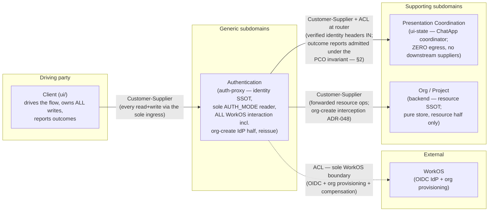
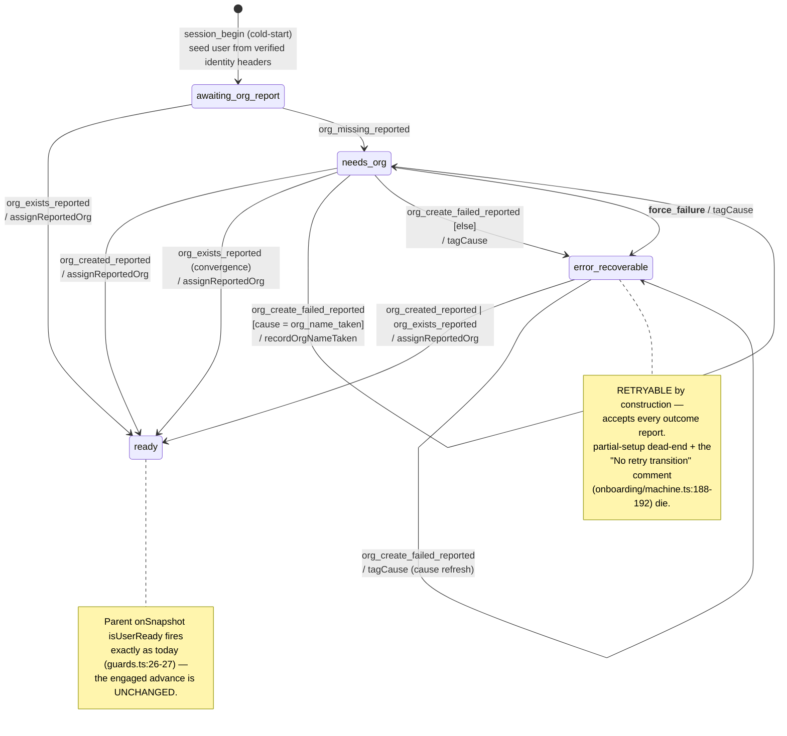
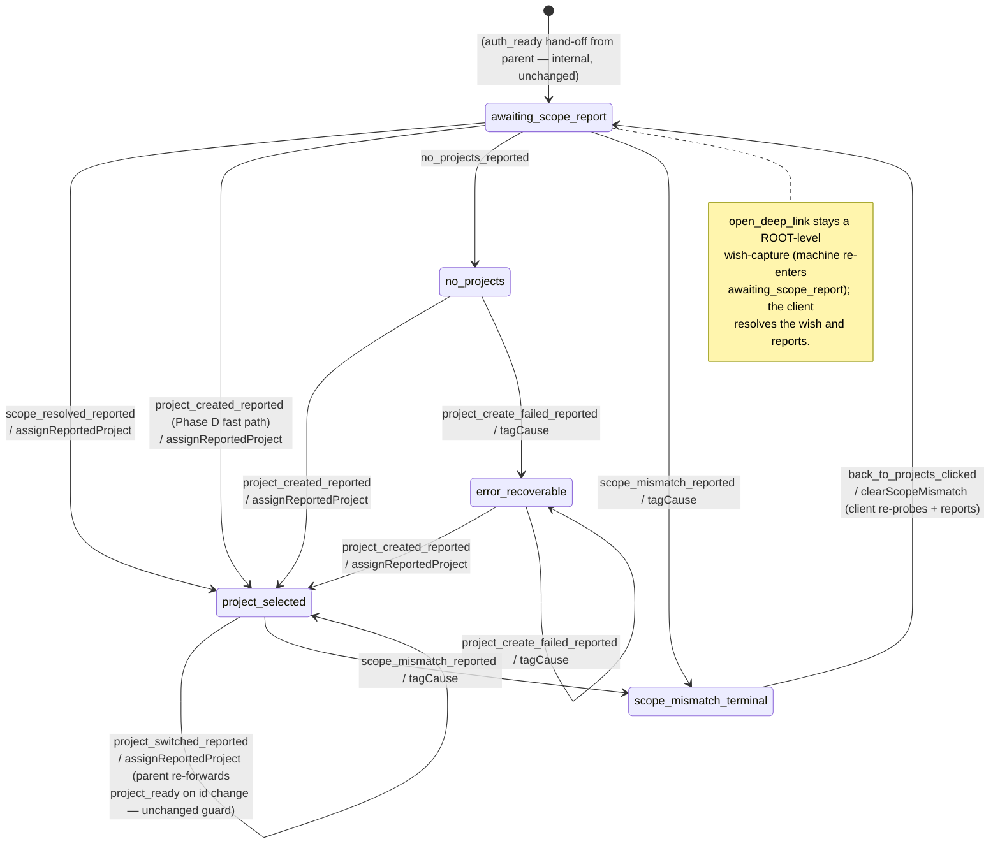

# client-driven-onboarding — Domain Model (domain-scope pass)

**Author:** Hera (nw-ddd-architect)
**Date:** 2026-06-10
**Mode:** Propose (boundary assignments are user-ratified and FIXED — `../design-intent.md` §"Boundary assignments"; options are presented only for genuinely open domain-level points)
**ADR:** ADR-049 (Proposed) — `docs/decisions/adr-049-client-reported-outcome-event-model.md`
**Upstream pass:** system scope — `system-architecture.md` + ADR-048 (binding constraint inherited: *no terminal-in-practice partial-setup states — every failure outcome must be representable as retryable*)
**Downstream pass:** solution architect — exact wire schemas (Zod/TS deltas to `shared/ui-state-wire/`), HTTP contracts (mode discovery, org-id carry, reissue cookie attributes), file-by-file deltas, fixture/acceptance migration list. This document pins the DOMAIN view only: contexts, language, event model, machine state-sets, routing semantics, invariants.

---

## 0. Scope and fixed inputs

The ratified boundary table (design-intent §"Boundary assignments") makes ui-state a **pure presentation-state coordinator**: zero network egress, transitions driven solely by client-reported outcome events over the unchanged ADR-046 `/state` transport. This pass designs what that means at the domain level:

1. the context-map amendment (who owns which half of org creation; what dies),
2. the re-examination of ADR-041's ACL rule under client-reported outcomes (a named invariant),
3. the new ubiquitous language (the outcome-event vocabulary),
4. the onboarding + project-context machine redesign at the event level (no-invokes-with-I/O rule),
5. the elimination of the settled-child event-crash class (an event-routing-semantics decision),
6. the domain-level answer to design-intent open point (f) — the engaged-state flip.

---

## 1. Context-map amendment

### 1.1 What moves, what dies, what stays

| Concern | Before (ADR-041 map, shipped org-onboarding) | After (this feature) |
|---|---|---|
| Org creation — **IdP half** (WorkOS org + membership) | Backend Org/Project context (`create_organization.py:86–120`) | **Authentication context (auth-proxy)** — org-create route interception (ADR-048 D1) |
| Org creation — **resource half** (org row, name uniqueness, `created_by`) | Backend Org/Project context | **Backend Org/Project context (unchanged)** — now its *only* half |
| JWT reissue on org-create | Listed under backend in the brief's context table (the seam was already auth-proxy's, `post-response-reissue.ts`) | **Authentication context** — explicit; emitted as `Set-Cookie` (ADR-048, D8 un-park) |
| ui-state → backend (`POST /api/orgs`, `GET /api/orgs/me`, `/api/projects*`) | Customer-Supplier (ADR-041 D7) — implemented as a direct `${backendUrl}` bypass | **REMOVED.** ui-state has **no downstream suppliers at all** (zero egress, ADR-048 D2/D4) |
| ui-state → WorkOS (`GET /oauth/userinfo` re-verification) | Conformist via re-verification (ADR-041 D3/D7) | **REMOVED** (re-verify invoke retired; see §2.3 residual-risk note) |
| auth-proxy → ui-state | Customer-Supplier + ACL at router | **SURVIVES** — ACL re-scoped by the PCO invariant (§2) |
| Client (ui/) | Passive consumer of projections | **The driving party**: drives the flow, owns ALL writes (catalog write-through pattern), probes, posts, **reports outcomes** to ui-state |

### 1.2 Amended context map



Reading notes (the load-bearing deltas vs. the brief's session-onboarding map):

- **ui-state has no outgoing edges.** It was previously downstream-customer of the backend and conformist to WorkOS; both edges are deleted, not redirected. Its only relationship is the inbound one through auth-proxy.
- **The client appears on the map for the first time** as a first-class driving party. The client→ui-state interface is the ADR-046 **published language** (`ChatAppStateDocument` + the wire-event union in `shared/ui-state-wire/`) over the unchanged `/state` Open-Host surface; this feature changes the *event vocabulary* inside that published language, never the transport.
- **auth-proxy is now the single ACL to WorkOS** for the entire system: OIDC (already), plus the org-provisioning writes relocated by ADR-048. No other context holds WorkOS vocabulary or credentials.
- **Context naming:** `ui-state/` remains ONE bounded context (ADR-039); the brief's table named it by its then-dominant flow ("Session-Onboarding"). With the ChatApp coordinator covering onboarding/project-context/session-chat as internal SRP regions, the context row is renamed **Presentation Coordination** — a description of the whole context, not a new boundary.

### 1.3 ADR-041 supersession map (precise)

| ADR-041 decision | Status under this feature |
|---|---|
| **D1** rename + entry assumes already-authenticated principal | **SURVIVES** |
| **D2** self-contained opening event seeds the projection (identity in at t0, never read back) | **SURVIVES in principle; mechanism amended.** The opening seed remains self-contained, but the verified user profile now arrives from the Authentication context (auth-proxy-verified identity headers at `session_begin` cold-start), not from a ui-state re-verification call. (Ratification point DR-4, §9.) |
| **D3** `workosUserInfo` repurposed as Bearer re-verification | **SUPERSEDED — retired.** ui-state has zero egress; auth-proxy is the only verifier. See §2.3 for the residual-risk note D3 was defending against. |
| **D4** identity from the verified token/headers, never a client body claim | **SURVIVES FOR IDENTITY — narrowed and clarified** by the PCO invariant (§2). Outcome body claims are admitted as presentation-coordination signals; they are never identity and never authorization inputs. |
| **D5** state-set (`verifying`, `needs_org`, `creating_org`, `ready`, `error_recoverable`, `session_rejected`, `[hasOrg]` shortcut) | **AMENDED.** `verifying` → `awaiting_org_report` (no I/O to verify); `creating_org` retired (no server-side write); `error_recoverable` kept and made *actually recoverable*; `session_rejected` retired (its only producer — re-verify failure — is gone). The `[hasOrg]` returning-user shortcut survives as the `org_exists_reported` fast path. §4. |
| **D6** `session_rejected` shape over HTTP 200 | **SUPERSEDED** (state retired with its producer; an unauthenticated request never reaches ui-state — auth-proxy 401s it). |
| **D7** context map: auth-proxy→SO Customer-Supplier+ACL; SO→WorkOS Conformist; (SO→Org/Project Customer-Supplier in the brief's map) | **SUPERSEDED IN PART.** auth-proxy→ui-state Customer-Supplier + ACL **survives** (ACL re-scoped, §2). Both ui-state-downstream edges (WorkOS conformist, backend customer-supplier) **deleted**. |
| **D8** non-security `access_token` projection echo | **RECOMMEND RETIRE** (ratification DR-6): the real org-scoped token now rides `Set-Cookie` on the org-create response (ADR-048 §6); the alg:none echo has no remaining consumer. |
| Aggregate **OnboardSession** (root-only, Vernon ~70% case) | **SURVIVES.** Same invariant boundary (one principal's settled tuple); the org remains a value snapshot referenced by id (rule 3) — now sourced from a client report instead of a backend call. Rule-by-rule re-check in §4.4. |
| ADR-041 OQ1 (is the backend reissue call vestigial?) | **RESOLVED by ADR-048** — reissue is auth-proxy's `Set-Cookie` on the intercepted org-create response; ui-state is uninvolved. |
| ADR-041 OQ2 (dev re-verify fixture placement) | **MOOT** — the re-verify is retired; the fake-WorkOS seam relocates to auth-proxy (`WORKOS_BASE` pin, ADR-048 R4). |

---

## 2. ADR-041 ACL rule re-examination → the PCO invariant

### 2.1 The apparent tension

ADR-041's ACL rule: *"identity from the verified token / verified headers, never a client body claim."* Under the client-reported-outcome model the client now POSTs **body claims about world state** — "an org exists," "org X was created," "the project create failed." Read broadly ("ui-state must not trust any body claim"), the new model violates the rule. Read narrowly ("identity facts must never come from the body"), it doesn't.

### 2.2 Resolution: the narrow reading is the rule; the trust object is re-categorized

The rule was always about **identity** — it closed the `persona_email`-as-DTO gap where a client body claim could *become* the principal's identity in the projection. That rule **survives intact and absolute**: identity (who the principal is, what org claim their token carries) comes only from auth-proxy-verified headers; no outcome event carries or mutates identity.

Outcome events are a different trust category. They are **not facts about resources** and are **not trusted as such** — they are *presentation-coordination signals*: "advance my screen-flow state machine as if this happened." The backend remains the resource SSOT (it authorizes and validates every actual write itself, against verified headers); auth-proxy remains the identity SSOT. Named as an explicit invariant:

> ### INV-PCO — the Presentation-Coordination-Only trust invariant
>
> **ui-state state — the `ChatAppStateDocument`, every region `state`/`context` field, and every client-reported outcome event — may be trusted for PRESENTATION COORDINATION ONLY.**
>
> 1. **Never an authorization input.** No component grants, scopes, or denies anything by reading ui-state. Every privileged operation is authorized per-request by auth-proxy (identity) + backend (resource ownership) from verified headers.
> 2. **Never a resource-existence oracle.** `regions.onboarding.context.org`, `regions.projectContext.context.project`, `active_scope` etc. are **display snapshots** of what the client reported — convenient, usually true, never authoritative. The backend is the only existence oracle.
> 3. **Never identity.** Identity fields are seeded exclusively from verified headers at cold-start (D4 survives); no wire event may write them.
> 4. **Identity-scoped acceptance.** A report is only ever applied to the reporting principal's own actor (`X-User-Id`-keyed registry — ADR-030/040, unchanged), so the maximum blast radius of a false report is the reporter's **own screen**.

### 2.3 What enforcement means at the domain level

The invariant is enforced **by construction**, not by runtime checks:

- **No downstream reader exists.** ui-state has zero egress (ADR-048): there is no call it could make on the strength of a false report. The 2026-06-10 incident class — a machine-internal write acting on machine state — becomes unrepresentable.
- **The backend never reads ui-state.** Every backend write the client performs (org create, project create) is independently authenticated, authorized, and validated at the ingress + backend; the subsequent report to ui-state is *after-the-fact narration*, causally downstream of the real write, never upstream of it.
- **auth-proxy never reads ui-state for minting.** The org-scoped reissue triggers off the **backend's 201** inside the intercepted org-create response (ADR-048) — the resource SSOT's answer, not the presentation tier's.
- **The self-harm property** (the enforcement test): a client that lies (`org_created_reported` with no real org) gets a document saying `ready`, routes itself into the app shell, and then every real API call 404s/403s against the SSOTs. A false report can produce a broken screen for the liar; it can never produce a privilege, a resource, or another principal's state change.
- **The router ACL survives, re-scoped.** The closed onboarding vocabulary (ADR-046 Decision 3; `router.ts:244–253, 440–456`) continues to validate **well-formedness and phase-applicability** — it is shape validation, not truth validation. Truth validation is structurally elsewhere (the SSOTs).
- **Residual risk accepted (replaces ADR-041 D3's defense-in-depth):** D3's re-verify defended against a misconfigured deployment exposing ui-state to the open web. Post-change the exposure surface is presentation state only (the PCO invariant caps the damage at wrong-screen), and the compose topology keeps ui-state reachable only via auth-proxy. Accepted; documented here rather than silently dropped.

---

## 3. Ubiquitous language — client-reported outcome events

### 3.1 Naming family (genuinely contested — options)

| | Option A — `*_reported` suffix | Option B — plain past tense (`org_created`, `org_found`) | Option C — `client_` / `report.` prefix |
|---|---|---|---|
| Example | `org_created_reported` | `org_created` | `client_org_created` |
| Trust posture in the name | **Explicit** — every reader of the machine/wire sees the event is a *claim observed by the client*, not a system fact | Invisible — reads identically to the retired actor-output events (`org_created` was the old server-verified FlowEvent vocabulary: a dangerous homonym across two trust regimes) | Explicit but names the *sender*, not the *speech act*; collides stylistically with nothing in the repo |
| Glossary fit | Pairs with INV-PCO: the suffix IS the invariant's linguistic marker | Shorter | Verbose at every payload site |
| Verdict | ✅ **RECOMMENDED** | ❌ rejected (homonym across trust regimes) | ⚠️ workable, not preferred |

**Recommendation: Option A.** Language divergence is the boundary signal — the same words meaning different things under different trust regimes is precisely the confusion the old vocabulary would re-introduce. The `_reported` suffix encodes "this is a client observation admitted under INV-PCO" into every event name.

### 3.2 The vocabulary (recommended; exact Zod/TS shapes → solution architect)

**Onboarding region** (closed ACL while `phase === "onboarding"`):

| Event | Payload (domain-level) | Meaning |
|---|---|---|
| `session_begin` | `{ force_restart? }` | KEPT (ADR-046 3a). Cold-start; identity seeded from verified headers. |
| `org_exists_reported` | `{ org: { id, name } }` | Client's existence probe (Phase B: `GET /api/orgs/me` through the ingress) answered 200. The returning-user fast path (ADR-041's `[hasOrg]`, reported instead of invoked). |
| `org_missing_reported` | `{}` | The probe answered 404 — the principal needs an org. |
| `org_created_reported` | `{ org: { id, name } }` | Client's `POST /api/orgs` (through auth-proxy, ADR-048 interception) returned 201. |
| `org_create_failed_reported` | `{ cause, org_name }` | The POST failed. `cause = org_name_taken` (409 — re-edit, not retry) vs. `org_create_failed` (5xx/compensated/orphaned — retryable). Exact cause-tag set: solution architect; the domain rule is the **two-way split**: *re-edit causes return to the form; everything else lands in a retryable error state*. |
| `__force_failure__` | `{ tag }` | KEPT (failure-sim side-channel, gate-authorized — `router.ts:467–482`). |

**Project-context region:**

| Event | Payload (domain-level) | Meaning |
|---|---|---|
| `scope_resolved_reported` | `{ project: { id, name }, … }` | Client resolved the initial scope (probed `/api/projects*`) to a project. Replaces the `resolveInitialScope` invoke's happy output. |
| `no_projects_reported` | `{}` | The probe found zero projects. |
| `scope_mismatch_reported` | `{ cause: cross_tenant \| project_not_found \| access_revoked }` | Deep-link / switch target rejected by the backend (403/404 observed by the client). One event covers the old resolve-time AND switch-time mismatch arms. |
| `project_created_reported` | `{ project: { id, name } }` | Client's `POST /api/projects` returned 201 — Phase D's automatic default project, and any later creation. |
| `project_create_failed_reported` | `{ cause }` | The POST failed (retryable). |
| `project_switched_reported` | `{ project: { id, name } }` | Client validated a switch target (`GET /api/projects/:id` 200) and is now on it. |
| `open_deep_link` | (unchanged payload) | KEPT — captures the URL **wish**; the client resolves it and reports the outcome. |
| `back_to_projects_clicked` | `{}` | KEPT — UI intent exiting `scope_mismatch_terminal`; the client re-probes and reports. |

**"default" is client policy, not machine vocabulary** (contested — recorded): the seed's example list says `default_project_created_reported`; this pass recommends the generic `project_created_reported` because the machine cannot tell (and must not care) whether the name was a client-chosen default — "default" is the *client's* Phase-D policy, and the generic name survives the later project-naming feature unchanged. (Ratification DR-3.)

### 3.3 What dies with the invokes (glossary delta)

| Retired | Was | Replaced by |
|---|---|---|
| `loadSession` invoke (`getWorkOSUserInfo` + `getUserOrg`) | `onboarding/setup/actors.ts:121–234`; the `verifying` state's I/O | Identity: verified headers at cold-start. Org existence: `org_exists_reported` / `org_missing_reported`. |
| `createOrg` invoke (`createOrgFn`, incl. the 500-idempotent `/api/orgs/me` reconcile rule) | `actors.ts:264–396`; `creating_org` state | `org_created_reported` / `org_create_failed_reported`. The 409 rule (`actors.ts:279–289`) survives as the `org_name_taken` cause arm; the 500 quirk rule dies (DEV_NO_ORG resolved it upstream — org-onboarding D1). |
| `org_form_submitted` wire event + `isOrgNameValid` guard + `creating_org` | the shipped org-onboarding write trigger (`wire-event.ts:23`) | Nothing — the client posts the backend directly and reports the outcome (§4.1 Option B). Name validation lives where it always truly did: backend (SSOT) + client (UX). |
| `create_project_submitted` / `create_project_clicked` wire events + `projectNameValid` guard + `creating_project` | the shipped Phase-D trigger — including the UI-1 `org_name`-carries-project-name misnomer (`wire-event.ts:25–33`) | `project_created_reported` / `project_create_failed_reported`. The UI-1 quirk dies with the event. |
| `resolveInitialScope` / `createProject` / `switchProject` invokes | `project-context/setup/actors.ts:140–480` | `scope_resolved_reported` / `no_projects_reported` / `scope_mismatch_reported` / `project_created_reported` / `project_switched_reported`. |
| `switching_project_intent` wire event + parent `PROJECT_SWITCH` | the switch *trigger* (`router.ts:565–571`) | `project_switched_reported` / `scope_mismatch_reported` — report-only; the client performs the validation it used to delegate. |
| `retry_clicked` | `error_recoverable → creating_project` re-invoke (`project-context/machine.ts:274–281`) | Retry = the client re-POSTs and re-reports; error states accept outcome reports directly. |
| `session_rejected` state + `user_rejected` parent state + `isUserRejected` guard + `captureUserRejected` | the re-verify failure arm (ADR-041 D6) | Nothing — authentication failure is auth-proxy's 401; it never reaches ui-state. (Ratification DR-5.) |
| WorkOS re-verify (`workosUrl`, `FAKE_WORKOS_URL` seam) | ADR-041 D3 | auth-proxy's per-request verification (ADR-016/043, unchanged); the fake seam relocates to auth-proxy (`WORKOS_BASE`, ADR-048 R4). |
| `partial-setup` cause tag | the terminal-in-practice dead-end (`onboarding/machine.ts:183`) | `org_create_failed` cause in a retryable `error_recoverable` (ADR-048's binding requirement). |
| The wire union's trailing catch-all `{ type: string }` | `wire-event.ts:52` ("forwarded verbatim") | A **closed union** — see §6 (the crash-class decision makes "forward anything to whoever's active" unrepresentable). |

**Glossary additions (Presentation Coordination context):**

| Term | Meaning |
|---|---|
| **Outcome report** | A client-posted event narrating a result the client observed from the SSOTs (`*_reported`). Admitted under INV-PCO: presentation-coordination signal, never a fact. |
| **Existence probe** | The client's sparse read (`GET /api/orgs/me`, `GET /api/projects*`) through the normal ingress, whose answer it reports. |
| **Display snapshot** | An org/project value held in ui-state context purely for rendering; sourced from reports; never authoritative. |
| **Convergence** | The property that a late/duplicate/contradicted report is absorbed without error and the returned document tells the reporter the actual current state (multi-tab safety; §4.3 Spec 8). |
| **INV-PCO** | §2.2 — the presentation-coordination-only trust invariant. |

---

## 4. Onboarding region — redesign at the event level

### 4.1 In-flight states: the one structural option that matters (options + recommendation)

| | Option A — two-step (keep server-visible in-flight states) | Option B — report-only (no in-flight states) — **RECOMMENDED** |
|---|---|---|
| Mechanism | Client tells ui-state "submitting" (machine → `creating_org`-like state), POSTs the backend, then reports the outcome | Client keeps in-flight UI local (optimistic — the catalog write-through pattern), and posts **only outcomes**; the machine transitions `needs_org → ready` (or error) directly |
| Document shows in-flight | Yes (other tabs see a spinner state via SSE) | No (other tabs see `needs_org` until the outcome report) |
| Dangling-state risk | **Structural.** Under the no-I/O rule an in-flight state has no actor to exit it — only the client can. A client that dies mid-flow strands the server in `creating_org` forever (a new dead-end class, the very thing ADR-048 forbids) | **None.** Every state is either stable-awaiting-a-report or settled; nothing the server holds can dangle |
| Event count | +2 events, +1 round-trip per write | Minimal |
| Philosophy fit | Splits write philosophy again (design-intent Why #4) | One write philosophy: optimistic client, after-the-fact narration |

**Recommendation: B.** The no-egress rule converts every in-flight server state from "an invoke in progress" into "a promise only the client can keep" — a standing liability with no compensating consumer (the in-flight render is local to the tab performing the write anyway). This is also why `org_form_submitted` / `create_project_submitted` retire rather than being repurposed.

### 4.2 Statechart



State-set delta vs. shipped (`onboarding/machine.ts:98–193`): `verifying` → **`awaiting_org_report`** (no invoke; nothing to verify — the wait is for the client's probe report); `creating_org` **retired**; `error_recoverable` **kept by name** (deliberately — the auth-proxy KPI sniffer pins `state ∈ {ready, error_recoverable}`; the name finally becomes true) and gains exit transitions; `session_rejected` **retired** (DR-5); `ready` unchanged.

**Report acceptance is deliberately wide** (every pre-`ready` state accepts every outcome report): multi-tab and crash-recovery flows converge instead of wedging. `ready` accepts none — late reports are ignored and answered with the current document (Spec 8).

### 4.3 Given/When/Then specs (key paths)

```gherkin
Spec 1 — existence probe, returning user (Phase B fast path; was [hasOrg])
  Given a cold-started actor in onboarding.awaiting_org_report
    And context.user seeded from verified identity headers
  When org_exists_reported { org: {id: "org-1", name: "Acme"} }
  Then onboarding settles in ready with org display snapshot {org-1, Acme}
    And the parent advances login → engaged (isUserReady, unchanged)
    And the document shows phase=project_context

Spec 2 — existence probe, new user (Phase B)
  Given onboarding.awaiting_org_report
  When org_missing_reported {}
  Then onboarding settles in needs_org and the document shows phase=onboarding
    (the client routes to the OnboardingRoute)

Spec 3 — org create success (Phase C)
  Given onboarding.needs_org
  When org_created_reported { org: {id: "org-1", name: "Acme"} }
  Then onboarding settles in ready; parent advances to engaged
    (the real write + WorkOS provisioning + Set-Cookie reissue already
     happened upstream at auth-proxy/backend — ADR-048; this event is narration)

Spec 4 — name taken (409; re-edit, not retry)
  Given onboarding.needs_org
  When org_create_failed_reported { cause: org_name_taken, org_name: "Acme" }
  Then onboarding REMAINS in needs_org
    And org_validation_error records the taken name (inline form error)
    And no error screen is shown (mirrors today's 409 → needs_org arm)

Spec 5 — orphan/partial outcome is retryable (ADR-048 inheritance)
  Given onboarding.needs_org
  When org_create_failed_reported { cause: org_create_failed }
  Then onboarding settles in error_recoverable carrying the cause
  When the user resubmits, the client re-POSTs /api/orgs (clean after a
       compensated failure; still succeeding after an uncompensated one —
       ADR-048 §3) and posts org_created_reported
  Then onboarding settles in ready — error_recoverable is NOT a dead end

Spec 6 — identity is never event-writable (INV-PCO / D4)
  Given any onboarding state
  When any outcome report carries user-identity-shaped payload fields
  Then the machine's actions never write context.user from an event
    (identity fields have exactly one writer: the verified-header seed at
     session_begin cold-start)
```

### 4.4 Aggregate re-check — OnboardSession (Vernon rules)

| Rule | Holds? |
|---|---|
| 1 — true invariants inside the boundary | ✅ unchanged: one principal's settled `(user, org display, state)` tuple; one transaction = one synchronous transition. |
| 2 — small | ✅ still root-only; the state-set *shrinks* (two states retired). |
| 3 — reference by id | ✅ strengthened: the Org is no longer even *fetched* by this context — it is a reported value snapshot `{id, name}`; the real Org aggregate lives wholly in the backend context. |
| 4 — eventual consistency outside | ✅ the parent `onSnapshot` hand-off remains the cross-region signal; client↔ui-state convergence (late reports absorbed) is the new eventual-consistency edge, made explicit in Spec 8. |

---

## 5. Project-context region — redesign + the engaged-state flip (open point f)

### 5.1 Statechart



Delta vs. shipped (`project-context/machine.ts:126–282`): `resolving_initial_scope` (invoke) → **`awaiting_scope_report`**; `creating_project` + `switching_project` (invokes) **retired**; `scope_mismatch_terminal`, `no_projects`, `project_selected`, `error_recoverable` survive by name; `retry_clicked` retired (error state accepts reports directly). The last-used-resolution policy embedded in `resolveInitialScopeFn` (`actors.ts:229–331`) becomes **client-side policy** — the machine only ever learns the resolved answer; the `most_recent_session_per_project` / degraded-probe context fields follow the client (display data per INV-PCO; exact context-field pruning → solution architect).

**Phase D is two client actions, one region transition.** After Spec 3 the parent is in `engaged.project_context` with the child in `awaiting_scope_report` (or `no_projects` if the client probed first). The client AUTOMATICALLY POSTs the default project (no user input) and reports `project_created_reported` — accepted from both states (the fast path keeps the auto-step a single report regardless of whether the client bothered probing an obviously-empty org).

### 5.2 The engaged-state flip (open point f — domain-level answer)

**The flip contract does not change shape; only the producer of the child state changes.** Today the chat-app parent advances `engaged.project_context → engaged.chat` when its `onSnapshot` watcher sees the project-context child in `project_selected` with no project yet forwarded (`isInitialProjectSelected`, `chat-app/setup/guards.ts:36–38`), then forwards the `project_ready` hand-off to session-chat. That machinery is **reused verbatim**: under the new design the child enters `project_selected` because the client reported `project_created_reported` / `scope_resolved_reported` instead of because an invoke resolved — the parent cannot tell the difference and must not.

So, domain-level:

- **What the client posts:** `project_created_reported { project }` (Phase D) — the final outcome report of onboarding.
- **What flips chat-app to engaged-chat:** the same parent-observed child state `project_selected` via the unchanged `isInitialProjectSelected` guard.
- **What the client observes as "enter the app":** the document returned by that very POST (the `/state/events` response is always the new settled document — ADR-046 Decision 3): `phase === "chat"`, `regions.projectContext.state === "project_selected"`, `active_scope.project_id` set. The client routes into the app shell on that document — no extra read, no race.
- **What the solution architect pins:** the exact wire shape of that response assertion set (which fields the FE gate dispatches on) and the acceptance-suite migration from today's `project_selected`-after-`create_project_submitted` assertion.

### 5.3 Given/When/Then specs

```gherkin
Spec 7 — Phase D: automatic default project completes onboarding
  Given the parent in engaged.project_context
    And projectContext in awaiting_scope_report (org just created, Spec 3)
  When the client POSTs the default project to the backend (auto, no user input)
    And posts project_created_reported { project: {id: "proj-1", name: <default>} }
  Then projectContext settles in project_selected
    And the parent advances engaged.project_context → engaged.chat
        (isInitialProjectSelected — unchanged) and forwards project_ready
    And the POST's response document shows phase=chat, active_scope.project_id=proj-1
    And the client enters the app shell on that document

Spec 7b — Phase D failure is retryable
  Given projectContext in no_projects (or awaiting_scope_report)
  When project_create_failed_reported { cause: transient }
  Then projectContext settles in error_recoverable (cause carried)
  When the client re-POSTs and posts project_created_reported
  Then projectContext settles in project_selected — no dead end, no retry_clicked
```

---

## 6. The settled-child event-crash class — made unrepresentable

### 6.1 The mechanism, in the live code

The crash is a four-step chain:

1. `POST /state/events` forwards every non-`session_begin` event into the actor: `forwardToActor(actor, evType, evPayload)` → `actor.send({ type: "child_event", child_event: {…} })`, with **no error observer** on the actor (`router.ts:484`, `:560–573`).
2. The parent handles `child_event` at the **machine root** — active in *every* state (`chat-app/machine.ts:72–75`).
3. The handler forwards blindly to whatever `context.active_child_id` names: `enqueue.sendTo(context.active_child_id, …)` (`chat-app/setup/actions.ts:153–168`). `sendTo` resolves its string target through `snapshot.children[id]` (`setup/types.ts:51–54`).
4. Invoked children are **phase-scoped**: the onboarding child is stopped and leaves `snapshot.children` the moment the parent exits `login` (documented at `setup/types.ts:81–95`). But `active_child_id` is only re-pointed by the *next* phase's entry action — and `user_rejected` has none (`machine.ts:147`); it inherits `"onboarding"` from `markLoginActive` (`machine.ts:43`).

**The reachable crash:** parent in `user_rejected` → any posted event (phase `"rejected"` skips the onboarding ACL, `router.ts:443`) → root `child_event` → `sendTo("onboarding")` → XState v5 cannot resolve the stopped child among `snapshot.children` and **throws inside the actor's event processing**; with no error subscriber on the bare `actor.send`, XState re-raises the error as an unhandled exception outside the Hono handler's scope — the ui-state **process dies** (the design-intent §Why #3 incident). The same shape is one re-pointing bug away in any future phase change: the class is "a total forward into a possibly-absent child," not the one instance.

(The sibling defect — `partial-setup` terminal-in-practice — is the quiet variant of the same gap: `error_recoverable` has no transitions (`onboarding/machine.ts:188–192`), and the phase-ACL admits only events it doesn't handle, so the flow wedges without crashing. §4 already kills it with report-accepting error states.)

### 6.2 Options + recommendation (event-routing semantics — a domain decision)

| | Option 1 — phase-gated vocabulary routing | Option 2 — regions never stop | Option 3 — guard the forwarder |
|---|---|---|---|
| Mechanism | Delete the root-level total forward. Define event acceptance **only on the states whose invoked child is alive**, routed **by region vocabulary**: `login.on` accepts the onboarding reports → `sendTo("onboarding")` (the invoke lives on `login` — target alive by construction); `engaged.on` accepts the project-context vocabulary → `sendTo("project-context")` (invoked on the `engaged` ancestor — alive in both substates, `machine.ts:104–128`, which is exactly why switch reports keep working from chat); `engaged.chat.on` accepts the session vocabulary. An event with no handler in the current state is **dropped by XState semantics** — no `sendTo` executes, no throw is representable. `active_child_id` (the crash's load-bearing mutable pointer) is deleted. | Re-shape the parent so children are invoked at the root for the actor's lifetime (or parallel regions), so no `sendTo` target ever disappears | Keep the total forward; have the forwarder check `snapshot.children[active_child_id]` before `sendTo`, drop/log otherwise |
| Crash class | **Unrepresentable** — illegal sends have no syntax | Unrepresentable, differently | Still representable, merely caught; every future forwarder must remember the check |
| Fit with ADR-044 | Honors it: phase-scoped invokes, `onSnapshot` advances, `onboarding_result` retention all unchanged | Contradicts ADR-044's phase-scoped design + the retention machinery built *because* children stop; largest refactor; keeps dead children resident | No structural change |
| Side benefit | The wire union becomes **closed** (the `{type: string}` catch-all at `wire-event.ts:52` retires): vocabulary→region routing requires naming the vocabulary, which resolves ADR-046's "unmodeled-event silence" open question for free (unknown types can be rejected at the edge; known-but-out-of-phase types converge per Spec 8) | — | — |
| Verdict | ✅ **RECOMMENDED** | ❌ rejected (re-litigates ADR-044 for no additional safety) | ⚠️ acceptable as a belt-and-braces *addition*, insufficient alone |

**Recommendation: Option 1** (with Option 3's check acceptable as defense-in-depth inside any forwarder that survives, e.g. the `project_ready` hand-off). The statechart becomes the routing table: an event is deliverable exactly where its target provably exists, and "send to a stopped child" stops being a runtime hazard and becomes a syntax that does not occur in the machine. Retiring `user_rejected` (DR-5) additionally removes the one state where the stale pointer was reachable today — but the decision stands on the class, not the instance.

```gherkin
Spec 8 — late/duplicate reports converge instead of crashing (the regression spec)
  Given the parent in engaged (onboarding child stopped)
  When a stale tab posts org_created_reported (or any onboarding-vocabulary event)
  Then NO transition occurs and NO send is attempted (no handler in engaged)
    And the response is the current document (phase=project_context|chat)
    And the ui-state process is alive
    (Today: sendTo into the stopped child — process crash in the user_rejected
     case; silent wedge otherwise.)
```

---

## 7. Reuse Analysis (hard gate)

| Existing component | File (verified) | Decision | Justification / fallout note |
|---|---|---|---|
| ChatApp parent machine | `ui-state/lib/machines/chat-app/machine.ts` | **EXTEND** | Lifecycle shape, invokes, `onSnapshot` guards (`isUserReady`, `isInitialProjectSelected`, `shouldSwitchProject`), hand-off capture/forward (`auth_ready`, `project_ready`) all reused. REPLACED inside it: root `on.child_event`/`user_intent` total forward → phase-gated vocabulary routing (§6); `active_child_id` deleted; `user_rejected` + `isUserRejected` + `captureUserRejected` retired (DR-5). |
| `/state` transport (router, registry, settle/persist, SSE, bookkeeping) | `chat-app/router.ts` | **REUSE (surface unchanged)** | ADR-046 transport explicitly out of scope. The phase-dispatched ACL schema (`router.ts:244–253`) is EXTENDED to the new closed vocabulary; `forwardToActor`'s `switching_project_intent → PROJECT_SWITCH` special case retires with the event. |
| Onboarding machine | `onboarding/machine.ts` | **EXTEND (realign)** | State-set per §4.2; actions `assignVerifiedUser`/`assignResolvedOrg`/`recordOrgNameTaken`/`tagCause` reused with new event sources; `assignVerifiedUser`'s source becomes the header seed. |
| Onboarding egress actors | `onboarding/setup/actors.ts` (`loadSession`, `getWorkOSUserInfo`, `getUserOrg`, `createOrg`/`createOrgFn`, `Config{workosUrl, backendUrl, devUserHeadersFixture}`) | **RETIRE** | The fixed boundary (zero egress). Fixture fallout: every test injecting a mock `fetch` as `deps.request_client`, the `__force_failure__`-adjacent error-path tests built on invoke rejection, and the org-onboarding acceptance suite's `org_form_submitted`-driven scenarios — exact file list: solution architect. |
| Project-context machine | `project-context/machine.ts` | **EXTEND (realign)** | State-set per §5.1; `tagCause`/`assignResolvedScope`-family actions reused with reported payloads. |
| Project-context egress actors | `project-context/setup/actors.ts` (`resolveInitialScopeFn` incl. last-used policy, `createProjectFn`, `switchProjectFn`) | **RETIRE** | Last-used resolution + deep-link 403/404 discrimination become client-side policy (the client already owns catalog reads — memory: backend-catalog-integration). |
| Session-chat egress actors | `session-chat/setup/actors.ts` | **RETIRE (egress), vocabulary follow-on** | ADR-048 removes `BACKEND_URL` tier-wide, so session-chat's I/O retires in this feature too; its reported-outcome vocabulary follows this ADR's pattern mechanically (list/resume reports) and is pinned by the solution architect (ratification DR-8). |
| `shared/ui-state-wire/wire-event.ts` | `wire-event.ts:19–52` | **EXTEND → closed union** | New `*_reported` members; retire `org_form_submitted`, `create_project_submitted` (+ UI-1 quirk), `switching_project_intent`, the trailing catch-all. Exact Zod/TS: solution architect. |
| `shared/ui-state-wire/state-document.ts` | `state-document.ts` | **REUSE (shape unchanged)** | Document/regions shape untouched; region `state` string sets change per §4/§5 (FE + acceptance dispatch sites: solution architect). `error_recoverable` and `ready` names preserved deliberately for the auth-proxy KPI sniffer literals. |
| Settled-store / hybrid persistence + ADR-042 inheritance | `chat-app/snapshot.ts`, `persistence/*` | **REUSE (unchanged)** | Synchronous reported transitions make the no-ES posture *more* right, not less (still no temporal requirement). |
| org-onboarding acceptance suite + `ui/` onboarding route | `tests/acceptance/org-onboarding/`, `ui/app/routes/onboarding.tsx` | **REWORK (sequenced)** | Shipped 2026-06-10; its write path is what this feature replaces (design-intent §Relationship). Migration plan: solution architect. |
| ADR-041 D8 `access_token` echo (`mintAccessTokenForReady`) | onboarding projection convenience | **RETIRE (recommended, DR-6)** | Superseded by the real `Set-Cookie` reissue (ADR-048 §6); no remaining consumer identified. |

**Zero unjustified CREATE NEW.** The genuinely new domain artifacts are the `*_reported` vocabulary and two renamed waiting states; everything else is extension, realignment, or retirement of what exists.

---

## 8. Event-model trade-off note (ES/CQRS posture — confirmed unchanged)

The client-reported model is *not* event sourcing and must not drift toward it: reports are commands-to-coordinate, the live actor + settled snapshot remain the state-of-record (ADR-044 hybrid / ADR-042 inheritance), and the bookkeeping log stays demoted to SSE/audit substrate. No written audit or temporal requirement has appeared; if one ever does, it belongs on the **SSOT sides** (backend resources, auth-proxy KPI events — ADR-048 §5 already gives org-create a structured trail), not on the presentation tier.

---

## 9. Decisions needing user ratification

| # | Question | Recommendation |
|---|---|---|
| **DR-1** | In-flight states: report-only (Option B, §4.1 — `org_form_submitted`/`create_project_submitted` retire) vs. two-step with server-visible in-flight states (Option A)? | **B.** In-flight server states under the no-I/O rule are danglable promises only the client can keep — a new dead-end class; the catalog write-through philosophy keeps in-flight local. |
| **DR-2** | Naming family for outcome events (§3.1): `*_reported` vs. plain past tense vs. `client_` prefix? | **`*_reported`.** The suffix is INV-PCO's linguistic marker; plain past tense is a dangerous homonym with the retired server-verified vocabulary. |
| **DR-3** | `project_created_reported` (generic) vs. `default_project_created_reported` (flow-explicit) for Phase D? | **Generic.** "Default" is client policy invisible to the machine; the generic name survives the later project-naming feature unchanged. |
| **DR-4** | Source of the user profile (email/display_name/first_name) after the re-verify retires: (i) auth-proxy-verified identity headers seeded at cold-start, (ii) drop the profile from the document and let the client fetch its own profile, (iii) client-reported profile? | **(i).** Preserves D2's self-contained seed and D4's identity rule with zero new trust surface ((iii) is rejected outright — identity from a body claim is the exact gap D4 closed). Exact header set: solution architect. |
| **DR-5** | Retire `session_rejected` (onboarding) + `user_rejected` (parent) + `isUserRejected`/`captureUserRejected`, since their only producer (the re-verify) is gone? | **Yes.** Authentication failure is auth-proxy's 401 and never reaches ui-state; keeping an unreachable rejection arm preserves the exact stale-pointer window §6 closes. |
| **DR-6** | Retire ADR-041 D8's non-security `access_token` projection echo? | **Yes.** The real org-scoped token now rides `Set-Cookie` on the org-create response (ADR-048); the alg:none echo has no consumer left. Verify no harness reads it at DISTILL. |
| **DR-7** | Crash-class elimination: phase-gated vocabulary routing + closed wire union (Option 1, §6.2) vs. never-stopping regions (2) vs. guarded forwarder (3)? | **Option 1** (3 acceptable as added defense inside surviving forwarders). Makes the invalid send unrepresentable and resolves ADR-046's unmodeled-event-silence question as a side effect. |
| **DR-8** | Session-chat egress retirement: define its reported-outcome vocabulary in this feature (ADR-048's env table already deletes `BACKEND_URL` tier-wide) or sequence as an immediate follow-on slice? | **Same feature, solution-architect-pinned vocabulary** following this ADR's pattern — shipping the env deletion with a still-egressing session-chat machine is not buildable; the vocabulary is mechanical (`session_list_reported`, `session_resumed_reported`, …). |

---

## References

- Seed (fixed): `docs/feature/client-driven-onboarding/design-intent.md`
- System pass: `docs/feature/client-driven-onboarding/design/system-architecture.md`; ADR-048
- ADRs: 016 (sole ingress), 028 (parent-ignorant children), 030 (single replica, flow identity), 039 (one bounded context), 040 (identity-derived addressing), 041 (superseded-in-part — §1.3 map), 042 (store inheritance), 043 (token lifecycle out of ui-state), 044 (ChatApp coordinator), 046 (StateProxy `/state` surface), 048 (auth-proxy WorkOS write workflow)
- Shipped baseline: `docs/feature/org-onboarding/design/delta-and-decisions.md` (§2 region flow this reworks)
- Live code (verified): `ui-state/lib/machines/onboarding/{machine.ts, setup/actors.ts}`, `ui-state/lib/machines/project-context/{machine.ts, setup/actors.ts}`, `ui-state/lib/machines/chat-app/{machine.ts, router.ts, setup/{actions,guards,types}.ts}`, `shared/ui-state-wire/{wire-event.ts, state-document.ts}`
