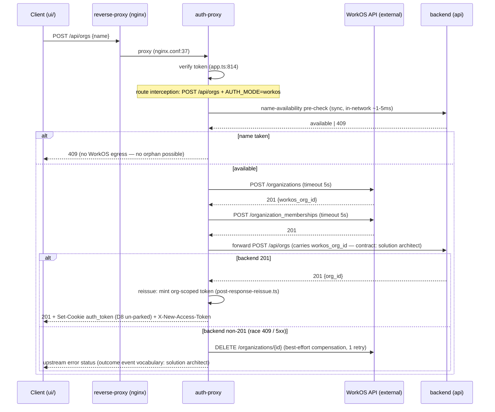
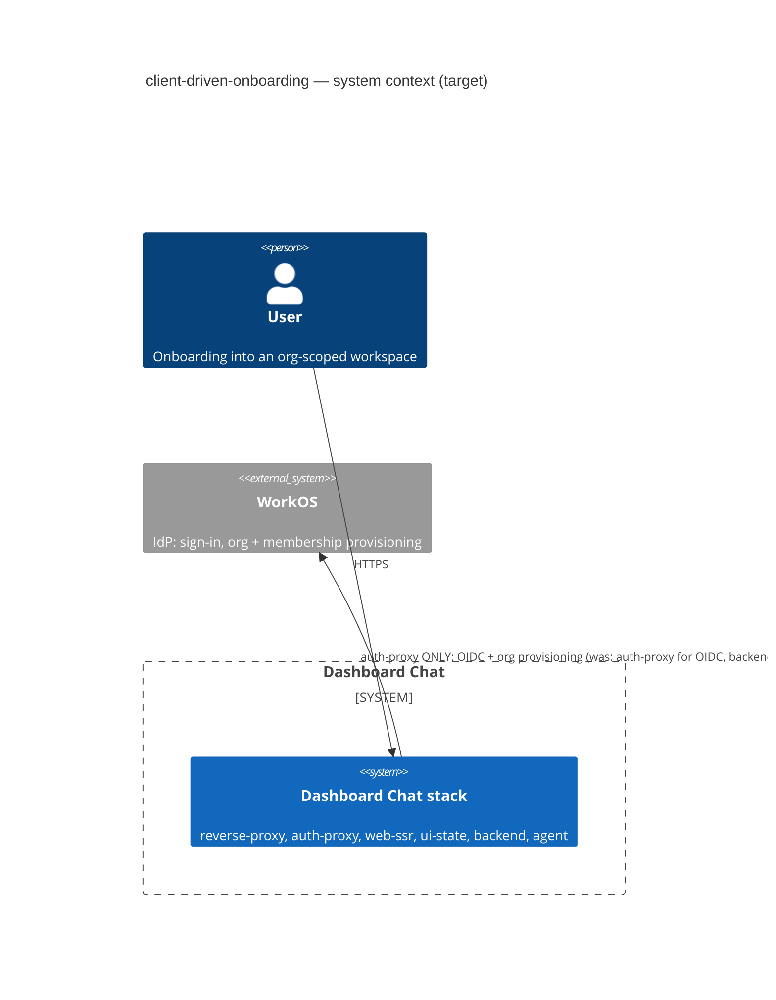
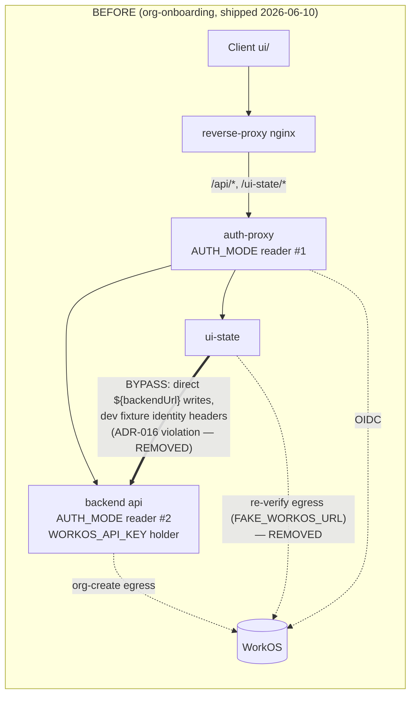
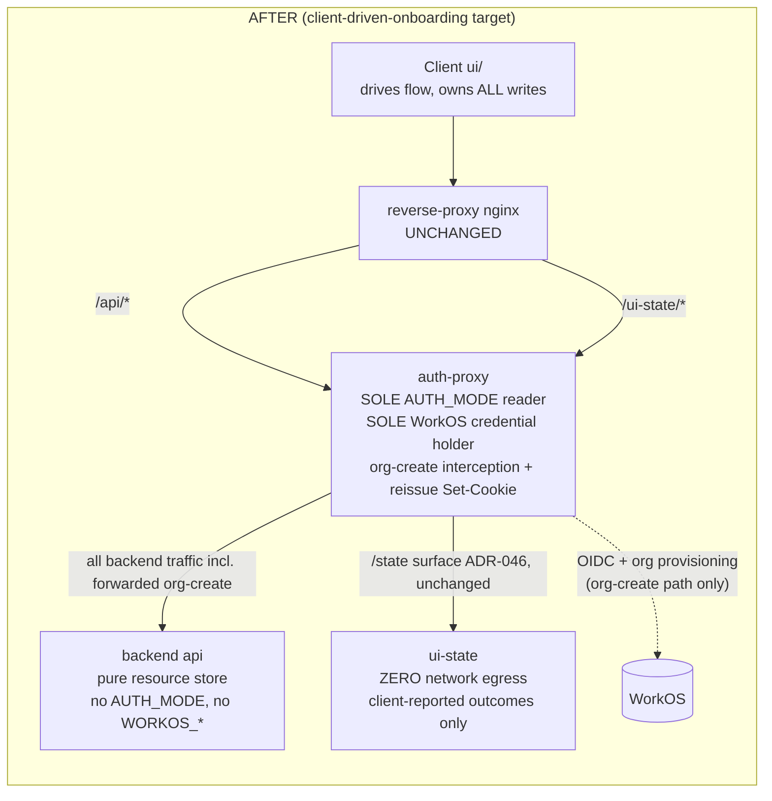

# client-driven-onboarding — System Architecture (system-scope pass)

**Author:** Titan (nw-system-designer)
**Date:** 2026-06-10
**Mode:** Propose (boundary assignments are user-ratified and FIXED — `../design-intent.md` §"Boundary assignments"; this pass designs the system-level consequences, not the boundaries)
**ADR:** ADR-048 (Proposed) — `docs/decisions/adr-048-auth-proxy-owns-workos-write-workflow.md`
**Downstream passes:** domain events → ddd-architect; client→ui-state outcome-event contracts, org-id carry mechanism, mode-discovery endpoint shape → solution-architect. This document pins the SYSTEM view only.

---

## 0. Scope and capacity estimation (numbers before architecture)

The path being redesigned is **org creation** — a once-per-tenant write.

| Quantity | Estimate | Basis |
|---|---|---|
| Org-create frequency | ≤100/day even under aggressive growth → **~0.001 QPS**, burst ≤1/min | One org per tenant, ever. The lowest-traffic write path in the system. |
| WorkOS egress per org-create | **2 sequential HTTPS calls** (create org + create membership), +1 conditional (compensation delete) | Same two calls the backend makes today (`backend/app/use_cases/organization/create_organization.py:100–115`) |
| Added latency on org-create POST | **+300–600 ms p50, ~2 s p99** (internet RTT + TLS + WorkOS processing, ×2 calls) | Public-API latency class (~150–300 ms/call). **Relocation, not addition** — the backend pays exactly this today; the user-visible total is unchanged. |
| Timeout budget | 5 s per WorkOS call (`AbortSignal.timeout`); worst-case org-create POST bounded at ~12 s incl. backend forward | Node `fetch` has **no default timeout** — an unset timeout would hang the sole ingress's event loop request slot indefinitely. Must be explicit. |
| Auth-proxy added load | Negligible: 2–3 outbound calls per org-create at 0.001 QPS | No capacity implication; no replica change warranted. |

**Conclusion of estimation:** this is a *correctness and blast-radius* redesign, not a throughput one. No component is added for scale; every delta below is justified by a defect class observed on 2026-06-10 (AUTH_MODE split-brain → 502 → terminal `partial-setup`; see design-intent §Why).

---

## 1. The auth-proxy WorkOS write-workflow — system view

Today the **backend** holds the WorkOS egress: `create_organization.py:72–77` dispatches on `settings.auth_mode` and `_create_workos_org` (`:86–120`) POSTs to WorkOS with `settings.workos_api_key`. This is the backend's ONLY `auth_mode` read and its only WorkOS credential use (verified by grep over `backend/app/**`).

Target: **auth-proxy intercepts `POST /api/orgs` in its catch-all proxy path** (`auth-proxy/app.ts:785–826`), and in workos mode performs the WorkOS org-create + membership-create *before* forwarding the request to the backend. Dev mode forwards straight through. The backend becomes a pure resource store (local row + name uniqueness + `created_by` stamp).

**Latency/timeout/availability posture:**

- **Latency:** org-create POST carries +300–600 ms p50 of WorkOS egress in workos mode (unchanged total vs. today — relocated from backend). The pre-check adds ~1–5 ms in-network. Acceptable without reservation for a once-per-tenant interactive operation; no async/queue machinery is justified at 0.001 QPS.
- **Timeouts:** every WorkOS call wrapped in `AbortSignal.timeout(5000)`. **No automatic retry on the org create** (WorkOS org-create is not idempotent — a blind retry can mint a duplicate IdP org). One retry on the membership call for network-class failures only, treating "already a member" responses as success (idempotent by semantics). Compensation delete: one retry.
- **Availability:** org-create availability = `auth-proxy ∧ backend ∧ WorkOS` in workos mode — the **same external dependency set as today, relocated**. WorkOS unreachability degrades org-create only; sign-in (`/api/auth/callback`) was already WorkOS-dependent in workos mode; every other proxied route is untouched (the interception is path+method+status guarded, zero overhead off-path — same pattern as the existing reissue guard at `app.ts:846–848`).
- **Event-loop safety:** auth-proxy is the sole ingress; the interception is async I/O (no blocking), and at ≤1/min cannot meaningfully occupy connection slots. No worker isolation needed.

---

## 2. Failure / compensation strategy (PROPOSE — options + recommendation)

The partial-failure window is the two-store write: WorkOS org (IdP) + backend org row (app DB), where **the WorkOS-assigned id is the local org id** (design-intent open point (b) — id-carry contract belongs to the solution architect; the *ordering* consequence is system-scope: WorkOS must be called first in workos mode because it mints the id).

| | Option A — backend pre-check, then WorkOS, then forward | Option B — WorkOS first, compensate (delete) on failed persist | Option C — accept-and-reconcile |
|---|---|---|---|
| Mechanism | Auth-proxy asks the backend whether the name is available BEFORE any WorkOS egress; only then creates the IdP org and forwards | No pre-check; on backend non-201 the auth-proxy DELETEs the just-created WorkOS org | No pre-check, no compensation; a periodic job diffs IdP orgs against app-DB orgs and deletes orphans |
| 409 orphan window | **Closed for the dominant case.** A name-taken 409 is detected before WorkOS is touched. Residual TOCTOU race (name taken between pre-check and persist) remains; DB unique constraint is the backstop (`create_organization.py:46–49`) | **Open on every 409.** Every name collision creates-then-deletes an IdP org — 2 wasted WorkOS writes per user typo, and the delete itself can fail | Open; orphans persist until the next reconcile run |
| Persist-failure (5xx) orphan window | Open (pre-check can't see future 5xx) — needs B as a second layer | Covered (that's its purpose) | Covered eventually |
| Compensation-failure residue | n/a alone | Orphaned IdP org; needs a durable signal | Reconciler is a NEW scheduled component + WorkOS list-API dependency for a ~0.001 QPS path — over-engineering |
| Cost | +1 in-network round-trip (~1–5 ms) + one small backend read affordance (contract: solution architect) | +1 WorkOS call on the failure path only | A new component class (scheduler) for the rarest failure mode in the system |

**Recommendation: A + B layered (pre-check first, best-effort compensation second), C rejected.**

- **Layer 1 (A):** the pre-check eliminates the *common* orphan cause — name collisions are user-input-driven and expected; 5xx persist failures are rare. A 409 must never cost a WorkOS write.
- **Layer 2 (B):** on backend non-201 after a successful WorkOS create, issue a best-effort `DELETE /organizations/{id}` (5 s timeout, 1 retry). If the compensation itself fails, emit the structured `workos.org_compensate.fail` event carrying the orphan `workos_org_id` (§4) — that event IS the reconcile queue (operator-driven, no scheduled component). An orphaned IdP org with no app-DB row is inert: nothing resolves to it, no backend resource is scoped to it.
- **Idempotency/retry posture (system level):** the client's retry unit is *re-submitting the org form*. After a compensated failure, retry is clean (no IdP residue). After an *uncompensated* failure (compensation also failed), a retry creates a second WorkOS org — WorkOS does not enforce org-name uniqueness (ASSUMPTION — validate against the WorkOS API during DELIVER; if false, orphans are NOT inert and compensation must become mandatory-blocking rather than best-effort), so the retry succeeds and the orphan stays inert + logged. No `Idempotency-Key` machinery is warranted at this traffic level (it would be a new component justified by no observed failure mode; ADR-046 already tracks idempotency on the `/state` event surface as a separate open question). The exact client→ui-state outcome events for 409 / orphaned / retryable states are the **solution architect's** deliverable (design-intent open points (c)+(e)); the machine-level requirement inherited from this pass: **no terminal-in-practice `partial-setup` states — every failure outcome must be representable as retryable.**

---

## 3. Reverse-proxy routing — verdict: **zero nginx changes**

Read against `frontend/nginx.conf` (the reverse-proxy image's config):

1. **Mode discovery:** any endpoint under `/api/auth/*` is already served by auth-proxy locally — nginx routes `location /api/` → `auth-proxy:3000` (`nginx.conf:37–42`), and auth-proxy registers its `/api/auth/*` routes before the catch-all proxy (`app.ts:107`, `:152`, `:283`). Whether the contract lands as `GET /api/auth/config → {mode}` or folds mode into the `/api/auth/login` response (solution architect's call, design-intent open point (d)), **no nginx change is needed** — both shapes live under the already-routed prefix.
2. **Login flow:** `GET /api/auth/login` and `POST /api/auth/callback` already reach auth-proxy through the same `location /api/` rule. The "forward the client to auth-proxy first" phrasing in the target flow is **already the deployed topology**: the SSR shell comes from `web-ssr` via the catch-all (`nginx.conf:12–20`), and every API call the client then makes hits auth-proxy.
3. **Org-create:** `POST /api/orgs` rides the same `location /api/` rule into auth-proxy's catch-all, where the interception lives. No new location block.
4. Load-bearing rules preserved untouched: `/api/channels/:id/presentation-state` regex → auth-proxy (`nginx.conf:27–34`, ADR-015), `/ui-state/` (`:50–57`), `/worker/` (`:64–75`).

---

## 4. Credential-surface change — env-var deltas per container

Auth-proxy becomes the **sole holder of WorkOS credentials and the sole AUTH_MODE reader on the org/onboarding path**. Verified consumer inventory: backend's only `auth_mode` read is `create_organization.py:72`; its only WorkOS-credential use is `_create_workos_org`; `WORKOS_CLIENT_ID`/`WORKOS_REDIRECT_URI` are read nowhere in `backend/app/**` outside `config.py:80–81` (dead config). ui-state never reads `AUTH_MODE` in code (comments only) but holds `BACKEND_URL` + `FAKE_WORKOS_URL` egress config.

| Container | REMOVE | ADD | KEEP (relevant) |
|---|---|---|---|
| `api` (compose `docker-compose.yml:269–301`) | `AUTH_MODE` (:274), `WORKOS_API_KEY` (:276), `WORKOS_CLIENT_ID` (:277), `WORKOS_REDIRECT_URI` (:278) | — | `TRUST_PROXY_HEADERS`, `DEV_NO_ORG` (org-onboarding D1), `AUTO_PROVISION_ORG` (separate flag, out of scope) |
| `api-full` (:313–357) | same four (:323–326) | — | — |
| `backend/app/config.py` | `auth_mode` (:76), `workos_api_key` (:78), `workos_api_url` (:79), `workos_client_id` (:80), `workos_redirect_uri` (:81) | — | `dev_no_org`, `trust_proxy_headers` |
| `docker-compose.override.yml` api block | the `AUTH_MODE: dev` pin (:36–37) — **the split-brain interim guard this feature obsoletes** (the override comment names this feature as its sunset) | — | source-rebuild + `/data` bind mount |
| `ui-state` (compose :152–195) | `FAKE_WORKOS_URL` (:172), `AUTH_MODE` (:173, set-but-never-read), `BACKEND_URL` (:177), `extra_hosts: host.docker.internal` (:189–192, existed only for the fake-WorkOS reach-out) | — | `PORT`, `REDIS_URL`, `FLOW_EVENT_MAXLEN`, `ENVIRONMENT`, `NWAVE_HARNESS_KNOBS` |
| `ui-state/config.ts` | `workosUrl` + `backendUrl` required zod fields (:12–14) and `devUserHeadersFixture` (:25–29) — the tier ends with **zero egress config** | — | `redisUrl` |
| `auth-proxy` (compose :215–247) | — | `WORKOS_BASE` (already read at `app.ts:317` with default `https://api.workos.com`, but absent from compose — pin it explicitly so dev/acceptance can point the org-provisioning egress at a fake WorkOS, replacing ui-state's retired `FAKE_WORKOS_URL` seam) | `AUTH_MODE` (sole reader), `WORKOS_API_KEY` (sole holder), `WORKOS_CLIENT_ID`, `WORKOS_REDIRECT_URI`, `JWKS_URL` |
| `agent` | — (out of scope) | — | `AUTH_MODE` read at `agent/lib/auth.ts:4` remains a **documented pre-existing inconsistency** (same status as ADR-016's agent-ingress caveat); scoping it out is ratification point R3 |

Net: **WORKOS_API_KEY exists in exactly one container** (auth-proxy), and `AUTH_MODE` disappears from the backend entirely — the split-brain class of 2026-06-10 becomes unrepresentable in compose config rather than guarded by an override pin.

---

## 5. Observability on the interception path

Inherited stances: stdout-JSON one-event-per-line (the existing KPI emitter, `auth-proxy/app.ts:761–770`; ADR-030 §SD4) and **mandatory correlation-id propagation** (ADR-030 inheritance — every event carries the request's correlation/request id; the id is forwarded on the backend hop and recorded against the WorkOS hop, which won't echo it).

| Event | When | Required fields (beyond `correlation_id`, `principal_id`, `ts`) |
|---|---|---|
| `org_create.intercepted` | POST /api/orgs enters the interception branch | `auth_mode` |
| `org_create.precheck.conflict` | backend pre-check returns name-taken | `status: 409` |
| `workos.org_create.start` / `.success` / `.fail` | around the WorkOS org POST | `duration_ms`, `status`, `workos_org_id` (on success) |
| `workos.membership_create.start` / `.success` / `.fail` | around the membership POST | `duration_ms`, `status`, `retried: bool` |
| `workos.org_compensate.start` / `.success` / `.fail` | around the compensation DELETE | `workos_org_id` — **`.fail` is the orphan-reconcile signal; alert on it** (expected rate: ~0) |
| `auth.reissue.emitted` | org-scoped token minted post-201 | `transport: "set-cookie" \| "header" \| "both"` (D8 un-park, §6) |
| `health.startup.refused` / `health.startup.degraded` | startup probe outcome (§7) | `probe`, `reason` |

Metrics derive from these logs by the external aggregator (same posture as ui-state; no in-tier metrics endpoint). The two alertable conditions: `workos.org_compensate.fail` > 0 (orphan created) and `workos.org_create.fail` rate (WorkOS egress health).

---

## 6. Token reissue transport (system note — un-parks ui-cookie-session D8)

The existing post-response-reissue seam (`auth-proxy/app.ts:839–885` + `lib/post-response-reissue.ts`) already mints the org-scoped token on `POST /api/orgs → 201` and emits it as `X-New-Access-Token`. ui-cookie-session D8 **parked** the conversion of that emission to `Set-Cookie`; this feature **un-parks it**: with `ui/` on httpOnly-cookie auth, the header is unreadable by the SPA, so the reissue must ride `Set-Cookie: auth_token=…` (+ refreshed `session` flag) on the org-create response. System-scope facts: the seam fires *after* the backend 201 inside the same response path (no extra round-trip, no new availability dependency — the mint is local keypair signing, sub-ms); the header emission is retained alongside the cookie for header-based clients (frontend/, PAT — ui-cookie-session D2/D9 compatibility). Exact cookie attributes + client behavior: solution architect (design-intent open point (a)).

---

## 7. Earned-trust probes (substrate honesty)

The relocated egress changes what auth-proxy must demonstrate at startup, per the probe-before-use stance already established in this repo (ADR-019 / ADR-027 `health.startup.refused` precedent):

- **workos mode startup probe:** credential-shape check + a cheap authenticated WorkOS reachability call against `WORKOS_BASE`. **Soft-fail** → `health.startup.degraded` (structured, names the unreachable substrate), NOT refuse-to-start: auth-proxy is the sole ingress, and refusing to start over a transient WorkOS outage would convert an org-create degradation into a total outage. The org-create path re-verifies per-request anyway (the 5 s timeout is the runtime guard). Ratification point R2.
- **dev mode:** probe is a no-op (no WorkOS substrate claimed).
- **ui-state startup delta:** its config validation (`ui-state/config.ts:40–45`) currently HARD-fails when `BACKEND_URL`/`FAKE_WORKOS_URL` are missing. Post-change those fields are deleted — ui-state's probe surface shrinks to Redis only (ADR-030 contract unchanged). A tier with no egress has no remote substrate left to lie about — the strongest probe is the one made unnecessary.

---

## 8. Topology / SPOF deltas — verdict: **no structural change**

- **No new containers, no replica changes, no new ports.** Compose service count unchanged; ui-state stays mandatory-single-replica (ADR-030); auth-proxy stays 1+ stateless-scalable. Verified against `docker-compose.yml` — every delta in §4 is env-only.
- **Relocated dependency, not a new one:** org-create availability now traverses WorkOS *through auth-proxy* instead of *through backend*. Same external dependency, same two API calls, one fewer in-network hop holding credentials.
- **No new SPOF:** auth-proxy was already the SPOF for every authenticated request (ADR-016 — sole ingress); adding the org-create workflow widens its responsibility on one ~0.001 QPS path without changing its failure blast radius.
- **ui-state loses ALL network egress** — a hardening win worth stating: the tier's observed fragility (an event sent to a settled onboarding child crashing the whole ui-state process; `partial-setup` terminal-in-practice) was a direct product of machine-internal I/O. Post-change ui-state is a pure synchronous transition engine over client-reported outcomes: its failure modes reduce to process+Redis, its compose dependency on `api` reachability disappears, and the ADR-016 violation (direct `${backendUrl}` calls with dev fixture identity headers, `ui-state/config.ts:25–29` + `index.ts:117–133`) is removed rather than patched.

### C4 — system context (target)

### C4 — container view (BEFORE → AFTER, the bypass removal)

---

## 9. Reuse Analysis (hard gate)

| Existing component | File (verified) | Decision | Justification |
|---|---|---|---|
| Post-response reissue seam | `auth-proxy/app.ts:839–885`, `auth-proxy/lib/post-response-reissue.ts` | **EXTEND** | Trigger guard (`isOrgCreateReissueTrigger`), org-id extraction, and mint reused verbatim; gains `Set-Cookie` emission alongside the header (D8 un-park, §6). |
| Catch-all proxy path | `auth-proxy/app.ts:785–826` (`app.all("*")` → `proxyRequest`) | **EXTEND** | The org-create interception is a pre-forward branch inside the path that already post-inspects `POST /api/orgs` responses — the route-specific seam exists on the response side; this adds its request-side twin. Cheap-guard pattern (`app.ts:846–848`) reused so off-path requests stay zero-overhead. |
| WorkOS provider module | `auth-proxy/lib/user-auth/workos.ts` (injected-fetch boundary, `WorkOsConfig`) | **EXTEND** | Org-provisioning calls — logical operations create-org / create-membership / delete-org; the actual HTTP endpoints are `POST /organizations`, `POST /user_management/organization_memberships`, `DELETE /organizations/{id}` (the same two writes the backend makes today, `create_organization.py:101–115`, plus the compensation delete) — join the same WorkOS HTTP boundary: same `WORKOS_BASE` + `clientSecret` config, same injected-`fetch` testability pattern. No second WorkOS client. |
| Dev provider | `auth-proxy/lib/user-auth/dev.ts` | **REUSE (unchanged)** | Dev mode forwards org-create straight through; dev identity/reissue already covered (org-onboarding D1 `DEV_NO_ORG`). |
| KPI/stdout-JSON emitter | `auth-proxy/app.ts:761–770` | **EXTEND** | §5 events reuse the one-line-JSON emitter; no new logging substrate. |
| Backend org-create use case | `backend/app/use_cases/organization/create_organization.py` | **SHRINK** | DELETE `_create_workos_org` (:86–120), the `auth_mode` dispatch (:72–77), and the `httpx` import; keep name-uniqueness + `created_by` stamp + local persist. Id arrives in the request (contract: solution architect). |
| Backend settings | `backend/app/config.py:76–81` | **SHRINK** | Delete `auth_mode` + all four `workos_*` fields. |
| nginx config | `frontend/nginx.conf` | **VERIFIED, UNCHANGED** | §3 — `/api/` already routes everything needed to auth-proxy. |
| Compose files | `docker-compose.yml`, `docker-compose.override.yml` | **EXTEND (env deltas only)** | §4 table; the override's api `AUTH_MODE` pin is deleted as designed (its comment names this feature as sunset). |
| ui-state egress actors | `ui-state/lib/machines/onboarding/setup/actors.ts`, `lib/machines/project-context/setup/actors.ts`, `lib/machines/session-chat/*` egress, `config.ts` egress fields | **RETIRE (egress only)** | The invokes' I/O is removed per the fixed boundary; what replaces them in the machines (client-reported outcome events) is the solution architect's vocabulary work, not a system component. |
| ADR-046 `/state` surface + StateProxy | `ui-state/index.ts:101–106`, `frontend/app/lib/state-proxy.ts` | **REUSE (unchanged)** | Transport explicitly out of scope (design-intent non-goal). |
| Mode-discovery endpoint | auth-proxy local route table (`app.ts:107–136` `/api/auth/login` already branches on mode) | **EXTEND** | Whether folded into the login response or a sibling `GET /api/auth/config`, it extends auth-proxy's existing local `/api/auth/*` family — zero topology delta. Shape: solution architect. |
| Backend name-availability pre-check | `metadata_repo.get_organization_by_name` (used at `create_organization.py:48`) | **EXTEND** | The lookup exists; it needs a small read affordance auth-proxy can call. The only CREATE-NEW-adjacent item, and it is one route over an existing repository method — evidence: no current endpoint exposes name availability (grep over `backend/app/routers`). |

**Zero new containers, zero new services, zero new persistence.** The only genuinely new code surfaces are the interception branch + WorkOS org-provisioning methods in auth-proxy (extending existing modules) and one small backend read endpoint.

---

## 10. Decisions needing user ratification

| # | Question | Recommendation |
|---|---|---|
| **R1** | Failure/compensation strategy (§2): pre-check only (A), compensate only (B), layered A+B, or accept-and-reconcile (C)? | **A+B layered.** Pre-check closes the common (user-typo 409) orphan window before any IdP write; best-effort compensation + the alertable `workos.org_compensate.fail` event covers the rare persist-failure residue without a scheduled reconciler. |
| **R2** | workos-mode startup probe posture (§7): soft-fail (`health.startup.degraded`) vs refuse-to-start on WorkOS unreachability? | **Soft-fail.** Auth-proxy is the sole ingress; refusing to start would convert a WorkOS blip into a total outage. Per-request timeouts are the runtime guard; the degraded event is the operator signal. |
| **R3** | The agent's independent `AUTH_MODE` read (`agent/lib/auth.ts:4`) — fold into this feature or leave as documented inconsistency? | **Leave, documented.** It guards the agent's own middleware behind `TRUST_PROXY_HEADERS`, not the org/onboarding path; folding it in widens the blast radius of this feature for no defect evidence. Same treatment ADR-016 gave the agent-ingress caveat. |
| **R4** | Pin `WORKOS_BASE` in compose for auth-proxy (§4) so dev/acceptance fakes can target the org-provisioning egress (replacing ui-state's retired `FAKE_WORKOS_URL` seam)? | **Yes.** It is already read in code with a safe default; the explicit pin is the test seam relocation, one line. |
| **R5** | Timeout numbers (§1): 5 s per WorkOS call, no auto-retry on create, 1 retry on membership + compensation? | **As stated.** Bounded worst case ~12 s on a once-per-tenant path; non-idempotent create must never auto-retry. |

---

## 11. Known bottlenecks + what I'd improve with more time

- **WorkOS remains the org-create availability ceiling** in workos mode — unavoidable while the IdP mints the org id. If org-create volume ever becomes loud (>1 QPS sustained — 3 orders of magnitude above estimate), revisit with an async provision-then-confirm flow; not justified now.
- **Auth-proxy responsibility growth** is the trend to watch: ingress + token lifecycle + KPI sniffing + now IdP write workflow. Still one concern (everything-auth/IdP), but the next non-auth responsibility proposed for this tier should trigger a split discussion.
- The orphan-reconcile path is log-driven (operator acts on `workos.org_compensate.fail`); if orphans ever recur, promote to a small admin command before considering a scheduler.
