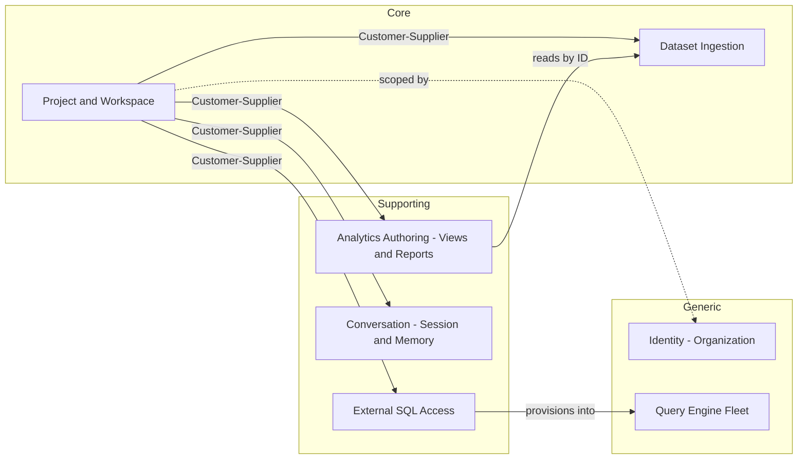

# Seam Analysis — backend/app/controllers/http_controller.py

Bead: `dc-e65d` (mol-refactor-legacy-ddd)
Target: `backend/app/controllers/http_controller.py` (527 lines, single `HTTPController` class, 29 static methods)
Scope: Identify bounded contexts entangled in this file and propose extraction seams that fit the existing `backend/app/` layout. **No code changes**; this is a design note.

---

## Current state summary

`HTTPController` is a single god-class of `@staticmethod` thin adapters that each:

1. Delegate to one use-case function (pulled from `app.use_cases.*`).
2. Pattern-match the `Success | Failure` result from `returns.result`.
3. Shape the payload with `_serialize` (calls `.serialize()` recursively on domain models).
4. Wrap in a JSON:API envelope via `wrap_jsonapi_single | wrap_jsonapi_list`.
5. On `Failure`, funnel through `_error_response(error)` which special-cases `DomainException` and falls back to 500.

**Responsibilities mixed in one file:**

| Area | Line range |
|------|-----------|
| Module-level serialization helper (`_serialize`) | L29–40 |
| Module-level error-to-HTTP mapping (`_error_response`) | L43–57 |
| Dataset endpoints (list / get / patch / post / list-by-project) | L66–144 |
| Upload endpoints (post_upload) | L145–168 |
| Transform endpoints (post/patch/preview) | L170–197 |
| Project endpoints (list / get / post / patch / delete) | L198–258 |
| Project-memory endpoints | L260–268 |
| Session endpoints (post / list / patch) | L270–310 |
| Dataset-search endpoint | L312–321 |
| Organization endpoints (post / get_my) | L323–344 |
| View endpoints (list / get / post / patch / delete) | L346–399 |
| Report endpoints (list / get / post / patch / delete) | L401–450 |
| SQL-access endpoints (enable / disable / get / sync / regenerate) | L452–497 |
| Query-engine endpoints (list / get / test) | L499–527 |

**Concrete smells** (per nw-ddd-tactical anti-pattern catalog):

- **Service Bloat / God Controller**: one class with 29 unrelated methods, >500 lines, no cohesion.
- **Missing Boundaries**: all domains funnel through one HTTP shim. A change to Dataset serialization forces a re-read of the entire file by reviewers for every domain.
- **Logic in wrong layer — borderline**: inline calls like `ViewSQLGenerator().generate_display(data)` on L378 (view rendering logic in the controller, not in the use case). One leak; otherwise the controller is genuinely thin.
- **Repeated dispatch pattern**: the `match result: case Success(...): ... case Failure(error): return _error_response(error)` block appears ~29 times verbatim, indicating the real seam is the "result -> JSON:API" mapping, which is context-independent.

**Non-smells (what's already good):**

- Business logic lives in `app/use_cases/<domain>/*`. The controller truly is a delegation layer.
- Error format (`Success/Failure`) is uniform across all use cases and drives a single helper.
- Module is import-cheap; no heavy cross-module work in `__init__`.

**Inbound coupling:**

- `app/controllers/__init__.py` re-exports `HTTPController` as a public symbol.
- All routers under `app/routers/*.py` call `HTTPController.<method>(...)` — see `datasets.py`, `projects.py`, `sessions.py`, etc.
- `backend/tests/controllers/test_http_controller.py` patches module-level names (`app.controllers.http_controller.dataset_use_cases`, `.project_use_cases`, `.upload_use_cases`) — the test surface is the CLASS as static dispatcher, not the individual functions. **Any extraction must keep the `HTTPController.<method>` signatures intact** or route the test patches through aliasing.

---

## Bounded contexts identified

Seven contexts are entangled. Cohesion signal below is the ubiquitous-language evidence (not just folder names) that each is a distinct boundary — the same noun means different things or is used by different actors.

### 1. Dataset Ingestion (Core)

**Charter**: Take a raw file upload, convert it into a governed dataset, maintain its shape/metadata and transforms. Actors: data engineer, project member.
**Cohesion signal**: `upload_use_cases.upload_file`, `dataset_use_cases.create_dataset_from_upload`, `dataset_use_cases.create_transforms/update_transforms/preview_cleaning_transform` all share the invariant "a Dataset is the post-ingest, cleaned artifact of an Upload." `Upload` only makes sense as the precursor to a `Dataset`; they live on the same business process.
**Methods on the controller** (lines):
- `list_datasets` L66–82, `list_project_datasets` L84–101, `get_dataset` L103–112, `patch_dataset` L114–121, `post_dataset` L123–143
- `post_upload` L145–167
- `post_transforms` L171–178, `patch_transforms` L180–187, `preview_transform` L189–196
- `search_datasets` L314–321 (arguably belongs here — searching your own datasets within a project)

### 2. Project & Workspace (Core)

**Charter**: The top-level tenant-scoped container that owns datasets, views, reports, sessions, memory, sql-access. Actors: org admin, project owner.
**Cohesion signal**: `Project` is the multi-tenancy anchor (`org_id` comes from it). Almost every other context takes `project_id` as a required input. The Project itself has CRUD + lifecycle invariants (`delete_project` cascades).
**Methods** (lines): `list_projects` L201–216, `get_project` L218–225, `post_project` L227–235, `patch_project` L237–246, `delete_project` L248–257.

### 3. Conversation / Session & Memory (Supporting)

**Charter**: Chat sessions and persistent project memory (the "Stream thread/channel" abstraction referenced in `sessions.py`). Actors: end user chatting with the AI.
**Cohesion signal**: The `sessions.py` router docstring says "project memory and session management" and explicitly calls out Stream (GetStream.io) channel/thread semantics. `Session` here is NOT a DB session, NOT an auth session — it is a **chat conversation**. Strong language divergence with other uses of the word "session" in the codebase (e.g., `set_session(db)` in use cases). This is a textbook bounded-context signal.
**Methods** (lines): `get_project_memory` L262–268, `post_session` L273–279, `list_sessions` L282–301, `patch_session` L303–310.

### 4. Identity / Organization (Generic, edging Supporting)

**Charter**: Organization (tenant) lifecycle and "whoami" lookups. Currently very small — likely to stay thin and wrap WorkOS or the auth provider long term.
**Cohesion signal**: Methods operate on the `Organization` aggregate; `org_id` is the multi-tenancy primitive that everything else references. The charter is distinct from `Project` (an org owns many projects; a project does not own orgs).
**Methods** (lines): `post_organization` L326–333, `get_my_organization` L335–344.

### 5. Analytics Authoring — Views & Reports (Supporting)

**Charter**: User-defined read models over datasets. A `View` is a saved query/transform spec; a `Report` is a saved visualization/summary over views or datasets. Actors: analyst.
**Cohesion signal**: Views and Reports are built from the same analytic language (fields, filters, aggregations). `list_views`, `get_view` etc. and `list_reports`, `get_report` etc. are structurally identical CRUDs, and they reference each other conceptually (a report may render one or more views). They share the "what the user looks at" lens, distinct from Dataset (the substrate) and from Memory/Session (the conversation about them).
**Caveat**: Views and Reports *could* be modeled as two bounded contexts inside a shared "Analytics Authoring" subdomain. The lightweight evidence (small use-case packages, parallel CRUD, shared `project_id` scoping) argues for one context with two aggregates for now. Re-evaluate if divergent invariants appear (e.g., report scheduling, view permissions).
**Methods** (lines): `list_views` L349–357, `post_view` L359–368, `get_view` L370–381, `patch_view` L383–390, `delete_view` L392–399; `list_reports` L404–412, `post_report` L414–423, `get_report` L425–432, `patch_report` L434–441, `delete_report` L443–450.
**Language-leak example**: L378 inlines `ViewSQLGenerator().generate_display(data)` — this is view-rendering logic that leaked across the seam.

### 6. External SQL Access Provisioning (Supporting, integrates with Generic)

**Charter**: Let customers point BI tools at the project via an external SQL endpoint. Provisions credentials, syncs schemas, rotates secrets.
**Cohesion signal**: Its own use-case package (`use_cases.sql_access._infra`), its own provisioner abstraction (`AsyncpgQueryEngineProvisioner` / `MockQueryEngineProvisioner`), its own lifecycle (enable/disable/sync/regenerate) that other domains do not share. Operates on a `SQLAccess` aggregate per project with credentials/grants.
**Methods** (lines): `enable_sql_access` L455–461, `disable_sql_access` L463–470, `get_sql_access` L472–479, `sync_sql_access` L481–488, `regenerate_sql_credentials` L490–497.

### 7. Query Engine Fleet Admin (Generic/Supporting, ops-facing)

**Charter**: Register and probe the Postgres/DuckDB-compatible query-engine nodes that SQL Access provisions into. Actors: platform operator.
**Cohesion signal**: Org-scoped (`user.org_id`), not project-scoped. Returns nodes, not per-project artifacts. A single node serves many projects; its lifecycle is independent of any project. This is a **fleet/registry** context, distinct from SQL Access (which is the per-project tenant inside a node).
**Methods** (lines): `list_query_engines` L502–509, `get_query_engine` L511–518, `test_query_engine` L520–527.

### Context map (draft)



All lines labeled. `Project` is the hub because every other context takes `project_id`. `SQLAcc -> QEFleet` is the only non-project lateral dependency and is Customer-Supplier: SQLAcc is downstream of the fleet registry.

---

## Proposed seams

**Prime directive**: do NOT invent a new top-level package. Target the existing shape:

- Keep `backend/app/controllers/` as the HTTP adapter layer.
- Split `http_controller.py` into **per-context sub-modules** under `backend/app/controllers/` (thin files, small classes or function namespaces).
- Keep `HTTPController` as a **facade class** that re-exports the per-context methods via mixins or attribute delegation, so routers and tests keep the `HTTPController.<method>` surface unchanged.
- Lift the two universal helpers (`_serialize` and `_error_response`) into their own module.

The "driving port" (what calls in) for every seam is a FastAPI router in `app/routers/*.py`. The "driven port" (what the seam calls out) is the matching `app/use_cases/<domain>/` package. We keep both fixed — only the HTTP-shim stratum moves.

### Seam 0 — Shared HTTP plumbing (extract first, zero-risk)

- **Driving port**: every other seam (imports `_serialize`, `_error_response`).
- **Driven port**: `app.use_cases.exceptions.DomainException` (already imported today), `app.controllers.response_wrapper.wrap_jsonapi_error`.
- **What moves**: `_serialize` (L29–40) and `_error_response` (L43–57).
- **Target location**: new file `backend/app/controllers/_result_mapper.py` (leading underscore marks it package-private; parallels how `use_cases/sql_access/_infra/` handles infra-ish internals).
- **Why first**: zero behavior change, unblocks every downstream seam, already has unit test coverage (`TestErrorResponse` in the test module).
- **Test impact**: `test_http_controller.py` imports `_error_response` from `app.controllers.http_controller`. Preserve that import by re-exporting from `http_controller.py` — the test file is read-only per the task.

### Seam 1 — Dataset Ingestion controller

- **Driving port**: `app/routers/datasets.py`, `app/routers/uploads.py`, `app/routers/transforms.py`, plus the `search_datasets` route in `app/routers/sessions.py` (L70–78 of that file — `/{project_id}/datasets/search`).
- **Driven port**: `app.use_cases.dataset`, `app.use_cases.upload`, `app.use_cases.dataset.search_datasets`.
- **What moves**: lines 66–196 and 314–321 of `http_controller.py`.
- **Target location**: `backend/app/controllers/dataset_controller.py`. Expose a `DatasetController` class with the same method names (`list_datasets`, `get_dataset`, `patch_dataset`, `post_dataset`, `list_project_datasets`, `post_upload`, `post_transforms`, `patch_transforms`, `preview_transform`, `search_datasets`).
- **Facade glue**: `HTTPController` gets `list_datasets = DatasetController.list_datasets` etc., so routers and tests are unchanged.

### Seam 2 — Project controller

- **Driving port**: `app/routers/projects.py`.
- **Driven port**: `app.use_cases.project`.
- **What moves**: lines 200–257.
- **Target location**: `backend/app/controllers/project_controller.py`. Class: `ProjectController`. Methods: `list_projects`, `get_project`, `post_project`, `patch_project`, `delete_project`.

### Seam 3 — Conversation (Session + Memory) controller

- **Driving port**: `app/routers/sessions.py` (except the `/datasets/search` endpoint, which belongs with Ingestion — see Seam 1).
- **Driven port**: `app.use_cases.memory.get_project_memory`, `app.use_cases.session.create_session/list_sessions/update_session`.
- **What moves**: lines 262–310.
- **Target location**: `backend/app/controllers/conversation_controller.py`. Class: `ConversationController`. Methods: `get_project_memory`, `post_session`, `list_sessions`, `patch_session`.
- **Language rename opportunity**: consider calling the class `ConversationController` rather than `SessionController` to avoid collision with DB session / auth session meanings used elsewhere in the codebase. If a rename is too disruptive for this bead, accept `SessionController` but document the conflict (see Ubiquitous-language notes).

### Seam 4 — Organization controller

- **Driving port**: `app/routers/organizations.py`.
- **Driven port**: `app.use_cases.organization`.
- **What moves**: lines 326–344.
- **Target location**: `backend/app/controllers/organization_controller.py`. Class: `OrganizationController`. Methods: `post_organization`, `get_my_organization`.

### Seam 5 — Analytics Authoring controller (Views + Reports)

- **Driving port**: `app/routers/views.py`, `app/routers/reports.py`.
- **Driven port**: `app.use_cases.view`, `app.use_cases.report`.
- **What moves**: lines 349–450.
- **Target location**: **two** files (keeps file size honest and lets future divergence be cheap):
  - `backend/app/controllers/view_controller.py` → `ViewController`
  - `backend/app/controllers/report_controller.py` → `ReportController`
- **Inline-logic cleanup**: L378 has `ViewSQLGenerator().generate_display(data)` inside the controller. Extracting to `ViewController` makes this leak visible. Recommend moving the call into the `get_view` use case so the controller stays pure shape-mapping. Log as a follow-up if out of scope for this bead.

### Seam 6 — SQL Access controller

- **Driving port**: `app/routers/sql_access.py`.
- **Driven port**: `app.use_cases.sql_access`.
- **What moves**: lines 455–497.
- **Target location**: `backend/app/controllers/sql_access_controller.py`. Class: `SQLAccessController`. Methods: `enable_sql_access`, `disable_sql_access`, `get_sql_access`, `sync_sql_access`, `regenerate_sql_credentials`.
- **Note on `disable_sql_access`**: returns `204` body from `wrap_jsonapi_single` (L468). A `204 No Content` response should have an empty body. This is a latent bug but NOT in scope; flag it in Risks.

### Seam 7 — Query Engine Fleet controller

- **Driving port**: `app/routers/query_engines.py`.
- **Driven port**: `app.use_cases.query_engine`.
- **What moves**: lines 502–527.
- **Target location**: `backend/app/controllers/query_engine_controller.py`. Class: `QueryEngineController`. Methods: `list_query_engines`, `get_query_engine`, `test_query_engine`.

### Seam 8 — `HTTPController` facade (extract last)

- **Driving port**: `app/routers/*.py`, `backend/tests/controllers/test_http_controller.py`.
- **Driven port**: all per-context controller classes from Seams 1–7.
- **What moves**: the shell of `http_controller.py` becomes a facade that composes the seven sub-controllers either via class-level attribute assignments or via multiple-inheritance mixins. Zero behavior change.
- **Test preservation**: the test module patches `app.controllers.http_controller.dataset_use_cases` (etc.). To keep these patches working, `http_controller.py` must continue to import the use-case modules at the module level. Options:
  1. **Keep the aliases in `http_controller.py`** (`from app.use_cases import dataset as dataset_use_cases` etc.) and have the facade methods delegate; then the per-context controllers are the real implementation but the mocks still land on the facade-module names. Cleaner: move the imports into the per-context files AND keep re-exports at the old names in `http_controller.py` for test compatibility, with a comment explaining why.
  2. Re-point the tests. **Not in scope** — task says tests are behavior evidence, do not modify.
- Choose option 1.

---

## Aggregate design

Per Vernon: small aggregates, one root with value-typed internals (~70% of the time), IDs across boundaries, eventual consistency between aggregates. The controller itself holds no domain state — the aggregates live behind the use cases in `app/use_cases/<domain>/` and the `app/repositories/` layer. Below are the aggregates each seam surfaces, with invariants and size rationale.

### Context 1 — Dataset Ingestion

- **Aggregate: `Upload`** (root). Invariants: (a) non-empty file; (b) supported file type; (c) immutable once processed (cannot re-process the same upload — see `UploadAlreadyProcessed` 409). Size: root + value-typed metadata (`file_name`, `project_id`, bytes hash). Rationale: tiny, single-transactional lifecycle `pending -> processed -> archived`.
- **Aggregate: `Dataset`** (root). Invariants: (a) belongs to exactly one project; (b) schema shape is fixed after creation (migrations treat it as new); (c) transform list is ordered and each transform references a column by name. Size: root + value-typed columns/partitions + a **collection of `Transform` value objects** (ordered list). Transforms are VOs, not a separate aggregate — they have no identity outside the dataset and their invariants (column exists, expression valid against that column) are tight to the parent. Rationale for keeping transforms inside the dataset aggregate: the "preview transform" and "apply transform" operations need transactional consistency with the dataset's column set.
- **Aggregate boundary to respect**: `Upload` -> `Dataset` is a cross-aggregate hand-off. `create_dataset_from_upload` mutates both; today it likely happens in one DB transaction via the unit-of-work in `with_repositories`. Flag as a design question (see Risks) — Vernon's rule 4 says prefer eventual consistency, but for a one-shot command with a single invariant ("exactly one dataset per upload") one-transaction-two-aggregates is defensible so long as concurrency stays low.

### Context 2 — Project & Workspace

- **Aggregate: `Project`** (root). Invariants: (a) name unique per org; (b) belongs to exactly one org; (c) soft-delete cascades ownership metadata but references to datasets/views use IDs, not object graphs. Size: root + value-typed name, description, timestamps. Rationale: small; avoids loading datasets/views into memory just to rename a project.
- Cross-aggregate references: `Dataset.project_id`, `View.project_id`, `Report.project_id`, etc. are all **IDs**, not object references. Good.

### Context 3 — Conversation

- **Aggregate: `Session`** (root) — represents a chat conversation (a Stream thread). Invariants: (a) belongs to a project; (b) only the owner can mutate via `patch_session`; (c) cursor-based pagination over sessions is monotonic on `created_at`. Size: root + minimal metadata.
- **Aggregate: `ProjectMemory`** (root) — the "Stream channel" for a project. Invariants: one per project; content is append-only from the domain's perspective (Stream manages its own internal consistency). Size: root + external-id pointer to the Stream channel. This is essentially a **Repository-level pointer** to an external system — candidate for ACL treatment (see Ubiquitous-language notes).

### Context 4 — Organization

- **Aggregate: `Organization`** (root). Invariants: (a) unique name; (b) has at least one member (the creator). Size: root + VO name + owner user-id reference. Very small; most of the real identity concerns live in the auth provider (dev-mode or WorkOS).

### Context 5 — Analytics Authoring

- **Aggregate: `View`** (root). Invariants: (a) belongs to a project; (b) references dataset(s) by ID; (c) the view's display SQL is a derived read model (see the L378 leak — this shows the domain actually has a computed projection that should be produced by the use case, not the controller). Size: root + filter/projection VOs.
- **Aggregate: `Report`** (root). Invariants: (a) belongs to a project; (b) references zero or more views or datasets by ID; (c) layout configuration is a VO tree. Size: root + layout VOs.
- Vernon check: could `View` and `Report` be one aggregate? No — reports can reference multiple views with independent lifecycles, and invariants of "view SQL is valid against its dataset" vs. "report layout is valid against its views" do not share a single transactional boundary. Keep separate; reference by ID.

### Context 6 — External SQL Access

- **Aggregate: `ProjectSQLAccess`** (root) — one per project. Invariants: (a) credentials rotation emits a new credential VO and invalidates the prior one atomically; (b) enable/disable transitions are guarded; (c) sync operations are idempotent. Size: root + VO credential (hashed), VO schema sync state, reference-by-ID to a `QueryEngineNode`. Keep small; the actual provisioner lives in `sql_access._infra` as a driven port.

### Context 7 — Query Engine Fleet

- **Aggregate: `QueryEngineNode`** (root). Invariants: (a) unique `(org_id, host, port, database)`; (b) `status` transitions `unknown -> healthy -> unhealthy` are the only valid transitions; (c) `test_query_engine_connection` side-effect writes a status+timestamp. Size: root only + VO host/port/database/admin_user + encrypted-pointer for admin_password (the real secret lives in settings, per `main.py` L65). Small.

---

## Ubiquitous-language notes

### Conflicts to resolve

1. **"Session"** is severely overloaded:
   - `Session` the chat conversation (`use_cases/session/*`, `HTTPController.post_session`).
   - `session` the SQLAlchemy `AsyncSession` (`set_session(db)`, `get_session()` in `app/repositories/__init__.py`).
   - "auth session" (`app/auth/`, JWT-derived).
   Recommendation: rename the **chat** concept to **Conversation** (`Conversation` aggregate, `ConversationController`, `use_cases/conversation/`). Too disruptive for this bead → at minimum rename the controller class to `ConversationController` and keep the use-case package name for now; schedule the model rename in a follow-on bead.

2. **"Memory"** currently means "Stream channel for a project". That is a vendor term (GetStream.io) leaking into the domain. Preferred domain term: **ProjectMemory** (already used in `get_project_memory_uc`) — the aggregate name is fine; the leak is inside the use case where it needs to map Stream-specific concepts. Candidate for an Anti-Corruption Layer against the Stream SDK.

3. **"Project"** is unambiguous internally but collides with **"dbt project"** in `export_dbt_project_route` (routers/projects.py L55). A dbt project is a VIEW of the internal project exported to a third-party format. Keep `Project` as the aggregate; use `DBTProjectExport` (VO) for the exported artifact. Already reads that way; no action needed.

4. **"Transform"** means a cleaning step on a dataset column (see `dataset_use_cases.create_transforms`). Do NOT confuse with dbt-transform or SQL-view transformation. This is a value object inside the `Dataset` aggregate, not a standalone concept.

5. **"View"** is an analytic saved query, not a database VIEW. When the view renders, it produces **display SQL** (L378) — but the concept is a user-authored saved configuration, not a DB view. Document this explicitly in the glossary.

6. **"Query Engine" vs "SQL Access"**: a Query Engine is a shared Postgres/DuckDB-compatible node in a fleet; SQL Access is a per-project grant-set provisioned into that node. These are distinct and the language is already clear in the use-case package names. Keep.

### Additions proposed

- **Ingestion Pipeline** as a phrase for the Upload -> Dataset -> Transform flow. Not an aggregate; a process/policy label.
- **Fleet** as a phrase for the Query Engine collection. Matches the ops-facing "I administer a fleet of nodes" mental model.

---

## Extraction order

Strictly increasing blast radius. Each step is independently reviewable and testable.

1. **Seam 0 — shared `_result_mapper.py`** (L29–57). Mechanical move + re-export. No test changes (`_error_response` import preserved).
2. **Seam 4 — `OrganizationController`** (L326–344). 2 methods, no cross-context dependencies. Smallest blast radius; validates the facade pattern end-to-end before it's used at scale.
3. **Seam 7 — `QueryEngineController`** (L502–527). 3 methods, org-scoped (not project-scoped), no coupling to any other extracted context. Confirms the facade pattern on a slightly larger slice.
4. **Seam 6 — `SQLAccessController`** (L455–497). 5 methods, project-scoped. Natural pair with QEFleet (it's the downstream) but has no code-level dependency on it; isolated extraction is safe.
5. **Seam 2 — `ProjectController`** (L200–257). 5 methods. Project is the hub, so extracting it mid-sequence proves the facade handles the heaviest-referenced context cleanly and shakes out any shared-state surprises before touching views/reports.
6. **Seam 5 — `ViewController` + `ReportController`** (L349–450). 10 methods across two files. Pure CRUD, parallel shape; also the natural checkpoint to decide whether to push `ViewSQLGenerator` down into the use case.
7. **Seam 3 — `ConversationController`** (L262–310). 4 methods. Lands the naming discussion (Session vs. Conversation) in a small-surface file.
8. **Seam 1 — `DatasetController`** (L66–196 + L314–321). Largest: 10 methods across ingestion, transforms, and search. Saved for last because (a) it is the biggest single extraction, and (b) by this point the facade pattern, the test-patch preservation strategy, and the shared `_result_mapper` are all battle-tested.
9. **Seam 8 — facade cleanup**. With all per-context controllers in place, confirm `http_controller.py` is now just a facade of re-exports + the two legacy aliases (`_serialize`, `_error_response`) needed for test imports. Retire anything redundant.

Dependency graph among seams:

```
Seam 0 (helpers)
  |
  +-- Seam 4 (Org)
  +-- Seam 7 (QEFleet)
  +-- Seam 6 (SQLAccess)
  +-- Seam 2 (Project)
  +-- Seam 5 (Views+Reports)
  +-- Seam 3 (Conversation)
  +-- Seam 1 (Dataset+Upload+Transform+Search)
  |
Seam 8 (facade)  <-- depends on all 1–7 being moved
```

All of Seams 1–7 depend only on Seam 0. They are mutually independent and could in principle be parallelized across branches, but sequencing them keeps the review cognitive load low and lets each PR run the full test suite as a checkpoint.

---

## Risks & open questions

**Risks**

1. **Test-patch binding**: `test_http_controller.py` patches at `app.controllers.http_controller.dataset_use_cases` (and similar for project/upload). After extraction, those names must still resolve inside `http_controller.py` or the tests will silently patch nothing. Mitigation: keep the original `from app.use_cases import dataset as dataset_use_cases` aliases in `http_controller.py` as a test-compatibility layer; add a module-level comment explaining why. Accept the duplication; it will be retired when tests are rewritten (out of scope for this bead).
2. **Facade method signatures**: routers call `await HTTPController.list_datasets(project_id, cursor=..., page_size=..., base_url=...)`. Any param drift during extraction breaks production. Mitigation: copy signatures verbatim; add a targeted test that each facade method forwards all kwargs.
3. **Inline logic in `get_view` (L378)**: `ViewSQLGenerator().generate_display(data)` runs in the controller today. Pure lift-and-shift preserves the bug; pushing it down to `view_use_cases.get_view` is the right fix but changes use-case behavior. Decide per-bead: in-scope (clean fix) or follow-up (open issue and keep the leak).
4. **`disable_sql_access` returns 204 with a JSON body** (L464–470). Lift-and-shift preserves this. Flag and fix in a separate bead.
5. **`_serialize` is duck-typed** (hasattr `.serialize`). Any use case that starts returning a plain dict from a callsite expecting a model will silently pass through. No action; document.

**Open questions / clarifications**

- **Should `search_datasets` live in the Dataset controller or the Conversation controller?** Routed from `sessions.py` today (L70–78), but semantically it's a dataset query. Proposal: move to Dataset controller (Seam 1) and have `sessions.py` import from `dataset_controller`. Confirm with router ownership before moving the route.
- **Is `ProjectMemory` truly a separate aggregate or a projection of `Project`?** One memory per project, small content. Could fold into `Project`. Currently modeled separately via `get_project_memory_uc`. Non-blocking for the refactor.
- **Do we want a single `AnalyticsController` with both Views and Reports, or two files?** Plan above proposes two files. If a single file feels right once extracted (e.g., shared helpers emerge), merge in a follow-up.
- **Naming: `ConversationController` vs. `SessionController`?** Recommend `ConversationController` to resolve the "session" overload; needs one-line consensus from the product/engineering owner.

No `ESCALATION_NEEDED` or `CLARIFICATION_NEEDED` signals are raised. The clarifications above are post-refactor refinements, not blockers for the extraction plan.
