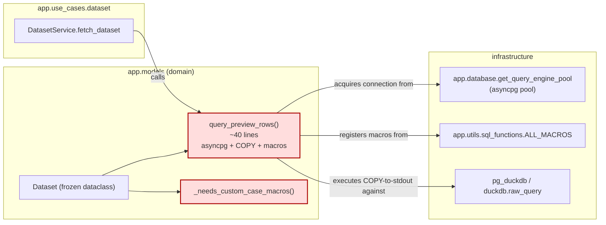
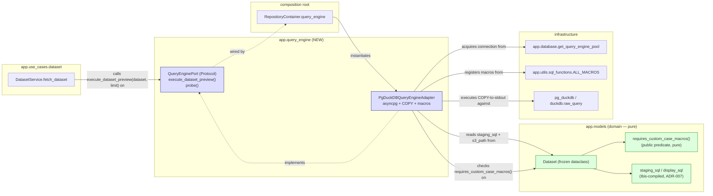
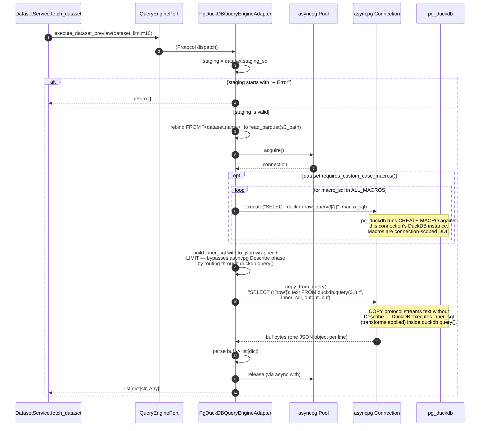

<!-- DES-ENFORCEMENT : exempt -->
# C4 Diagrams — Extract Dataset Query Port

## L3 Component — Current state (problem)

**Smell:** the domain model (`models/`) imports from `database`, `utils.sql_functions`, and indirectly speaks asyncpg + pg_duckdb wire protocol. Three infrastructure dependencies cross the model boundary.

---

## L3 Component — Proposed state (Option α)

**Result:** model has zero infrastructure imports. All asyncpg/COPY/pg_duckdb knowledge lives behind `QueryEnginePort`. The Protocol convention mirrors `LakeRepository`.

---

## Sequence — COPY-from-stdout preview-row flow (proposed)

This sequence is the **non-negotiable** path: the COPY-to-stdout route exists because asyncpg's Describe phase rejects DuckDB's UNKNOWN type from `duckdb.query()`. Documented in `_pg_duckdb_query.py` and `dataset.py:209–213`. The refactor preserves it byte-for-byte.

**What MUST not change between current and proposed:**

- The exact `outer_sql` constant: `"SELECT (r['row'])::text FROM duckdb.query($1) r"`.
- The exact `inner_sql` shape: `"SELECT CAST(to_json(t) AS VARCHAR) AS row FROM ({transformed_sql}) t LIMIT {limit}"`.
- The macro-DDL shim: `await conn.execute("SELECT duckdb.raw_query($1)", macro_sql)` (positional arg, not interpolated).
- The order of operations: macros first (when needed), COPY second.

These are pinned by characterization tests (`test_dataset.py:963–970, :1003–1004`), which **must move with the code in DELIVER, not rewrite themselves to fit the new shape.** The Iron Rule applies.
