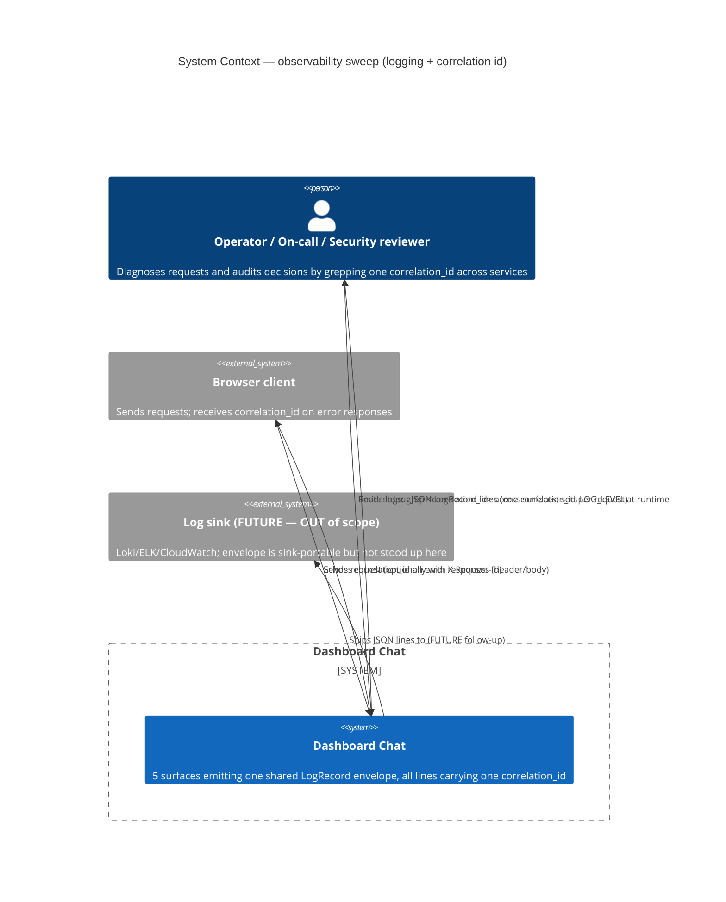
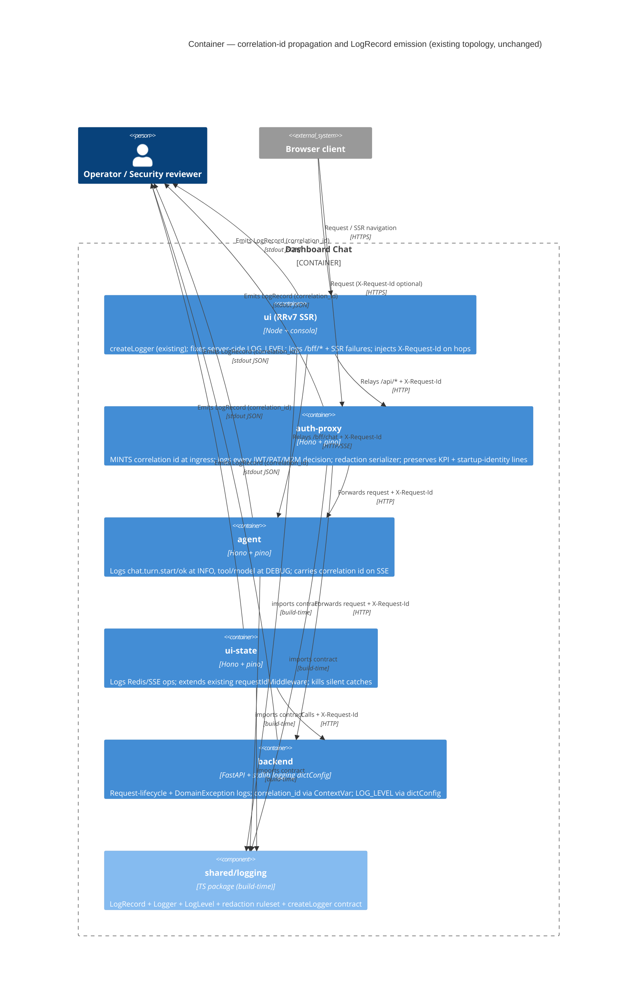
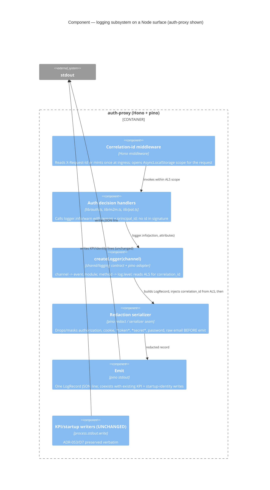

# C4 diagrams — log-coverage-and-quality (DESIGN, application scope)

**Wave:** DESIGN · **Feature:** log-coverage-and-quality (DC-103) · **Author:** Morgan (nw-solution-architect) · **2026-06-20**

> **Topology is UNCHANGED.** This feature introduces **no new containers** and no
> new network hops. The five existing surfaces (auth-proxy, backend, agent,
> ui-state, ui) gain a logging adapter + a correlation-id binding seam. The only
> new artifact is the shared contract package `shared/logging/`, which is a
> build-time dependency, not a runtime container. The diagrams below annotate the
> **logging / correlation-id flow** over the existing topology.

## Level 1 — System Context (logging & correlation-id flow)

## Level 2 — Container (correlation-id propagation + envelope emission)

## Level 3 — Component (the logging subsystem on one Node surface)

The subsystem of interest: how a line emitted deep in handler code acquires the
correlation id and passes through redaction before emit. Shown for a Node service
(auth-proxy); the Python backend is the same shape with `ContextVar` + dictConfig
JSON formatter in place of `AsyncLocalStorage` + pino.

## Notes on diagram fidelity

- Every arrow carries a verb. No abstraction levels are mixed.
- `shared/logging` is drawn as a Component inside the boundary in L2 only to show
  the build-time dependency; it is **not** a runtime container.
- The "FUTURE log sink" appears in L1 only to mark the sink-portability seam (D3/Q3
  OUT of scope) and is explicitly not built.
