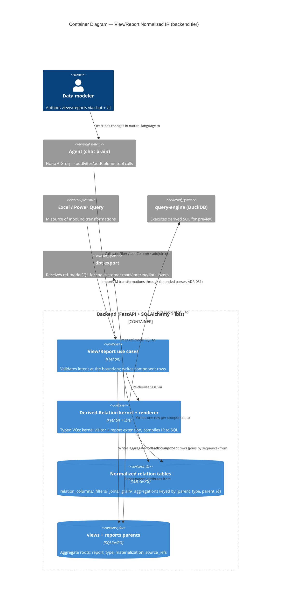
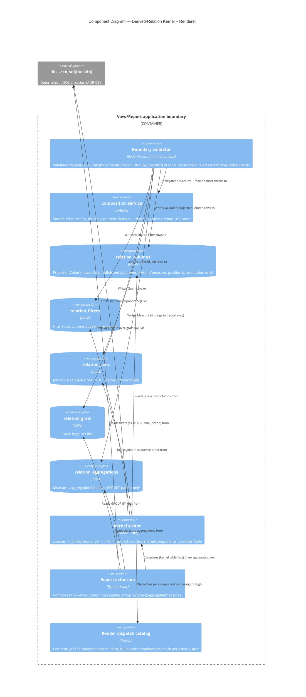

# C4 Diagrams — Normalized View/Report IR + Renderer Subsystem

**Wave:** DESIGN (application/component scope) · **Mode:** PROPOSE
**Author:** Morgan (nw-solution-architect)
**Companion:** `evaluation.md` (decisions 1–5), draft `adr-052`.

Scope: the affected backend subsystem only — the normalized View/Report
component tables, the typed Derived-Relation kernel, the input adapters that
write the IR, and the kernel visitor + report extension that render it to ibis →
SQL. Every arrow is labeled with a verb. Levels do not mix.

---

## L2 — Container diagram (the backend tier and its IR neighbours)

Shows where the normalized View/Report IR lives relative to the inbound writers
and the outbound SQL targets. Datastores are normalized component tables, not
JSON blobs.

---

## L3 — Component diagram (the kernel, the IR tables, the visitor extension)

The complex subsystem warranting L3 (5+ collaborating components): the typed
kernel, the discriminated-union validation boundary, the normalized tables, and
the kernel-visitor / report-extension renderer split (Decision 4B).

---

## Reading notes (level discipline)

- **L2** shows containers (use cases, kernel+renderer, two datastores) and
  external systems (agent, Excel/M, DuckDB, dbt). It does not show the five
  component tables individually — that is L3 detail.
- **L3** opens the application boundary: the validation boundary (Decision 3),
  the five normalized tables (Decision 1C), and the kernel-visitor / report-
  extension split (Decision 4B). The report extension **composes** the kernel
  visitor (the "Report is a View plus one operator" finding, rendered as an edge,
  not a mode branch).
- The `relation_joins → sequence`-ordered read (Decision 2B) is the only
  order-bearing edge; every other component read is set-like.
- No edge reads compiled SQL back as authority — ibis is strictly terminal
  (ADR-026 hard invariant).
