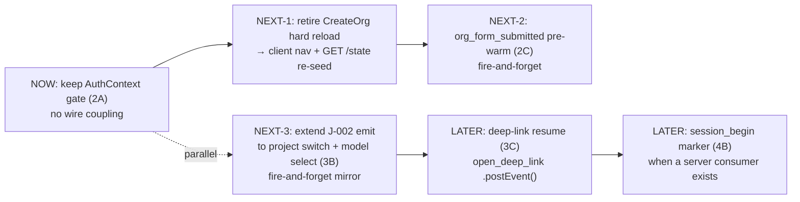
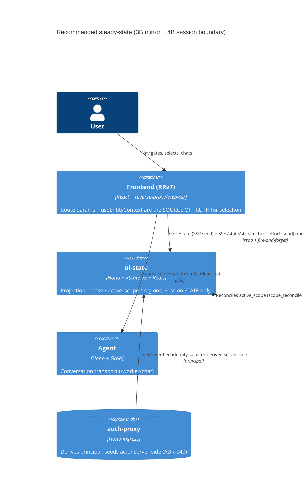
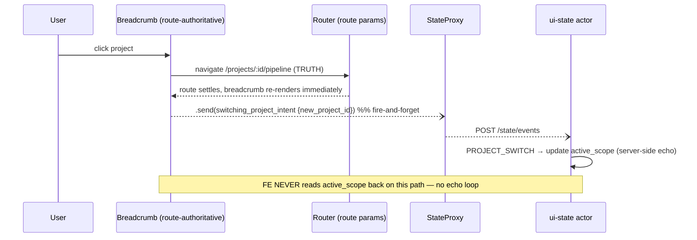

# ui-state ↔ New Layout Integration — REVIEW / FORWARD-LOOKING — NOT RATIFIED

> **BANNER — READ FIRST.** This is a **forward-looking solution-architecture REVIEW**, not a ratified decision and not an implementation plan. No code is changed here. No ADR is accepted here. The ui-state wire is **in flux** (just reshaped by the chat-app coordinator; `/flow` retired at ADR-046 MR-7), so every proposal that would touch `frontend/` or `auth-proxy/` is explicitly flagged **CONFIRM-FIRST** and must be ratified by the user before any build. ADR candidates below are marked **PROPOSED**, never ACCEPTED.

**Author:** Morgan (nw-solution-architect, PROPOSE mode, headless)
**Date:** 2026-05-31
**Scope:** How ui-state should fit into the pipeline-layers UI redesign going forward — (0) the `login → engaged` / org-create gate (needed now), (1) project state, (2) active scope, (3) chat session, plus event-emission triggers, phasing, and risks.

---

## Assumptions (headless — could not ask)

1. **The redesign FE remains a "pure consumer reskin" for this MR sequence.** Per `docs/feature/pipeline-layers-ui-redesign/path-forward.md` §4.4 ("The ui-state wire is untouched"), §2.2/§2.4, and the risk note (L236, "ui-state in flux … pure consumer reskin"). Any wire coupling is a *next-sequence* recommendation, not this sequence.
2. **The two MR tracks are independent.** Pipeline-redesign MR-N ≠ ADR-046 MR-N. They meet only at the `ChatProvider`/`ChatContext` seam. I do not sequence one against the other; I sequence *ui-state coupling* as its own mini-track.
3. **ADR-046 lands as specified** — single `/state` surface, `useSelector` client, closed event vocabulary (Decision 3). I treat the wire SSOT in `shared/ui-state-wire/` as the contract of record even though ADR-046 DELIVER is "in progress."
4. **The actor is derived server-side from the verified principal** (ADR-040); the FE never constructs a `flow_id`/principal. Confirmed by the J-002 emit comment (`useChatEngine.tsx:682-686`).
5. **`org_id` on the auth user is the authoritative onboarding gate today**, not ui-state. Confirmed by `RequireOrg` (`guards.tsx:15-18`). ui-state's `phase: "onboarding"` is a *projection* of the same fact, not yet the gate.
6. **Single-replica, in-process actors** (ADR-030) — so "server-side cross-surface awareness" is per-process, not a distributed concern. This lowers the stakes of the mirroring options below.
7. No new external integrations are introduced by any option here; the only external service in the blast radius is the existing **agent `/worker/chat`** path, which is *not* an ui-state surface.

---

## Point 1 — Current wiring (wired vs absent)

### What is WIRED (live today)

| Concern | Where | Status |
|---|---|---|
| Single actor HTTP surface | `ui-state/lib/machines/chat-app/router.ts:375` `GET /state`; `:385` `POST /state/events`; `:502` `GET /state/stream` (SSE). `/flow/*` retired (router comment L8-9). | LIVE |
| SSR seed of the document | `frontend/app/root.tsx:98` loader `fetchStateDocument(request)`; `:133-134` `createStateProxy({seed})`. | LIVE |
| Projection model (phase / active_scope / regions) | `shared/ui-state-wire/state-document.ts:187` `ChatAppStateDocument`; `:173` `phase`; `:37` `ActiveScope`; `:177` three `regions`; `:55` `ReducedContext`. | LIVE (modeled) |
| Event vocabulary | `shared/ui-state-wire/wire-event.ts:19` `ChatAppWireEvent` — `org_form_submitted` (:22), `switching_project_intent` (:27), `open_deep_link` (:29-37), `session_begin` (:39), catch-all (:41). | LIVE (modeled) |
| Client + proxy | `frontend/app/lib/ui-state-client.ts:98/85-96/109-115`; `frontend/app/lib/state-proxy.ts:121-219` (`getSnapshot`/`send`/`postEvent`/`subscribe`). | LIVE |
| **The one ui-state-driven gate that exists** | `root.tsx:136-147` — `useSelector(stateProxy, d => d.regions.projectContext.state)` renders `<WelcomePanel>` when `=== "no_projects"`. | LIVE |
| **The one existing FE→ui-state emit** | `useChatEngine.tsx:667-700` — best-effort `fetch("/ui-state/state/events", …)` (:687) forwarding a dataset-pick verbatim to the active child (J-002). Principal-gated, fire-and-forget, never throws. | LIVE (precedent) |

### What is ABSENT (deliberately decoupled — saved-feedback constraint)

| Redesign component | Source of truth today | ui-state coupling |
|---|---|---|
| **Breadcrumb** (`frontend/src/ui/components/Breadcrumb/`) | `params.projectId ?? model?.project_id ?? null` (`index.tsx:68`) via pure `resolveBreadcrumbContext(params)` (`breadcrumbContext.ts:22-35`); `selectProject` navigates to `/projects/:id/pipeline` (`index.tsx:92-95`). Comment `index.tsx:13`. | NONE (does not read/write ui-state) |
| **Assistant overlay** (`frontend/src/ui/components/Assistant/`) | `AssistantFeed.tsx:12-14` pure `useChatContext()` consumer (comment L1-6). In-frame model via `useEntityContext()` → `{projectId, entityType, entityId}` (`useEntityContext.ts:23-61`) over refs. `ActiveProjectSync` calls `ChatContext.registerProjectId(projectId)`. | NONE |
| **Chat engine** (`useChatEngine.tsx`) | Primary chat posts to the agent `chatClient.fetchChatStream(...)` → `/worker/chat` (`:491-497`). | NONE for the transcript; ONE best-effort dataset-pick emit only (J-002, above). |
| **Org-create gate** (`guards.tsx`, `CreateOrg/index.tsx`) | `RequireOrg` (`guards.tsx:15-18`) redirects on `user?.org_id == null`. `CreateOrg` → `catalog.createOrg` (`index.tsx:32-34`) → `login(org_id)` (:36) → `window.location.href="/"` reload (:45). **Does NOT POST to /state/events.** | NONE — AuthContext-driven, not ui-state-driven |

**Headline of Point 1:** The wire *models* almost everything the redesign needs (`phase`, `active_scope`, three regions, and a closed event vocabulary that already names `org_form_submitted`, `switching_project_intent`, `open_deep_link`, `session_begin`). The redesign components are *deliberately not wired to it*. There is exactly **one** live FE→ui-state emit (J-002) — proof that fire-and-forget mirroring is already in place and low-risk.

---

## Point 2 — The `login → engaged` switch (NEEDED NOW)

The only "needed now" concern. The gate question: when a user has no org, show the org-create view; once they have an org, show the engaged app.

### Option 2A — Keep AuthContext guards as the gate; do NOT touch ui-state (status quo)
- **Trade-offs:** Zero wire coupling, zero risk against the in-flux wire. `RequireOrg` (`guards.tsx:15-18`) already works. But the gate fact lives in *two* places conceptually (auth user `org_id` AND ui-state `phase`/`projectContext.state`), and after org-create the FE does a hard `window.location.href="/"` reload (`CreateOrg/index.tsx:45`) which forces a cold `GET /state` re-seed — the actor is rebuilt from scratch on the new principal.
- **Cost:** none. **Risk:** none. **Cross-surface drift:** the projection lags the auth fact by exactly one reload — acceptable because the reload *is* the resync.

### Option 2B — Make ui-state `phase`/`regions.projectContext.state` the gate; FE selects on the projection
- **Trade-offs:** Single projection-driven gate, consistent with the existing `WelcomePanel` dispatch (`root.tsx:146-147`). But it makes the org-create gate depend on the in-flux wire's `phase` semantics, and the auth user's `org_id` would become a *derived* input to the actor rather than the gate. This is a meaningful re-architecture of the auth boundary. **Touches `frontend/` AND likely `auth-proxy/`** (identity-header → actor seed semantics).
- **Cost:** high relative to value right now. **Risk:** couples the gate to a wire still being reshaped.

### Option 2C — Keep AuthContext as the gate, but have `CreateOrg` *pre-warm* the actor by POSTing `org_form_submitted` before the reload (additive)
- **Trade-offs:** `org_form_submitted {org_name}` is already in the closed vocabulary (`wire-event.ts:22`) and is the *only* event accepted while `phase==="onboarding"` (Decision 3 ACL). Emitting it on submit lets the actor advance its onboarding region *before* the post-reload `GET /state`, so the re-seed lands on a warm actor instead of a cold `anonymousStateDocument()` (`state-document.ts:214`). It does NOT change the gate (auth `org_id` still gates). It is purely a fire-and-forget projection warm-up — same shape as the J-002 precedent. **Touches `frontend/` (`CreateOrg/index.tsx`) — CONFIRM-FIRST.**
- **Cost:** ~one fetch call, best-effort, principal-gated. **Risk:** low — if the emit fails, the reload path is unchanged (status quo fallback). **Caveat:** the org-create flow mints a *new* org/principal; the actor is derived from the *post-create* principal, so the pre-warm only helps if the emit carries (or the server derives) the new principal. Given the current reload-then-fresh-seed flow, the warm-up's value is marginal until the FE stops hard-reloading. This caveat is the main reason not to rush 2C.

### Recommendation (Point 2)
**Adopt Option 2A now (status quo AuthContext gate), and record 2C as the PROPOSED next step — but only once the org-create flow stops hard-reloading.** Rationale: the gate is not broken, the wire is in flux, and the hard reload (`CreateOrg/index.tsx:45`) makes the pre-warm's benefit marginal today. The correct sequencing is: (1) keep the auth gate; (2) *separately* retire the hard reload in favor of a client-side navigation + `GET /state` re-seed; (3) *then* add the `org_form_submitted` pre-warm so the re-seed lands warm. Do **not** adopt 2B — promoting `phase` to the gate re-architects the auth boundary against an unstable wire for no present benefit. **Flag:** 2C touches `frontend/`.

---

## Point 3 — Project state & active scope

The redesign's breadcrumb dictates the selected project; the assistant overlay's `useEntityContext()` tracks the in-frame dataset/view/report. The wire models the same facts in `active_scope` (`state-document.ts:37`). Question: who owns the truth, and how do the two stay in sync.

### Option 3A — Projection is source of truth; FE emits `switching_project_intent` / `open_deep_link` and reads scope back from `active_scope`
- **Trade-offs:** Cleanest conceptual model — one authority. `switching_project_intent {new_project_id}` (`wire-event.ts:27`) maps to the parent `PROJECT_SWITCH` and reaches project-context even while chat is the active child; `open_deep_link` (`:29-37`) carries `intent_resource_id`/`intent_resource_type`. But the redesign's breadcrumb is **route-driven** (`index.tsx:68/92-95`) — navigation is the truth. Making the projection the truth means the breadcrumb must *await* `active_scope` reconciliation (`scope_reconciled`, `state-document.ts:67`) before rendering the selected project, introducing a round-trip on every project switch and an **echo loop** risk (route change → emit → projection update → route reaction). This inverts the redesign's deliberate route-first design. **Touches `frontend/` heavily — CONFIRM-FIRST.**
- **Cost:** high. **Risk:** dual-source-of-truth becomes a *reconciliation* problem with latency on the hot path (project switch).

### Option 3B — FE stays source of truth (route params + `useEntityContext`); MIRROR into ui-state via fire-and-forget events for cross-surface/server awareness
- **Trade-offs:** Matches the J-002 precedent exactly (`useChatEngine.tsx:667-700`) — emit-and-forget, never blocks the UI, never reads back on the hot path. The route stays authoritative for the breadcrumb; `useEntityContext` stays authoritative for the in-frame model; ui-state's `active_scope` becomes a *derived server-side echo* used only by server-side consumers (the actor's own logic, the agent's scope awareness, future deep-link resume). No round-trip, no echo loop (the FE never reacts to its own mirrored scope). The `scope_reconciled`/`scope_resolution_error` fields (`state-document.ts:67/70`) let the *server* note divergence without forcing the FE to resolve it. **Touches `frontend/` (additive emits) — CONFIRM-FIRST**, but minimally and in the proven J-002 shape.
- **Cost:** low — a handful of additive `.send()` emits at navigation/selection seams. **Risk:** the projection can lag the FE truth; acceptable because no surface treats it as authoritative.

### Option 3C — Hybrid: FE authoritative for navigation/selection (3B), projection authoritative ONLY for deep-link *entry* (3A for `open_deep_link`)
- **Trade-offs:** On a deep-link cold start the route *is* the intent and the actor resolves it server-side (`deeplink_project_id`/`session_id`, `state-document.ts:87-88`; `intent_resource_id/type` :91-92), so the projection legitimately leads *once*, at entry, before the route settles. After entry, 3B takes over. This is the natural division: projection leads at *resume*, FE leads during *interaction*. **Touches `frontend/` — CONFIRM-FIRST.**
- **Cost:** low-moderate. **Risk:** one well-defined hand-off point (entry → interaction) that must be unambiguous to avoid a brief double-authority window.

### Dual-source-of-truth & echo-loop note
The genuine hazard is route-params-vs-`active_scope` divergence with a feedback loop. **3B eliminates the loop by construction** (FE never reads its own mirror back). 3A *creates* the loop. 3C confines the projection's authority to the one moment the route is genuinely undefined (cold deep-link), so there is no loop during steady-state interaction.

### Recommendation (Point 3)
**Adopt 3B as the steady-state model, with the 3C deep-link refinement reserved for when deep-link resume is actually built.** The redesign is route-first by design (`breadcrumbContext.ts:22-35`) and the J-002 precedent already proves fire-and-forget mirroring is safe and shipped. Keep route params + `useEntityContext` authoritative; mirror project switch and model selection into `active_scope` as best-effort emits so the actor and the agent gain scope awareness *without* the FE ever depending on the read-back. Defer 3A entirely — it inverts the redesign and re-introduces the exact reconciliation latency the route-first design avoids. **Flag:** all of 3B/3C touch `frontend/` (additive emits only).

---

## Point 4 — Chat session

ui-state models a `sessionChat` region with `session_id`/`transcript`/`pending_first_message` (`state-document.ts:106-117`) and a `session_begin` event (`wire-event.ts:39`). Today the session is owned by `ChatContext`, and the *conversation itself* streams from the agent `/worker/chat` (`useChatEngine.tsx:491-497`) — not from ui-state.

### Option 4A — ui-state owns session lifecycle; assistant-open / new-session emits `session_begin`, transcript flows through `sessionChat`
- **Trade-offs:** One authority for session state and transcript. But this would route the *conversation* through ui-state, duplicating or replacing the agent stream (`/worker/chat`) — a large re-architecture of the chat data path, against the in-flux wire, and contradicting the redesign's "chat wire untouched" constraint (`AssistantFeed.tsx` L1-6). **Touches `frontend/` heavily and changes the chat transport — strongly CONFIRM-FIRST / likely out of scope.**
- **Cost:** very high. **Risk:** conflates *session state* (ui-state's job) with *conversation streaming* (the agent's job).

### Option 4B — Clear boundary: **ui-state tracks session STATE; the agent streams the conversation.** Assistant-open / new-session emits `session_begin` as a best-effort state marker; the transcript stays on `/worker/chat`
- **Trade-offs:** Honors the natural division — `session_begin {force_restart?}` (`wire-event.ts:39`) tells the actor "a session is starting" so `sessionChat.session_id`/`pending_first_message` reflect reality for cross-surface resume, while the bytes of the conversation keep flowing through the agent. This is the same role split the J-002 emit already assumes (ui-state knows the active dataset; the agent does the talking). **Touches `frontend/` (one additive emit at session start) — CONFIRM-FIRST.**
- **Cost:** low. **Risk:** session-state-vs-transcript can drift; acceptable because they answer different questions (which session? vs what was said?).

### Option 4C — Do nothing; ChatContext remains the sole session owner, no `session_begin` emit
- **Trade-offs:** Zero coupling, zero risk. But ui-state's `sessionChat` region stays unfed, so any future server-side feature needing "is a session active / which one" (deep-link resume, multi-surface continuity) has no signal.
- **Cost:** none now; deferred cost later. **Risk:** none now.

### Recommendation (Point 4)
**Adopt 4B as the target boundary, but only emit `session_begin` once there is a server-side consumer that needs it (deep-link/cross-surface resume); until then, 4C is the honest status quo.** The boundary to ratify is explicit: **ui-state is the session-STATE projection; the agent `/worker/chat` is the conversation transport.** Never route the transcript through ui-state (rejects 4A). When session-state awareness is actually needed, add a single best-effort `session_begin` emit at assistant-open / new-session in the J-002 shape. **Flag:** 4B touches `frontend/` (one additive emit).

**Dependency note (4B ↔ 3C).** Deep-link resume (3C) and the session-state marker (4B) are *partially* coupled, split by the `open_deep_link` payload (`wire-event.ts:29-37`): resuming a **project/resource** deep link (`intent_project_id`/`intent_resource_id`) resolves through `active_scope` and needs only 3C — it does **not** depend on 4B. Resuming a **session** deep link (`intent_session_id` → `sessionChat.session_id`, `state-document.ts:106`) *does* depend on the `sessionChat` region being fed, i.e. 4B must precede the session-resume slice of 3C. Net sequencing: 3C's *scope* resume is independent of 4B; 3C's *session* resume is gated on 4B. The phasing diagram orders `session_begin` (F) after `open_deep_link` (E) only because the first real consumer of `session_begin` is session-resume; the scope-resume slice of 3C can land without 4B.

---

## Point 5 — Event-emission trigger map

Each row: redesigned interaction → wire event (all already modeled in `wire-event.ts`) → emit style. **Fire-and-forget `.send()`** when the UI must not block and never reads the result back (the J-002 pattern). **Awaitable `.postEvent()`** only when the FE genuinely needs the returned document before proceeding.

| Redesign interaction | Wire event | Emit style | Why | Touches FE? |
|---|---|---|---|---|
| Breadcrumb project switch | `switching_project_intent {new_project_id}` (`wire-event.ts:27`) | **`.send()`** fire-and-forget | Route is authoritative (3B); mirror only. Never block navigation. | YES — CONFIRM-FIRST |
| Selecting a model / in-frame dataset/view/report | catch-all child_event e.g. `dataset_picked_directly` (existing J-002 shape, `useChatEngine.tsx:687-693`) or `open_deep_link` payload on deep entry | **`.send()`** | Already shipped as J-002; extend to view/report. Mirror only. | YES (extends existing emit) |
| Deep-link cold entry (resume) | `open_deep_link {intent_project_id?, intent_session_id?, intent_resource_id?, intent_resource_type?}` (`:29-37`) | **`.postEvent()`** awaitable | At cold entry the projection legitimately leads (3C); FE awaits resolved scope before settling the route. | YES — CONFIRM-FIRST |
| Opening the assistant / new session | `session_begin {force_restart?}` (`:39`) | **`.send()`** | State marker only; transcript stays on the agent (4B). | YES — CONFIRM-FIRST |
| Org create (form submit) | `org_form_submitted {org_name}` (`:22`) | **`.send()`** pre-warm | Only event accepted while `phase==="onboarding"` (Decision 3 ACL); gate stays on auth. Marginal until hard-reload retired (Point 2). | YES — CONFIRM-FIRST |

**Note:** Every event in this table is **already in the closed vocabulary** — no wire change is needed for any of them. The only `.postEvent()` (awaitable) case is deep-link cold entry; everything in steady-state interaction is fire-and-forget.

---

## Point 6 — Phasing / sequencing (smallest safe first step)

- **Do first (needed now):** Nothing that touches the wire. Keep the AuthContext org-create gate (2A). The login→engaged switch is already functional; the only "needed now" item requires **no** new coupling.
- **Smallest safe first coupling step (when the user green-lights coupling):** extend the **existing** J-002 best-effort emit (`useChatEngine.tsx:667-700`) to also fire `switching_project_intent` on breadcrumb switch and the model-select event on view/report selection — fire-and-forget, principal-gated, never blocking. This reuses a shipped, proven seam and adds **zero** wire surface.
- **Defer:** `open_deep_link` awaitable resume (3C), `session_begin` (4B), and the `org_form_submitted` pre-warm (2C) until (a) the wire stabilizes post-ADR-046 DELIVER and (b) there is a concrete consumer for each.
- **Never (out of scope):** routing the transcript through ui-state (4A); promoting `phase` to the auth gate (2B).

### Proposals that touch `frontend/` or `auth-proxy/` — ALL CONFIRM-FIRST
| Proposal | Files | Layer |
|---|---|---|
| 2C `org_form_submitted` pre-warm | `frontend/src/ui/components/CreateOrg/index.tsx` | frontend |
| Retire CreateOrg hard reload (prereq for 2C value) | `frontend/src/ui/components/CreateOrg/index.tsx`, possibly `AppShell/guards.tsx` | frontend |
| 2B promote `phase` to the gate (NOT recommended) | `guards.tsx`, identity-header→actor seed | frontend + **auth-proxy** |
| 3B mirror project switch | `frontend/src/ui/components/Breadcrumb/index.tsx` (or the chat-engine emit seam) | frontend |
| 3B/J-002 extend model-select emit | `useChatEngine.tsx` (extend existing emit) | frontend |
| 3C deep-link resume (`.postEvent()`) | route loaders / `root.tsx`, Breadcrumb settle logic | frontend |
| 4B `session_begin` marker | Assistant open / `ChatContext` session start | frontend |

**No proposal *requires* an `auth-proxy/` change except 2B, which is explicitly NOT recommended.** Everything recommended is frontend-only and additive.

---

## Reuse Analysis (hard-gated — default EXTEND)

| Capability needed | Existing asset (file:line) | EXTEND or CREATE | Rationale |
|---|---|---|---|
| Org-create gate | `RequireOrg` `guards.tsx:15-18` | **EXTEND (keep as-is)** | Works; auth `org_id` is authoritative. No new gate. |
| Org-create projection warm-up | `org_form_submitted` `wire-event.ts:22` + `CreateOrg/index.tsx:32-45` | **EXTEND** | Event already modeled; add an emit at submit. No new event. |
| Project-switch mirror | `switching_project_intent` `wire-event.ts:27` + J-002 emit `useChatEngine.tsx:667-700` | **EXTEND** | Event + emit seam both exist; add a call site. |
| Model/dataset/view/report mirror | J-002 emit `useChatEngine.tsx:687-693` (`dataset_picked_directly`) + catch-all `wire-event.ts:41` | **EXTEND** | Generalize the shipped dataset emit to view/report via the catch-all. |
| Deep-link resume | `open_deep_link` `wire-event.ts:29-37` + `deeplink_*`/`intent_*` `state-document.ts:87-92` | **EXTEND** | Event + projection fields already modeled; add `.postEvent()` call site. |
| Session-state marker | `session_begin` `wire-event.ts:39` + `sessionChat` region `state-document.ts:106-117` | **EXTEND** | Event + region already modeled; add one emit when a consumer exists. |
| Read-side selection | `useSelector(stateProxy, …)` `root.tsx:136-139` + `state-proxy.ts:200-217` | **EXTEND** | Proven pattern (WelcomePanel); reuse for any future projection-driven UI. |
| Active-scope header | `activeScopeHeader(document)` `ui-state-client.ts:109-115` | **EXTEND** | Already serializes scope; reuse, do not reinvent. |
| Conversation transport | agent `/worker/chat` `useChatEngine.tsx:491-497` | **KEEP (do not touch)** | Transcript stays on the agent (4B boundary). |
| **CREATE NEW** | — | **NONE** | The wire already models every needed event and projection field. No new wire surface, no new event, no new region is warranted by this review. |

**Headline of Reuse Analysis:** Zero CREATE-NEW rows. Every recommended capability is an EXTEND of an already-modeled event/projection or an already-shipped emit seam. The wire is ahead of the FE.

---

## Container view — FE ↔ ui-state ↔ agent (recommended steady state, 3B/4B)

## Sequence — recommended emit-on-interaction (breadcrumb switch, 3B)

---

## Point 7 — Risks & open questions

| # | Risk / open question | For user to decide |
|---|---|---|
| R1 | **Wire still in flux (ADR-046 DELIVER in progress).** Any FE coupling now risks rework. | Confirm: hold all coupling until ADR-046 DELIVER lands? (Recommended: yes.) |
| R2 | **Dual source of truth (route vs `active_scope`).** 3B avoids the loop but the projection can lag. Is a lagging server-side scope echo acceptable? (Recommended: yes — no surface treats it as authoritative.) | Confirm 3B over 3A. |
| R3 | **org-create hard reload (`CreateOrg/index.tsx:45`)** makes the 2C pre-warm marginal. Retiring the reload is a prerequisite, and itself a non-trivial FE change. | Approve retiring the reload as a separate step before 2C? |
| R4 | **ADR-027 status nuance.** ADR-027's per-machine FlowProjection wire is superseded/retired (router.ts L8-9) yet the ADR doc still reads `Status: Accepted`. Stale status is a documentation integrity risk. | Should a follow-up mark ADR-027 Superseded-by-ADR-046? (Recommended: yes.) |
| R5 | **Principal derivation on org-create.** A new org mints a new principal; the pre-warm only helps if the post-create principal is the one the actor derives from. | Confirm the post-create identity flow before building 2C. |
| R6 | **Session-state vs transcript drift (4B).** Acceptable, but needs a named consumer before `session_begin` is worth emitting. | Is there a concrete deep-link/cross-surface resume requirement? If not, defer 4B. |
| R7 | **No auth-proxy change is recommended.** Only 2B would touch it, and 2B is rejected. Confirm we are NOT promoting `phase` to the gate. | Confirm 2B is out. |

### PROPOSED ADR candidates (NOT accepted)

- **ADR-PROPOSED-A — "FE-authoritative selection with best-effort ui-state mirroring."** Status: **PROPOSED.** Context: redesign is route-first; wire in flux. Decision: route params + `useEntityContext` are authoritative; project-switch and model-select mirror into `active_scope` via fire-and-forget events (extending J-002); the FE never reads its own mirror back. Alternatives: (1) projection-authoritative (3A) — rejected: inverts route-first design, adds hot-path latency + echo loop; (2) no coupling (status quo) — rejected: leaves `active_scope` unfed for server-side consumers. Consequences: + no echo loop, + reuses shipped seam, + no wire change; − projection may lag, − requires FE call sites (confirm-first).
- **ADR-PROPOSED-B — "ui-state owns session STATE; the agent owns the conversation."** Status: **PROPOSED.** Context: `sessionChat` region exists but transcript streams from `/worker/chat`. Decision: ui-state tracks session lifecycle/state via `session_begin`; the agent remains the sole conversation transport. Alternatives: (1) route transcript through ui-state (4A) — rejected: large re-architecture, conflates state with transport; (2) ChatContext sole owner, no marker (4C) — acceptable interim, becomes ADR-PROPOSED-B once a consumer exists. Consequences: + clean separation, + minimal emit; − state/transcript can drift.
- **ADR-PROPOSED-C — "Org-create gate stays on AuthContext; ui-state `phase` is a projection, not the gate."** Status: **PROPOSED.** Decision: `RequireOrg` (auth `org_id`) remains authoritative; `org_form_submitted` is an optional projection pre-warm, not a gate. Alternative: promote `phase` to the gate (2B) — rejected: re-architects the auth boundary against an unstable wire, touches auth-proxy, no present benefit. Consequences: + zero auth-boundary risk; − two conceptual representations of the same fact (projection lags auth by one resync).

---

**Reviewer grade:** **PASS — A−** (nw-solution-architect-reviewer gate, 2026-05-31). All file:line citations spot-verified against the repo; all 7 points covered; Reuse Analysis present with zero unjustified CREATE-NEW; ADR candidates correctly PROPOSED; every `frontend/`/`auth-proxy/`-touching proposal flagged CONFIRM-FIRST. Three MEDIUM non-blocking notes raised — two already captured in the risk table (R4 ADR-027 stale `Status: Accepted`; R5 post-org-create principal derivation), and the third (4B↔3C interdependence) folded into Point 4's *Dependency note* above. No blocking issues.
