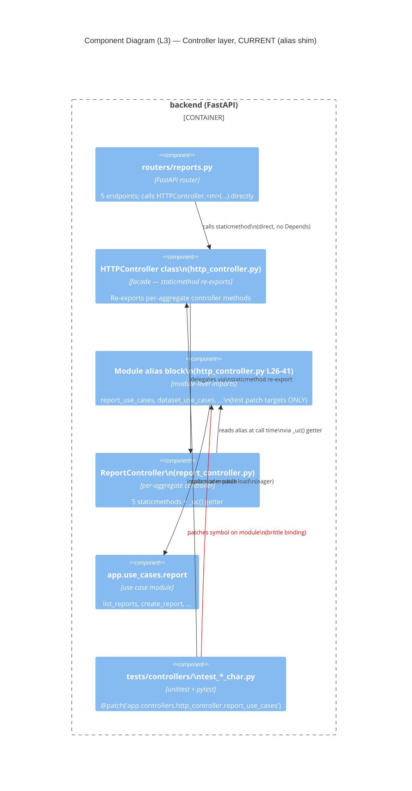
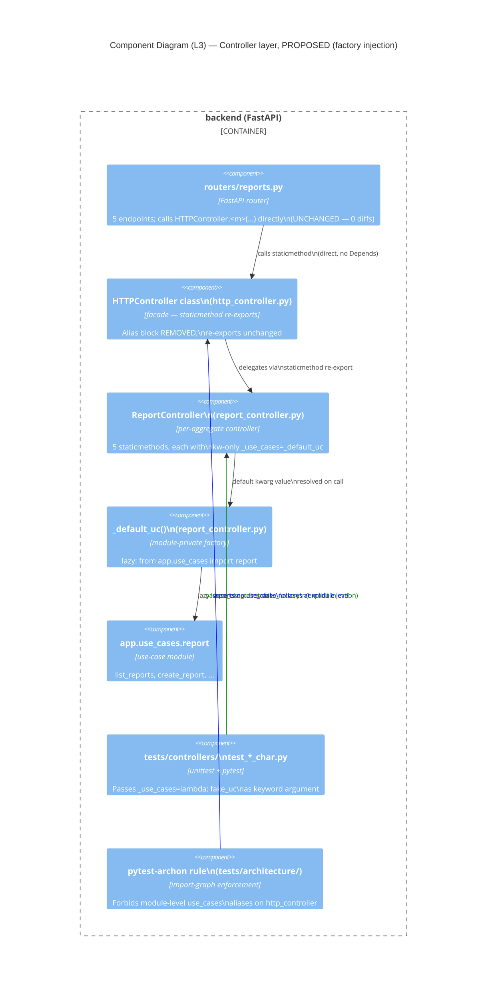
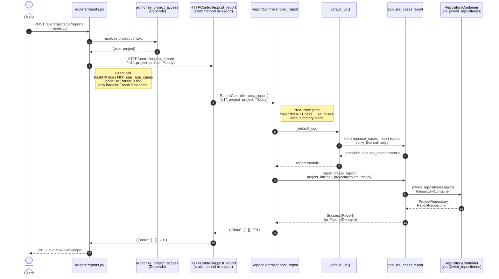
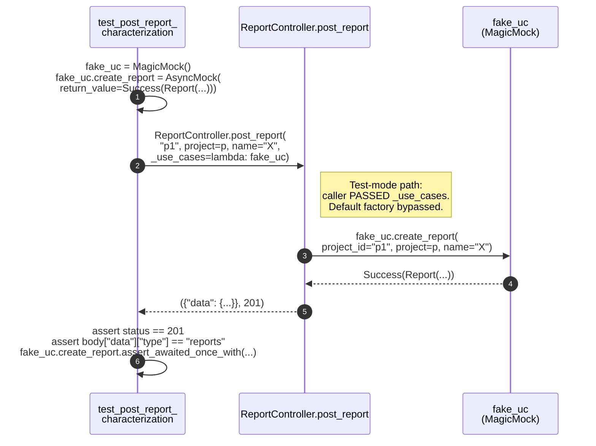

<!-- DES-ENFORCEMENT : exempt -->
# C4 Diagrams — Controller use-case injection refactor

Mermaid C4 Component (L3) views of the **current** alias-shim shape and the **proposed** factory-injection shape, plus a sequence diagram for a representative call path. Scope is the `backend` container only — system-context (L1) and container (L2) views are unchanged from `docs/product/architecture/brief.md` and are not duplicated here.

## L3 — Current state (alias-shim shape)

**Key signal (red arrow):** the test → alias-block dependency is the L4 root cause. Tests bind to a module symbol, not to the controller's contract. The `_uc()` getter exists *only* to bridge the controller to that symbol.

## L3 — Proposed state (factory-injection shape)

**Key changes:**
- The alias block is **gone**. There is no module-level shared symbol for tests to patch.
- The `_uc()` getter on the controller is **replaced** by `_default_uc` (used as the default value of a keyword-only parameter). The body of `_default_uc` performs the same lazy import the old getter did.
- Tests now bind to the controller's **signature** (green arrow) — explicit, contract-level coupling — not to a module symbol.
- The `pytest-archon` rule (blue dashed arrow) is the architectural enforcement layer (Principle 11) that prevents future regression.

## Sequence — Representative call path

`POST /api/projects/{project_id}/reports` (production) — illustrates how the default factory wins when no test-time override is supplied.

**Test-mode variant** (single line difference at step 5):

**The two flows differ by one argument.** In production, `_use_cases` defaults to `_default_uc` (lazy real-module import). In tests, `_use_cases` is a caller-supplied factory returning a `MagicMock`. Production routers never pass `_use_cases`; tests always do. This is the entire mechanism.
