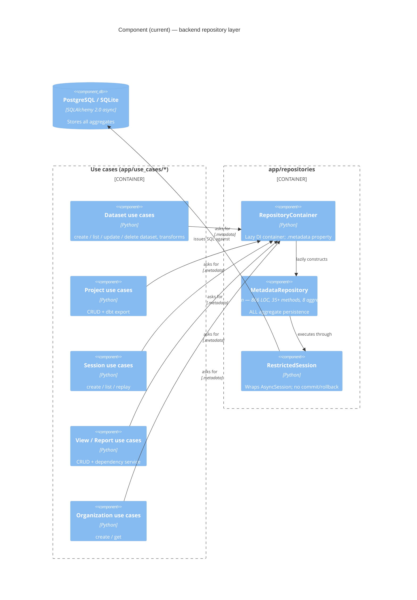
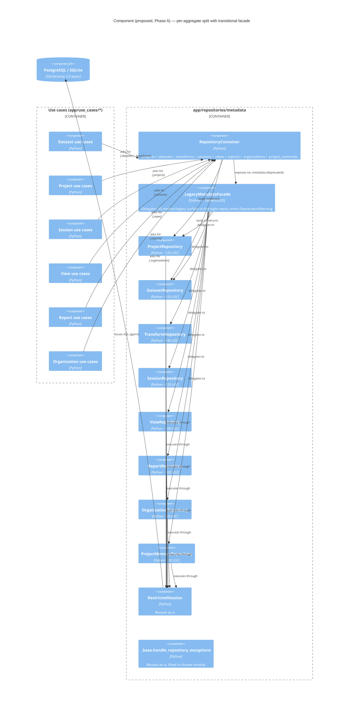
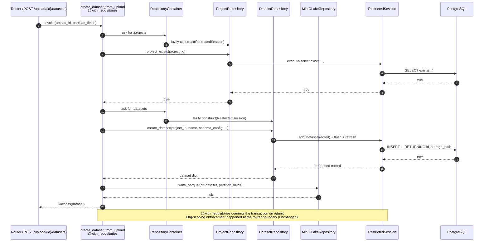

<!-- DES-ENFORCEMENT : exempt -->
# C4 Diagrams — Metadata Repository Split

## L3 Component — Current state

One class, eight aggregates, 35+ methods. Use cases bind to a single facade.

## L3 Component — Proposed (Phase A — facade in place)

Eight per-aggregate repositories register with the container; the facade preserves the legacy `.metadata` surface during migration.

## L3 Component — Terminal (Phase C — facade removed)

Same as Phase A minus `_LegacyMetadataFacade` and the `.metadata` property. The `pytest-archon` rule promotes from warn to error: any new use case that imports the legacy facade fails CI.

## Sequence — `create_dataset_from_upload` (representative)

Shows the new container-property access path. The use case touches two aggregates (Dataset, Project for existence check) plus the lake; this surfaces the multi-aggregate access pattern that justified one-class-per-aggregate over β grouping.

