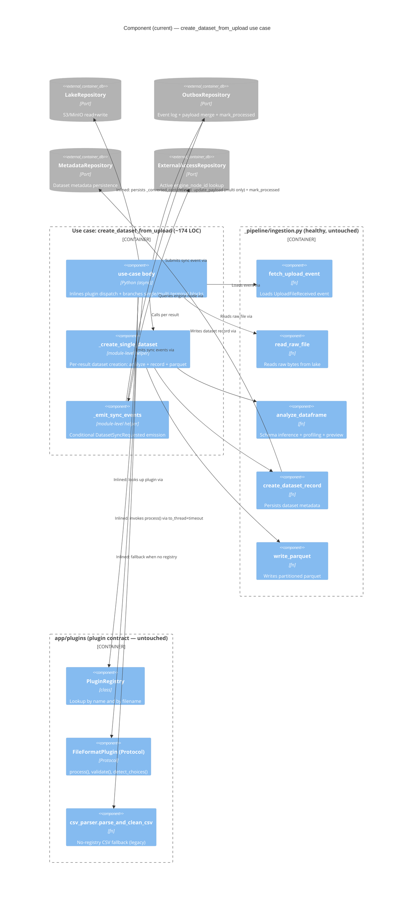
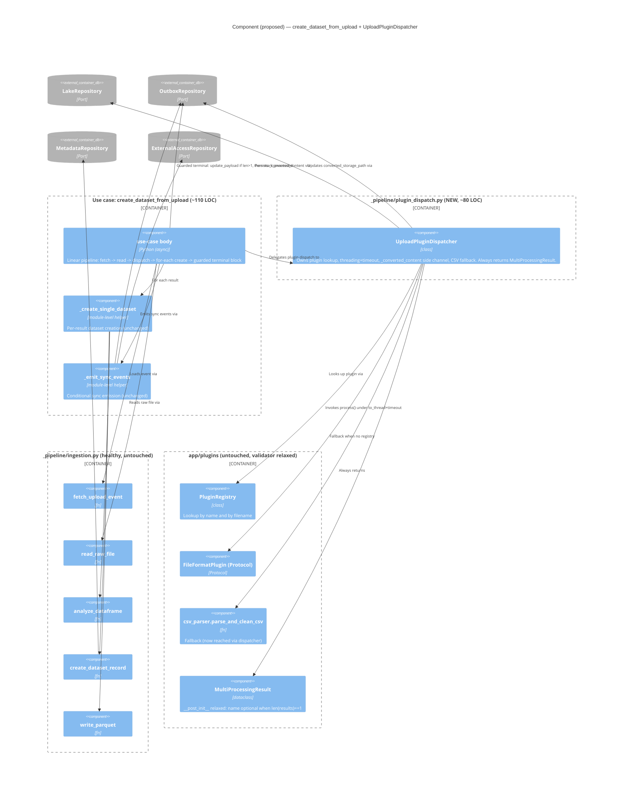
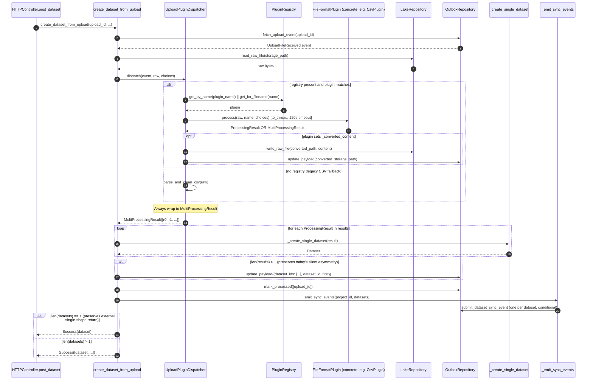

<!-- DES-ENFORCEMENT : exempt -->
# C4 Diagrams — Refactor Upload Pipeline Modularity

Two Component-level (L3) diagrams (current vs proposed) plus one sequence diagram for the unified dispatcher flow.

L1 (System Context) and L2 (Container) are unchanged by this refactor — see `docs/product/architecture/brief.md` for the canonical container view. This is a use-case-internal modularity refactor; no container or external-system surface changes.

---

## L3 — Current component shape (`create_dataset_from_upload`)

**Smell visible above.** The use-case body has direct edges to `PluginRegistry`, `FileFormatPlugin`, `csv_fallback`, AND inline edges to `LakeRepository` (for `_converted_content` persistence) and `OutboxRepository` (for the multi-only `update_payload`). Five separate concerns hanging off one component.

---

## L3 — Proposed component shape (post-refactor)

**Improvement visible above.** The use-case body now has *one* edge into the dispatch concern (`UploadPluginDispatcher`) and *one* guarded edge into the outbox terminal block. The plugin/CSV/`_converted_content` knowledge has moved entirely into the dispatcher. Five inlined edges in the current shape collapse to one delegated edge in the proposed shape.

---

## Sequence — Unified dispatcher flow (single and multi as one path)

**Three observations from the sequence.**

1. The **internal** dataset-construction loop runs the same number of iterations regardless of single-vs-multi (length-1 loop for single). The branchy `if isinstance(...)` block in the current code disappears.
2. The outbox `update_payload` step is **explicitly guarded** by `len(results) > 1` — preserving today's silent asymmetry rather than silently aligning it. DISTILL adds an absence-assertion test for the single-path case (see design.md §7 risk #1).
3. The **external** return shape is preserved: single-result -> `Success(dataset)`; multi-result -> `Success([dataset, ...])`. The unification is internal pipeline shape only, never reaches `HTTPController.post_dataset`. The latent multi-dataset HTTP-envelope mishandling stays exactly as it is today.
