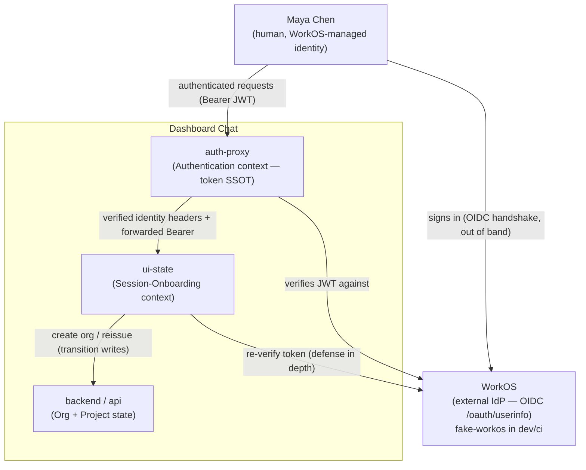
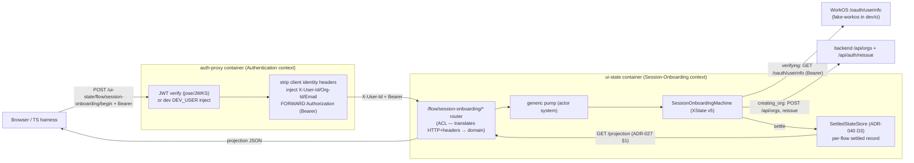
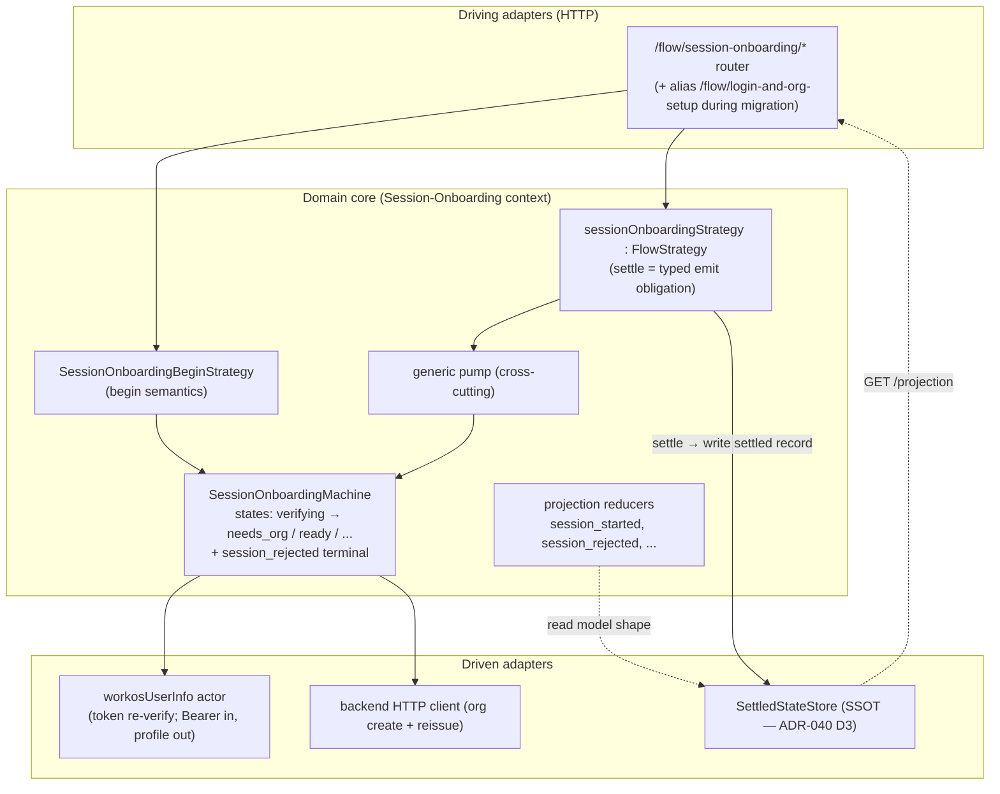

# C4 Diagrams — session-onboarding

**Wave:** DESIGN (Domain / bounded-contexts scope, propose mode) · **Date:** 2026-05-22 · **Author:** Hera (nw-ddd-architect)
**Status:** PROPOSED — pending user ratification
**Scope:** domain-level topology for the `session-onboarding` realignment of `ui-state/lib/machines/login-and-org-setup/`.

These diagrams are domain-level (bounded-context oriented), not infrastructure-level. The
container topology itself is **unchanged** by this feature (ADR-030 §1 + ADR-033/034 +
ADR-040 are authoritative for runtime topology). The diagrams below exist to make the
**Authentication ↔ Session-Onboarding** boundary, the ACL at the ui-state router, and the
re-verification call to WorkOS legible. They reflect the *proposed* to-be flow (§4 of the
seed brief).

---

## C4 Level 1 — System Context

Who authenticates, who onboards the session, and where identity originates.

**Reading note.** The authentication *handshake* (`user → WorkOS`) happens **upstream and
out of band**; it never enters `ui-state`. By the time a request reaches `ui-state`,
auth-proxy has already authenticated it (ADR-016, ADR-030 §1). The `ui-state → WorkOS`
arrow is a **re-verification** of an already-issued token (L3), not the authenticator.

---

## C4 Level 2 — Container (the request path for one sign-in)

The runtime path of a `session_started` onboarding. Container topology is per ADR-030 §1
(behind auth-proxy, single replica) and is **not changed** by this feature.

**Container deltas vs today: NONE.** Per ADR-040, the read-port becomes the
`SettledStateStore` (LEAF-5); this feature inherits that decision and does not introduce a
new container, port, or env var. The only domain-relevant change inside the container is
the **machine vocabulary + the re-verify input** (Bearer instead of `persona_email` lookup
code).

---

## C4 Level 3 — Component (ui-state hexagon, session-onboarding slice)

The internal components of the `session-onboarding` slice within the `ui-state` hexagon
(ADR-040 target state). Only the login/session-onboarding strategy is drawn; the
project-context and session-chat strategies are siblings (omitted for focus).

**Key component changes this feature introduces (PROPOSED):**

| Component | Change |
|---|---|
| `SessionOnboardingMachine` | Rename of `LoginAndOrgSetupMachine`; `anonymous`/`authenticating` collapse into `verifying`; add `[hasOrg]` shortcut + `session_rejected` terminal (L1, L6). |
| `SessionOnboardingBeginStrategy.begin()` | Seeds projection from `session_started` (carries the verified user) instead of reading user back from a just-reset projection (L2 — closes the placeholder defect). |
| `workosUserInfo` actor | Repurposed to a **direct `/oauth/userinfo` call with the forwarded Bearer** — drops the `persona_email`→code→token exchange (L3, L4). Identity from the token's profile (L5). |
| router (ACL) | Takes identity from the verified `X-User-Id` header + forwards the Bearer to the re-verify actor; **drops `persona_email` as a required body DTO field** (L4 closes the §2.5 production-path gap). |
| projection reducers | `session_started` + `session_rejected` reducers added; `sign_in_clicked` / `auth_callback_resolved` / `auth_failed` reducers retired (L6). |

---

## Boundary annotation — Anti-Corruption Layer

The `ui-state` router for `session-onboarding` is the **ACL** between the Authentication
context (auth-proxy's wire vocabulary: `X-User-Id`, `X-Org-Id`, `Authorization: Bearer`)
and the Session-Onboarding domain (`principal_id`, `session_started{user, org}`). The ACL
rule this feature ENFORCES: **identity is read from the verified token / verified headers,
never from a client-supplied body claim** (L4). The pre-existing `persona_email` body field
violated this; it is removed (production path) / demoted to a dev-only fixture seam (see
ADR-041 + open-question #1 resolution in `wave-decisions.md`).
</content>
</invoke>
