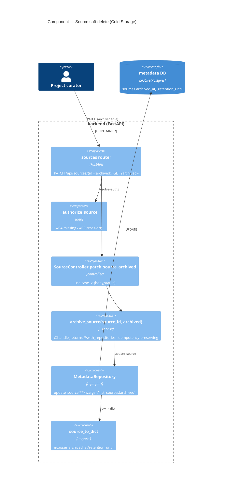

# Application Architecture — source-soft-delete-cold-storage

**Wave:** DESIGN (application scope, propose) · **Author:** Morgan (nw-solution-architect)
**Ratifies:** [ADR-055](../../../decisions/adr-055-patch-soft-delete-source-cold-storage.md)
**Feature:** DC-199 (parent DC-195) · Backend-only.

## Problem & drivers

Give a **Source** the recoverable Cold Storage a **Dataset** already has, exposed through a
`PATCH` state contract, fixing the DC-195 404. Quality attributes, ranked:

1. **Consistency / maintainability** — mirror the dataset MR-7 cold-storage machinery; do not fork a new `deleted_at` vocabulary.
2. **Testability** — port-boundary use case on the standard decorator stack; HTTP → use case → repository.
3. **Correctness** — idempotent archive that does not advance the retention clock; org-scoped.

## Reuse Analysis (MANDATORY)

| Existing Component | File | Overlap | Decision | Justification |
|---|---|---|---|---|
| `archive_dataset` / `restore_dataset` use cases | `app/use_cases/dataset/archive_dataset.py`, `restore_dataset.py` | sets/clears `archived_at`+`retention_until` | **CREATE NEW** `archive_source` | Bound to `DatasetRecord` + returns `Dataset` domain object via `DatasetService`; source path returns dicts. Structure is mirrored, not shared (extraction deferred — see ADR-055 debt note). One boolean-driven use case replaces the archive/restore pair. |
| `MetadataRepository.update_dataset(**kwargs)` | `app/repositories/metadata/repository.py` | generic column setter | **EXTEND (add sibling)** `update_source(source_id, **kwargs)` | Source repo has no generic setter (only `update_source_schema`); add one mirroring `update_dataset`. ~12 LOC. |
| `MetadataRepository.list_sources(project_id)` | `repository.py:562` | list query | **EXTEND** add `archived: bool \| None` param | Mirror `list_datasets` filter (`repository.py:350-368`): `None/False` → `archived_at IS NULL`; `True` → `IS NOT NULL`. |
| `_authorize_source(source_id, user, db)` | `app/routers/sources.py:22` | resolve + authorize source via parent project | **EXTEND (reuse verbatim)** | Already yields `404` (`SourceNotFound`) for missing and `403` (`AuthorizationError`, `deps.py:88`) for cross-org. No new authz code. |
| `source_to_dict` | `app/repositories/metadata/_mappers.py:100` | wire dict | **EXTEND** add `archived_at`/`retention_until` keys | Read-contract exposure. |
| `Source.serialize()` / `Source.from_record()` | `app/models/source.py:54,40` | domain serialize/hydrate | **EXTEND** add the two fields | Keep the domain model coherent with the wire dict. |
| `SourceController` | `app/controllers/source_controller.py:30` | source use-case → (body,status) | **EXTEND** add `patch_source_archived` | Mirror `DatasetController.archive_dataset` (`dataset_controller.py:111`). |
| Migration `015_add_dataset_cold_storage` | `migrations/versions/015_*.py` | add cold-storage columns (datasets) | **CREATE NEW** `021_add_source_cold_storage` | Same two `add_column` calls against `sources`; chains off current head `020_add_dataset_model_name`. |

**Zero unjustified CREATE NEW**: the two CREATE-NEWs (use case, migration) are per-aggregate mirrors that cannot be literally shared without the mixin extraction ADR-055 defers.

## Components & flow

### Sequence — archive (idempotency-preserving)
1. `PATCH /api/sources/{id}` `{archived:true}` → `_authorize_source` (404 missing / 403 cross-org).
2. `SourceController.patch_source_archived(id, archived=True)` → `archive_source(id, archived=True)`.
3. Use case reads the source; **if `archived_at is None`** sets `archived_at=now`, `retention_until=now+90d` via `update_source`; **else no-op** (retention clock preserved).
4. Returns refreshed source dict (now carrying the two fields) → `200`.

Restore is the same path with `{archived:false}` → `update_source(archived_at=None, retention_until=None)`, unconditionally.

## Contract

- **Request body** (`app/routers/schemas/source.py`): `SourceArchiveRequest(BaseModel): archived: bool`. Minimal today; extensible to a general `SourceUpdate` later without breaking `{archived}`.
- **Responses:** `200` with the source body (incl. `archived_at`, `retention_until`); `404` unknown source; `403` cross-org; `422` malformed body.
- **List:** `GET /api/sources?project_id=..&archived=true|false` — `archived` defaults `false` (active only).

## Test architecture
- Use-case unit tests at the repository **port** (override `repositories={'metadata_repository': ...}`), covering: archive sets both fields; re-archive preserves `archived_at`; restore clears; unknown id → `SourceNotFound`.
- Router/integration: `403` cross-org, `404` unknown, `200` round-trip (archive → default-list excludes → `?archived=true` includes → restore → default-list includes).
- Migration up/down on SQLite + Postgres.
- Iron Rule: the regression test archives a source successfully (fails on today's tree — no endpoint) and passes after.

## Migration note
`021_add_source_cold_storage` `revises` the **current head `020_add_dataset_model_name`** (not 019 — 020 landed after the sources table). DELIVER confirms via `alembic heads` and follows the `alembic-migration` skill (portable `add_column`, no index — org-scoped via `project_id`).
