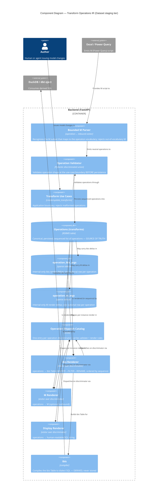
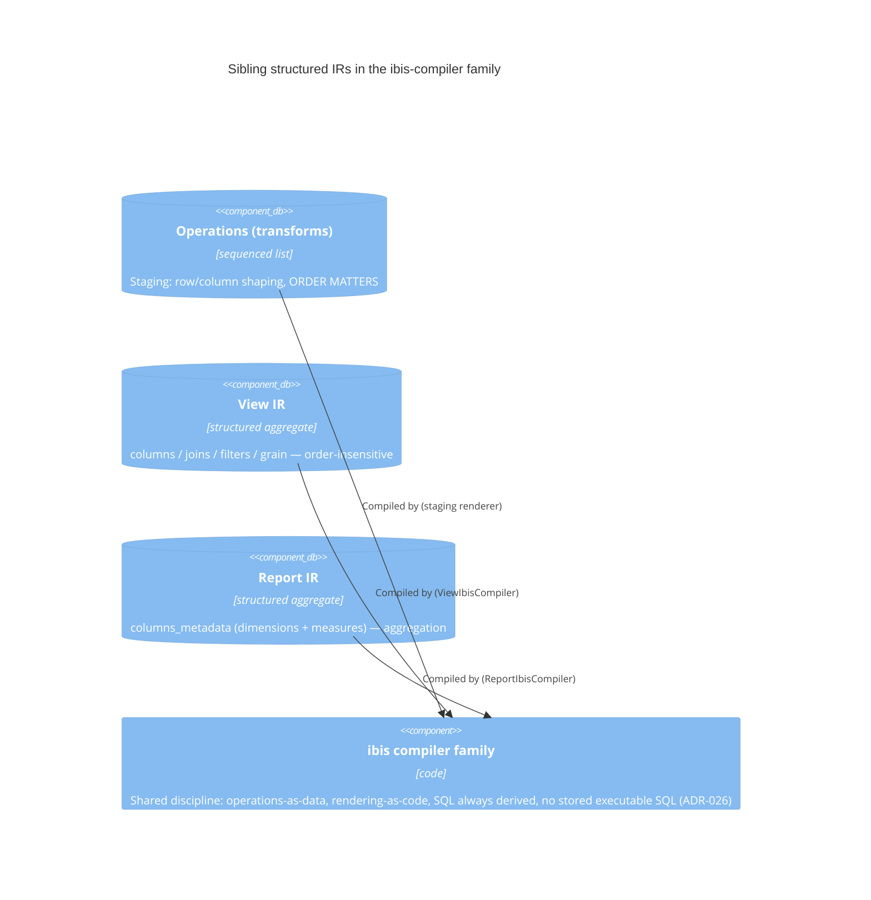

# C4 Component — Transform Operations IR + Multi-Renderer Topology

Level 3 (Component) diagram of the operations-IR proposal. Shown because the
multi-renderer + sidecar + View/Report-sibling topology is the load-bearing
part of the proposal and benefits from an explicit picture. Every arrow is
labeled with a verb. ibis/SQL are always on the *derived* (outbound) side; the
persisted operations list is the only authority.

## Reading notes

- **Authority direction.** Everything flows *out of* `Operations`. The M parser
  is the only inbound writer (besides direct use-case authoring); ibis and SQL
  are strictly downstream and never read back into the operations table.
- **Bounded parser.** The M Parser sits *before* the validator — an
  out-of-vocabulary M construct is rejected at parse time, never half-imported.
- **Sidecars.** `operation_ibis_args` / `operation_m_args` are sparse and
  internal; they shape *render*, not *intent*. A renderer left-joins its own
  sidecar; absence means "render the neutral operation faithfully".
- **One catalog, many visitors.** The dispatch catalog is the single place an
  operation's rules live; each renderer is a visitor over the same
  discriminator. Completeness across visitors is enforced by a static probe.

## View / Report relationship (siblings, not shared rows)

The three IRs are unified by a shared *discipline*, not a shared table. Only the
staging operations list carries the `sequence` ordering invariant.
