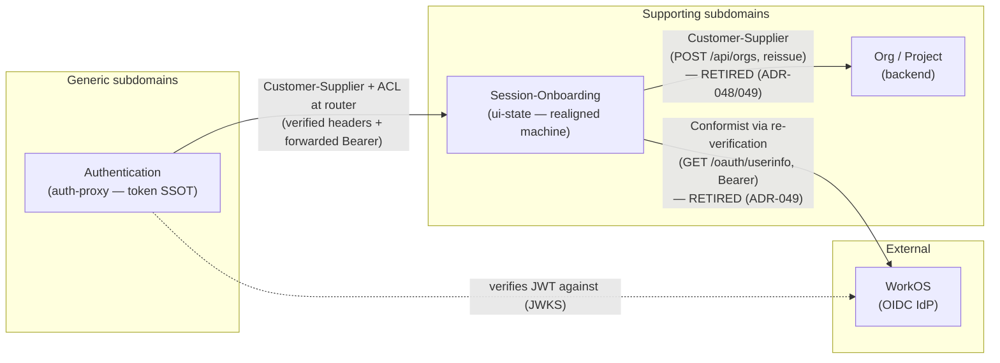
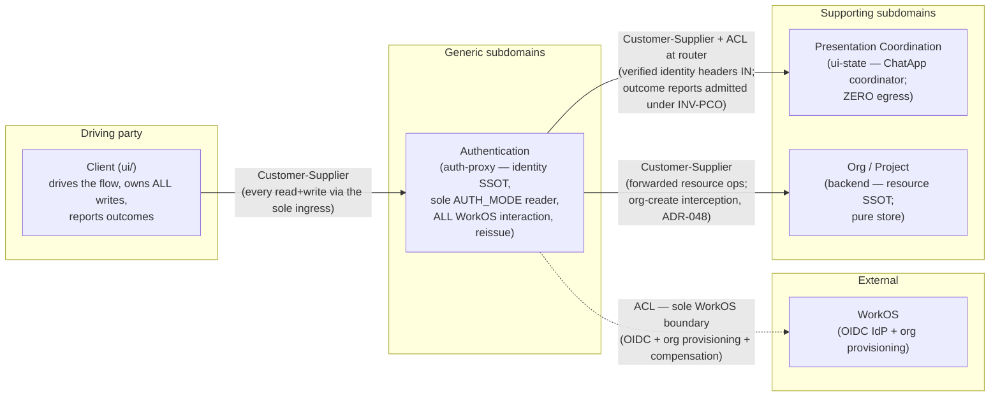

# Architecture Brief — Dashboard Chat

**Status:** Living document — bootstrapped 2026-05-08
**Owners:**
- Application architecture: nw-solution-architect (current author: Morgan)
- System / domain / infrastructure architecture: future architects extend below

This brief is the SSOT root for architectural decisions across waves. Each
architect appends to their own section; ADRs in `docs/decisions/` are the
ratified atoms this document indexes. Prior architect sections are absent
because this is the first DESIGN-wave architectural feature to bootstrap the
brief.

---

## System Architecture

This section accumulates system-scope architectural decisions: topology,
scaling, observability, deployment surface, persistence substrates, and
infrastructure-level concerns. Each feature's DESIGN wave (system-scope
pass) appends a sub-heading. Bootstrapped 2026-05-11 by Titan
(nw-system-designer) when the first system-architecture-shaped feature
ran DESIGN.

### Constraint inheritance (system-scope)

| Source | Constraint | Effect on system architecture |
|---|---|---|
| ADR-001 | Hono over Express for new Node services | All new Node tiers ship on Hono; no per-service framework re-litigation |
| ADR-016 | Auth-proxy is the sole production ingress (for backend; aspirational for agent today) | New privileged-operation tiers MUST route through auth-proxy; the door is documented for future migration of `/worker/*` to also route through auth-proxy. ADR-048 (client-driven-onboarding) removes the last in-network bypass besides the agent's: ui-state's direct-to-backend egress is retired |
| ADR-018 | Capability-presence dispatch — `REDIS_URL` set → Redis tier; unset → noop fallback | All new tiers that need durable replay reuse this dispatch shape verbatim; no new env-var conventions |
| ADR-015 | nginx routing rule `/api/channels/:id/presentation-state` → agent direct (load-bearing for ADR-015's directive log) | Must be preserved through any frontend tier transition; ADR-031 honors this |

### Current container topology (as of 2026-05-11)

| Container | Role | Stateful? | Replica count | Host port |
|---|---|---|---|---|
| `frontend` | nginx — static SPA + reverse-proxy router | No (config-driven) | 1 (fixed host port) | 5173:80 |
| `auth-proxy` | Hono — JWT verification + identity-header injection | Stateless (keypair on volume) | 1+ (scalable; pending shared secrets) | 1042:3000 |
| `agent` | Hono + Groq SDK — chat brain | In-process presentation-state log; Redis-backed when configured | 1 (fixed host port; ADR-018) | 1041:8787 |
| `api` (backend) | FastAPI + SQLAlchemy + Ibis — dataset + project state | Yes (SQLite/PG + Redis read for session log) | 1 | 8000:8000 |
| `redis` | Redis 7 — append-only log substrate for 2 (soon 3) key prefixes | Yes (volume-backed) | 1 | 6379:6379 |
| `minio` | S3-compatible object store — Parquet datalake | Yes | 1 | 9000:9000 |
| `query-engine` | pg_duckdb — DuckDB compute | Yes | 1 | 5433:5432 |

The frontend's nginx is the de-facto multi-upstream router today (proxies `/api/` to auth-proxy; `/worker/` to agent direct; `/api/channels/:id/presentation-state` to agent direct per ADR-015). Auth-proxy is single-upstream today (`BACKEND_URL` only); this changes for new tiers per ADR-030.

### System-architecture features

#### `user-flow-state-machines` (DESIGN — 2026-05-11 — system-scope pass)

**Author:** Titan (nw-system-designer)
**ADRs:** ADR-030 (topology + scaling, Proposed), ADR-031 (frontend tier transition, Proposed)
**Companion (application-scope):** Morgan's ADR-027/028/029
**Feature design:** `docs/feature/user-flow-state-machines/design/{system-architecture.md, application-architecture.md, wave-decisions.md, upstream-changes.md}`
**Status:** Proposed → awaiting system-designer-reviewer + user ratification of single-replica + multi-upstream auth-proxy → DISTILL

**Topology decision summary.** The new ui-state tier sits **behind auth-proxy**, which gains a multi-upstream routing table (`/api/auth/*` → local; `/ui-state/*` → ui-state; `/api/*` → backend; future `/worker/*` → agent). Auth-proxy keeps its single concern (auth verification + identity injection); it gains a path-prefix routing layer (~30 lines of Hono routes + tests). The ui-state tier is the first tier to be routed through auth-proxy for privileged operations, honoring ADR-016 from day 1 (the agent's bypass is documented as a pre-existing inconsistency).

**Scaling decision summary.** The ui-state tier deploys as **exactly one replica** in compose (fixed host port `1043:8788`, mirroring the agent's pattern). XState v5's in-process actor model precludes cross-replica FREEZE/THAW without Redis pub/sub re-implementation; back-of-envelope estimation shows a single 256MB container handles 10x load (1,000 concurrent users; 3,000 active actors; 1,000 Redis XADDs/sec) with 2-3 orders of magnitude headroom on every dimension. Scaling-ceiling triggers (CPU>60%, RAM>200MB, actors>10K, SLO target >99.5%) are documented; migration to multi-replica sticky-routing (Option γ) is pre-costed at 1-2 weeks.

**Persistence stance.** Redis Streams via ADR-018 inheritance. New key prefix `ui-state:{flow_id}:events` where `flow_id = <machine-name>:<principal_id>` for per-user flows (mandatory for multi-tenant safety). XADD per transition; snapshot every 50 events. Probe contract: XADD/XRANGE/DEL round-trip; HARD-fail at startup if Redis is unreachable. Redis blast radius grows: three key prefixes (`ui-state:`, `session:`, `presentation-state:`) now share one Redis container — operator runbook should add Redis HA before the next service joins the substrate.

**Frontend tier transition.** A NEW `ui-presentation` container runs Remix's Node server alongside the existing nginx-static `reverse-proxy` container. nginx is byte-unchanged except for one new upstream rule for migrated routes (`/login`, `/org/$org` in PR-0). The strangler-fig migration runs one route family per PR; rollback per route is a one-line nginx.conf revert. ADR-015's load-bearing `/api/channels/:id/presentation-state` rule is preserved verbatim.

**New containers introduced:**

| Container | Role | Replica | Host port |
|---|---|---|---|
| `ui-state` | Hono + XState v5 — ui-state machines, projection endpoints | 1 (mandatory) | 1043:8788 |
| `ui-presentation` | Remix v2 on Node — server-side route loaders for migrated routes | 1 | (internal only; not exposed) |

Compose acceptance stack grows from 5 services (ADR-016) to **7 services** (+`ui-state`, +`ui-presentation`).

**Observability stance.** Per-transition structured JSON to stdout (event=`flow.transition`, with machine_id, from_state, to_state, sequence_id, correlation_id, principal_id, org_id, duration_ms). FREEZE/THAW emit their own events (`flow.freeze.broadcast`, `flow.thaw.broadcast`). Health endpoints: `/health`, `/health/probes`, `/health/actors` (aggregate counts only). Metrics derived from logs by external aggregator; no in-tier metrics endpoint at PR-0. OpenTelemetry deferred — system-wide decision, not feature-local. Correlation-ID propagation MANDATORY on every request, every outgoing call, every FlowEvent record.

**SPOF assessment.** The ui-state tier is a SPOF for sign-in + scope transitions (MTTR ~30s on crash; lazy Redis rehydration on first projection read). It is NOT a SPOF for chat (agent independent), dataset operations (backend independent), or any other in-progress flow. Failover verified in compose acceptance test (`docker compose restart ui-state` mid-flow → recovery <60s). No NEW SPOF compared to today's stack; existing SPOFs (Redis, auth-proxy, backend) are inherited.

**Quality gates passed (this DESIGN wave, system-scope pass).**

- [x] Topology decision with explicit options + trade-offs (`system-architecture.md` §1).
- [x] Scaling shape decision driven by back-of-envelope estimation (`system-architecture.md` §0).
- [x] Persistence substrate inheritance ratified + contract spec extended (multi-tenant `flow_id`).
- [x] Observability surface specified (events + health + metrics + correlation-id).
- [x] Frontend tier transition with strangler-fig migration path (ADR-031).
- [x] Updated C4 Container diagram in Mermaid (`system-architecture.md` §8).
- [x] Deployment diagram (`flowchart TB`) showing replicas + routing + sticky-vs-round-robin (`system-architecture.md` §9).
- [x] Top-3 system risks identified for DEVOPS handoff (`system-architecture.md` §12).
- [x] Pushbacks on Morgan's design documented (`upstream-changes.md` Changes 9-13).
- [ ] Peer review pending (`system-designer-reviewer`).

#### `client-driven-onboarding` (DESIGN — 2026-06-10 — system-scope pass)

**Author:** Titan (nw-system-designer)
**ADR:** ADR-048 (auth-proxy owns the WorkOS write workflow, Proposed)
**Seed (fixed inputs):** `docs/feature/client-driven-onboarding/design-intent.md` (user-ratified boundary assignments — not re-litigated)
**Feature design:** `docs/feature/client-driven-onboarding/design/system-architecture.md`
**Status:** Proposed → awaiting user ratification of R1–R5 (failure/compensation layering, probe posture, agent AUTH_MODE scoping, WORKOS_BASE pin, timeout numbers) → domain + application passes

**Decision summary.** The WorkOS write workflow (org create + membership) relocates from the backend to **auth-proxy via interception of `POST /api/orgs`** in the existing catch-all proxy path — the request-side twin of the already-shipped post-response reissue seam, which is simultaneously extended to emit the org-scoped token as `Set-Cookie` (un-parking ui-cookie-session D8). Auth-proxy becomes the **sole WorkOS credential holder and sole AUTH_MODE reader** on the org/onboarding path: backend loses `AUTH_MODE` + all `WORKOS_*` env and config fields (`_create_workos_org` deleted); ui-state loses **all network egress** (`BACKEND_URL`, `FAKE_WORKOS_URL` retired), removing its documented ADR-016 bypass and the machine-internal I/O behind the 2026-06-10 fragility. Failure strategy: **backend name pre-check before any WorkOS egress** (a 409 can never orphan an IdP org) layered with **best-effort compensation delete** on failed persist; accept-and-reconcile rejected (no scheduler for a ~0.001 QPS path; uncompensated orphans are inert + alertable via `workos.org_compensate.fail`).

**Topology verdict: no structural change.** Zero new containers/replicas/ports; **zero nginx changes** (`location /api/` already routes mode-discovery, login, and org-create to auth-proxy — verified against `frontend/nginx.conf`). Org-create availability traverses WorkOS through auth-proxy instead of backend — same external dependency, relocated, one fewer in-network credential holder. The compose AUTH_MODE split-brain becomes unrepresentable; the override's interim api pin is deleted on schedule.

**Observability stance.** Structured stdout-JSON on the interception path (`org_create.intercepted`, `workos.org_create.*`, `workos.membership_create.*`, `workos.org_compensate.*`, `auth.reissue.emitted`) reusing the existing KPI emitter; correlation-id mandatory per ADR-030 inheritance. Probe: workos-mode startup reachability probe SOFT-fails (`health.startup.degraded`) — the sole ingress must not crashloop on an IdP blip; ui-state's probe surface shrinks to Redis only (no egress left to probe).

**Quality gates passed (this DESIGN wave, system-scope pass).**

- [x] Capacity estimation before architecture (org-create ~0.001 QPS; +300–600 ms p50 relocated, not added — `system-architecture.md` §0).
- [x] Failure/compensation decision with explicit options + trade-offs (§2 matrix; A+B layered recommended).
- [x] Reverse-proxy routing verified against the live nginx conf (zero delta, §3).
- [x] Credential-surface deltas enumerated per container with file:line evidence (§4).
- [x] Observability surface specified (events + alert conditions + correlation-id, §5).
- [x] Earned-trust probe contract updated for the relocated egress (§7).
- [x] Topology/SPOF delta assessed and explicitly null (§8).
- [x] C4 context + container diagrams (before-bypass vs after) in Mermaid (§8).
- [x] Reuse Analysis hard gate: zero unjustified CREATE NEW (§9).
- [x] Open points routed to the next passes (org-id carry, outcome events, mode-discovery shape — design-intent (a)–(f)).
- [ ] User ratification of R1–R5 pending.
- [ ] Peer review pending (`system-designer-reviewer`).

### Cross-section index (system-scope ADRs)

| ADR | Summary |
|---|---|
| ADR-001 | Hono over Express for new Node services |
| ADR-015 | nginx routes presentation-state log to agent direct (load-bearing) |
| ADR-016 | Auth-proxy sole production ingress (for backend; aspirational for agent today) |
| ADR-017 | SessionEventReader capability-presence dispatch (superseded by ADR-018) |
| ADR-018 | Redis-only SessionEventReader (supersedes ADR-017) |
| ADR-030 | UI-state tier topology + single-replica scaling (Proposed) |
| ADR-031 | Frontend tier transition — Remix alongside nginx, not replacing (Proposed) |
| ADR-048 | Auth-proxy owns the WorkOS write workflow — org-create interception, credential/AUTH_MODE consolidation, ui-state egress removal (Proposed) |

---

## Domain Model

Bootstrapped 2026-05-22 by Hera (nw-ddd-architect) when the first
domain-modeling-shaped feature (`session-onboarding`) ran DESIGN. Each
domain-scope DESIGN pass appends a sub-heading. The existing taxonomy
`dataset` / `view` / `report` remains documented inline in ADR-015's "Naming
discipline" section (not re-derived here).

### Bounded contexts (current map)

`ui-state/` is **one bounded context** (ADR-039 TL;DR) — the
project-context / session-chat / session-onboarding split is a
Single-Responsibility partition inside one ubiquitous language, not a
context-map boundary. The system-level context map relevant to
`session-onboarding`:

| Context | Owner (source tree) | Subdomain class | Role |
|---|---|---|---|
| **Authentication** | `auth-proxy/` | Generic (commodity — JWT verify, identity injection, token SSOT) | Verifies the WorkOS-issued JWT, injects identity headers, forwards the Bearer. Token SSOT (ADR-016). *(Amended 2026-06-10, ADR-048/049: also sole AUTH_MODE reader + ALL WorkOS interaction incl. the org-create IdP half + the org-scoped reissue.)* |
| **Session-Onboarding** | `ui-state/` (the realigned machine) | Supporting (enables core; bespoke org-binding flow) | Brings an already-authenticated principal to an org-scoped, app-ready state. *(Renamed 2026-06-10 → **Presentation Coordination** — still ONE bounded context per ADR-039; the ChatApp coordinator's onboarding/project-context/session-chat regions are an internal SRP partition. ADR-049: zero network egress; transitions on client-reported outcome events only.)* |
| **Org / Project** | `backend/` | Supporting | Owns org + project + dataset state; ~~org creation + JWT reissue~~ *(superseded 2026-06-10, ADR-048/049: pure resource store — org creation's IdP half + the reissue belong to Authentication; backend keeps the resource half: local row, name uniqueness, `created_by`)*. |
| **WorkOS** (external) | external IdP (fake-workos in dev/ci) | Generic | OIDC handshake (upstream, out of band) ~~+ `/oauth/userinfo` re-verification target~~ *(re-verify retired 2026-06-10, ADR-049; auth-proxy is the sole WorkOS boundary, incl. org provisioning per ADR-048)*. |
| **Client (ui/)** *(added 2026-06-10, ADR-049)* | `ui/` | — (the driving party, not a server-side subdomain) | Drives the flow, owns ALL writes (catalog write-through pattern), probes the SSOTs, reports outcomes to ui-state. |

### Context map (session-onboarding) — SUPERSEDED IN PART 2026-06-10 (ADR-049; see amended map below)

The two ui-state-downstream edges in this diagram (Conformist re-verify to
WorkOS; Customer-Supplier to Org/Project) are **deleted** by ADR-048/049 —
retained here as history.

### Context map (amended — client-driven-onboarding, 2026-06-10, ADR-049)

The ui-state context (now **Presentation Coordination**) has **no downstream
suppliers at all** (zero egress, ADR-048); the client (ui/) is the driving
party; org creation's IdP half lives in Authentication, its resource half in
backend Org/Project.

**ACL annotation.** The `/flow/session-onboarding/*` router is the
Anti-Corruption Layer between Authentication's wire vocabulary
(`X-User-Id`, `Authorization: Bearer`) and the Session-Onboarding domain
(`principal_id`, `session_started{user, org}`). ACL rule enforced:
**identity from the verified token / verified headers, never a client body
claim** (closes the pre-existing `persona_email`-as-DTO production gap).

**ACL annotation — amended 2026-06-10 (ADR-049, INV-PCO).** The
identity-from-headers rule **survives, absolute and unchanged**. Client-posted
**outcome reports** (`org_created_reported`, `project_created_reported`, …)
are a different trust category, governed by the named invariant **INV-PCO
(Presentation-Coordination-Only trust)**: ui-state state — the
`ChatAppStateDocument`, every region context field, every outcome event — is
trusted for presentation coordination ONLY; never an authorization input,
never a resource-existence oracle, never identity. The backend remains the
resource SSOT, auth-proxy the identity SSOT; enforcement is by construction
(ui-state has zero egress, no downstream component reads it, reports apply
only to the reporting principal's own header-keyed actor — a false report can
only break the liar's own screen). The router ACL survives re-scoped to
well-formedness + phase-applicability validation (shape, not truth).

### Aggregate — OnboardSession

One aggregate, root entity with value-typed properties (Vernon's ~70%
root-only case). The aggregate is the noun/thing the flow manages
(`OnboardSession`); the flow/machine that onboards it stays named
`session-onboarding` / `SessionOnboardingMachine` — a deliberate
aggregate-noun vs flow-descriptor distinction (ratified 2026-05-22).

| Vernon rule | How this aggregate satisfies it |
|---|---|
| **1 — true invariants in the boundary** | A single principal's (verified `user`, `org` binding, settled `state`) tuple is one consistency boundary. No second entity must change in the same transaction. |
| **2 — small aggregate** | Root-only: `user` (VO), `org` (VO), state value, validation/error VOs. No child entities. |
| **3 — reference other aggregates by id** | `Org` is referenced by id; org *creation* is a call to the backend Org aggregate (separate context). The onboarding aggregate holds `{org_id, org_name}` as a value snapshot, not an Org entity. |
| **4 — eventual consistency outside** | The `auth_ready` broadcast to project-context is a pump-mediated cross-aggregate signal, not a shared transaction. |

Flow / stream identity: `flow_id = session-onboarding:<principal_id>`
(ADR-030 §6 per-user flow naming).

### Event model (corrected flow)

Opening event `session_started{user, org|null}` is self-contained and seeds
the projection (closes the placeholder defect). Lifecycle:
`session_started → [hasOrg] ready | [else] needs_org → org_created → ready`,
with `session_rejected` (terminal, re-verify failure), and the preserved
`expired_token` / `error_recoverable` / `error_terminal` side-states. Full
Given/When/Then specs:
`docs/feature/session-onboarding/design/event-model.md`.

Retired wire vocabulary (was authentication-context leakage):
`sign_in_clicked`, `auth_callback_resolved`, `auth_failed`, `anonymous`,
`authenticating`. Renamed: `authenticated_no_org → needs_org`.

**Amended 2026-06-10 (ADR-049):** the actor-driven half of this lifecycle is
superseded by the client-reported outcome model — `verifying` →
`awaiting_org_report` (no invoke), `creating_org` retired, `session_rejected`
retired (its producer, the re-verify, is gone), `error_recoverable` retained
and made genuinely retryable (accepts outcome reports). Full statecharts +
Given/When/Then:
`docs/feature/client-driven-onboarding/design/domain-model.md` §4–§6.

### Read-model substrate (ES-vs-store)

Session-onboarding adopts the **server-authoritative `SettledStateStore`**
(ADR-040 D3 inheritance — ADR-042), NOT event-sourcing. Rationale: thinnest
flow in the system, no written audit/temporal requirement, and the store
eliminates the emission-completeness invariant that produced this feature's
defect. Lands after ADR-040 LEAF-5 (sequencing constraint).

### Ubiquitous language glossary (Presentation Coordination context — renamed from Session-Onboarding 2026-06-10, ADR-049)

| Term | Meaning | Replaces |
|---|---|---|
| Session onboarding | Bringing an already-authenticated principal to an org-scoped app-ready state | "login" (happens upstream) |
| Principal | Verified user identity injected by auth-proxy (`X-User-Id`) | `persona` (a dev fixture) |
| Re-verification | Defense-in-depth re-check of the forwarded Bearer against WorkOS `/oauth/userinfo` *(RETIRED 2026-06-10, ADR-049 — auth-proxy is the sole verifier)* | "authentication" |
| Verified user | The WorkOS profile (`email`, `display_name`) ~~from re-verification~~ *(amended 2026-06-10: from auth-proxy-verified identity headers at cold-start, ADR-049 DR-4)* | `persona_email`/`persona_display_name` body claims |
| Org binding | The (org_id, org_name) the principal operates under *(amended 2026-06-10: a **display snapshot** sourced from outcome reports, never authoritative — INV-PCO)* | — |
| Session rejected | Terminal state when re-verification fails *(RETIRED 2026-06-10, ADR-049 — auth failure is auth-proxy's 401, never a ui-state state)* | — (new) |

Glossary additions (2026-06-10, ADR-049 — Presentation Coordination context):

| Term | Meaning | Replaces |
|---|---|---|
| Outcome report | A client-posted `*_reported` event narrating a result the client observed from the SSOTs; admitted under INV-PCO as a presentation-coordination signal, never a fact | the `loadSession`/`createOrg`/`resolveInitialScope`/`createProject`/`switchProject` invokes (retired) |
| Existence probe | The client's sparse read (`GET /api/orgs/me`, `GET /api/projects*`) through the normal ingress, whose answer it reports | the machine-internal `getUserOrg`/`resolveInitialScope` calls |
| Display snapshot | An org/project value held in ui-state context purely for rendering; sourced from reports; never authoritative | — |
| Convergence | Late/duplicate/contradicted reports are absorbed without error; the returned document tells the reporter the actual current state (multi-tab safety) | the settled-child crash + the `partial-setup` dead-end |
| INV-PCO | The Presentation-Coordination-Only trust invariant (see the amended ACL annotation above) | — |

### Domain-model features

#### `session-onboarding` (DESIGN — 2026-05-22 — domain scope, propose mode)

**Author:** Hera (nw-ddd-architect)
**ADRs:** ADR-041 (domain realignment, Proposed), ADR-042 (store-model inheritance, Proposed)
**Seed:** `docs/feature/session-onboarding/design-intent.md`
**Deliverables:** `docs/feature/session-onboarding/design/{wave-decisions.md, c4-diagrams.md, event-model.md}`
**Status:** PROPOSED → awaiting user ratification of L1–L6 inheritance + OQ-1..6 (esp. OQ-4 ES-vs-store) → ddd-architect-reviewer → DISTILL

**Decision summary.** Realign the `login-and-org-setup` machine to
`session-onboarding`: it modeled an authentication handshake that completes
upstream (a bounded-context leak), producing a probe-verified defect (resolved
user profile never reaches the projection). The corrected flow opens with a
self-contained `session_started{user, org|null}` event that seeds the
projection (defect closed by construction), repurposes the `workosUserInfo`
invoke as Bearer-based re-verification (defense-in-depth, not the
authenticator), adds a `[hasOrg]` returning-user shortcut and a
`session_rejected` terminal, and adopts ADR-040's server-authoritative store.
This is a behavior change → needs RED acceptance coverage (session_rejected,
[hasOrg], identity-at-t0) at DISTILL.

**Reuse verdict:** correction-in-place — 0 net-new domain artifacts; EXTEND
the machine / strategy / projection / router; DELETE `derivePersonaCode`;
defer `harvestSettled*` deletion to ADR-040 LEAF-5 and the reissue path to an
OQ-5 empirical check. Full table: `wave-decisions.md` §2.

**Sequencing constraint.** Lands AFTER ADR-040 LEAF-4/5/6 (do not entangle
with the in-flight hexagonal-transport series). The store substrate (ADR-042)
is only real after LEAF-5.

#### `client-driven-onboarding` (DESIGN — 2026-06-10 — domain scope, propose mode)

**Author:** Hera (nw-ddd-architect)
**ADR:** ADR-049 (client-reported outcome event model, Proposed; amends ADR-041 — supersession map in ADR-049 §2)
**Companion (system scope, same wave):** ADR-048 (Titan)
**Seed (fixed inputs):** `docs/feature/client-driven-onboarding/design-intent.md` (boundary assignments user-ratified, not re-litigated)
**Deliverable:** `docs/feature/client-driven-onboarding/design/domain-model.md`
**Status:** Proposed → awaiting user ratification of DR-1–DR-8 (in-flight-state model, naming family, identity-seed source, rejection-arm retirement, D8 echo retirement, crash-class option, session-chat sequencing) → ddd-architect-reviewer → solution-architect pass

**Decision summary.** ui-state becomes a **pure presentation-state
coordinator**: the onboarding + project-context regions transition only on
**client-reported outcome events** (`org_exists_reported` /
`org_missing_reported` / `org_created_reported` /
`org_create_failed_reported{cause}` / `scope_resolved_reported` /
`no_projects_reported` / `scope_mismatch_reported{cause}` /
`project_created_reported` / `project_create_failed_reported{cause}` /
`project_switched_reported`; `session_begin`, `open_deep_link`,
`back_to_projects_clicked`, `__force_failure__` kept) over the unchanged
ADR-046 `/state` transport. The `*_reported` suffix is deliberate ubiquitous
language marking each event as a client observation admitted under the new
named invariant **INV-PCO** (presentation-coordination-only trust), which
resolves the apparent tension with ADR-041's ACL rule: identity-from-headers
survives absolute; outcome body claims are coordination signals, never facts
— the backend stays the resource SSOT, auth-proxy the identity SSOT, and a
false report can only break the reporter's own screen. No server-visible
in-flight states (`org_form_submitted` / `create_project_submitted` retire;
retry = re-POST + re-report — every failure outcome retryable per ADR-048's
binding constraint; the `partial-setup` dead-end dies). The settled-child
**process-crash class** (root-level total forward → `sendTo` into a stopped
phase-scoped child) is made **unrepresentable** by phase-gated
vocabulary routing — events are accepted only on the parent states whose
invoked child is alive, the wire union closes (the `{type: string}` catch-all
retires), and out-of-phase reports converge via the returned document. The
engaged-state flip (seed open point f) keeps its shape: the unchanged
`isInitialProjectSelected` `onSnapshot` guard fires when the client's
`project_created_reported` settles project-context in `project_selected`; the
client enters the app on the POST's own response document. The chat-app
parent, `/state` transport, hybrid persistence (ADR-042/044), and the
`ready`/`error_recoverable` wire literals (auth-proxy KPI sniffer) are all
reused; the egress actors, the re-verify, `session_rejected`/`user_rejected`,
and the actor-driven wire events are retired.

**Quality gates passed (this DESIGN wave, domain-scope pass).**

- [x] Context-map amendment with explicit ADR-041 supersession map (`domain-model.md` §1).
- [x] ACL rule re-examined and resolved as a named invariant with by-construction enforcement (§2).
- [x] Ubiquitous-language vocabulary with naming-options tables where contested (§3).
- [x] Both machines redesigned at the event level: statecharts + Given/When/Then incl. probe, 409, orphan-retry, Phase D, engaged flip (§4–§5).
- [x] Crash class grounded in live code (file:line) and eliminated with options + recommendation (§6).
- [x] Reuse Analysis hard gate: zero unjustified CREATE NEW (§7).
- [x] ES/CQRS posture re-confirmed against ADR-042 (no drift toward event sourcing) (§8).
- [ ] User ratification of DR-1–DR-8 pending.
- [ ] Peer review pending (`ddd-architect-reviewer`).

---

## Application Architecture

This section accumulates application-level architectural decisions. Each
feature's DESIGN wave appends a sub-heading.

### Constraint inheritance

| Source | Constraint | Effect on this brief |
|---|---|---|
| ADR-007 | Ibis is the SQL generator (DuckDB + PostgreSQL dialects) | All transform pipelines compile through Ibis at runtime; eject-time path uses dbt-compiled SQL against the same Parquet sources. |
| ADR-014 | ChatEvent vocabulary is stratified into `DomainEvent` and `UiDirective` parallel unions in `shared/chat/events.ts` | Test infrastructure that asserts on chat events imports from the appropriate sub-union; new chat-event types are out of scope for application-architecture decisions unless an ADR amends ADR-014. |
| ADR-015 | Headless presentation-state retrieval via reflect-only directive log | Available to any feature that needs to assert on table presentation state. |
| ADR-016 | The integration-test compose stack mirrors production topology — 5 services (auth-proxy + backend + worker + query-engine + MinIO) | Any new component that participates in test acceptance MUST run outside the compose network OR justify a topology change with its own ADR. |
| ADR-017 | SessionEventReader uses capability-presence dispatch (Stream.io > Redis > noop) | Independent of validation-shaped features. |

### Component boundaries (current)

* **Frontend** (`reverse-proxy/`) — React 18 + Vite + TanStack Query/Table.
  Renders chat-driven directives via `applyDirective` (ADR-015 reference
  reducer in `shared/chat/`).
* **Worker** (`worker/`, also `agent/`) — Hono SSE chat API. Emits typed
  `ChatEvent`s per ADR-014. Persists `DomainEvent`s for replay (ADR-017).
* **Backend** (`backend/`) — FastAPI + SQLAlchemy + Ibis-on-DuckDB. Owns
  dataset state, transforms, project resources, and the
  `dbt-project-export` artifact pipeline.
* **auth-proxy** (`auth-proxy/`) — Hono + jose. Sole production ingress
  for backend and worker (ADR-016).
* **MinIO** — S3-compatible object store; the canonical Parquet datalake.
* **query-engine** — DuckDB compute service, used by the backend for
  preview materialization.
* **Redis** (added by ADR-017 epic F.2) — durable session-event log when
  Stream.io is unconfigured.

### Test architecture

* **DatasetLayerHarness** (`backend/tests/integration/dataset_layer/`) —
  the canonical integration-test entry point for chat-driven dataset
  workflows. Runs against the 5-service compose stack (ADR-016). Owns
  retry-with-rephrase budget (AC1.5) and protocol-level invariants
  (AC1.4). Its facade is the surface other validation layers attach to.
* **Per-flow validation** (planned, ADR-019): the
  `EjectAndTestOrchestrator` invokes `dbtRunner.invoke()` (Python API
  from `dbt.cli.main`) for `deps`/`build`/`test` against the
  customer-fidelity export.
* **Per-turn validation** (planned, ADR-019): a Pandera layer for fast
  feedback on staging-data shape.

### Application-architecture features

#### `dbt-test-validation` (DESIGN — 2026-05-08)

**Author:** Morgan (nw-solution-architect)
**ADR:** ADR-019 (Proposed)
**JOB:** JOB-001 (`docs/product/jobs.yaml`)
**Status:** Awaiting peer review (Atlas) → DELIVER

**Decision summary.** Realize Option C (Eject-then-test) as **Option β
(Layered C+B)** — per-turn Pandera schema validation under a per-flow
eject-and-test customer-fidelity gate. Two layers, one concept (validation),
with the eject step doubling as a drift detector between the SSOTs.

**New components introduced (test infrastructure only — no runtime code):**

| Component | Role | Location (planned) |
|---|---|---|
| `EjectAndTestOrchestrator` | Orchestrates `fetch zip → unzip → seed → dbtRunner.invoke() → parse dbtRunnerResult.result` | `backend/tests/integration/dataset_layer/eject/` |
| `DuckDBProfileSeeder` | Writes a concrete `profiles.yml` overriding the export's `env_var(...)` placeholders for MinIO | same package |
| `DbtRunner` | Wraps `dbtRunner.invoke()` from `dbt.cli.main` (Python API; stable since dbt 1.5); sequences `deps`/`build`/`test` as in-process calls | same package |
| `RunResultsParser` | Translates `dbtRunnerResult.result` (list of `RunResult` from `dbt.cli.main`) into a structured `EjectTestReport`; falls back to `target/run_results.json` only if `.result` is `None` | same package |
| `PanderaValidator` | Per-turn schema check against `TableState.df` | `backend/tests/integration/dataset_layer/validation/` |

**Integration points (new):**

| Integration | Direction | Contract |
|---|---|---|
| Harness → backend export endpoint | `GET /api/projects/{id}/export/dbt` (existing) | application/zip body; verified at `probe()` time |
| Harness → dbt-core (Python API) | `dbtRunner().invoke(['deps'/'build'/'test'])` from `dbt.cli.main` | `dbtRunnerResult.success` + `.result` (list of `RunResult`); **contract test recommended** against pinned dbt versions (1.8, 1.9) — dbt documents `.result` as "not fully contracted" |
| dbt → MinIO | `read_parquet('s3://...')` via httpfs (production-fidelity path) | seeded profile must let DuckDB authenticate; `probe()` exercises this exact path |

**External integrations annotated for DEVOPS handoff:**

> Contract tests recommended for the `dbt-core` ↔ `RunResultsParser` boundary
> — consumer-driven contract (golden-fixture style is sufficient; Pact is
> overkill) pinned against the supported dbt versions. Catches upstream
> shape drift on minor-version bumps before a feature-branch upgrade
> green-passes a parser that silently misses failures.

**Earned-Trust contract.** `EjectAndTestOrchestrator.probe()` is mandatory
and is invoked exactly once per pytest session by a session-scoped fixture.
Probes 1–5 are enumerated in ADR-019. Composition root invariant: **wire then
probe then use**. Probe failure → `pytest.skip(reason)`.

**Architectural enforcement (principle 11).**

* `mypy` + `typing.Protocol` (`EjectOrchestratorProtocol` requires
  `probe()`) — subtype layer.
* `pytest-archon` rule: tests importing the orchestrator MUST also import
  the `eject_orchestrator` fixture — structural layer.
* CI gold-test that uninstalls `dbt-core` (or monkeypatches
  `dbt.cli.main.dbtRunner` to raise `ImportError`) and asserts the suite
  skips with the expected probe-failure reason — behavioral layer.
* `import-linter` config in `backend/`: forbids `backend/app/**` from
  importing `dbt`, `dbt.adapters.duckdb`, or `pandera` — these are test
  extras only.

**Quality gates passed (this DESIGN wave).**

- [x] Requirements traced to components (JOB-001 → β layers → orchestrator + Pandera).
- [x] Component boundaries with clear responsibilities.
- [x] Technology choices in ADR-019 with alternatives.
- [x] Quality attributes addressed (see design.md §9).
- [x] Dependency-inversion compliance (orchestrator behind a Protocol;
      probing fixture is the composition root).
- [x] C4 diagrams (L1+L2+L3 + sequence) in Mermaid.
- [x] Integration patterns specified.
- [x] OSS preference validated (dbt-core + dbt-duckdb + pandera; all
      Apache-2.0 / MIT).
- [x] AC behavioral, not implementation-coupled.
- [x] External integrations annotated with contract test recommendation.
- [x] Architectural enforcement tooling recommended.
- [ ] Peer review pending (Atlas — `solution-architect-reviewer`).

---

### `user-flow-state-machines` (DESIGN — 2026-05-11)

**Author:** Morgan (nw-solution-architect)
**ADRs:** ADR-027 (host + framework, Proposed), ADR-028 (XState v5 actor model, Proposed), ADR-029 (`active_scope` propagation contract, Proposed)
**JOB:** JOB-002 (`docs/product/jobs.yaml`)
**DISCUSS source:** `docs/feature/user-flow-state-machines/discuss/` (11 artifacts; Round-2-extended)
**DESIGN deliverables:** `docs/feature/user-flow-state-machines/design/{wave-decisions.md, application-architecture.md, handoff-design-to-distill.md, upstream-changes.md}`
**Status:** Proposed → awaiting solution-architect-reviewer (Atlas) + user ratification of Option D vs B → DISTILL

**Decision summary.** Introduce a NEW Hono Node tier (`ui-state/`), peer to the agent in compose, that owns XState v5 actor-tree flow machines and exposes per-flow JSON projections at `GET /api/flows/{flow_id}/projection`. Recommend **Remix v2** as the FE framework (Option D from DISCUSS's 5-option matrix); **Option B** (BFF + plain SPA, React Router stays) is the structural fallback. Five-option matrix narrowed to two survivors (B + D); A, C, E cut with documented rationale (see ADR-027).

**New components introduced:**

| Component | Role | Location (planned) |
|---|---|---|
| UI-State Tier | NEW Hono service hosting XState v5 actor tree; owns flow machines, projection endpoints, scope resolver, replay buffer | `ui-state/` (new top-level workspace) |
| `LoginAndOrgSetupMachine` | Seed XState v5 actor implementing J-001 (US-001 through US-005) | `ui-state/lib/machines/loginAndOrgSetup.ts` |
| `FlowOrchestrator` | Root actor; spawns + supervises flow machines; broadcasts FREEZE/THAW | `ui-state/lib/orchestrator.ts` |
| `ScopeResolver` | Pure function `(route, jwt, machineContext) → ActiveScope`; enforces ADR-029 invariants | `ui-state/lib/scope/resolver.ts` |
| `RedisFlowEventLog` | Adapter satisfying `FlowEventLog` port; Redis Streams (XADD/XRANGE); `ui-state:{id}:events` key prefix | `ui-state/lib/adapters/redisFlowEventLog.ts` |
| `ReplayBuffer` | Bounded queue (5s timeout, 16 max); flushed on THAW | `ui-state/lib/orchestrator/replayBuffer.ts` |
| `UserFlowHarness` (TS) | First-class TS harness for J-001 flows; reads same projection FE consumes | `tests/acceptance/user-flow-state-machines/harness/UserFlowHarness.ts` |
| Remix FE migration (if Option D ratified) | Replace `reverse-proxy/main.tsx` + `App.tsx` with Remix routes tree; `useScope()` helper backed by `useRouteLoaderData` | `reverse-proxy/app/` (Remix convention) |
| `<ScopeProvider>` (if Option B ratified) | React Context + TanStack-Query-backed projection consumer | `reverse-proxy/src/scope/ScopeProvider.tsx` |

**Integration points (new):**

| Integration | Direction | Contract |
|---|---|---|
| Auth-proxy → UI-State Tier | `/ui-state/*` forward rules | Auth-proxy injects identity headers + `X-Correlation-Id`; tier trusts them. No new auth surface. |
| UI-State Tier → Backend | `POST /api/orgs`, `POST /api/auth/reissue` (verify present; small backend delta if absent) | OpenAPI-contract-validated in CI. |
| UI-State Tier → WorkOS | OIDC token exchange during `authenticating` transitions | **Contract test recommended** (Pact-JS) for response shape pinning. |
| UI-State Tier → Redis | XADD `ui-state:{id}:events`; XRANGE for projection fold | Capability-presence dispatched (ADR-018 inheritance); same Redis container. |
| FE / Harness → UI-State Tier (via auth-proxy) | `GET /api/flows/{id}/projection`, `POST /api/flows/{id}/events`, SSE `/projection/stream` | JSON projection schema in ADR-027 §4. |
| Agent (chat brain — unchanged) | Receives `X-Active-Scope` header from auth-proxy on every chat turn | Per ADR-029 §"Agent integration contract"; D8 honored (agent does not derive scope; it receives). |

**External integrations annotated for DEVOPS handoff:**

> Contract tests recommended for UI-State Tier → WorkOS — consumer-driven contracts via Pact-JS in CI acceptance stage. Internal contracts (auth-proxy, backend) covered by their existing OpenAPI documents; tier's mock-server validates against those specs.

**Earned-Trust contract.** Every adapter satisfies a `Probed` TypeScript interface. Composition-root invariant: **wire then probe then use**. Probes:
- `RedisFlowEventLog`: XADD/XRANGE/DEL round-trip on startup.
- `AuthProxyClient`: validate openapi.json shape; verify `/api/auth/reissue` present.
- `BackendClient`: health endpoint; validate openapi.json.
- `WorkOSClient`: OIDC discovery (SOFT-fail; degrades `authenticating` to `error_recoverable`).
Probe failure for HARD adapters → process exits with `health.startup.refused` structured event.

**Architectural enforcement (principle 11).** Three semantically orthogonal layers in the tier: (a) TypeScript `Probed` interface + composition-root subtype check; (b) AST pre-commit hook walking `*Adapter.ts` files; (c) CI gold-test exercising probe round-trip at startup. `dependency-cruiser` for import-graph rules. `eslint-plugin-dashboard-chat-ui-state` (custom) flags direct `useParams` reads of scope-relevant params on the FE.

**Quality gates passed (this DESIGN wave).**

- [x] Requirements traced to components (US-001..005 → machines + projections + harness; ACs map to projection invariants).
- [x] Component boundaries with clear responsibilities (C4 L3 diagram in `application-architecture.md` §3).
- [x] Technology choices in ADRs with alternatives (ADR-027 cuts A/C/E; ADR-028 cuts v4 + studio; ADR-029 cuts per-component fetch).
- [x] Quality attributes addressed (ISO 25010 table in `application-architecture.md` §7).
- [x] Dependency-inversion compliance (ports/adapters with capability-presence dispatch; `Probed` injection at composition root).
- [x] C4 diagrams L1+L2+L3 in Mermaid.
- [x] Integration patterns specified (auth-proxy → tier; tier → Redis/backend/WorkOS).
- [x] OSS preference validated (XState MIT; Remix MIT; Hono MIT; all permissive).
- [x] AC behavioral, not implementation-coupled (US-001..005 ACs are projection-state assertions, not internal-class assertions).
- [x] External integrations annotated with contract test recommendation (WorkOS).
- [x] Architectural enforcement tooling recommended (three-layer per principle 11+12).
- [ ] Peer review pending (Atlas — `solution-architect-reviewer`).
- [ ] User ratification of Option D vs Option B pending.

---

#### `client-driven-onboarding` (DESIGN — 2026-06-10 — application scope, propose mode)

**Author:** Morgan (nw-solution-architect)
**ADR:** ADR-050 (application contracts — reissue cookie, org-id carry, failure causes, mode discovery, closed wire vocabulary, engaged flip; Proposed)
**Companions (same wave):** ADR-048 (Titan, system scope), ADR-049 (Hera, domain scope) — this pass pins the concrete contracts both deliberately delegated
**Seed (fixed inputs):** `docs/feature/client-driven-onboarding/design-intent.md` (boundary assignments user-ratified, not re-litigated; open points (a)–(f) are this pass's deliverable)
**Deliverable:** `docs/feature/client-driven-onboarding/design/application-architecture.md`
**Status:** Proposed → awaiting user ratification of AR-1–AR-8 (reissue emission posture, org-id header, cause enums + backend validation relocation, config endpoint, KPI retry trigger retirement, acceptance migration strategy, ReducedContext pruning, session-chat vocabulary) → solution-architect-reviewer → DISTILL

**Decision summary.** Pins the six open points: **(a)** the org-scoped reissue rides `Set-Cookie: auth_token=…` (ui-cookie-session D1 attributes, D8 un-parked) **alongside** the retained `X-New-Access-Token` header (unconditional dual emission — `frontend/`/PAT stay header-based per D2/D9); the client does nothing (httpOnly), and Phase D's automatic project POST rides the refreshed claim; dev mode needs no special case (`DEV_NO_ORG` DB resolution). **(b)** the WorkOS-minted org id reaches the forwarded backend write as a trusted **`X-Provisioned-Org-Id`** header (joins the `IDENTITY_HEADERS` strip-then-inject list; backend passes it to the repo `id=` — the WorkOS id IS the local id, dev stays backend-generated); body-rewrite and id-in-body rejected as forgeable/stream-breaking. **(c)** failure contracts: backend statuses relayed verbatim, WorkOS-egress failures synthesize a 502 envelope, the pre-check 409 mirrors the backend's JSON:API shape; cause enums pinned (`org_name_taken`/`org_name_invalid` re-edit; `org_create_failed` retryable; compensated-vs-orphaned client-indistinguishable by design); manual-retry-only for org create, probe-first convergence for the default project, probe transport failures never reportable. **(d)** mode discovery = side-effect-free `GET /api/auth/config → {mode}` (cacheable; login.tsx renders the dev affordance only when the server says `dev`; folding into `/api/auth/login` rejected — it mints CSRF state per call). **(e)** the `ChatAppWireEvent` union becomes **closed** (catch-all retired; `*_reported` members + cause enums + the session-chat vocabulary executing DR-8; `org_form_submitted`/`create_project_submitted`/`switching_project_intent`/`retry_clicked` die — upstream issue UI-1 closes structurally); router ACL widens to the full closed vocabulary, compile-bound to the shared union; document deltas pinned (phase loses `rejected`; `verifying→awaiting_org_report` etc.; `ReducedContext` pruned); migration mapped file-by-file for the shipped `ui/` surfaces (new `onboarding-driver.ts` client policy module; `ProjectNameForm` deleted — Phase D automatic) and per-test for `tests/acceptance/org-onboarding/` (rework-in-place: driver does the real POSTs + reports; one test rewritten against new backend 422 validation; one survives as-is). **(f)** the engaged flip is gated on `regions.projectContext.state === "project_selected"` + non-null `active_scope.project_id` on the report POST's own response document (`phase === "chat"` is routing convenience — the document SSOT demotes phase from state-of-record); duplicates/stale tabs converge per ADR-049 phase-gating.

**New components introduced:**

| Component | Role | Location (planned) |
|---|---|---|
| `org-create-workflow` | Pre-check → WorkOS provision → forward (with id header) → compensate orchestration; fault-injection-testable unit | `auth-proxy/lib/org-create-workflow.ts` |
| `onboarding-driver` | Relocated client flow policy: SSOT probes, status→cause mapping, outcome reports, Phase-D auto default project, retry policies | `ui/app/lib/onboarding-driver.ts` |
| Name-availability endpoint | `GET /api/orgs/availability?name=` over the existing `get_organization_by_name` (ADR-048 layer A) | `backend/app/routers/organizations.py` |

**Integration points (new/changed):**

| Integration | Direction | Contract |
|---|---|---|
| auth-proxy → backend pre-check | `GET /api/orgs/availability?name=` | `200 {available: bool}`; same identity headers + correlation id as the forward |
| auth-proxy → backend forward | `POST /api/orgs` + `X-Provisioned-Org-Id` | Trusted header (strip-then-inject); repo `id=` pass-through |
| auth-proxy → client | org-create `201` response | `Set-Cookie auth_token` + `session=1` (D1 attributes) + retained `X-New-Access-Token` pair |
| client → auth-proxy | `GET /api/auth/config` | `{mode: "dev"\|"workos"}`, `max-age=300`, no credential |
| client → ui-state | `POST /ui-state/state/events` | Closed `ChatAppWireEvent` union (shared SSOT); unknown type → 400; out-of-phase → convergence |

**External integrations annotated for DEVOPS handoff:**

> Contract coverage recommended for the auth-proxy → WorkOS org-provisioning boundary (POST /organizations, POST /user_management/organization_memberships, DELETE /organizations/{id}) — golden-fixture consumer-driven contracts against a fake WorkOS via the `WORKOS_BASE` pin (ADR-048 R4), exercising timeout, membership failure, and compensation failure. Pact is overkill for three calls; the fake + gold tests in CI acceptance suffice. The ADR-048 assumption "WorkOS does not enforce org-name uniqueness" MUST be validated during DELIVER.

**Earned-Trust contract.** System-scope probes inherited (ADR-048 §7: workos-mode soft-fail startup probe; ui-state probe surface shrinks to Redis-only). Application additions: the client reports only definitive SSOT answers (probe transport failures are not reportable); the `WORKOS_BASE` seam is the fault-injection target for the interception's gold tests; the closed union is compile-bound producer↔validator (`z.ZodType<ChatAppWireEvent>`) so vocabulary drift is a build failure, not a runtime surprise.

**Quality gates passed (this DESIGN wave, application-scope pass).**

- [x] All six seed open points (a)–(f) pinned with options + recommendation + exact contract (`application-architecture.md`).
- [x] File-by-file delta across auth-proxy / backend / ui-state / ui/ / shared / compose, every row grounded file:line.
- [x] Explicit cleanup (DELETE) inventory incl. the compose override pin whose comment names this feature as its sunset.
- [x] C4 component diagram (interception + client-drive loop) in Mermaid.
- [x] Reuse Analysis hard gate: two justified NEW modules + one new route; everything else EXTEND/SHRINK/DELETE/REUSE.
- [x] Migration path for the shipped org-onboarding surfaces + per-test acceptance verdicts (incl. the Spec-8 crash-regression scenario).
- [x] AC behavioral (document predicates + HTTP statuses), not implementation-coupled.
- [x] External integration annotated with contract-test recommendation (WorkOS provisioning).
- [x] Quality attributes addressed (ISO 25010 delta table in `application-architecture.md`).
- [ ] User ratification of AR-1–AR-8 pending.
- [ ] Peer review pending (Atlas — `solution-architect-reviewer`).

---

## Cross-section index

| ADR | Section | Summary |
|---|---|---|
| ADR-007 | System | Ibis for SQL generation |
| ADR-013 | Methodology | nwave adoption |
| ADR-014 | Application | ChatEvent stratification |
| ADR-015 | Application | Presentation-state log |
| ADR-016 | System | 5-service compose stack |
| ADR-017 | System | SessionEventReader dispatch (superseded) |
| ADR-018 | System | Redis-only SessionEventReader (supersedes 017) |
| ADR-019 | Application | Eject-then-test validation (Proposed) |
| ADR-024 | Application | Rebalance dbt-test-validation (Proposed; partially supersedes 019) |
| ADR-027 | Application | UI-state tier + Remix framework (Proposed) |
| ADR-028 | Application | XState v5 with actor model (Proposed) |
| ADR-029 | Application | `active_scope` propagation contract (Proposed) |
| ADR-030 | System | UI-state tier topology + single-replica scaling (Proposed) |
| ADR-031 | System | Frontend tier transition — Remix alongside nginx (Proposed) |
| ADR-041 | Domain | Session-onboarding domain realignment (Proposed) |
| ADR-042 | Domain | Session-onboarding adopts the server-authoritative store (Proposed) |
| ADR-048 | System | Auth-proxy owns the WorkOS write workflow — org-create interception, credential/AUTH_MODE consolidation (Proposed) |
| ADR-049 | Domain | Client-reported outcome event model + INV-PCO trust invariant — amends ADR-041 (Proposed) |
| ADR-050 | Application | Client-driven-onboarding application contracts — reissue cookie, org-id carry, failure causes, mode discovery, closed wire vocabulary, engaged flip (Proposed) |
