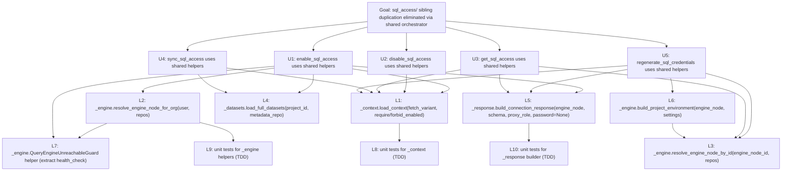

# Mikado plan: consolidate `backend/app/use_cases/sql_access/`

- **Bead:** `dc-78r9`
- **Branch:** `mikado/dc-78r9`
- **Hotspot basis:** `docs/evolution/hotspot-2026-04-24.md` — parallel evolution across `sql_access/*.py` siblings.
- **Green baseline:** `cd backend && uv run pytest tests/use_cases/sql_access/ -q` → 60 passed.
- **Abstraction shape:** **orchestrator** (shared preamble context + shared helpers). Not a state machine: there is no single enable/disable state transition graph — each use case is a distinct operation that happens to share preconditions and response shaping.

## What exploration revealed

Reading the five siblings (`enable`, `disable`, `get`, `regenerate`, `sync`) and probing a `_context.py` + rewritten `disable_sql_access` (all probes reverted — tree clean), five concrete duplicated patterns emerged:

1. **Preamble** — `if project is None: project = await ProjectService(repositories).fetch_project(project_id)` is copied verbatim in all 5 files.
2. **Access-record guard** — `access_record = await external_access_repo.<fetch>(project_id); if <enabled-check>: raise <exc>` repeats in 4 files with 3 fetch variants (`get_by_project_id`, `get_by_project_id_for_update`, `get_by_project_id_with_hash`) and two guard modes (forbid-enabled, require-enabled).
3. **Engine node resolution** — `get_first_for_org` (enable) and `get_by_id` (regenerate/get) with a "missing node → RuntimeError/fallback to settings" policy that disagrees across siblings (`get_sql_access` falls back silently, `regenerate` raises `RuntimeError`).
4. **Datasets load** — `records, _, _ = await metadata_repo.list_datasets(project_id, include_transforms=…); [Dataset.from_record(r, include_transforms=…) for r in records]` repeats in 3 files. `enable_sql_access` even does it twice (once with `False` for the "has datasets?" guard, once with `True` for bootstrap).
5. **Response shape** — the `{host, port, database, username, password, schema, connection_string, …}` dict is built in 3 files (`enable`, `regenerate`, `get`) with subtle differences (`get` omits password and connection_string, the other two include both).

The `ProjectEnvironment` hand-construction in `regenerate_sql_credentials` (lines 76–83) is feature envy against `engine_node`. The `sql_access_service.bootstrap_sql_views_via_provisioner` already encapsulates the bootstrap half — the remaining duplication is the orchestration around it.

Goal tree size: 10 leaves / 3 dependency levels deep. Fits the 3–30 range.

## Mermaid dependency graph



Edges read "A depends on B — B must land first." Leaves (L1–L10) are bottom-level changes; use-case migrations (U1–U5) are mid-level; the root GOAL is the observable outcome.

## Indented tree with rationale

```
- [ ] GOAL: sql_access siblings share one orchestrator; parallel evolution eliminated
    - [ ] U1: enable_sql_access — replace inline preamble/engine/datasets/response with helpers
        - [ ] L1: introduce _context.load_context()
        - [ ] L2: introduce _engine.resolve_engine_node_for_org()
        - [ ] L7: extract QueryEngineUnreachableGuard (or keep inline — see node note)
        - [ ] L4: introduce _datasets.load_full_datasets()
        - [ ] L5: introduce _response.build_connection_response()
    - [ ] U2: disable_sql_access — delegate preamble + enabled guard to _context
        - [ ] L1: introduce _context.load_context()
    - [ ] U3: get_sql_access — delegate preamble + engine-node lookup + response
        - [ ] L1: introduce _context.load_context()
        - [ ] L3: introduce _engine.resolve_engine_node_by_id()
            - [ ] L6: introduce _engine.build_project_environment()
        - [ ] L5: introduce _response.build_connection_response()
    - [ ] U4: sync_sql_access — delegate preamble + datasets
        - [ ] L1: introduce _context.load_context()
        - [ ] L4: introduce _datasets.load_full_datasets()
    - [ ] U5: regenerate_sql_credentials — delegate preamble + engine + env + response
        - [ ] L1: introduce _context.load_context()
        - [ ] L3: introduce _engine.resolve_engine_node_by_id()
            - [ ] L6: introduce _engine.build_project_environment()
        - [ ] L5: introduce _response.build_connection_response()
```

### Node notes (paragraph per node)

- **GOAL** — The observable end state is that every use case reads like a small composition of domain steps: `ctx = load_context(…); engine = resolve_engine_node_…(…); resp = build_connection_response(…)`. Parallel evolution risk drops because a change to preamble/response semantics happens in one place. The root is blocked by all five `Uₙ` use-case migrations; those are blocked by the leaves they depend on.

- **U1 enable_sql_access** — The largest consumer. Touches 4 of 5 shared helpers (L1/L2/L4/L5, optionally L7). Do this last among the use cases: the helpers' shape only stabilises after a smaller use case (likely U2) has exercised L1.

- **U2 disable_sql_access** — The smallest consumer of shared code (needs only L1). Ideal first-U migration because it validates the `_context.load_context` signature against a real call site before other use cases are touched. Blocks only on L1.

- **U3 get_sql_access** — Introduces the "settings fallback when engine_node is missing" branch to `resolve_engine_node_by_id` (see L3 note). Blocked by L1, L3, L5.

- **U4 sync_sql_access** — Simple: L1 + L4. Good second migration after U2 because it proves L4 works.

- **U5 regenerate_sql_credentials** — Needs the full engine path (L3, L6) and builds a connection response with a fresh password (L5). Also exercises the test patch point `app.use_cases.sql_access.regenerate_sql_credentials.regenerate_proxy_credentials` — the leaf implementer must preserve the module-level import so the `@patch(...)` in `test_regenerate_sql_credentials.py` still resolves. This is the trickiest use-case migration; do it last.

- **L1 `_context.load_context`** — New file `backend/app/use_cases/sql_access/_context.py` with a single async function accepting `project_id, project, repositories, fetch_variant: Literal["plain", "for_update", "with_hash"] = "plain", require_enabled: bool = False, forbid_enabled: bool = False`. Returns a dataclass `SqlAccessContext(project, access_record)`. Probed successfully in exploration — disable refactor kept 60/60 tests green. Highest-leverage leaf: unlocks all 5 use-case migrations.

- **L2 `_engine.resolve_engine_node_for_org`** — New module `backend/app/use_cases/sql_access/_engine.py`. Function signature: `async def resolve_engine_node_for_org(org_id: str, repos) -> EngineNode`, raising `RuntimeError(f"No query engine node found for org '{org_id}'")` to match current enable behaviour. Used only by U1 today.

- **L3 `_engine.resolve_engine_node_by_id`** — Same module as L2. Signature: `async def resolve_engine_node_by_id(engine_node_id: str, repos, *, fallback_to_settings: bool = False) -> EngineNode | None`. The `fallback_to_settings` flag captures the divergence between `regenerate` (raises) and `get` (falls back) policies; callers pick. Blocks on L6 only if we also return a `ProjectEnvironment` convenience; otherwise independent. Chose to keep L6 as a separate leaf so L3 stays pure "resolve the row."

- **L4 `_datasets.load_full_datasets`** — New module `backend/app/use_cases/sql_access/_datasets.py`. Signature: `async def load_full_datasets(project_id, metadata_repo, *, include_transforms: bool = True) -> list[Dataset]`. Returns `[]` for empty projects; `enable_sql_access` continues raising `ProjectHasNoDatasets` at its own level (domain concern stays with the use case).

- **L5 `_response.build_connection_response`** — New module `backend/app/use_cases/sql_access/_response.py`. Signature: `def build_connection_response(engine_node, schema: str, username: str, *, password: str | None = None, extras: dict | None = None) -> dict`. When `password is None`, the returned dict omits `password` and `connection_string` (matches current `get_sql_access` contract). This asymmetry is captured as a single conditional inside the helper — do not duplicate.

- **L6 `_engine.build_project_environment`** — In `_engine.py`. Signature: `def build_project_environment(engine_node, admin_password: str) -> ProjectEnvironment`. Eliminates the 8-line hand-rolled `ProjectEnvironment(...)` block in `regenerate_sql_credentials`. Takes `admin_password` from caller (still `settings.query_engine_admin_password`) to avoid hidden settings coupling.

- **L7 QueryEngineUnreachableGuard** — Optional decoration of L2 result. Signature: `async def ensure_engine_reachable(engine_node, provisioner) -> None` raising `QueryEngineUnreachable(engine_node.id)`. Only `enable_sql_access` calls `health_check`. If L2 + L7 end up trivially small, fold L7 into L2; track as a "keep inline or extract" decision during the leaf. Mark as LOW priority if inline form reads clearly.

- **L8/L9/L10 unit tests** — One parametrized test class per helper, port-to-port: call the helper directly (it is its own driving port, per nw-tdd-methodology `§Domain Layer`). These are not standalone deliverables — they are written inside each leaf's TDD cycle. Listed in the tree to document the expectation, not to create separate beads.

## Leaves (ready to become beads)

| ID | Title | Target file(s) | Complexity | One-line description |
|----|-------|---------------|------------|----------------------|
| L1 | Introduce `_context.load_context` preamble builder | `backend/app/use_cases/sql_access/_context.py` (new) + tests | S | Centralise fetch-project + access-record-load + enabled-state guard behind a dataclass return. |
| L2 | Introduce `_engine.resolve_engine_node_for_org` | `backend/app/use_cases/sql_access/_engine.py` (new) + tests | S | Fetch org's default engine node, raise RuntimeError if missing — extracted from enable_sql_access. |
| L3 | Introduce `_engine.resolve_engine_node_by_id` | `backend/app/use_cases/sql_access/_engine.py` + tests | S | Lookup engine node by id with `fallback_to_settings` flag bridging get/regenerate semantics. |
| L4 | Introduce `_datasets.load_full_datasets` | `backend/app/use_cases/sql_access/_datasets.py` (new) + tests | S | Wrap `list_datasets` + `Dataset.from_record` pair used by enable/sync. |
| L5 | Introduce `_response.build_connection_response` | `backend/app/use_cases/sql_access/_response.py` (new) + tests | S | Build the `{host,port,database,username,schema,…}` dict with optional `password`/`connection_string`. |
| L6 | Introduce `_engine.build_project_environment` | `backend/app/use_cases/sql_access/_engine.py` + tests | S | Map `engine_node` + admin password to a frozen `ProjectEnvironment` dataclass. |
| L7 | Extract `_engine.ensure_engine_reachable` (optional) | `backend/app/use_cases/sql_access/_engine.py` + tests | S | Run health check and raise `QueryEngineUnreachable` — used only by enable today; defer if inline reads well. |
| U2 | Migrate `disable_sql_access` to `_context.load_context` | `backend/app/use_cases/sql_access/disable_sql_access.py` | S | Smallest consumer; first migration to validate `_context` signature. |
| U4 | Migrate `sync_sql_access` to `_context` + `_datasets` | `backend/app/use_cases/sql_access/sync_sql_access.py` | S | Second migration; exercises L4. |
| U3 | Migrate `get_sql_access` to `_context` + `_engine` + `_response` | `backend/app/use_cases/sql_access/get_sql_access.py` | M | Exercises the `fallback_to_settings=True` branch of L3 and the `password=None` branch of L5. |
| U1 | Migrate `enable_sql_access` to all shared helpers | `backend/app/use_cases/sql_access/enable_sql_access.py` | M | Largest consumer; lands last because it touches every shared helper. |
| U5 | Migrate `regenerate_sql_credentials` | `backend/app/use_cases/sql_access/regenerate_sql_credentials.py` | M | Requires preserving module-level `regenerate_proxy_credentials` import for existing `@patch` in tests. |

Total: **12 leaves** (10 unique if L7 is folded into L2 and tests count as part of each leaf, as the Mikado skill recommends — "each leaf execution = one atomic commit with tests passing"). Within 3–30 bound. Dependency depth: 3 (L6 → L3 → U3/U5 → GOAL).

## Key dependencies

1. **L1 → every `Uₙ`** — `_context.load_context` is the keystone; every use-case migration depends on it. First bead after the plan.
2. **L6 → L3 → U3, U5** — `build_project_environment` is a hard dependency for `resolve_engine_node_by_id` only if we choose to bundle environment construction into the resolver. If we keep resolver pure, L6 depends only on U5 directly. Current tree keeps L3 pure and treats L6 as a U5 leaf.
3. **U2 → validates → L1 signature** — Migrating disable first exposes any API defects in `_context.load_context` before the larger migrations commit to the shape.

## Recommended first leaves (coder dispatch order)

1. **L1 `_context.load_context`** — keystone, smallest surface area, probe confirmed green.
2. **L5 `_response.build_connection_response`** — independent of L1, no use-case migration blocks it, smallest test surface.
3. **L4 `_datasets.load_full_datasets`** — independent, shortest body, unlocks U4 + U1.

After these three land, U2 should follow immediately to validate L1's signature at a real call site before U1/U3/U5 commit to it.

## Discovered bugs

- **Silent divergence in missing-engine-node behaviour** — `regenerate_sql_credentials.py` L65–66 raises `RuntimeError` when the engine node is missing, whereas `get_sql_access.py` L49–55 silently falls back to settings. Neither is necessarily wrong, but the inconsistency is latent: the same invariant ("access record points at a valid engine node") is enforced in one place and ignored in another. **Not fixed on this branch.** L3's `fallback_to_settings` flag makes the divergence explicit at the call site; downstream work can choose whether to converge them.
- **Double dataset load in `enable_sql_access`** — Lines 65 and 90 each call `metadata_repo.list_datasets(project_id, …)` with different `include_transforms` flags. Possible opportunity to call once with `include_transforms=True` and filter down for the count check, but this would change repository semantics (transforms affect what is returned) — out of scope here. **Not fixed on this branch.**

## Constraints honoured

- No code changes committed during exploration (probe reverted, `git status` clean before tree write).
- No tests weakened.
- Tree size 12 leaves, depth 3 — within bounds.
- 60/60 tests green at end of exploration.
