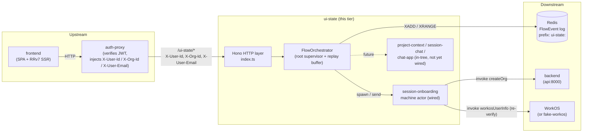
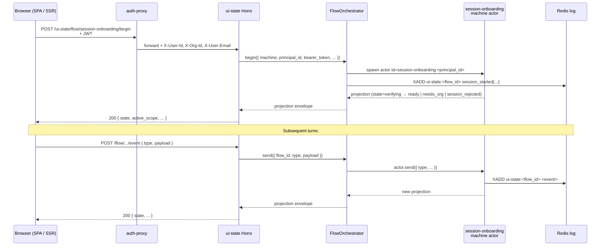

# ui-state

Hono + XState v5 backend-for-frontend that holds the canonical state for UI flows across page reloads, tabs, and machines. Architecturally a sibling of `agent/` and `auth-proxy/`: it serves UIs but is itself a server-side service.

> See [ADR-027](../docs/decisions/adr-027-flow-state-tier-and-framework.md) (tier introduction), [ADR-028](../docs/decisions/adr-028-xstate-v5-actor-model.md) (actor-model invariants), [ADR-029](../docs/decisions/adr-029-active-scope-propagation-contract.md) (active-scope contract), [ADR-030](../docs/decisions/adr-030-flow-state-topology-and-scaling.md) (topology + Redis substrate), [ADR-040](../docs/decisions/adr-040-ui-state-hexagonal-transport.md) (hexagonal transport seam), [ADR-041](../docs/decisions/adr-041-session-onboarding-domain-realignment.md) (session-onboarding realignment), [ADR-043](../docs/decisions/adr-043-retire-ui-state-token-lifecycle-modeling.md) (token lifecycle retired), [ADR-044](../docs/decisions/adr-044-chatapp-coordinator-supersedes-orchestrator.md) (ChatApp coordinator). [ADR-033](../docs/decisions/adr-033-source-tree-topology-separation.md) explains why this directory and its topology service name are both `ui-state` (no divergence here, unlike `frontend/`/`reverse-proxy`).

## Architecture at a glance



`FlowOrchestrator` is the imperative root supervisor: it owns every per-flow actor for the process, the replay buffer, and all cross-machine signaling. Sibling machines never import each other — they signal only through the orchestrator (ADR-028 invariant). Flow identity is `<machine-name>:<principal_id>`, so cold restarts rehydrate from the Redis log.

## The machines

| Machine | Owns | HTTP-wired? | README |
|---|---|---|---|
| `session-onboarding` | Brings an already-authenticated principal to an org-scoped, app-ready state (re-verify → org bootstrap) | **Yes** — the only machine reachable over HTTP today (ADR-041) | [`lib/machines/session-onboarding/`](lib/machines/session-onboarding/README.md) |
| `project-context` | "Which project am I in?" — project selection + active-scope | No (in-tree) | [`lib/machines/project-context/`](lib/machines/project-context/README.md) |
| `session-chat` | "What's happening in my chat session?" — session list, resume, chat-turn surface | No (in-tree) | [`lib/machines/session-chat/`](lib/machines/session-chat/README.md) |
| `chat-app` | XState v5 **parent coordinator** that cycles `onboarding → project-context → chat` with a freeze/reauth overlay | No — built to **supersede** the imperative orchestrator (ADR-044); runs alongside it, swapped in at Phase 4 | [`lib/machines/chat-app/`](lib/machines/chat-app/README.md) |

## HTTP API

All flow routes are mounted under `/flow/session-onboarding` (with a legacy `/flow/login-and-org-setup` alias kept alive for the FE + auth-proxy + acceptance harness during the ADR-041 migration window). `:machine` below is `session-onboarding`.

| Method + path | Purpose |
|---|---|
| `POST /flow/:machine/begin` | Start a new flow; returns the initial projection envelope |
| `POST /flow/:machine/event` | Dispatch an event to an existing flow |
| `POST /flow/:machine/open-deep-link` | Resolve a deep-link route → active-scope, append `deep_link_opened` (ADR-029) |
| `POST /flow/:machine/freeze` | Cross-flow freeze barrier — `broadcastFreeze` (failure-sim / harness path) |
| `POST /flow/:machine/thaw` | Release the freeze — `broadcastThaw` + ordered replay |
| `GET /flow/:machine/projection` | Read the current projection envelope (flow_id is derived from the machine name + `X-User-Id`) |
| `GET /flow/:machine/projection/stream` | SSE stream: long-polls the flow's Redis log and pushes a fresh projection per new event (`since` / `budget_ms` query params; default 25s budget) |

Auth: this tier trusts the `X-User-Id` / `X-Org-Id` / `X-User-Email` headers injected by auth-proxy upstream (ADR-016 pattern) and does **not** verify the JWT signature. As defense in depth, the `session-onboarding` machine independently re-checks the forwarded Bearer against WorkOS `/oauth/userinfo` (ADR-041 L3) — that is a re-verification, not the primary authenticator.

## Request flow — begin → event → projection



## Cross-machine freeze + replay (US-005)

The orchestrator can freeze every *other* active flow and buffer their inbound events until the freeze releases (or the window expires), then replay them in arrival order. This is the architectural payoff of the actor model: machines never import each other; the orchestrator is the only thing that knows the actor tree. The protocol is machine-agnostic — meaningful once more than one machine is wired.

```mermaid
sequenceDiagram
    participant UI_B as Tab B
    participant H as ui-state Hono
    participant O as FlowOrchestrator
    participant M_B as Other flow
    participant R as Redis log

    Note over H,O: A freeze is triggered (POST /freeze, origin=A)
    H->>O: broadcastFreeze(origin=A)
    O->>M_B: send { type: "FREEZE" }
    Note over M_B,O: M_B enters frozen;<br/>orchestrator buffers up to<br/>REPLAY_BUFFER_CAP=16 events<br/>for FREEZE_WINDOW_MS=5_000 ms

    UI_B->>H: POST /flow/.../event { type: "submit_x" }
    H->>O: send(...)
    O->>O: buffer event for M_B
    O-->>H: projection (state=frozen)
    H-->>UI_B: 200 { state: "frozen", ... }

    Note over H,O: The freeze releases (POST /thaw, origin=A)
    H->>O: broadcastThaw(origin=A)
    O->>M_B: send { type: "THAW" }
    O->>M_B: replay buffered events in FIFO (cross-flow seq) order
    M_B->>R: XADD per replayed event
    M_B-->>O: new projection
```

> **ADR-043:** no machine emits a token-expiry trigger any more — "silent reauth" was removed from `session-onboarding`. Freeze/thaw is reachable via the `/freeze` + `/thaw` endpoints (the failure-sim / harness path) on the live orchestrator. The `chat-app` coordinator (ADR-044) does **not** carry a freeze/reauth region: an early design overlaid a parallel `connectivity` region, but it was retired (ADR-043, resolving ADR-044 §5 Open Question #2 toward removal) because auth-proxy owns the token lifecycle (ADR-016) and ui-state is never a token-management participant.

**Invariants (ADR-028):**

- One root orchestrator per process. Do not spawn a secondary orchestrator for the freeze/replay subsystem.
- No machine imports another machine. Cross-machine signaling goes through the orchestrator.
- The replay buffer is a property of the orchestrator, not any machine.
- Buffer is bounded: `REPLAY_BUFFER_CAP` (16 events) and `FREEZE_WINDOW_MS` (5_000 ms). Overflow or timeout → the frozen flow is abandoned and surfaces as `error_recoverable`.

## Configuration

Environment read at startup. `config.ts` validates the service config via zod (fail-fast — a missing/malformed **required** var throws and names the field); `index.ts` reads the process knobs directly.

| Variable | Required | Default | Purpose |
|---|---|---|---|
| `FAKE_WORKOS_URL` | yes | — | WorkOS `/oauth/userinfo` endpoint the re-verify resolver calls (the in-process fake in dev/tests; the real WorkOS in prod). |
| `BACKEND_URL` | yes | — | Backend the `createOrg` actor calls on the principal's behalf. |
| `REDIS_URL` | no | unset | Flow event-log backing. Unset → in-memory **noop** log (single-process dev); set → durable cross-restart log per ADR-030 §SD3. |
| `PORT` | no | `8788` | HTTP listen port. |
| `UI_STATE_AUTOSTART` | no | unset | Set to `"false"` in tests to skip the `serve()` call and the production composition root. |

Identity headers ui-state presents to the backend are a dev fixture (`dev-user-001` / `dev-org-001`) in `config.ts`; in production a service-to-service M2M token replaces it (see `auth-proxy`). The failure-simulation harness (`__force_failure__` et al.) is gated by the environment-tier composition in ADR-035, not by a ui-state config var.

## File layout

```
ui-state/
├── index.ts                              # Hono server + composition root (buildSessionOnboardingApp)
├── config.ts                             # env → typed Config (zod, fail-fast)
├── lib/
│   ├── orchestrator.ts                   # FlowOrchestrator (root supervisor + freeze/replay), BeginFlowOrchestrator, FlowActorRegistry
│   ├── orchestrator-harvester.ts         # settled-snapshot harvest helpers (the sanctioned context-read boundary, ADR-030)
│   ├── wait-for-settled-state.ts         # await an actor reaching a settled state
│   ├── domain/
│   │   ├── flow-event.ts                 # FlowEvent — the append-only log entry
│   │   ├── flow-projection.ts            # FlowProjection — the ADR-027 read-model wire shape
│   │   ├── flow-result.ts                # Result<T> envelope
│   │   ├── projection.ts                 # FlowEvent log → FlowProjection fold (buildProjection)
│   │   └── active-scope.ts               # deep-link route → active-scope resolution (ADR-029)
│   ├── hexagonal-transport/
│   │   └── flow-router.ts                # shared HTTP transport: request-id mw + /freeze /thaw /projection /projection/stream (ADR-040)
│   ├── machines/
│   │   ├── session-onboarding/           # the only HTTP-wired machine (ADR-041)
│   │   ├── project-context/              # "which project am I in?"
│   │   ├── session-chat/                 # "what's happening in my chat session?"
│   │   └── chat-app/                     # parent coordinator superseding the orchestrator (ADR-044, not yet wired)
│   ├── persistence/
│   │   ├── redis.ts                      # FlowEventLog adapter (Redis tier or noop)
│   │   └── chatapp-snapshot-store.ts     # ChatApp snapshot store (Redis/noop) — ADR-044 Phase 3
│   └── testing/
│       └── test-config.ts                # test config + mock-fetch builders
├── Dockerfile                            # Production image
├── BUILD.bazel                           # Bazel build target
└── package.json                          # name: dashboard-chat-ui-state
```

## Running tests

```bash
cd ui-state && npx vitest run            # unit + projection + machine tests
```

`ui-state` is a standalone package (not in the root npm workspaces), so run `npm install` inside this directory first. The backend dispatcher (`./tools/test/test.sh --backend`) does **not** include ui-state tests. Cross-stack acceptance tests live at `tests/acceptance/user-flow-state-machines/` and are run separately per CLAUDE.md.
