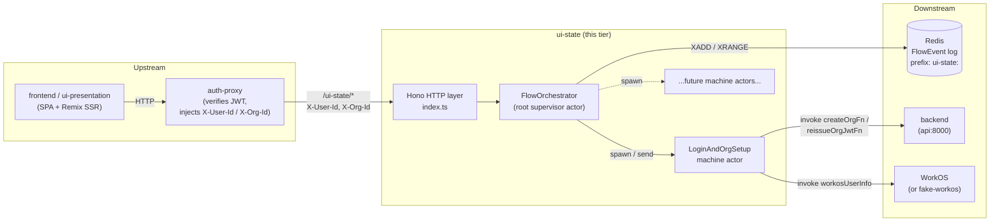
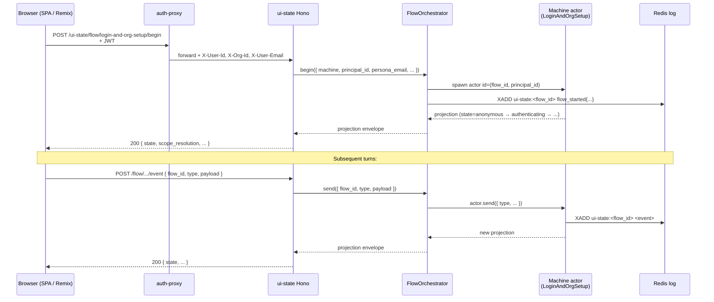
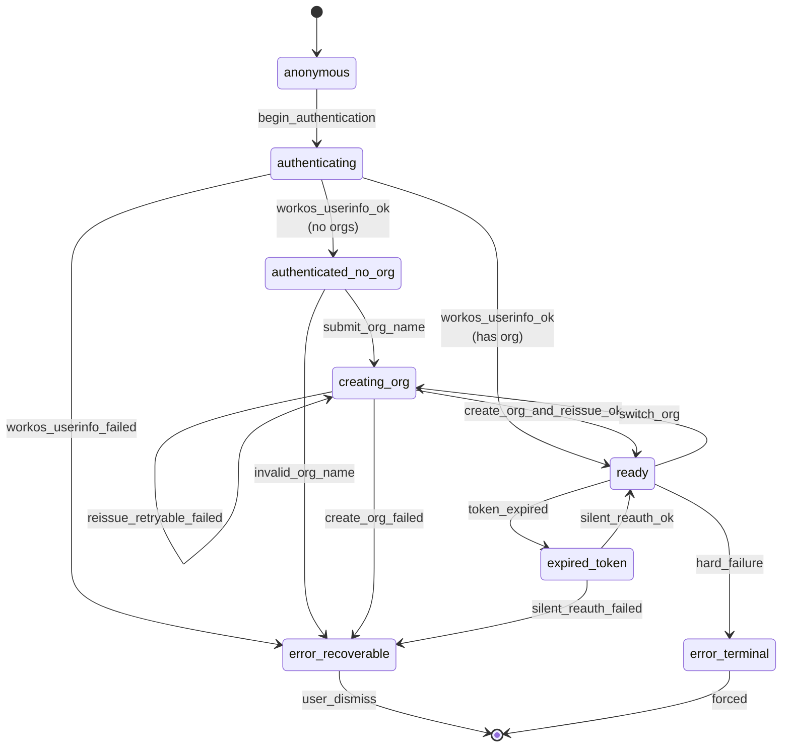

# ui-state

Hono + XState v5 backend-for-frontend that holds the canonical state for UI flows across page reloads, tabs, and machines. Architecturally a sibling of `agent/` and `auth-proxy/`: it serves UIs but is itself a server-side service.

> See [ADR-027](../docs/decisions/adr-027-flow-state-tier-and-framework.md) (tier introduction), [ADR-028](../docs/decisions/adr-028-xstate-actor-model.md) (actor model invariants), [ADR-029](../docs/decisions/adr-029-active-scope-propagation.md) (active-scope contract), [ADR-030](../docs/decisions/adr-030-flow-state-topology-and-scaling.md) (topology + Redis substrate). [ADR-033](../docs/decisions/adr-033-source-tree-topology-separation.md) explains why this directory is `ui-state/` while the topology service name is also `ui-state` (no divergence here, unlike `frontend/`/`reverse-proxy`).

## Architecture at a glance



The orchestrator owns every machine actor for the process; cross-machine communication goes through `system.get(<actor_id>).send(...)` from the orchestrator, never directly between machines (ADR-028 invariant). Actor identity is `(flow_id, principal_id)` so cold restarts rehydrate from the Redis log.

## HTTP API

| Method + path | Purpose |
|---|---|
| `GET /health` | Liveness check |
| `POST /flow/:machine/begin` | Start a new flow; returns the initial projection envelope |
| `POST /flow/:machine/event` | Dispatch an event to an existing flow |
| `POST /flow/:machine/open-deep-link` | Resolve a deep-link route → active-scope, append `deep_link_opened` (ADR-029) |
| `GET /flow/:machine/projection?flow_id=…` | Read the current projection envelope |

Auth: this tier trusts `X-User-Id` / `X-Org-Id` / `X-User-Email` headers injected by auth-proxy upstream (ADR-016 pattern). It does NOT re-verify JWTs.

## Request flow — begin → event → projection



## Login-and-org-setup state machine

The only machine currently wired (see `lib/machines/login-and-org-setup.ts`). Other machines plug into the same orchestrator surface; the freeze/replay protocol below is machine-agnostic.



## Cross-machine freeze + replay (US-005)

When any machine in this process emits `token_expired`, the orchestrator freezes every *other* active machine and buffers their incoming events until silent re-auth resolves (or the freeze window expires). This is the architectural payoff of the actor model: machines never import each other; the orchestrator is the only thing that knows the actor tree.

```mermaid
sequenceDiagram
    participant UI_A as Tab A (SPA)
    participant UI_B as Tab B (Remix)
    participant H as ui-state Hono
    participant O as FlowOrchestrator
    participant M_A as Machine A
    participant M_B as Machine B
    participant R as Redis log

    Note over M_A: enters expired_token
    M_A->>O: emit token_expired
    O->>O: broadcastFreeze(origin=A)
    O->>M_B: send { type: "FREEZE" }
    Note over M_B,O: M_B enters frozen state;<br/>orchestrator buffers up to<br/>REPLAY_BUFFER_CAP=16 events<br/>for FREEZE_WINDOW_MS=5_000 ms

    UI_B->>H: POST /flow/.../event { type: "submit_x" }
    H->>O: send(...)
    O->>O: buffer event for M_B
    O-->>H: projection (state=frozen)
    H-->>UI_B: 200 { state: "frozen", ... }

    Note over M_A: silent_reauth_ok
    M_A->>O: emit silent_reauth_ok
    O->>O: broadcastThaw(origin=A)
    O->>M_B: send { type: "THAW" }
    O->>M_B: replay buffered events in order
    M_B->>R: XADD per replayed event
    M_B-->>O: new projection (state=ready)
```

**Invariants (ADR-028):**

- One root orchestrator actor per process. Do not spawn a secondary orchestrator for the freeze/replay subsystem.
- No machine imports another machine. Cross-machine signaling goes through `system.get(<actor_id>).send(...)` from the orchestrator.
- The replay buffer is a property of the orchestrator, not any machine.
- Buffer is bounded: `REPLAY_BUFFER_CAP` (16 events) and `FREEZE_WINDOW_MS` (5_000 ms). Overflow or timeout → frozen flow is abandoned and surfaces as `error_recoverable`.

## Configuration

Environment variables read at startup (`index.ts`):

| Variable | Default | Purpose |
|---|---|---|
| `PORT` | `8788` | HTTP listen port |
| `REDIS_URL` | unset | Redis connection. Unset → noop adapter (single-process dev). Set → durable cross-restart event log per ADR-030 §SD3. |
| `FAKE_WORKOS_URL` | `http://fake-workos:14299` | Loopback to the in-process fake WorkOS for acceptance tests. Production sets this to the real WorkOS endpoint. |
| `BACKEND_URL` | `http://api:8000` | Backend the `createOrgAndReissue` actor calls on the principal's behalf. |
| `AUTH_MODE` | `dev` | When `dev`, identity defaults to `dev-user-001` / `dev-org-001`. |
| `FLOW_EVENT_MAXLEN` | `1000` | Redis stream max length per flow_id. |
| `NWAVE_HARNESS_KNOBS` | unset | When `true`, the harness `__harness_*` events are dispatchable. Production deployments leave this unset. |
| `UI_STATE_AUTOSTART` | unset | Set to `"false"` in tests to skip the `serve()` call and the Redis probe. |

## File layout

```
ui-state/
├── index.ts                          # Hono server + routes + composition root
├── lib/
│   ├── orchestrator.ts               # FlowOrchestrator (root supervisor + freeze/replay)
│   ├── projection.ts                 # FlowEvent → FlowProjection reducer
│   ├── active-scope.ts               # Deep-link route → scope resolution (ADR-029)
│   ├── machines/
│   │   ├── login-and-org-setup.ts    # The first wired machine
│   │   └── validation.ts             # Shared input validation
│   └── persistence/
│       └── redis.ts                  # FlowEventLog adapter (Redis tier or noop)
├── Dockerfile                        # Production image
├── BUILD.bazel                       # Bazel build target
└── package.json                      # name: dashboard-chat-ui-state
```

## Running tests

```bash
cd ui-state && npx vitest run            # unit + projection + machine tests
# or via the dispatcher (no Bazel daemon):
./tools/test/test.sh --backend           # backend gate (does not include ui-state tests)
```

Cross-stack acceptance tests live at `tests/acceptance/user-flow-state-machines/` and are run separately per CLAUDE.md.
