# login-and-org-setup machine

> **Owner:** ui-state (Hono BFF actor system)
> **Source-of-truth:** `machine.ts` in this directory.
> **Related ADRs:** ADR-027 (flow-state tier + framework — XState v5 adoption), ADR-028 (XState v5 actor model — machines own transitions, the log owns state; amended 2026-05-15 to canonicalize "context for handler-internal state, `event.output` for cross-state hand-off"), ADR-030 (flow-state topology + scaling — orchestrator pattern + projection as primary read model).

## Purpose

Owns the J-001 sign-in + org-bootstrap journey: anonymous → WorkOS userinfo exchange → org-name submission with inline validation → atomic create-org + JWT reissue with a bounded internal retry budget → `ready`. From `ready` the machine also handles the silent-reauth-on-expired-token path (ADR-028 §"Decision outcome"). Maintains the `user.{email, display_name}` + `org.{id, name}` halves of the J-001 projection; emits `auth_ready` post-`ready` so the orchestrator can wake `project-context.resolving_initial_scope` with `org_id` + `user.first_name`.

## State diagram

```mermaid
stateDiagram-v2
  [*] --> anonymous

  anonymous --> authenticating: sign_in_clicked

  authenticating --> authenticated_no_org: workosUserInfo onDone (assigns user.email + user.display_name)
  authenticating --> error_recoverable: workosUserInfo onError (classifyFailure → underlying_cause_tag)

  authenticated_no_org --> creating_org: org_form_submitted [orgNameValid] (captures pending_org_name; clears org_validation_error)
  authenticated_no_org --> authenticated_no_org: org_form_submitted [invalid] (inline error in context; no transition)
  authenticated_no_org --> error_recoverable: __force_failure__ (harness side-channel; assigns underlying_cause_tag)

  creating_org --> ready: createOrgAndReissue onDone (assigns org.id + org.name)
  creating_org --> creating_org: createOrgAndReissue onError [retry budget remaining] (increments reissue_attempts_count; capturePartialOrgFromError; reenter)
  creating_org --> error_recoverable: createOrgAndReissue onError [reissueBudgetExhausted] (tag partial-setup; capturePartialOrgFromError)

  ready --> expired_token: __expire_token__ (harness side-channel)

  expired_token --> ready: silentReauth onDone
  expired_token --> error_recoverable: silentReauth onError (assigns underlying_cause_tag = silent-reauth-failed)

  error_recoverable --> creating_org: retry_clicked [user retry budget remaining] (increments retry_budget_used_count; resets reissue_attempts_count)
  error_recoverable --> error_terminal: retry_clicked [userRetryBudgetExhausted] (increments retry_budget_used_count)

  error_terminal --> [*]
```

*Note: the two `__double_underscore__` events (`__force_failure__`, `__expire_token__`) are failure-simulation side channels — gated at the HTTP layer (`ui-state/index.ts`) by `NWAVE_HARNESS_KNOBS=true` (the deprecated alias) / `FAILURE_SIMULATION_ENABLED=true` so production builds never observe them. Per the vocabulary audit's canonical convention C4, production events MUST NOT use the `__double_underscore__` prefix.*

## States

| State | Purpose | Entered on | Exits on |
|---|---|---|---|
| `anonymous` | Initial state; pre-sign-in surface | initial spawn | `sign_in_clicked` |
| `authenticating` | Invokes `workosUserInfo` against the WorkOS-compatible `/oauth/token` + `/oauth/userinfo` exchange | `sign_in_clicked` | `workosUserInfo` `onDone` (settled) / `onError` (transient or workos-profile-corrupt) |
| `authenticated_no_org` | Org-name composer surface; Maya enters her org name. `org_form_submitted` branches via the `orgNameValid` guard | `workosUserInfo` `onDone` | valid `org_form_submitted`; invalid `org_form_submitted` (self-loop with inline error); `__force_failure__` (harness) |
| `creating_org` | Invokes `createOrgAndReissue` (POST `/api/orgs` + POST `/api/auth/reissue`, idempotent per ADR-029 invariant 4). Internal retry budget = 3 reissue attempts | valid `org_form_submitted`; `retry_clicked` from `error_recoverable` (with `reissue_attempts_count` reset to 0); internal retry self-loop on transient `onError` | `createOrgAndReissue` `onDone` (settled) / `onError` (transient self-loop or budget-exhausted to `error_recoverable`) |
| `ready` | Settled state — `org.id` populated, JWT reissued. Orchestrator's broadcast hook fires `auth_ready` to project-context on entry | `createOrgAndReissue` `onDone`; `silentReauth` `onDone` | `__expire_token__` (harness side-channel) |
| `error_recoverable` | Recoverable-error landing zone; FE shows a "Try again" CTA. The user-retry budget = 3 (the 4th total attempt at the same `underlying_cause_tag` escalates to `error_terminal`) | `workosUserInfo` `onError`; `createOrgAndReissue` `onError` (budget exhausted); `silentReauth` `onError`; `__force_failure__` | `retry_clicked` (2 guarded branches) |
| `expired_token` | Invokes `silentReauth` to attempt a transparent re-issue without forcing Maya through `/login` again | `__expire_token__` from `ready` | `silentReauth` `onDone` (→ `ready`) / `onError` (→ `error_recoverable` tagged `silent-reauth-failed`) |
| `error_terminal` | Terminal-style surface (contact-support page); no further retry CTA. Not a sink in the XState sense — the FE simply does not surface an exit | `retry_clicked` with `userRetryBudgetExhausted` | (none — terminal from the FE's perspective) |

## Events

### External (FE / orchestrator → machine)

| Event | Source | Payload | Purpose |
|---|---|---|---|
| `sign_in_clicked` | FE sign-in button | `{ persona_email, persona_display_name }` | Move from `anonymous` to `authenticating`; persona fields supply the fake-workos lookup code in dev |
| `auth_callback_resolved` | (reserved) | (none) | Reserved for the real WorkOS redirect callback path; not yet wired |
| `auth_failed` | (reserved) | `{ underlying_cause_tag }` | Reserved for an explicit FE-emitted auth-failure signal; not yet wired |
| `org_form_submitted` | FE org-name composer | `{ org_name }` | Submit the org name; guard `orgNameValid` decides between transition and inline-error self-loop |
| `retry_clicked` | FE recoverable-error CTA | (none) | Re-enter `creating_org` (clearing `reissue_attempts_count`) OR escalate to `error_terminal` when the user-retry budget is exhausted |

### Internal / failure-simulation side channels

| Event | Source | Payload | Purpose |
|---|---|---|---|
| `__force_failure__` | Failure-simulation harness (gated by `FAILURE_SIMULATION_ENABLED` / legacy `NWAVE_HARNESS_KNOBS`) | `{ tag: UnderlyingCauseTag }` | From `authenticated_no_org`, jump straight into `error_recoverable` carrying the supplied cause tag |
| `__expire_token__` | Failure-simulation harness | (none) | From `ready`, jump to `expired_token` to rehearse the silent-reauth path |

### Cross-machine (orchestrator-emitted; FREEZE/THAW)

| Event | Source | Payload | Purpose |
|---|---|---|---|
| `FREEZE` | Orchestrator FREEZE/THAW broadcast (cross-flow replay barrier, ADR-028) | (none) | Currently declared in the event union; the orchestrator's freeze logic owns the cross-machine semantics (see `orchestrator.ts`) |
| `THAW` | Orchestrator FREEZE/THAW broadcast | (none) | Companion to `FREEZE`; replay-buffer release |

### Cross-machine broadcasts (orchestrator broadcasts FROM this machine)

This machine does not directly send events to siblings; the orchestrator's state-watcher branch observes `ready` entry and broadcasts `auth_ready` to the project-context machine (carries `{ org_id, user: { first_name } }`).

> **Naming convention:** the broadcast event is `auth_ready` — payload-centric per [ADR-039](../../../../docs/decisions/adr-039-ui-state-naming-conventions.md) §C3 (cross-machine broadcasts name what they carry — auth completion — not the sender). Renamed from the legacy journey-numbered `auth_ready` per the vocabulary audit at `docs/discussion/ui-state-vocabulary-audit/findings.md` §7 Tier-1 #1.

## Actors invoked

| Actor | `input` shape | `output` shape | When invoked |
|---|---|---|---|
| `workosUserInfo` | `{ persona_email, persona_display_name }` | `{ email, display_name }` (`WorkOSProfile`) | On entry into `authenticating` |
| `createOrgAndReissue` | `{ org_name, principal_id, correlation_id, attempt }` | `{ org_id, org_name }` (`CreateOrgAndReissueOutput`) | On entry into `creating_org` (including reentry on transient `onError` within the internal 3-attempt budget) |
| `silentReauth` | `{ correlation_id }` | `{ ok: true }` | On entry into `expired_token` (no-op fallback when `deps.silentReauth` is absent — the actor sits pending rather than blowing up the chart) |

## Context fields (current)

| Field | Type | When populated | Read by | Notes |
|---|---|---|---|---|
| `correlation_id` | `string` | construction | every emission; actor inputs | NEVER overwritten across retries (B2 invariant in `machine.test.ts`) |
| `principal_id` | `string` | construction | actor inputs | from auth-proxy `X-User-Id` |
| `user` | `{ email: string \| null; display_name: string \| null }` | `workosUserInfo` `onDone` | projection / FE | both null until WorkOS settles |
| `org` | `{ id: string \| null; name: string \| null }` | `createOrgAndReissue` `onDone`; also populated from the `partial_org` marker on `onError` via `capturePartialOrgFromError` so the "Try again" CTA can retry reissue without re-creating the org row | projection; orchestrator `auth_ready` broadcast | both null until provisioning settles |
| `pending_org_name` | `string` | `org_form_submitted` (valid) | `createOrgAndReissue` input on retry | preserved across `creating_org` ↔ `error_recoverable` so each retry sees the same name |
| `underlying_cause_tag` | `UnderlyingCauseTag \| null` | error transitions; `__force_failure__`; `silentReauth` `onError` | projection / FE diagnostic copy | union: `transient \| cookie-blocked \| partial-setup \| workos-profile-corrupt \| silent-reauth-failed` |
| `retries_count` | `number` | (reserved) | observability | declared but currently unused by transition logic — the two real counters are `reissue_attempts_count` and `retry_budget_used_count` |
| `reissue_attempts_count` | `number` | each `creating_org` reentry on transient `onError` | guard `reissueBudgetExhausted` | bounded by `REISSUE_BUDGET = 3`; reset on `retry_clicked` |
| `retry_budget_used_count` | `number` | every `retry_clicked` | guard `userRetryBudgetExhausted` | bounded by `USER_RETRY_BUDGET = 3` — the 4th total attempt at the same `underlying_cause_tag` escalates to `error_terminal` (3 user-visible retries including the original failure) |
| `org_validation_error` | `OrgValidationInlineError \| null` | invalid `org_form_submitted` | projection / inline error UI | cleared on the valid-submit branch (`clearOrgValidationError`); 4-kind discriminated union (`empty \| too_short \| too_long \| duplicate`) |
| `existing_org_names` | `string[]` | construction (from `input.existing_org_names`) | `orgNameValid` guard + `recordOrgValidationError` | duplicate-name detection set; case-insensitive compare |

NOTE: Per ADR-028 §"Amendment 2026-05-15", context should carry handler-internal state only; cross-state hand-off should ride on `event.output`. Several legacy shapes in this machine are noted as targets for the later LEAF-A through LEAF-D migration (ADR-030 §"Migration sequencing") — captured here as descriptive context (no fix in this MR):

- **`pending_org_name` prefix** — Tier-2 audit row "`pending_` prefix" confirms this is the de facto canonical prefix for composer-text preservation (paired with `pending_project_name`, `pending_first_message`). Not a defect; recorded as the established convention.

The vocabulary audit at `docs/discussion/ui-state-vocabulary-audit/findings.md` is the SSOT for the convention catalog; ADR-039 ratifies C1–C12. Counter-suffix canonicalization (C5) and `user.{first_name, …}` nesting (Tier-2 #11) landed under MR-C.

## Cross-machine wiring

- **Receives from orchestrator:** `FREEZE` / `THAW` (cross-flow replay barrier; the orchestrator owns the semantics).
- **Emits projection events** (inline in `orchestrator.begin()` and the J-001 broadcast hook): `sign_in_clicked`, `org_created_and_jwt_reissued`, `reissue_failed_partial`, plus the `auth_ready` cross-machine event recorded as a side-effect of the broadcast hook (see `orchestrator.ts` §"auth_ready broadcast hook").
- **Triggers downstream broadcast:** the orchestrator's state-watcher branch observes `ready` entry and broadcasts an `auth_ready` event to the project-context machine, carrying `{ org_id, user: { first_name } }` (payload-centric event naming per ADR-039 §C3).

## Files in this directory

- `machine.ts` — the XState v5 machine factory + types + production actor factories (`createWorkOSUserInfoActor`, `createOrgAndReissueActor`) + the harness-knob construction site (`createForcedFailureOrgAndReissueActor`) + the split pure-function halves (`createOrgFn`, `reissueOrgJwtFn`)
- `index.ts` — barrel; re-exports the public surface (machine + actors + types + the re-exported `UnderlyingCauseTag` from `../validation.ts`)
- `machine.test.ts` — vitest unit tests (port-to-port at the XState actor's `send` / snapshot surface); the B1 + B2 behavior budget (4-test cap)
- `README.md` — this file

Shared with sibling machines (intentionally NOT moved into this directory; see the vocabulary audit for the relocation discussion):

- `../validation.ts` — `validateOrgName`, `classifyFailure`, `UnderlyingCauseTag` — currently consumed only by this machine but kept at the `machines/` root pending a separate decision on whether to relocate. Sibling `project-context/validation.ts` holds the `validateProjectName` analog.

## Related design docs

- `docs/decisions/adr-027-flow-state-tier-and-framework.md`, `adr-028-xstate-v5-actor-model.md` (with 2026-05-15 amendment), `adr-029-jwt-reissue-on-org-create.md`, `adr-030-flow-state-topology-and-scaling.md`
- `docs/product/journeys/login-and-org-setup.yaml` — the J-001 journey (8-state contract this machine implements)
- `docs/discussion/ui-state-vocabulary-audit/findings.md` — Tier-1 / Tier-2 vocabulary findings; the deferred-rename SSOT
- `docs/evolution/2026-05-15-failure-simulation-consolidation/` — failure-simulation knobs this machine respects (`force-failure-on-auth-retry`, `expire-token`)
