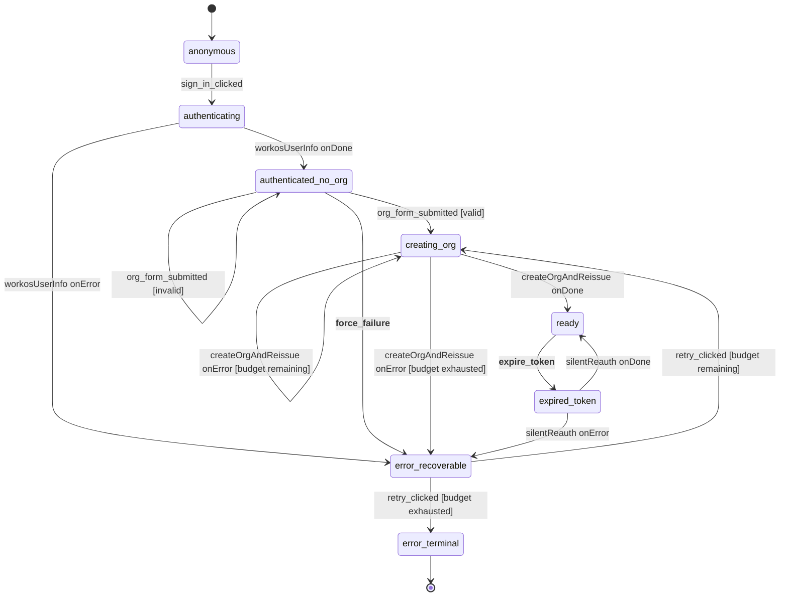

# login-and-org-setup machine

The flow that takes a brand-new user from "I clicked sign in" to "I'm signed in with an org and a working JWT." Owned by `ui-state` (the Hono backend-for-frontend actor system).

## What this machine does

This is the first machine a user touches. It has three jobs:

1. **Authenticate.** Trade an OAuth code with WorkOS for a user profile (`email`, `display_name`).
2. **Bootstrap an org.** A fresh user has no org, so we collect a name, then atomically create the org row and reissue the JWT so the token's `org_id` claim matches the new org.
3. **Keep the token alive.** When the access token expires later, attempt a silent reauth without bouncing the user back to `/login`.

When everything settles, the machine sits in `ready`. The orchestrator watches for that and broadcasts `auth_ready` to the sibling [`project-context`](../project-context/) machine, which then loads the project list.

## State diagram

`__force_failure__` and `__expire_token__` are failure-simulation entry points — see [Failure simulation](#failure-simulation) below.

## States

| State | What's happening | Entered on | Exits on |
|---|---|---|---|
| `anonymous` | Pre-sign-in landing surface | spawn | `sign_in_clicked` |
| `authenticating` | Invokes the WorkOS userinfo exchange. On success, `user.{email, display_name, first_name}` populate | `sign_in_clicked` | `workosUserInfo` settles |
| `authenticated_no_org` | Waiting for the user to type an org name. Invalid submissions self-loop with `org_validation_error` set in context | `workosUserInfo` `onDone` | valid submit / invalid submit / failure-sim side channel |
| `creating_org` | POST `/api/orgs` + POST `/api/auth/reissue` (one idempotent invoke). On transient errors, retries up to **3 attempts** before falling through to `error_recoverable`. On success, `org.{id, name}` populate | valid `org_form_submitted`, `retry_clicked` from recoverable, or self-loop on transient error | actor settles or budget exhausts |
| `ready` | Signed in with org. The orchestrator broadcasts `auth_ready` on entry | `createOrgAndReissue` settles, `silentReauth` settles | token-expiry side channel |
| `expired_token` | Attempts a silent JWT refresh without forcing the user back to `/login` | `__expire_token__` | `silentReauth` settles |
| `error_recoverable` | Shows a "Try again" CTA. User has **3 retries** at the same `underlying_cause_tag` before escalating | any actor error, or `__force_failure__` | `retry_clicked` |
| `error_terminal` | Contact-support surface. The FE doesn't render an exit; the user must reload | `retry_clicked` with budget exhausted | none |

## Events

### From the FE

| Event | Payload | What it does |
|---|---|---|
| `sign_in_clicked` | `{ persona_email, persona_display_name }` | Kick off the WorkOS exchange. Persona fields drive the fake-WorkOS lookup in dev mode |
| `org_form_submitted` | `{ org_name }` | Submit the org name. Guarded — invalid input self-loops with an inline `org_validation_error` |
| `retry_clicked` | (none) | Resume from `error_recoverable`. Either re-enters `creating_org` or escalates to `error_terminal` based on the retry budget |
| `auth_callback_resolved` | (none) | Reserved — not yet wired. Intended for the production WorkOS redirect callback |
| `auth_failed` | `{ underlying_cause_tag }` | Reserved — not yet wired |

### Cross-machine (from orchestrator)

| Event | Payload | What it does |
|---|---|---|
| `FREEZE` | (none) | Cross-flow replay barrier. The orchestrator owns the semantics; this machine only declares the type |
| `THAW` | (none) | Replay-buffer release |

### Failure simulation

`__force_failure__` and `__expire_token__` are dev-only side channels gated at the HTTP boundary (`ui-state/index.ts`) by `FAILURE_SIMULATION_ENABLED` (legacy alias: `NWAVE_HARNESS_KNOBS`). Production builds don't observe them — they exist so acceptance tests can rehearse failure modes without breaking real upstreams.

| Event | Payload | What it does |
|---|---|---|
| `__force_failure__` | `{ tag: UnderlyingCauseTag }` | From `authenticated_no_org`, jump to `error_recoverable` with the supplied cause tag |
| `__expire_token__` | (none) | From `ready`, jump to `expired_token` to rehearse the silent-reauth path |

The double-underscore prefix is the project-wide convention for "this event must not exist in production." See [ADR-039 §C4](../../../../docs/decisions/adr-039-ui-state-naming-conventions.md).

## Actors invoked

| Actor | Input | Output | Invoked in |
|---|---|---|---|
| `workosUserInfo` | `{ persona_email, persona_display_name }` | `WorkOSProfile` = `{ email, display_name }` | `authenticating` |
| `createOrgAndReissue` | `{ org_name, principal_id, correlation_id, attempt }` | `{ org_id, org_name }` | `creating_org` (each attempt within the 3-retry budget) |
| `silentReauth` | `{ correlation_id }` | `{ ok: true }` | `expired_token` |

`createOrgAndReissue` is idempotent on `(org_name, principal_id)`. On partial failure (org created but reissue failed), the machine captures the partial org id so the retry doesn't double-create. See [ADR-029](../../../../docs/decisions/adr-029-jwt-reissue-on-org-create.md) for why this is one invoke rather than two.

## Context

| Field | Type | When populated |
|---|---|---|
| `correlation_id` | `string` | spawn |
| `principal_id` | `string` | spawn (from auth-proxy's `X-User-Id` header) |
| `user` | `{ email, display_name, first_name }` (all `string \| null`) | `workosUserInfo onDone`; `first_name` derived from `display_name` |
| `org` | `{ id, name }` (both `string \| null`) | `createOrgAndReissue onDone`, or partial-org capture on retry |
| `pending_org_name` | `string` | valid `org_form_submitted`; preserved across `creating_org` ↔ `error_recoverable` so retries see the same name |
| `existing_org_names` | `string[]` | spawn input; powers duplicate-name validation |
| `org_validation_error` | `OrgValidationInlineError \| null` | invalid `org_form_submitted`. 4-kind union: `empty`, `too_short`, `too_long`, `duplicate` |
| `underlying_cause_tag` | `UnderlyingCauseTag \| null` | error transitions and silent-reauth failure |
| `reissue_attempts_count` | `number` | each transient retry in `creating_org`. Bounded by `REISSUE_BUDGET = 3` |
| `retry_budget_used_count` | `number` | each `retry_clicked`. Bounded by `USER_RETRY_BUDGET = 3` |
| `retries_count` | `number` | reserved field; not currently driven by any transition |

Counter fields end in `_count` per [ADR-039 §C5](../../../../docs/decisions/adr-039-ui-state-naming-conventions.md).

Most fields here are **internal handler state** — they live for the duration of a `creating_org` retry loop or a composer-validation cycle, not as a contract between states. The exceptions are the fields the orchestrator reads off the snapshot (`user.first_name`, `org.id`) when it builds the cross-machine `auth_ready` payload; those are the cross-machine projection contract. ADR-028 has the broader rule.

## How it connects to siblings

This machine never sends events to other machines directly. The orchestrator watches for `ready` entry and broadcasts `auth_ready` with `{ org_id, user: { first_name } }` to the `project-context` machine, which uses it to start scope resolution.

The event is named after **what it carries** ("auth completion data") rather than the sender. See [ADR-039 §C3](../../../../docs/decisions/adr-039-ui-state-naming-conventions.md) for the broadcast-naming rule.

The machine also emits projection events for the FlowEvent log: `sign_in_clicked`, `org_created_and_jwt_reissued`, `reissue_failed_partial`. Those are FE-consumable; `auth_ready` is internal to ui-state.

## Files

- `machine.ts` — the XState v5 machine + types + actor factories (`createWorkOSUserInfoActor`, `createOrgAndReissueActor`, plus the split pure helpers `createOrgFn` / `reissueOrgJwtFn`)
- `index.ts` — barrel; re-exports the public surface
- `machine.test.ts` — vitest unit tests at the actor's `send` / snapshot boundary

Shared with siblings (kept at `machines/` root rather than in this directory):

- `../validation.ts` — `validateOrgName`, `classifyFailure`, and the `UnderlyingCauseTag` union

## See also

- [`../project-context/`](../project-context/) — receives `auth_ready` from this machine and owns the project-selection half of the post-signin flow
- [`../session-chat/`](../session-chat/) — the third machine in the chain; doesn't talk to this one directly
- [ADR-027](../../../../docs/decisions/adr-027-flow-state-tier-and-framework.md) — why ui-state runs XState v5 in a Hono BFF
- [ADR-028](../../../../docs/decisions/adr-028-xstate-v5-actor-model.md) — the actor model and the rule "machines own transitions, the log owns state"
- [ADR-029](../../../../docs/decisions/adr-029-jwt-reissue-on-org-create.md) — why `createOrgAndReissue` is one atomic invoke
- [ADR-030](../../../../docs/decisions/adr-030-flow-state-topology-and-scaling.md) — orchestrator pattern and projection-as-read-model
- [ADR-039](../../../../docs/decisions/adr-039-ui-state-naming-conventions.md) — naming conventions for states, events, fields, counters
