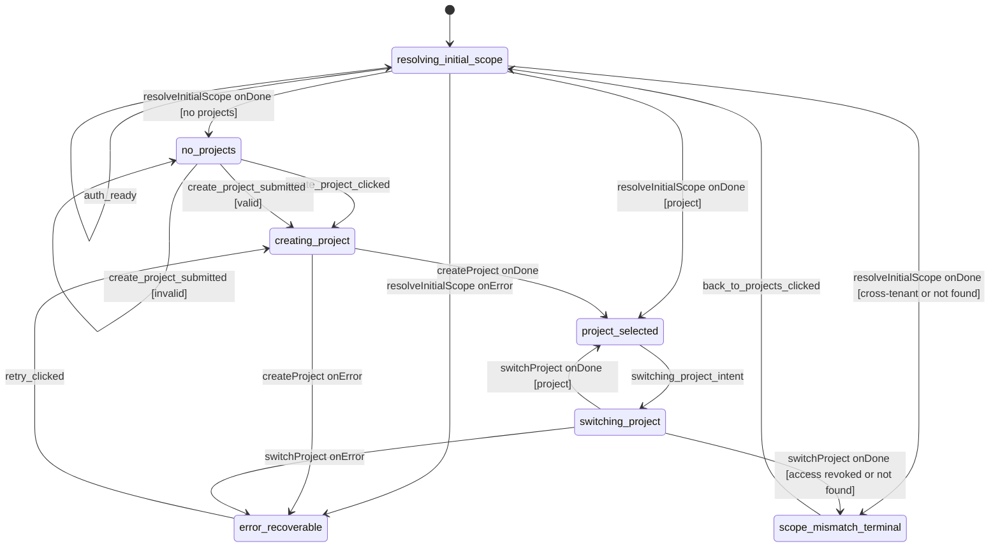

# project-context machine

Owns "which project am I in?" — the project-selection half of the post-signin experience. Sibling of [`login-and-org-setup`](../login-and-org-setup/) (which feeds it `auth_ready`) and [`session-chat`](../session-chat/) (which it wakes via `project_ready`).

## What this machine does

Once login is done, the user lands in this machine. Three responsibilities:

1. **Initial scope resolution.** Look up the user's projects. If they have one, pre-select it. If they have a deep-link intent on the URL, validate it. If the project belongs to a different tenant, route to a terminal mismatch surface.
2. **Project creation.** First-time users with no projects type a name; the machine creates the row and pre-selects the new project.
3. **Mid-session project switching.** When the user clicks a different project in the picker, the machine atomically clears the previous selection's session state (via the orchestrator broadcasting a fresh `project_ready`) and verifies they still have access.

The settled state is `project_selected`. When the machine enters that state, the orchestrator broadcasts `project_ready` to `session-chat`, carrying `{ org_id, project_id, project_name }` plus any deep-link intents that came in via the URL.

## State diagram

**Root-level event — `open_deep_link`.** This transition is registered on the machine's root `on:` block (outside the `states:` block), which means it can fire from any state. When it fires, the handler captures the URL wish into the `deeplink_project_id` + `deeplink_session_id` context fields and re-enters `resolving_initial_scope` so the resolver runs again with the new wish. (The event payload also carries `intent_resource_id` + `intent_resource_type`; those ride along to session-chat through the `project_ready` broadcast directly, without ever touching this machine's context.) It's not drawn as a wildcard arrow above to keep the chart readable — when you see deep-link behaviour in production, this is what dispatched it.

## States

| State | What's happening | Entered on | Exits on |
|---|---|---|---|
| `resolving_initial_scope` | Invokes `resolveInitialScope` to find out: does the user have any projects? Does a `deeplink_project_id` from the URL match one they own? Are they cross-tenant? | spawn, `auth_ready`, `open_deep_link`, `back_to_projects_clicked` | resolver settles |
| `no_projects` | Welcome-empty surface. The user must type a name to create their first project | resolver returns `{ no_projects: true }` | `create_project_clicked` or valid submit |
| `creating_project` | POST `/api/projects` with `pending_project_name` | valid `create_project_submitted` or `retry_clicked` | `createProject` settles |
| `project_selected` | A project is materialized in `context.project`. The orchestrator broadcasts `project_ready` to session-chat on entry | resolver `onDone {project}`, `createProject onDone`, `switchProject onDone {project}` | `switching_project_intent` (or root-level `open_deep_link`) |
| `switching_project` | Validates the user's access to a new project id via `switchProject` | `switching_project_intent` | `switchProject` settles |
| `scope_mismatch_terminal` | Terminal-style mismatch surface (cross-tenant, project not found, access revoked). Not a sink — the user can recover via `back_to_projects_clicked` | resolver or switcher returns a mismatch verdict | `back_to_projects_clicked` |
| `error_recoverable` | Transient-failure landing zone. Preserves `pending_project_name` so the retry doesn't lose composer text | any actor error | `retry_clicked` |

## Events

### From the FE

| Event | Payload | What it does |
|---|---|---|
| `create_project_clicked` | (none) | Move from `no_projects` welcome surface into `creating_project` directly (variant of explicit submit) |
| `create_project_submitted` | `{ project_name }` | Submit a project-name string. Guarded — invalid input self-loops with an inline `project_validation_error` |
| `back_to_projects_clicked` | (none) | Recover from `scope_mismatch_terminal`. Clears the `deeplink_*` context fields |
| `retry_clicked` | (none) | Re-invoke `createProject` from `error_recoverable`, preserving `pending_project_name` |
| `switching_project_intent` | `{ new_project_id }` | Atomic project switch. The orchestrator emits `switching_project_started` so the projection invalidates `session_id` + `resource_*` *before* `session-chat`'s `loading_session_list` re-runs |

### Cross-machine (from orchestrator)

| Event | Payload | What it does |
|---|---|---|
| `auth_ready` | `{ org_id, user: { first_name } }` | Inherit identity from the login machine. Re-entering `resolving_initial_scope` kicks off scope resolution |

### Root-level (cross-state)

| Event | Payload | What it does |
|---|---|---|
| `open_deep_link` | `{ intent_project_id?, intent_session_id?, intent_resource_id?, intent_resource_type? }` | Captures the URL wish into `deeplink_project_id` + `deeplink_session_id` and re-enters `resolving_initial_scope`. The `intent_resource_*` keys ride straight through to the `project_ready` broadcast without touching this machine's context. Fires from any state |

The HTTP entry point is `POST /flow/:machine/open-deep-link`, which arrives via the orchestrator.

## Actors invoked

| Actor | Input | Output | Invoked in |
|---|---|---|---|
| `resolveInitialScope` | `{ org_id, deeplink_project_id, principal_id }` | One of: `{ project }`, `{ no_projects: true }`, `{ cross_tenant: true }`, `{ project_not_found: true }`. May also include `most_recent_session_per_project` and `degraded_project_ids` | `resolving_initial_scope` |
| `createProject` | `{ org_name, correlation_id, principal_id }` | `ProjectSummary` = `{ id, name }` | `creating_project` |
| `switchProject` | `{ new_project_id, correlation_id, principal_id }` | One of: `{ project }`, `{ access_revoked: true }`, `{ project_not_found: true }` | `switching_project` |

## Context

| Field | Type | When populated |
|---|---|---|
| `correlation_id` | `string` | spawn |
| `principal_id` | `string` | spawn (from auth-proxy's `X-User-Id` header) |
| `org_id` | `string` | `auth_ready` (empty string until login settles) |
| `user` | `{ first_name }` (`string \| null`) | `auth_ready` |
| `project` | `{ id, name }` (both `string \| null`) | `project_selected` entry |
| `deeplink_project_id` | `string \| null` | `open_deep_link` or `switching_project_intent` — the URL-level project wish, cleared on `switchProject onDone` and on `back_to_projects_clicked` |
| `deeplink_session_id` | `string \| null` | `open_deep_link` — the URL-level session wish, forwarded via the `project_ready` payload to session-chat (where it lands as `pending_resume_session_id`) |
| `pending_project_name` | `string` | valid `create_project_submitted`; preserved across `creating_project` ↔ `error_recoverable` |
| `project_validation_error` | `ProjectValidationError \| null` | invalid `create_project_submitted` |
| `underlying_cause_tag` | `ProjectContextCauseTag \| null` | mismatch or transient-error transitions. 6-cause union |
| `last_live_state` | `ProjectContextState \| null` | error transitions. Currently retry routing always goes back to `creating_project`; kept for shape parity with sibling machines |
| `retries_count` | `number` | each `retry_clicked` |
| `scope_reconciled_count` | `number` | each `switchProject onDone {project}` (observability) |
| `stale_intents_dropped_count` | `number` | reserved (observability) |
| `most_recent_session_per_project` | `Record<string, string>` | `resolveInitialScope onDone`. Orchestrator emits `last_used_resolution_degraded` from this |
| `last_used_degraded_project_ids` | `string[]` | `resolveInitialScope onDone`. Orchestrator emits `last_used_resolution_degraded` from this |

**A note on the `deeplink_*` fields.** This machine carries the URL-level wish transiently between `open_deep_link` and the next `project_ready` broadcast, where the orchestrator forwards `deeplink_session_id` to session-chat (it lands there as `pending_resume_session_id` — the click-or-deeplink-captured resume target). The resource half of the wish (`intent_resource_id` / `intent_resource_type`) rides the orchestrator's `project_ready` payload directly from the `open_deep_link` event payload, without ever touching this machine's context.

## How it connects to siblings

**Incoming.** The orchestrator forwards `auth_ready` from `login-and-org-setup`'s `ready` entry — that's how this machine learns its `org_id` and `user.first_name`.

**Outgoing.** This machine doesn't send events directly. The orchestrator watches `project_selected` entry and broadcasts `project_ready` to `session-chat`. The broadcast is idempotent on the same `project_id` (no-op) and invalidates session/transcript/resource state when the `project_id` changes (cross-project switch).

The machine also emits projection events to the FlowEvent log: `no_projects_displayed`, `project_creation_started`, `project_validation_failed`, `project_selected`, `project_switched`, `switching_project_started`, `scope_mismatch_displayed`, `deep_link_opened`, `last_used_resolution_degraded`.

## Files

- `machine.ts` — the XState v5 machine + types + actor factories (`resolveInitialScopeActor`, `createProjectActor`, `switchProjectActor`)
- `validation.ts` — `validateProjectName`, `ProjectValidationError`
- `index.ts` — barrel; re-exports the public surface
- `machine.test.ts` — vitest unit tests at the actor's `send` / snapshot boundary

## See also

- [`../login-and-org-setup/`](../login-and-org-setup/) — feeds this machine `auth_ready`
- [`../session-chat/`](../session-chat/) — receives `project_ready` from this machine
- [ADR-027](../../../../docs/decisions/adr-027-flow-state-tier-and-framework.md) — why ui-state runs XState v5 in a Hono BFF
- [ADR-028](../../../../docs/decisions/adr-028-xstate-v5-actor-model.md) — the actor model and the rule "machines own transitions, the log owns state"
- [ADR-030](../../../../docs/decisions/adr-030-flow-state-topology-and-scaling.md) — orchestrator pattern, projection-as-read-model, and the `event.output` direction for cross-state hand-off
- [ADR-039](../../../../docs/decisions/adr-039-ui-state-naming-conventions.md) — naming conventions for states, events, fields, counters
