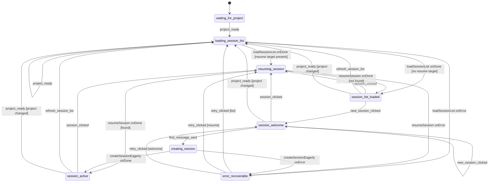

# session-chat machine

Owns "what's happening in my current chat session?" — session list, session resume, the welcome state for fresh sessions, and the chat-turn surface. Sibling of [`project-context`](../project-context/) (which feeds it `project_ready`) and [`login-and-org-setup`](../login-and-org-setup/) (which it doesn't talk to directly).

## What this machine does

After `project-context` has settled on a project, this machine wakes up via the orchestrator's `project_ready` broadcast and takes over the right side of the UI. Three responsibilities:

1. **Show the sidebar.** Fetch the session list for the current project. If the URL carried a `deeplink_session_id` (forwarded from `project-context` via the `project_ready` broadcast) — or a `session_clicked` arrived from the sidebar — resume that target directly. Both paths feed the same `pending_resume_session_id` context field.
2. **Resume sessions.** Pull transcript + resource together in one atomic operation so the UI never paints a half-loaded session.
3. **Lazy-create new sessions.** When the user clicks "+ New Session" we don't write to the backend yet — we sit in a welcome state. The session row is only created when they send the first message. The title is derived from that first message.

The machine has a "waiting" stub state (`waiting_for_project`) where it idles before `project_ready` arrives. Once it does, the machine cycles between `loading_session_list`, `session_list_loaded`, `resuming_session`, and `session_active` as the user picks/creates/switches sessions.

## State diagram

## States

| State | What's happening | Entered on | Exits on |
|---|---|---|---|
| `waiting_for_project` | Stub state. The actor spawns here and idles until the orchestrator's `project_ready` broadcast arrives | spawn | `project_ready` |
| `loading_session_list` | Invokes `loadSessionList` against `GET /api/projects/:id/sessions` | `project_ready` (initial or cross-project re-broadcast), `refresh_session_list`, `retry_clicked` for list | `loadSessionList` settles |
| `session_list_loaded` | Sidebar populated; no session opened. Awaiting user action | `loadSessionList onDone` (no resume target); `resumeSession onDone {session_not_found: true}` (silent fall-through) | `session_clicked`, `new_session_clicked`, `refresh_session_list`, or cross-project `project_ready` |
| `resuming_session` | Invokes `resumeSession` against `GET /api/sessions/:id` to fetch transcript + dataset probe | `loadSessionList onDone` (with resume target), `session_clicked`, `retry_clicked` for resume | `resumeSession` settles |
| `session_active` | A session is loaded. `transcript` + `resource` were assigned together in one transition (no half-loaded UI) | `resumeSession onDone {found}`, `createSessionEagerly onDone` | `session_clicked`, `refresh_session_list`, or cross-project `project_ready` |
| `session_welcome` | A new session has been started but not yet persisted. The composer is empty; no backend write fires until the first message arrives | `new_session_clicked`, `retry_clicked` for welcome | `first_message_sent`, `session_clicked`, idempotent `new_session_clicked`, or cross-project `project_ready` |
| `creating_session` | Invokes `createSessionEagerly` (POST a new session row + PATCH its title from `first_message[:80]`) | `first_message_sent` | `createSessionEagerly` settles |
| `error_recoverable` | Transient-failure landing zone. The retry table consults `last_live_state` to route back to the right actor | any actor error | `retry_clicked` (three guarded branches) |

## Events

### From the FE

| Event | Payload | What it does |
|---|---|---|
| `session_clicked` | `{ session_id }` | Captures `session_id` into `pending_resume_session_id` (via `capturePendingResumeIntent`); transitions to `resuming_session` |
| `new_session_clicked` | (none) | Enter the welcome state. Idempotent from `session_welcome` |
| `first_message_sent` | `{ content }` | Captures `pending_first_message`. Triggers the lazy-create POST/PATCH |
| `refresh_session_list` | (none) | Re-enter `loading_session_list` |
| `retry_clicked` | (none) | Re-invoke the actor for whichever live state failed |
| `dataset_resolved_by_agent` | `{ resource_id, resource_type }` | Reserved — wired in a future dataset-attachment feature |
| `dataset_picked_directly` | `{ resource_id, resource_type }` | Reserved — wired in a future dataset-attachment feature |
| `suggestion_chip_clicked_upload` | (none) | Reserved — wired when the welcome-state suggestion chips ship |
| `suggestion_chip_clicked_browse_projects` | (none) | Reserved — wired when the welcome-state suggestion chips ship |

### Cross-machine (from orchestrator)

These events are never FE-emitted — they arrive from the orchestrator.

| Event | Payload | What it does |
|---|---|---|
| `project_ready` | `{ org_id, project_id, project_name, request_id, deeplink_session_id?, intent_resource_id?, intent_resource_type? }` | Initial wake-up from `waiting_for_project`. The `deeplink_session_id` value (when present) lands in `pending_resume_session_id` so the upcoming `loadSessionList` can echo it through `event.output.resume_target`. `intent_resource_*` are forward-compat slots — accepted but not stored on this machine's context (the orchestrator routes them through the projection directly). On subsequent broadcasts (the user switched projects), the cross-project guard clears session/transcript/resource state before re-entering `loading_session_list`. Idempotent on the same `project_id` |
| `FREEZE` | `{ origin_request_id? }` | Reserved — the freeze/replay handler isn't yet declared in this machine |
| `THAW` | (none) | Reserved companion to `FREEZE` |

## Actors invoked

| Actor | Input | Output | Invoked in |
|---|---|---|---|
| `loadSessionList` | `{ project_id, principal_id, page_size?, pending_resume_session_id? }` | `{ items: SessionSummary[], next_cursor: string \| null, has_more: boolean, resume_target: string \| null }` | `loading_session_list` |
| `resumeSession` | `{ session_id, project_id, principal_id }` | Either `{ session_id, transcript, active_dataset_id, dataset_unavailable? }` or `{ session_not_found: true }` | `resuming_session` |
| `createSessionEagerly` | `{ project_id, principal_id, first_message }` | `{ session_id }` | `creating_session` |

`createSessionEagerly` does a POST + PATCH in one fire-and-await sequence so the test/UI can observe the session row with the correct title (derived from `first_message[:80]`) by the time `session_active` settles.

## Context

| Field | Type | When populated |
|---|---|---|
| `request_id` | `string` | spawn; refreshed on `project_ready` if the payload supplies one |
| `principal_id` | `string` | spawn (from auth-proxy's `X-User-Id` header) |
| `org_id` | `string` | `project_ready` (empty string until project-context settles) |
| `project` | `{ id, name }` (both `string \| null`) | `project_ready`. Cleared on cross-project `project_ready` |
| `session_list` | `SessionSummary[]` | `loadSessionList onDone`. Cleared on cross-project `project_ready` |
| `session_list_next_cursor` | `string \| null` | `loadSessionList onDone` (reserved for pagination) |
| `session_list_has_more` | `boolean` | `loadSessionList onDone` (reserved for pagination) |
| `session_id` | `string \| null` | `resumeSession onDone` or `createSessionEagerly onDone`. Zeroed by `new_session_clicked` and cross-project `project_ready` |
| `transcript` | `TranscriptMessage[]` | `resumeSession onDone`, assigned in the same transition as `resource` |
| `resource` | `{ type: ResourceType \| null; id: string \| null }` | `resumeSession onDone`, assigned in the same transition as `transcript` |
| `pending_resume_session_id` | `string \| null` | `project_ready` payload (the `deeplink_session_id` URL wish forwarded from project-context), or `session_clicked` (click-captured target). Cleared on `resumeSession onDone` (any branch) |
| `pending_first_message` | `string` | `first_message_sent`. Preserved across `session_welcome` ↔ `error_recoverable` so the retry sees the same message |
| `underlying_cause_tag` | `SessionChatCauseTag \| null` | error transitions, plus `resumeSession onDone` in the `dataset_unavailable` branch |
| `last_live_state` | `SessionChatState \| null` | error transitions. Drives the three-branch retry table |
| `retries_count` | `number` | each `retry_clicked` |
| `stale_intents_dropped_count` | `number` | reserved (observability) |

**Atomicity rule.** `transcript` and `resource` are assigned in a single transition (when `resumeSession` settles successfully). The orchestrator's projection never sees a session where transcript is filled but resource is null, or vice versa. This is the invariant the FE relies on to avoid rendering a session with the chat panel populated but the dataset chip blank.

**Internal vs. cross-state hand-off.** `pending_resume_session_id` is transient hand-off — captured from `project_ready` (URL wish) or `session_clicked` (click), read by the `resumeSession` actor invoke, cleared on settle. The actor input/output channel echoes it as `resume_target` so the `loading_session_list → resuming_session` branch reads from `event.output` rather than ctx (per ADR-030 §"Migration sequencing" LEAF-C / ADR-028 Direction F).

## How it connects to siblings

**Incoming.** `project_ready` from the orchestrator (originally sourced from `project-context`'s `project_selected` entry). That broadcast is the only way this machine learns about its project; before it arrives, the machine sits in `waiting_for_project`.

**Outgoing.** This machine has no downstream cross-machine broadcasts — it's the end of the chain.

It emits projection events to the FlowEvent log for FE consumption: `project_context_inherited`, `session_list_load_started`, `session_list_loaded`, `session_list_displayed`, `session_resume_started`, `session_resumed`, `session_active_reached`, `session_resume_not_found`.

## Files

- `machine.ts` — the XState v5 machine + types + actor factories (`loadSessionListActor`, `resumeSessionActor`, `createSessionEagerlyActor`)
- `index.ts` — barrel; re-exports the public surface
- `machine.test.ts` — vitest unit tests at the actor's `send` / snapshot boundary

## See also

- [`../project-context/`](../project-context/) — feeds this machine `project_ready`
- [`../login-and-org-setup/`](../login-and-org-setup/) — the first machine in the chain; doesn't talk to this one directly
- [ADR-027](../../../../docs/decisions/adr-027-flow-state-tier-and-framework.md) — why ui-state runs XState v5 in a Hono BFF
- [ADR-028](../../../../docs/decisions/adr-028-xstate-v5-actor-model.md) — the actor model and the rule "machines own transitions, the log owns state"
- [ADR-030](../../../../docs/decisions/adr-030-flow-state-topology-and-scaling.md) — orchestrator pattern, projection-as-read-model, and the `event.output` direction for cross-state hand-off
- [ADR-039](../../../../docs/decisions/adr-039-ui-state-naming-conventions.md) — naming conventions for states, events, fields, counters
