# session-chat machine

> **Owner:** ui-state (Hono BFF actor system)
> **Source-of-truth:** `machine.ts` in this directory.
> **Related ADRs:** ADR-027 (flow-state tier + framework — XState v5 adoption), ADR-028 (XState v5 actor model — machines own transitions, the log owns state), ADR-030 (flow-state topology + scaling — orchestrator pattern + projection as primary read model).

## Purpose

Owns the "what's happening in my current session?" half of journey J-002: session-list visibility (US-203), session resume + transcript materialization (US-205), the lazy-create welcome state (US-206), and the chat-turn-emitting states. Maintains the `resource_*` half of `active_scope`; the `org_id` + `project_id` halves are owned by the sibling `project-context` machine and arrive here via the orchestrator's `project_ready` broadcast.

## State diagram

```mermaid
stateDiagram-v2
  [*] --> waiting_for_project

  waiting_for_project --> loading_session_list: project_ready (captures org_id + project_id + project_name + intent_session_id)

  loading_session_list --> loading_session_list: project_ready (reenter; clears session_id + transcript + resource + session_list)
  loading_session_list --> resuming_session: loadSessionList onDone [intent_session_id !== null]
  loading_session_list --> session_list_loaded: loadSessionList onDone [no intent]
  loading_session_list --> error_recoverable: loadSessionList onError (list_sessions_degraded; last_live_state = loading_session_list)

  session_list_loaded --> resuming_session: session_clicked (captures session_id into intent_session_id)
  session_list_loaded --> session_welcome: new_session_clicked (zeros session_id + transcript + resource + pending_first_message)
  session_list_loaded --> loading_session_list: refresh_session_list
  session_list_loaded --> loading_session_list: project_ready [project_id changed] (clears all session state)

  resuming_session --> session_list_loaded: resumeSession onDone {session_not_found: true} (silent; clears intent_session_id)
  resuming_session --> session_active: resumeSession onDone (atomic: transcript + resource assigned together)
  resuming_session --> error_recoverable: resumeSession onError (transient; last_live_state = resuming_session)

  session_active --> resuming_session: session_clicked
  session_active --> loading_session_list: refresh_session_list
  session_active --> loading_session_list: project_ready [project_id changed]

  session_welcome --> session_welcome: new_session_clicked (idempotent no-op)
  session_welcome --> resuming_session: session_clicked
  session_welcome --> creating_session: first_message_sent (captures pending_first_message)
  session_welcome --> loading_session_list: project_ready [project_id changed] (clears pending_first_message)

  creating_session --> session_active: createSessionEagerly onDone (session_id assigned; transcript + resource zeroed)
  creating_session --> error_recoverable: createSessionEagerly onError (transient; last_live_state = session_welcome)

  error_recoverable --> loading_session_list: retry_clicked [last_live_state = loading_session_list]
  error_recoverable --> resuming_session: retry_clicked [last_live_state = resuming_session]
  error_recoverable --> session_welcome: retry_clicked [last_live_state = session_welcome] (preserves pending_first_message)
```

*MR-3 added the `session_welcome` + `creating_session` pair for the US-206 lazy-create contract. The eager-create actor POSTs `/api/projects/:id/sessions` and PATCHes the title in one fire-and-await sequence so the test can observe the row with `title === first_message[:80]` by the time `session_active` settles. MR-5 will add `switching_dataset_context`; MR-6 will add a top-level `on.FREEZE` handler + `freeze` state.*

## States

| State | Purpose | Entered on | Exits on |
|---|---|---|---|
| `waiting_for_project` | Stub state; the actor spawns here and idles until the orchestrator's `project_ready` broadcast arrives | initial spawn | `project_ready` |
| `loading_session_list` | Invokes `loadSessionList` against `GET /api/projects/:id/sessions` | `project_ready` (initial or re-broadcast on project switch); `refresh_session_list`; `retry_clicked` (when `last_live_state = loading_session_list`) | `loadSessionList` `onDone` (2 branches: intent / no-intent) / `onError` |
| `session_list_loaded` | Sidebar populated; no session opened | `loadSessionList` `onDone` (no intent); `resumeSession` `onDone {session_not_found: true}` | `session_clicked`, `new_session_clicked`, `refresh_session_list`, or cross-project `project_ready` |
| `resuming_session` | Invokes `resumeSession` against `GET /api/sessions/:id` + transcript events + dataset probe (US-205) | `loadSessionList` `onDone` (with intent); `session_clicked`; `retry_clicked` (when `last_live_state = resuming_session`) | `resumeSession` `onDone` (3 branches: found / not_found / dataset_unavailable) / `onError` |
| `session_active` | Atomic post-resume state with transcript + resource materialized together (per IC-J002-3) | `resumeSession` `onDone {found}`; `createSessionEagerly` `onDone` | `session_clicked`, `refresh_session_list`, or cross-project `project_ready` |
| `session_welcome` | US-206 welcome state; lazily-created session — no backend write fires until first message | `new_session_clicked`; `retry_clicked` (when `last_live_state = session_welcome`) | `first_message_sent`, `session_clicked`, idempotent `new_session_clicked`, or cross-project `project_ready` |
| `creating_session` | Invokes `createSessionEagerly` (POST + PATCH title) on the welcome state's first message | `first_message_sent` | `createSessionEagerly` `onDone` / `onError` |
| `error_recoverable` | Transient-failure landing zone; the retry table consults `last_live_state` to route back | any actor `onError` | `retry_clicked` (3 guarded branches) |

## Events

### External (FE → machine)

| Event | Source | Payload | Purpose |
|---|---|---|---|
| `session_clicked` | FE sidebar row click | `{ session_id }` | Captures `session_id` into `intent_session_id`; transitions to `resuming_session` |
| `new_session_clicked` | FE "+ New Session" button | (none) | Enter the welcome state; idempotent from `session_welcome` |
| `first_message_sent` | FE composer submit (from welcome state) | `{ content }` | US-206 lazy-create trigger; captures `pending_first_message` |
| `refresh_session_list` | FE sidebar refresh | (none) | Re-enter `loading_session_list` |
| `dataset_resolved_by_agent` | FE agent message handler (MR-5+) | `{ resource_id, resource_type }` | Reserved for MR-5 dataset attachment |
| `dataset_picked_directly` | FE dataset picker (MR-5+) | `{ resource_id, resource_type }` | Reserved for MR-5 dataset attachment |
| `retry_clicked` | FE error UI | (none) | Re-invoke the actor for `last_live_state` |
| `suggestion_chip_clicked_upload` | FE welcome-state suggestion chip | (none) | Reserved for future UX surfacing |
| `suggestion_chip_clicked_browse_projects` | FE welcome-state suggestion chip | (none) | Reserved for future UX surfacing |

### Cross-machine (orchestrator-emitted; never FE-emitted)

| Event | Source | Payload | Purpose |
|---|---|---|---|
| `project_ready` | Orchestrator broadcast hook (project-context → session-chat, on `project_selected` entry) | `{ org_id, project_id, project_name, correlation_id, intent_session_id?, intent_resource_id?, intent_resource_type? }` | Initial wake-up from `waiting_for_project`; on subsequent broadcasts (e.g. MR-4 project switch) clears session/transcript/resource state when `project_id` changes; idempotent no-op when `project_id` matches |
| `FREEZE` | Orchestrator FREEZE/THAW broadcast (cross-flow replay barrier, ADR-028) | `{ origin_correlation_id? }` | Reserved for MR-6 (top-level handler + `freeze` state not yet declared in MR-3) |
| `THAW` | Orchestrator FREEZE/THAW broadcast | (none) | Reserved for MR-6 |

## Actors invoked

| Actor | `input` shape | `output` shape | When invoked |
|---|---|---|---|
| `loadSessionList` | `{ project_id, principal_id, page_size? }` | `{ items: SessionSummary[], next_cursor: string \| null, has_more: boolean }` | On entry into `loading_session_list` |
| `resumeSession` | `{ session_id, project_id, principal_id }` | `{ session_id, transcript: TranscriptMessage[], active_dataset_id: string \| null, dataset_unavailable?: boolean }` \| `{ session_not_found: true }` | On entry into `resuming_session` |
| `createSessionEagerly` | `{ project_id, principal_id, first_message }` | `{ session_id }` | On entry into `creating_session` |

## Context fields (current)

| Field | Type | When populated | Read by | Notes |
|---|---|---|---|---|
| `correlation_id` | `string` | construction; refreshed on `project_ready` if payload supplies one | every emission | always |
| `principal_id` | `string` | construction | actor inputs | from auth-proxy `X-User-Id` |
| `org_id` | `string` | `project_ready` | projection / FE | `""` until project-context settles |
| `project` | `{ id: string \| null; name: string \| null }` | `project_ready` | actor inputs; projection / FE | cleared on cross-project `project_ready`; nested per ADR-039 §C8 (aggregate-owned id nested inside its object) |
| `session_list` | `SessionSummary[]` | `loadSessionList` `onDone` | projection / FE sidebar | cleared on cross-project `project_ready` |
| `session_list_next_cursor` | `string \| null` | `loadSessionList` `onDone` | (reserved for pagination) | |
| `session_list_has_more` | `boolean` | `loadSessionList` `onDone` | (reserved for pagination) | |
| `session_id` | `string \| null` | `resumeSession` / `createSessionEagerly` `onDone` | projection / FE | zeroed by `new_session_clicked` and by cross-project `project_ready` |
| `transcript` | `TranscriptMessage[]` | `resumeSession` `onDone` (atomic with `resource`) | projection / FE | zeroed by `new_session_clicked` and by cross-project `project_ready` |
| `resource` | `{ type: ResourceType \| null; id: string \| null }` | `resumeSession` `onDone` (atomic with `transcript`) | projection / FE | per IC-J002-3 the assignment is single-transaction with transcript |
| `intent_session_id` | `string \| null` | `project_ready` payload; `session_clicked` | `resumeSession` input | cleared on `resumeSession` `onDone` (settled or not_found) |
| `underlying_cause_tag` | `SessionChatCauseTag \| null` | error transitions; `resumeSession` `onDone` (dataset_unavailable case) | projection; FE diagnostic copy | 6-cause union |
| `last_live_state` | `SessionChatState \| null` | error transitions | retry routing | drives the 3-branch retry table in `error_recoverable` |
| `retries_count` | `number` | `retry_clicked` | observability | bumps each retry |
| `pending_first_message` | `string` | `first_message_sent` | `createSessionEagerly` input on retry | preserved across `session_welcome` ↔ `error_recoverable` (app-arch §6.4 composer-state contract) |
| `stale_intents_dropped_count` | `number` | (reserved) | observability | OQ-J002-5 |

NOTE: Per ADR-028 §"Amendment 2026-05-15", context should carry internal handler state only; cross-state communication rides on `event.output`. The current field set may include legacy "lying-about-nullability" fields targeted for LEAF-A through LEAF-D migration per ADR-030. In particular, `intent_session_id` is carried transiently here between the `project_ready` payload (or `session_clicked`) and `resuming_session` `onDone` — per the amendment it should ride on the event surface, not context.

## Cross-machine wiring

- **Receives from orchestrator:** `project_ready` (from project-context's `project_selected` entry — carries `org_id` + `project_id` + `project_name` + forwarded `intent_*`). MR-4's `project_ready` re-broadcast on project switch arrives here too; the cross-project guard (`context.project?.id !== event.project_id`) routes it back into `loading_session_list` with all session state cleared per IC-J002-4.
- **Emits projection events** (via `orchestrator.appendSessionChatTerminalEvents` and adjacent emitters): `session_chat_project_ready`, `session_list_load_started`, `session_list_loaded`, `session_list_displayed`, `session_resume_started`, `session_resumed`, `session_active_reached`, `session_resume_not_found`. (Dataset-related events arrive with MR-5; FREEZE/THAW arrive with MR-6.)
- **No downstream broadcasts:** session-chat is a leaf in the J-002 broadcast tree.

## Files in this directory

- `machine.ts` — the XState v5 machine factory + types + production actor factories (`loadSessionListActor`, `resumeSessionActor`, `createSessionEagerlyActor`)
- `index.ts` — barrel; re-exports the public surface (machine + actors + types)
- `machine.test.ts` — vitest unit tests (port-to-port at the XState actor's `send` / snapshot surface)
- `README.md` — this file

## Related design docs

- `docs/evolution/2026-05-15-failure-simulation-consolidation/` — failure-simulation knobs this machine respects (`X-Force-Create-Session-Failure`)
- `docs/feature/project-and-chat-session-management/design/` — J-002 design wave (will migrate to docs/evolution/ on FINALIZE)
- `docs/decisions/adr-027-flow-state-tier-and-framework.md`, `adr-028-xstate-v5-actor-model.md`, `adr-030-flow-state-topology-and-scaling.md`
- `docs/discussion/session-chat-context-architecture/directions.md` — the JTBD analysis that motivated the A+F convergence
