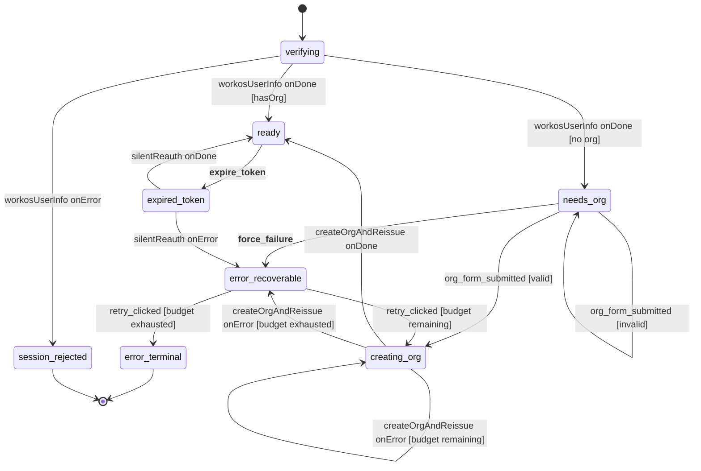

# session-onboarding machine

The flow that brings an **already-authenticated** principal to an org-scoped, app-ready state. Owned by `ui-state` (the Hono backend-for-frontend actor system). Realigned from the former `login-and-org-setup` machine per [ADR-041](../../../../docs/decisions/adr-041-session-onboarding-domain-realignment.md).

> **Entry assumption (ADR-041 L1):** by the time any request reaches `ui-state`, auth-proxy has already authenticated the user upstream (out of band) and injected verified identity headers (`X-User-Id`) + forwarded the Bearer. This machine does **not** re-enact a sign-in handshake — authentication belongs to the Authentication context (auth-proxy). Modelling it here was a bounded-context leak; the realignment removes it.

## What this machine does

1. **Re-verify (defense in depth).** Re-check the forwarded Bearer against WorkOS `/oauth/userinfo` (`workosUserInfo` invoke, ADR-041 L3). It is NOT the authenticator — it independently validates user + token in case a deployment misconfig exposed `ui-state` to the open web. The verified profile (`email`, `display_name`, ADR-041 L5) and any existing org binding seed the opening `session_started` event.
2. **Bootstrap an org (new user).** A user with no org binding collects a name, then atomically creates the org row and reissues the org-scoped token.
3. **Keep the token alive.** When the access token expires later, attempt a silent reauth without bouncing the user back to `/login`.

A **returning user** whose re-verify carries an org binding takes the `[hasOrg]` shortcut straight to `ready`. The orchestrator broadcasts `auth_ready` to the sibling [`project-context`](../project-context/) machine on first `ready` via EITHER path (`creating_org → ready` for new users, `verifying → ready` for returning users — ADR-041 D5).

## State diagram

`__force_failure__` and `__expire_token__` are failure-simulation entry points — see [Failure simulation](#failure-simulation) below.

## States

| State | What's happening | Entered on | Exits on |
|---|---|---|---|
| `verifying` | Invokes the WorkOS `/oauth/userinfo` re-verify with the forwarded Bearer. On success `user.{email, display_name, first_name}` + the org binding populate | spawn / begin | `workosUserInfo` settles |
| `needs_org` | Verified, no org binding yet. Waiting for the user to type an org name. Invalid submissions self-loop with `org_validation_error` set in context | `workosUserInfo` `onDone` [no org] | valid submit / invalid submit / failure-sim side channel |
| `creating_org` | POST `/api/orgs` (+ reissue, one idempotent invoke). Retries up to **3 attempts** before falling through to `error_recoverable`. On success `org.{id, name}` populate | valid `org_form_submitted`, `retry_clicked` from recoverable, or self-loop on transient error | actor settles or budget exhausts |
| `ready` | Signed in with org. The orchestrator broadcasts `auth_ready` on first entry | `workosUserInfo onDone` [hasOrg], `createOrgAndReissue` settles, `silentReauth` settles | token-expiry side channel |
| `expired_token` | Attempts a silent token refresh without forcing the user back to `/login` | `__expire_token__` | `silentReauth` settles |
| `error_recoverable` | Shows a "Try again" CTA. User has **3 retries** at the same `underlying_cause_tag` before escalating | any org-setup actor error, or `__force_failure__` | `retry_clicked` |
| `error_terminal` | Contact-support surface. The FE doesn't render an exit; the user must reload | `retry_clicked` with budget exhausted | none |
| `session_rejected` | Terminal: re-verification failed (token/user invalid). No user state advanced; the FE renders a "sign in again" surface | `workosUserInfo onError` | none |

## Events

### From the FE

| Event | Payload | What it does |
|---|---|---|
| `org_form_submitted` | `{ org_name }` | Submit the org name. Guarded — invalid input self-loops with an inline `org_validation_error` |
| `retry_clicked` | (none) | Resume from `error_recoverable`. Either re-enters `creating_org` or escalates to `error_terminal` based on the retry budget |

### Cross-machine (from orchestrator)

| Event | Payload | What it does |
|---|---|---|
| `FREEZE` | (none) | Cross-flow replay barrier. The orchestrator owns the semantics; this machine only declares the type (it is never itself frozen) |
| `THAW` | (none) | Replay-buffer release |

### Failure simulation

`__force_failure__` and `__expire_token__` are dev-only side channels gated at the HTTP boundary (`router.ts`) by the failure-simulation gate (ADR-035). Production builds don't observe them — they exist so acceptance tests can rehearse failure modes without breaking real upstreams.

| Event | Payload | What it does |
|---|---|---|
| `__force_failure__` | `{ tag: UnderlyingCauseTag }` | From `needs_org`, jump to `error_recoverable` with the supplied cause tag |
| `__expire_token__` | (none) | From `ready`, jump to `expired_token` to rehearse the silent-reauth path |

The double-underscore prefix is the project-wide convention for "this event must not exist in production." See [ADR-039 §C4](../../../../docs/decisions/adr-039-ui-state-naming-conventions.md).

## Actors invoked

| Actor | Input | Output | Invoked in |
|---|---|---|---|
| `workosUserInfo` | `{ bearer_token }` | `WorkOSProfile` = `{ email, display_name, org? }` | `verifying` |
| `createOrgAndReissue` | `{ org_name, principal_id, correlation_id, attempt }` | `{ org_id, org_name }` | `creating_org` (each attempt within the 3-retry budget) |
| `silentReauth` | `{ correlation_id }` | `{ ok: true }` | `expired_token` |

`createOrgAndReissue` is idempotent on `(org_name, principal_id)`: org creation always runs first, and a retry after a failed reissue re-creates nothing — `createOrgFn` reuses the existing org via `GET /api/orgs/me`. See [ADR-029](../../../../docs/decisions/adr-029-jwt-reissue-on-org-create.md).

## FlowEvents emitted

The machine never writes FlowEvents itself (ADR-028/030). The begin strategy + the orchestrator's settle path append them to the event log:

- `session_started{user, org|null}` — the SELF-CONTAINED opening event (ADR-041 D2). Carries the verified user + org binding, harvested from the settled snapshot after `verifying`. The projection folds it directly (state = `org?.id ? ready : needs_org`), so the user is populated at t=0 — this is the defect fix.
- `session_rejected{reason}` — emitted instead of `session_started` when re-verify fails.
- `org_created{org, access_token}` — emitted on the `creating_org → ready` settle. `access_token` is a NON-SECURITY org-claim echo (ADR-016 / OQ-5), not a real credential.
- `validation_failed{error}` — invalid org name on the `needs_org` self-loop.
- `token_expired` / `reissue_failed_partial` — the expiry + partial-setup paths.

## How it connects to siblings

This machine never sends events to other machines directly. The orchestrator watches for first `ready` entry and broadcasts `auth_ready` with `{ org_id, user: { first_name } }` to the `project-context` machine, which uses it to start scope resolution. The event is named after **what it carries** rather than the sender (ADR-039 §C3).

## Validation, guards, and actions

Three roles that are easy to conflate — kept strictly separate. The org-name rule
is the worked example (see the docstrings atop `setup/domain.ts`,
`setup/guards.ts`, `setup/actions.ts`):

| Role | Question it answers | May read | May write |
|---|---|---|---|
| **The value object** (`setup/domain.ts`) | "Is this domain datum well-formed, and if not, what *exactly* is wrong?" | the raw input | nothing — pure; `constructOrgName(raw)` returns a value object with `isValid()` / `getError()` |
| **Guards** (`setup/guards.ts`) | "May this transition fire?" | `context`, `event`, `.isValid()` | nothing — pure predicate; routes only |
| **Actions** (`setup/actions.ts`) | *(no question — apply a decided effect)* | `context`, `event`, `.getError()` | `context`, via `assign` — the only writers |

`OrgName` owns its rule (in `constructOrgName`). On `org_form_submitted` the
**guard** `isOrgNameValid` calls `.isValid()` to route (valid → `creating_org`;
invalid → fall through). The fallthrough's **action** `recordOrgValidationError`
re-constructs the value object and calls `.getError()` for the typed rejection,
then renders it to the user-facing `org_validation_error` — the kind→copy mapping
is *presentation*, so it lives in the action, not on the model. The re-derivation
is intentional: a guard can *route* on a verdict but cannot *write* it (guards are
pure and may be evaluated more than once), so the action materializes it. In
short — **the value object evaluates, guards route, actions write.**

## Files

The machine is split so `machine.ts` reads as state transitions; the XState
wiring it references by name lives under `setup/`. The `setup/` modules form a
one-way dependency chain — `domain` is the leaf → `actors` → `types` → `guards` /
`actions` → `machine` — so there are no cycles.

- `machine.ts` — the XState v5 statechart, **mapping only**: `setup({ actors, guards, actions }).createMachine(...)`. Names actors/guards/actions by string; no definitions inline, no inline `assign`
- `setup/domain.ts` — the OnboardSession **domain model**: branded primitives (`PrincipalId`, `OrgId`, `OrgName`) + the value objects (`VerifiedUser`, `Org`, `VerifiedSession`) that replace anemic, provenance-named data shapes (e.g. `CreateOrgAndReissueOutput` → `Org`). The `OrgName` value object owns its invariant via `constructOrgName(raw)` → `{ value, isValid(), getError() }`. Also owns the **failure-cause vocabulary**: the closed `UnderlyingCauseTag` union plus `failWithCause` (an actor brands a thrown Error with its cause at the seam that knows it) / `causeOf` (a downstream action reads it back, defaulting untagged or foreign throws to `transient`) — the structured replacement for downstream message-sniffing. Stored forms are plain serializable shapes (branded strings + `readonly` records, never class instances) so they survive the Redis context round-trip; the value object's methods are transient (used at the guard/action boundary)
- `setup/types.ts` — context / event / state / input types + the `ActionArgs` / `GuardArgs` arg aliases the extracted guards + actions annotate their params with
- `setup/actors.ts` — the external-service resolvers (WorkOS re-verify, backend org SSOT, org-create/reissue) that return the domain model (`VerifiedSession`, `Org`), their transport DTOs, the `fromPromise` actor aliases, and the wired `actors` bundle threaded into `setup({ actors })`
- `setup/guards.ts` — the `guards` bundle (transition predicates + the reissue/user-retry budgets)
- `setup/actions.ts` — the `actions` bundle (every `assign`, including the two formerly inline in the statechart, `assignPendingOrgName` + `assignCreatedOrg`, and the parameterized `tagCause` that records the cause tag on both the `__force_failure__` and budget-exhausted arms)
- `strategy.ts` — the `FlowStrategy` impl (`sessionOnboardingStrategy`) + the per-request `SessionOnboardingBeginStrategy`
- `router.ts` — the ACL HTTP transport (`buildSessionOnboardingRouter`); identity from the verified header + forwarded Bearer, never a client body claim (ADR-041 D4)
- `index.ts` — barrel; exports the **minimal** public surface only: `createSessionOnboardingMachine` plus the `RequestClient` / `SessionOnboardingDeps` wiring types a composition root needs
- `machine.test.ts`, `setup/domain.test.ts` — vitest unit tests

## See also

- [`../project-context/`](../project-context/) — receives `auth_ready` from this machine and owns the project-selection half
- [ADR-041](../../../../docs/decisions/adr-041-session-onboarding-domain-realignment.md) — the domain realignment this machine implements
- [ADR-027](../../../../docs/decisions/adr-027-flow-state-tier-and-framework.md) — why ui-state runs XState v5 in a Hono BFF
- [ADR-028](../../../../docs/decisions/adr-028-xstate-v5-actor-model.md) — the actor model; "machines own transitions, the log owns state"
- [ADR-029](../../../../docs/decisions/adr-029-jwt-reissue-on-org-create.md) — why `createOrgAndReissue` is one atomic invoke
- [ADR-030](../../../../docs/decisions/adr-030-flow-state-topology-and-scaling.md) — orchestrator pattern and projection-as-read-model
- [ADR-039](../../../../docs/decisions/adr-039-ui-state-naming-conventions.md) — naming conventions for states, events, fields, counters
